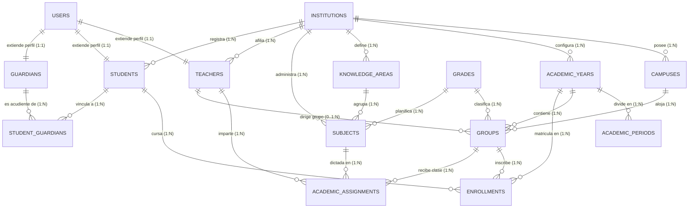

# MODELO DE DATOS RELACIONAL — FASE 3A
# Plataforma Educativa Virtual Nacional (PEVN)

> **ESTADO:** DISEÑO ARQUITECTÓNICO — ESPECIFICACIÓN DE ESQUEMA POSTGRESQL  
> **LÍNEA BASE DE SEGURIDAD:** TODAS LAS TABLAS HEREDAN LLAVES FORÁNEAS Y RESTRICCIONES DE AISLAMIENTO INSTITUCIONAL.

---

## 1. Diagrama Entidad-Relación (Mermaid ERD)



---

## 2. Especificación Detallada de Tablas Relacionales

### 2.1. Estructura Curricular y Temporal

#### `academic_years` (Años Lectivos)
- **Propósito:** Período lectivo anual de una institución.
- **Campos:**
  - `id`: `UUID`, PK, default `gen_random_uuid()`.
  - `institution_id`: `UUID`, FK `institutions(id) ON DELETE RESTRICT`, NOT NULL, Index.
  - `year`: `SMALLINT`, NOT NULL (e.g. 2026).
  - `name`: `VARCHAR(100)`, NOT NULL (e.g. "Año Escolar 2026").
  - `calendar_type`: `VARCHAR(20)`, NOT NULL, Default `'CALENDAR_A'` (`CALENDAR_A` / `CALENDAR_B`).
  - `start_date`: `DATE`, NOT NULL.
  - `end_date`: `DATE`, NOT NULL.
  - `status`: `VARCHAR(20)`, NOT NULL, Default `'PLANNING'` (`PLANNING`, `ACTIVE`, `CLOSED`, `ARCHIVED`).
  - `created_at`, `updated_at`: `TIMESTAMPTZ`, NOT NULL.
- **Restricciones & Índices:**
  - `UNIQUE (institution_id, year)`: Previene duplicación del mismo año en una institución.
  - `INDEX ix_academic_years_institution_status (institution_id, status)`: Acelera la búsqueda del año lectivo activo.
  - `CHECK (start_date < end_date)`: Valida coherencia temporal.

#### `academic_periods` (Períodos de Evaluación)
- **Propósito:** Subdivisiones del año escolar para evaluación.
- **Campos:**
  - `id`: `UUID`, PK.
  - `academic_year_id`: `UUID`, FK `academic_years(id) ON DELETE CASCADE`, NOT NULL, Index.
  - `period_number`: `SMALLINT`, NOT NULL (e.g., 1, 2, 3, 4).
  - `name`: `VARCHAR(100)`, NOT NULL (e.g., "Primer Período").
  - `weight_percentage`: `NUMERIC(5,2)`, NOT NULL (e.g. 25.00).
  - `start_date`: `DATE`, NOT NULL.
  - `end_date`: `DATE`, NOT NULL.
  - `is_closed`: `BOOLEAN`, NOT NULL, Default `FALSE`.
- **Restricciones:**
  - `UNIQUE (academic_year_id, period_number)`: Períodos no repetidos en el mismo año.
  - `CHECK (weight_percentage > 0 AND weight_percentage <= 100)`.

#### `grades` (Grados Académicos)
- **Propósito:** Catálogo estandarizado nacional de niveles y grados.
- **Campos:**
  - `id`: `UUID`, PK.
  - `code`: `VARCHAR(20)`, UNIQUE, NOT NULL (e.g., `'TRANSICION'`, `'G01'`, `'G10'`).
  - `name`: `VARCHAR(100)`, NOT NULL (e.g., "Décimo Grado").
  - `level`: `VARCHAR(30)`, NOT NULL (`PREESCOLAR`, `PRIMARIA`, `SECUNDARIA`, `MEDIA`).
  - `ordinal_order`: `SMALLINT`, NOT NULL (0 a 13 para ordenamiento secuencial).

#### `knowledge_areas` (Áreas Fundamentales)
- **Propósito:** Áreas de conocimiento curriculares según Ley 115.
- **Campos:**
  - `id`: `UUID`, PK.
  - `institution_id`: `UUID`, FK `institutions(id) ON DELETE RESTRICT`, NULLABLE (NULL si es área estándar nacional).
  - `name`: `VARCHAR(150)`, NOT NULL (e.g., "Matemáticas", "Ciencias Naturales").
  - `is_mandatory`: `BOOLEAN`, NOT NULL, Default `TRUE`.

#### `subjects` (Asignaturas)
- **Propósito:** Materias de estudio específicas.
- **Campos:**
  - `id`: `UUID`, PK.
  - `institution_id`: `UUID`, FK `institutions(id) ON DELETE RESTRICT`, NOT NULL, Index.
  - `knowledge_area_id`: `UUID`, FK `knowledge_areas(id) ON DELETE RESTRICT`, NOT NULL.
  - `grade_id`: `UUID`, FK `grades(id) ON DELETE RESTRICT`, NOT NULL.
  - `name`: `VARCHAR(150)`, NOT NULL (e.g., "Álgebra y Trigonometría").
  - `weekly_hours`: `SMALLINT`, NOT NULL, Default `4`.
- **Restricciones:**
  - `UNIQUE (institution_id, grade_id, name)`: Evita duplicar asignaturas en el mismo grado.

---

### 2.2. Grupos y Actores Educativos

#### `groups` (Grupos / Salones)
- **Propósito:** Salón de clases en una sede para un grado y año lectivo específicos.
- **Campos:**
  - `id`: `UUID`, PK.
  - `campus_id`: `UUID`, FK `campuses(id) ON DELETE RESTRICT`, NOT NULL, Index.
  - `academic_year_id`: `UUID`, FK `academic_years(id) ON DELETE RESTRICT`, NOT NULL, Index.
  - `grade_id`: `UUID`, FK `grades(id) ON DELETE RESTRICT`, NOT NULL, Index.
  - `name`: `VARCHAR(50)`, NOT NULL (e.g., "10-01", "10-A").
  - `shift`: `VARCHAR(30)`, NOT NULL, Default `'MANANA'` (`MANANA`, `TARDE`, `COMPLETA`, `NOCTURNA`, `UNICA`).
  - `capacity_limit`: `INTEGER`, NOT NULL, Default `40`.
  - `group_director_teacher_id`: `UUID`, FK `teachers(id) ON DELETE SET NULL`, NULLABLE.
- **Restricciones:**
  - `UNIQUE (campus_id, academic_year_id, grade_id, name, shift)`: Unicidad absoluta del grupo en la sede.

#### `students` (Estudiantes)
- **Propósito:** Perfil del estudiante en el sistema educativo.
- **Campos:**
  - `id`: `UUID`, PK.
  - `user_id`: `UUID`, FK `users(id) ON DELETE RESTRICT`, UNIQUE, NOT NULL, Index.
  - `institution_id`: `UUID`, FK `institutions(id) ON DELETE RESTRICT`, NOT NULL, Index.
  - `code_simat`: `VARCHAR(30)`, UNIQUE, NULLABLE, Index.
  - `birth_date`: `DATE`, NOT NULL.
  - `gender`: `VARCHAR(10)`, NOT NULL (`MASCULINO`, `FEMENINO`, `OTRO`).
  - `blood_type`: `VARCHAR(5)`, NULLABLE (e.g., `'O+'`, `'A-'`).
  - `eps`: `VARCHAR(100)`, NULLABLE.
  - `stratum`: `SMALLINT`, NULLABLE (1 a 6).
  - `has_disability`: `BOOLEAN`, NOT NULL, Default `FALSE`.
  - `disability_type`: `VARCHAR(100)`, NULLABLE.

#### `teachers` (Docentes)
- **Propósito:** Perfil profesional del educador.
- **Campos:**
  - `id`: `UUID`, PK.
  - `user_id`: `UUID`, FK `users(id) ON DELETE RESTRICT`, UNIQUE, NOT NULL, Index.
  - `institution_id`: `UUID`, FK `institutions(id) ON DELETE RESTRICT`, NOT NULL, Index.
  - `specialty`: `VARCHAR(150)`, NOT NULL.
  - `escalafon_grade`: `VARCHAR(50)`, NULLABLE.
  - `contract_type`: `VARCHAR(50)`, NOT NULL, Default `'PROPIEDAD'`.

#### `guardians` (Acudientes)
- **Propósito:** Perfil del padre o tutor legal.
- **Campos:**
  - `id`: `UUID`, PK.
  - `user_id`: `UUID`, FK `users(id) ON DELETE SET NULL`, UNIQUE, NULLABLE, Index.
  - `document_type`: `VARCHAR(20)`, NOT NULL.
  - `document_number`: `VARCHAR(50)`, NOT NULL.
  - `full_name`: `VARCHAR(255)`, NOT NULL.
  - `phone`: `VARCHAR(50)`, NOT NULL.
  - `email`: `VARCHAR(255)`, NULLABLE.
  - `address`: `VARCHAR(255)`, NULLABLE.
- **Restricciones:**
  - `UNIQUE (document_type, document_number)`.

#### `student_guardians` (Vínculo Estudiante - Acudiente)
- **Propósito:** Relación de parentesco y responsabilidad legal.
- **Campos:**
  - `id`: `UUID`, PK.
  - `student_id`: `UUID`, FK `students(id) ON DELETE CASCADE`, NOT NULL, Index.
  - `guardian_id`: `UUID`, FK `guardians(id) ON DELETE RESTRICT`, NOT NULL, Index.
  - `relationship_type`: `VARCHAR(50)`, NOT NULL (`PADRE`, `MADRE`, `ABUELO`, `TUTOR_LEGAL`, `OTRO`).
  - `is_primary_contact`: `BOOLEAN`, NOT NULL, Default `TRUE`.
- **Restricciones:**
  - `UNIQUE (student_id, guardian_id)`.

---

### 2.3. Matrícula y Asignación Académica

#### `enrollments` (Matrículas)
- **Propósito:** Registro formal del estudiante en un grupo para un año lectivo.
- **Campos:**
  - `id`: `UUID`, PK.
  - `student_id`: `UUID`, FK `students(id) ON DELETE RESTRICT`, NOT NULL, Index.
  - `group_id`: `UUID`, FK `groups(id) ON DELETE RESTRICT`, NOT NULL, Index.
  - `academic_year_id`: `UUID`, FK `academic_years(id) ON DELETE RESTRICT`, NOT NULL, Index.
  - `enrollment_date`: `DATE`, NOT NULL, Default `CURRENT_DATE`.
  - `status`: `VARCHAR(30)`, NOT NULL, Default `'ACTIVE'` (`PRE_ENROLLED`, `ACTIVE`, `WITHDRAWN`, `TRANSFERRED`, `GRADUATED`).
  - `status_reason`: `VARCHAR(255)`, NULLABLE.
  - `created_at`, `updated_at`: `TIMESTAMPTZ`, NOT NULL.
- **Restricciones & Índices Invariantes:**
  - **Índice Único Parcial PostgreSQL (Garantía de Matrícula Activa Única):**
    ```sql
    CREATE UNIQUE INDEX uq_enrollments_single_active_per_year 
    ON enrollments (student_id, academic_year_id) 
    WHERE status = 'ACTIVE';
    ```
    *Garantía:* Previene a nivel de motor de base de datos que existan dos matrículas activas simultáneas para el mismo estudiante en el mismo año lectivo, permitiendo al mismo tiempo preservar registros históricos (`WITHDRAWN`, `TRANSFERRED`, `GRADUATED`).
  - `INDEX ix_enrollments_tenant_query (academic_year_id, group_id, status)`.

#### `group_transfer_history` (Trazabilidad de Traslados de Salón)
- **Propósito:** Registro histórico inmutable de cambios de grupo/jornada dentro del año lectivo.
- **Campos:**
  - `id`: `UUID`, PK.
  - `enrollment_id`: `UUID`, FK `enrollments(id) ON DELETE RESTRICT`, NOT NULL, Index.
  - `previous_group_id`: `UUID`, FK `groups(id) ON DELETE RESTRICT`, NOT NULL.
  - `new_group_id`: `UUID`, FK `groups(id) ON DELETE RESTRICT`, NOT NULL.
  - `transferred_by_user_id`: `UUID`, FK `users(id) ON DELETE RESTRICT`, NOT NULL.
  - `transfer_date`: `TIMESTAMPTZ`, NOT NULL, Default `CURRENT_TIMESTAMP`.
  - `reason`: `VARCHAR(255)`, NOT NULL.

#### `academic_assignments` (Carga Académica Docente)
- **Propósito:** Asigna un profesor a una materia en un salón para el año lectivo.
- **Campos:**
  - `id`: `UUID`, PK.
  - `teacher_id`: `UUID`, FK `teachers(id) ON DELETE RESTRICT`, NOT NULL, Index.
  - `subject_id`: `UUID`, FK `subjects(id) ON DELETE RESTRICT`, NOT NULL, Index.
  - `group_id`: `UUID`, FK `groups(id) ON DELETE RESTRICT`, NOT NULL, Index.
  - `academic_year_id`: `UUID`, FK `academic_years(id) ON DELETE RESTRICT`, NOT NULL, Index.
  - `weekly_hours`: `SMALLINT`, NOT NULL.
  - `is_active`: `BOOLEAN`, NOT NULL, Default `TRUE`.
- **Restricciones & Índices:**
  - **Índice Único Parcial PostgreSQL (Unicidad de Docente Titular Activo):**
    ```sql
    CREATE UNIQUE INDEX uq_academic_assignments_single_active 
    ON academic_assignments (subject_id, group_id, academic_year_id) 
    WHERE is_active = TRUE;
    ```
    *Garantía:* Asegura un único docente titular activo por materia/grupo en el año lectivo, permitiendo registrar reemplazos docentes sin destruir la bitácora de asignaciones pasadas.
  - `INDEX ix_academic_assignments_lookup (teacher_id, academic_year_id)`.
