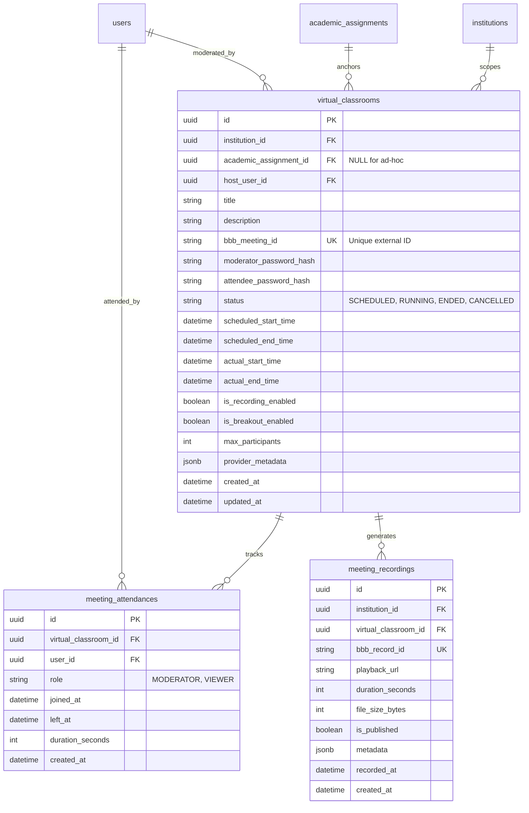

# PHASE 4 — DISCOVERY, ARCHITECTURAL ANALYSIS & IMPLEMENTATION PLAN
## Virtual Classroom & Real-Time Collaboration Subsystem

**Domain:** Virtual Classrooms, Real-Time Meeting Delivery & Recording Management  
**System:** Plataforma Educativa Virtual Nacional (PEVN)  
**Status:** PHASE 4 DISCOVERY COMPLETED / IMPLEMENTATION GATED  
**Baseline:** PHASE 3B FROZEN & FULLY PRESERVED  
**Date:** 2026-08-23  

---

## 1. Current System Baseline

The Plataforma Educativa Virtual Nacional (PEVN) has completed Phases 1, 2, and 3B:

- **Phase 1 — Foundation:** Async FastAPI architecture, PostgreSQL 16 schema conventions, Redis 7 caching, Structured JSON logging, PWA shell, Docker infrastructure.
- **Phase 2 — Authentication, Authorization & Security:** Argon2id password hashing, in-memory volatile JWT access tokens, HttpOnly refresh cookie rotation with replay breach detection, DANE territorial multi-tenancy (`scope_contains`), centralized Deny-by-Default RBAC (`CentralizedAuthorizationService`), persistent append-only audit logging (`audit_logs`), account lockout, and rate limiting.
- **Phase 3B — Academic Management:** MEN National Grade catalog, Knowledge Areas, Subjects, Academic Years lifecycle (`PLANNING` $\rightarrow$ `ACTIVE` $\rightarrow$ `CLOSED`), Classrooms (`groups`) with capacity limits and row-locking, Student profiles with SIMAT codes, Teacher statutory appointments, Guardian civil registry, Enrollment book transitions, Atomic classroom transfers with audit logs, and Single-Active-Teacher workload assignments (`academic_assignments`).

---

## 2. Phase 3B Frozen Regression Baseline

The Phase 3B implementation is **FROZEN** and serves as an immutable regression baseline for Phase 4:

```
========================================================================================
                          FROZEN PHASE 3B QUALITY BASELINE
========================================================================================
[PASS] Frontend TypeScript (tsc --noEmit)            : 0 errors
[PASS] Frontend Linter (eslint . --max-warnings 0)   : 0 errors, 0 warnings
[PASS] Frontend Vitest Suite (vitest run)            : 19/19 passed (100% across 3 suites)
[PASS] Frontend Production Bundle (vite build)       : Success (PWA + Service Worker)
[PASS] Backend Pytest Suite (pytest -v)              : 84/84 passed (100%)
[PASS] Backend Formatter (black --check backend)     : 94 files clean
[PASS] Backend Linter (ruff check backend)           : 0 issues
[PASS] Backend Static Typecheck (mypy backend)       : 0 errors (98 source files clean)
[PASS] JWT & In-Memory Token Security                : FROZEN & VERIFIED
[PASS] Multi-Tenant Isolation (Blind 404)            : FROZEN & VERIFIED
[PASS] RBAC & Granular Permission Matching           : FROZEN & VERIFIED
[PASS] PostgreSQL Invariants & Capacity Locks        : FROZEN & VERIFIED
========================================================================================
```

---

## 3. Intended Phase 4 Scope

The scope of Phase 4 is derived from repository architecture documents (`docs/ARCHITECTURE.md` §7, `docs/ADR/ADR-001-foundation-architecture.md` §13, `docs/ADR/ADR-003-academic-domain-architecture.md` §5, `docs/PHASE_3_DOMAIN_MODEL.md` §2, and `docs/DATABASE.md` §6):

### A. In-Scope Functional & Technical Components
1. **Virtual Classroom Domain (`VirtualClassroom` / `Meeting`):**
   - Scheduled and on-demand virtual sessions directly anchored to Phase 3B `academic_assignments` (Teacher + Subject + Group) or institutional ad-hoc meetings.
   - Status lifecycle: `SCHEDULED` $\rightarrow$ `RUNNING` $\rightarrow$ `ENDED` $\rightarrow$ `CANCELLED`.
2. **Provider Adapter Abstraction (`IMeetingProvider` / `IMeetingService`):**
   - Clean decoupling of educational domain logic from third-party meeting technology.
   - Default concrete adapter: **BigBlueButton (BBB) API Client** using SHA-1/SHA-256 parameter checksum signing (`create`, `join`, `isMeetingRunning`, `getMeetingInfo`, `end`, `getRecordings`).
3. **Automated Role & Authority Resolution:**
   - **Moderator Role:** Derived automatically from active `academic_assignments` (the assigned teacher) or institutional administrators (`rector`, `academic_coordinator`).
   - **Viewer / Student Role:** Derived automatically from active `enrollments` in the associated `group`. Unauthorized users are blocked before token/URL generation.
4. **Attendance Tracking (`MeetingAttendance` / `MeetingParticipant`):**
   - Ingestion of participant join/leave events, calculate duration, and record timestamps for academic accountability.
5. **Recordings Management (`MeetingRecording`):**
   - Discovery, synchronization, playback URL generation, publication status toggle (`is_published`), and deletion of session recordings with strict institutional tenant scoping.
6. **Frontend Integration (`VirtualClassroomHub`):**
   - Classroom schedule view, active session indicator, one-click moderator/student launch, recording archive player, and responsive UI feedback.

### B. Out-of-Scope Items (Deferred to Future Phases)
- Custom WebRTC media server development from scratch (PEVN delegates real-time media mixing to BigBlueButton).
- Phase 5 Academic Grading & Rubrics (evaluation weights, gradebooks, report cards).
- Phase 6 Daily institutional attendance outside virtual meetings.
- Commercial proprietary video providers (Zoom/Teams/Google Meet) during Phase 4 baseline.

---

## 4. Functional Requirements

| Requirement ID | Description |
| :--- | :--- |
| `FR-VC-001` | An authorized teacher or administrator can schedule or immediately launch a virtual classroom for a specific subject and group. |
| `FR-VC-002` | The system must verify that the user launching as moderator is the active assigned teacher of the `academic_assignment` or an institutional administrator. |
| `FR-VC-003` | Enrolled students in the group can join the running virtual classroom as viewers; unenrolled students or users from other institutions are strictly barred. |
| `FR-VC-004` | The system must generate signed, short-lived BigBlueButton join URLs with appropriate passwords (`moderatorPW` / `attendeePW`) without exposing secrets to the frontend. |
| `FR-VC-005` | The moderator can formally end the virtual classroom, updating session status in PEVN and terminating the remote meeting on the BigBlueButton server. |
| `FR-VC-006` | The system must record participant session attendance (join time, leave time, total active minutes). |
| `FR-VC-007` | When recording is enabled, the system must synchronize generated recordings from BigBlueButton and make them available exclusively to authorized students and teachers of that course. |

---

## 5. Technical Requirements & Architecture Impact

### A. Layered Meeting Provider Abstraction

```
+-----------------------------------------------------------------------------------+
| 1. Presentation Layer (Frontend React)                                            |
|    - VirtualClassroomHub, LiveMeetingLauncher, RecordingsArchive                  |
+-----------------------------------------------------------------------------------+
                                         | (REST JSON + Bearer JWT)
+-----------------------------------------------------------------------------------+
| 2. API Gateway & Controller Layer (FastAPI)                                       |
|    - /api/v1/virtual-classrooms, /api/v1/recordings                               |
|    - Permissions: virtual_classrooms:create, join_moderator, join_viewer, end     |
+-----------------------------------------------------------------------------------+
                                         |
+-----------------------------------------------------------------------------------+
| 3. Domain Services Layer (Pure Business Logic)                                    |
|    - VirtualClassroomService: verifies tenant, assignment, enrollment status      |
|    - AttendanceService, RecordingService                                          |
+-----------------------------------------------------------------------------------+
                                         | (Calls Interface)
+-----------------------------------------------------------------------------------+
| 4. Meeting Provider Abstraction Layer                                             |
|    - IMeetingProvider (Protocol / Abstract Interface)                             |
|      - create_meeting(params) -> MeetingInfo                                      |
|      - generate_join_url(meeting_id, user_name, role, ...) -> str                 |
|      - end_meeting(meeting_id, password) -> bool                                  |
|      - get_recordings(meeting_id) -> list[RecordingInfo]                          |
|      - is_meeting_running(meeting_id) -> bool                                     |
+-----------------------------------------------------------------------------------+
                                         | (Concrete Implementation)
+-----------------------------------------------------------------------------------+
| 5. BigBlueButton Provider Adapter (BigBlueButtonProvider)                         |
|    - Asynchronous HTTP client (httpx.AsyncClient)                                 |
|    - Cryptographic Checksum calculation: SHA-1(api_call + query_params + secret)   |
|    - XML response parser & error mapper                                           |
+-----------------------------------------------------------------------------------+
                                         | (HTTPS XML API)
+-----------------------------------------------------------------------------------+
| 6. BigBlueButton Server Infrastructure (External / Dedicated Cluster)             |
+-----------------------------------------------------------------------------------+
```

---

## 6. Database Impact

Phase 4 requires a dedicated database migration (`005_phase4_virtual_classrooms`) introducing 3 new relational tables:



### Constraints & Indexes
- `uq_virtual_classrooms_bbb_id`: Unique constraint on `bbb_meeting_id`.
- `ix_virtual_classrooms_institution`: B-tree index on `(institution_id, status)`.
- `ix_virtual_classrooms_assignment`: B-tree index on `(academic_assignment_id, status)`.
- `ix_meeting_attendances_classroom_user`: B-tree index on `(virtual_classroom_id, user_id)`.
- `ix_meeting_recordings_classroom`: B-tree index on `(virtual_classroom_id, is_published)`.

---

## 7. API Impact

New REST endpoints under `/api/v1/virtual-classrooms` and `/api/v1/recordings`:

| HTTP Method | Path | Required Permission | Description |
| :--- | :--- | :--- | :--- |
| `POST` | `/api/v1/virtual-classrooms` | `virtual_classrooms:create` | Create/schedule a virtual classroom session |
| `GET` | `/api/v1/virtual-classrooms` | `virtual_classrooms:read` | List virtual classrooms (filters: assignment, status, date) |
| `GET` | `/api/v1/virtual-classrooms/{id}` | `virtual_classrooms:read` | Get virtual classroom details and live status |
| `POST` | `/api/v1/virtual-classrooms/{id}/join` | `virtual_classrooms:join` | Resolve role, verify enrollment/assignment, generate signed join URL |
| `POST` | `/api/v1/virtual-classrooms/{id}/end` | `virtual_classrooms:end` | End running virtual classroom (moderator/admin only) |
| `GET` | `/api/v1/virtual-classrooms/{id}/attendance` | `virtual_classrooms:read_attendance` | Get attendee attendance logs |
| `GET` | `/api/v1/virtual-classrooms/{id}/recordings` | `recordings:read` | List recordings for a virtual classroom |
| `PATCH` | `/api/v1/recordings/{id}/publish` | `recordings:manage` | Toggle recording publication visibility |
| `DELETE` | `/api/v1/recordings/{id}` | `recordings:delete` | Delete recording record and trigger remote purge |

---

## 8. Frontend Impact

1. **TypeScript Types (`frontend/src/types/virtual_classroom.ts`):**
   - `VirtualClassroomStatus`, `VirtualClassroomResponse`, `VirtualClassroomCreateRequest`, `JoinMeetingResponse`, `AttendanceResponse`, `RecordingResponse`.
2. **API Client (`frontend/src/services/virtualClassroom.ts`):**
   - Typed methods calling the `/api/v1/virtual-classrooms` API.
3. **Views & Pages (`frontend/src/pages/virtual_classroom/`):**
   - `VirtualClassroomsView.tsx`: Active sessions overview, scheduling calendar, launch controls.
   - `ClassroomDetailView.tsx`: Live room status, participant list, recording archive.
   - `MeetingLauncher.tsx`: Safe URL redirector / embedded launch handler.
4. **Navigation & Dashboard:**
   - Add "Aulas Virtuales" navigation link in `RootLayout.tsx` and quick access widget in `Dashboard.tsx`.

---

## 9. Security & Multi-Tenant Preservation

1. **Cryptographic Checksum Verification:** Secret keys (`BBB_SECRET`) are kept strictly on the backend. The frontend never interacts with BigBlueButton directly; all join parameters and checksums are computed by the backend service.
2. **Strict Multi-Tenant Isolation:** Classrooms and recordings are isolated per `institution_id`. Cross-tenant requests return **`404 Not Found`** (Blind 404 behavior).
3. **Content Security Policy (CSP) Updates:** In [backend/app/core/security/headers.py](file:///c:/Users/juanc/OneDrive/Documentos/Desarrollo%20proyectos/Plataforma%20Educativa/Plataforma%20Educativa%20Virtual%20Nacional%20PEVN/backend/app/core/security/headers.py), update `media-src` and `frame-src` to allow secure connections to the configured BigBlueButton domain.
4. **Moderator Privilege Protection:** Students cannot obtain moderator credentials; role resolution is enforced dynamically against active `academic_assignments` in PostgreSQL.

---

## 10. Risk Assessment & Architectural Categorization

| Component / Task | Category | Risk Description & Mitigation |
| :--- | :--- | :--- |
| Database Migration (3 new tables) | **SAFE** | Non-destructive additions. Full downgrade scripts provided. Zero modification to existing tables. |
| `IMeetingProvider` Abstraction | **SAFE** | Pure interface layer. High testability via mock adapters. |
| BigBlueButton HTTP Client | **REQUIRES REVIEW** | Network latency / BBB server downtime. Mitigated by timeouts, retries, and graceful fallback errors. |
| Dynamic CSP Header Adjustments | **REQUIRES REVIEW** | Need to ensure frame-src allows BBB iframe or popout without introducing XSS vulnerabilities. |
| Role & Authority Resolution | **SAFE** | Built on frozen Phase 3B `academic_assignments` and `enrollments` models. |

---

## 11. Proposed Phase 4 Implementation Plan

Phase 4 will execute across 7 controlled, gated steps:

```
[Phase 4 Implementation Steps]
Step 1: Virtual Classroom Foundation, Models & Migration (005_phase4_virtual_classrooms)
  │
  ▼ [GATE 1: Pytest, Black, Ruff, Mypy PASS]
Step 2: Meeting Provider Abstraction & BigBlueButton Client (IMeetingProvider, BBBAdapter)
  │
  ▼ [GATE 2: Provider Mock Tests PASS]
Step 3: Domain Services Layer (VirtualClassroomService, AttendanceService, RecordingService)
  │
  ▼ [GATE 3: Domain Unit Tests PASS]
Step 4: REST Controllers & API Gateway (/api/v1/virtual-classrooms, /api/v1/recordings)
  │
  ▼ [GATE 4: API Integration Tests PASS]
Step 5: Frontend Views & UI Integration (VirtualClassroomsView, Launcher, Types, Services)
  │
  ▼ [GATE 5: TypeScript, ESLint, Vitest, Build PASS]
Step 6: End-to-End Testing & Integration Validation (Full E2E suite, Multi-tenant checks)
  │
  ▼ [GATE 6: Full Stack E2E PASS]
Step 7: Final Documentation, Knowledge Archival & Formal Closure
```

---

## 12. Conclusion & Discovery Status

The Phase 4 architecture is fully specified, aligned with the Colombian educational context, decoupled via provider abstractions, and completely preserves the frozen Phase 2 and Phase 3B security foundations.

```
========================================================================================
                 PHASE 4 DISCOVERY STATUS: READY FOR IMPLEMENTATION
========================================================================================
```

**Next Action:** Await user authorization for **Phase 4 Step 1 (Virtual Classroom Foundation, Data Model & Migration)**.
