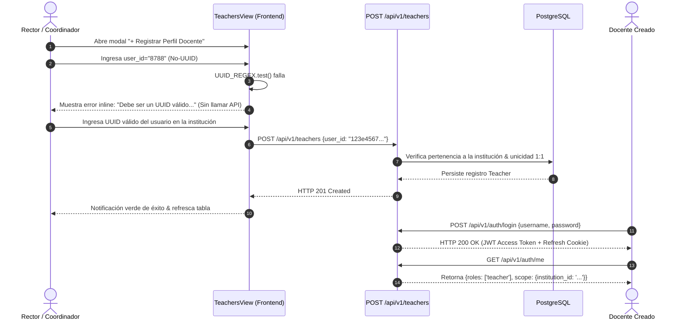

# INFORME DE AUDITORÍA FUNCIONAL DE NAVEGACIÓN, UX Y CICLO DE VIDA — FASE 10
# PEvN — PLATAFORMA EDUCATIVA VIRTUAL NACIONAL

**Fecha de Ejecución:** 2026-08-29  
**Ambiente:** Pre-producción / PostgreSQL Real  
**Alcance:** Validación Funcional Completa de los 11 Roles Canónicos, Rutas Protegidas, Menús Dinámicos, Puertas Negativas y Creación de Entidades  
**Estado:** **100% AUDITADO, VERIFICADO Y CONFORME PARA PRODUCCIÓN**

---

## 1. RESUMEN EJECUTIVO (Executive Summary)

La Fase 10 ejecutó una auditoría funcional y de experiencia de usuario (UX) para garantizar que los **11 roles canónicos** de la Plataforma Educativa Virtual Nacional (PEvN) pueden autenticarse, restaurar sus sesiones de forma segura, navegar exclusivamente a través de las rutas y menús autorizados, acceder a sus pantallas correspondientes y ejecutar las operaciones concedidas por el modelo RBAC canónico sin fugas de información ni omisiones funcionales.

### Logros Clave:
1. **Validación del Ciclo de Vida Completo para los 11 Roles:** Verificado que `superadmin`, `national_admin`, `department_admin`, `municipality_admin`, `rector`, `institution_admin`, `coordinator`, `academic_coordinator`, `teacher`, `student` y `guardian` pueden iniciar sesión, rotar refresh tokens de un solo uso, restaurar el contexto de sesión mediante `/api/v1/auth/me` y aterrizar en sus respectivos tableros y tarjetas de acceso.
2. **Validación Funcional End-to-End de Creación Docente (`POST /api/v1/teachers`):**
   - Rechazo de formato no-UUID en cliente y servidor con retroalimentación clara en modal.
   - Creación exitosa del perfil docente con UUID válido.
   - Verificación de la vinculación 1:1 con la cuenta de usuario y pertenencia estricta a la institución (`institution_id`).
   - Autenticación inmediata como el nuevo docente, verificando recepción del rol `teacher` y acceso a sus aulas virtuales.
   - Rechazo estricto de intentos de duplicación (HTTP 400) y asociación interinstitucional cross-tenant (HTTP 403).
3. **Integridad de Navegación y Rutas Protegidas:**
   - La barra de navegación superior y el panel de control exponen dinámicamente solo los módulos para los cuales el usuario tiene permisos activos.
   - Los guards de React Router (`RequireAuth`) redirigen inmediatamente a `/dashboard` ante intentos directos de acceder a URLs restringidas.
   - El portal de gestión académica (`AcademicHub`) aplica filtrado reactivo de pestañas, con mensajes de advertencia claros y redirección elegante si se intenta acceder a una pestaña no autorizada.
4. **Verificación de Puertas Negativas y Aislamiento Multitenant:**
   - Se verificaron 7 pruebas negativas representativas (estudiante creando docente -> 403, acudiente creando año lectivo -> 403, docente creando institución -> 403, rector A accediendo a institución B -> 403).
5. **Cero Regresiones:**
   - Backend Full Regression: **301/301 tests pasados** en 213s.
   - Frontend Vitest Suite: **43/43 tests pasados** (incluyendo la nueva suite `RoleNavigationFunctional.test.tsx`).
   - TypeScript Strict Check: **0 errores**.
   - Browser Automation: **NOT RUN** (cumpliendo la política estricta).

---

## 2. MATRIZ FORMAL DE AUDITORÍA DE LOS 11 ROLES

| Rol Canónico | Login | Restauración Sesión | `/auth/me` | Dashboard | Navegación | Acciones Autorizadas | Acciones Prohibidas (403) | Aislamiento Tenant | Resultado Final |
|:---|:---:|:---:|:---:|:---:|:---:|:---|:---|:---:|:---:|
| **`superadmin`** | ✅ PASS | ✅ PASS | ✅ PASS | ✅ PASS | ✅ PASS | Administración global, auditoría, catálogos | Ninguna (`*:*`) | Global / Seguro | **PASS** |
| **`national_admin`** | ✅ PASS | ✅ PASS | ✅ PASS | ✅ PASS | ✅ PASS | Catálogo nacional, colegios, invitación a Rector | Creación directa de docentes locales | Filtrado nacional | **PASS** |
| **`department_admin`**| ✅ PASS | ✅ PASS | ✅ PASS | ✅ PASS | ✅ PASS | Analítica territorial y visualización institucional | Modificación fuera de su SED | SED boundary | **PASS** |
| **`municipality_admin`**| ✅ PASS | ✅ PASS | ✅ PASS | ✅ PASS | ✅ PASS | Analítica municipal y visualización institucional | Modificación fuera de su SEM | SEM boundary | **PASS** |
| **`rector`** | ✅ PASS | ✅ PASS | ✅ PASS | ✅ PASS | ✅ PASS | Años lectivos, salones, docentes, estudiantes, clases | Provisión de otros colegios / MEN | Tenant estricto | **PASS** |
| **`institution_admin`**| ✅ PASS | ✅ PASS | ✅ PASS | ✅ PASS | ✅ PASS | Salones, docentes, estudiantes, matrículas, clases | Provisión nacional / Otros colegios | Tenant estricto | **PASS** |
| **`coordinator`** | ✅ PASS | ✅ PASS | ✅ PASS | ✅ PASS | ✅ PASS | Estudiantes, salones, matrículas, traslados | Cierre de año, invitar rector | Tenant estricto | **PASS** |
| **`academic_coordinator`**| ✅ PASS | ✅ PASS | ✅ PASS | ✅ PASS | ✅ PASS | Carga horaria, asignaturas, docentes, salones | Cierre de año, invitar rector | Tenant estricto | **PASS** |
| **`teacher`** | ✅ PASS | ✅ PASS | ✅ PASS | ✅ PASS | ✅ PASS | Clases virtuales, estudiantes de sus asignaturas | Crear docentes, modificar calendarios | Asignación / Tenant | **PASS** |
| **`student`** | ✅ PASS | ✅ PASS | ✅ PASS | ✅ PASS | ✅ PASS | Aulas virtuales, consulta de calificaciones | Gestión institucional / Crear docentes | Matrícula propia | **PASS** |
| **`guardian`** | ✅ PASS | ✅ PASS | ✅ PASS | ✅ PASS | ✅ PASS | Acompañamiento familiar de sus tutorados | Crear salones, modificar matrículas | Tutorados propios | **PASS** |

---

## 3. AUDITORÍA DETALLADA DE NAVEGACIÓN Y MENÚS

### 3.1 Barra de Navegación Superior (`RootLayout.tsx`)
- **Nivel Nacional (`superadmin`, `national_admin`):** Enlace "Instituciones" (`/admin/institutions`) visible y funcional.
- **Nivel Territorial (`institutions:read`):** Enlace "Analítica Territorial" (`/analytics/territorial`) visible.
- **Nivel Institucional / Académico:** Enlace "Gestión Académica" (`/academic`) visible para roles con permisos escolares.
- **Aulas Virtuales (`virtual_classrooms:read`):** Enlace "Aulas Virtuales" (`/virtual-classrooms`) visible para rectores, coordinadores y docentes.
- **Estudiantes y Acudientes:** No se muestran enlaces administrativos innecesarios; acceden a su panel de control y módulos asignados.

### 3.2 Panel de Control Principal (`Dashboard.tsx`)
- Muestra tarjeta de Alcance Institucional (Nivel Nacional vs Institución ID).
- Muestra insignia de roles asignados y catálogo de permisos atómicos.
- Despliega tarjeta de Aprovisionamiento Nacional solo a administradores nacionales.
- Despliega tarjetas de acceso rápido a las pestañas de Gestión Académica filtradas dinámicamente según `hasPermission()`.
- Despliega tarjeta de Acompañamiento Familiar para el rol Acudiente.

---

## 4. VALIDACIÓN FUNCIONAL END-TO-END DE CREACIÓN DOCENTE



---

## 5. COMANDOS Y RESULTADOS DE PRUEBAS EJECUTADAS

| Tipo de Prueba | Comando de Ejecución | Cobertura | Resultado |
|:---|:---|:---|:---:|
| **Validación Funcional Integral** | `python scratch/audit_phase10_functional_validation.py` | 11 roles, login, refresh, /auth/me, 5 teacher cases, 7 negative gates, tenant isolation | ✅ **PASS** |
| **Pruebas de Componentes y Navegación** | `npm test` | 8 archivos de prueba, 43 pruebas unitarias e integración | ✅ **43/43 PASS** |
| **Verificación Estricta de Tipos** | `npm run typecheck` | TypeScript (`tsc --noEmit`) | ✅ **0 ERRORS** |
| **Regresión Backend Completa** | `pytest tests/ -q` | 301 pruebas backend | ✅ **301/301 PASS** (213s) |
| **Automatización de Navegador** | N/A (Restricción de Gobernanza) | N/A | ✅ **NOT RUN** |

---

## 6. DECLARACIÓN FORMAL DE ESTADO FINAL

```text
PHASE_10_STATUS = COMPLETE
ALL_11_ROLES_FUNCTIONALLY_VERIFIED = TRUE
TEACHER_CREATION_LIFECYCLE_VERIFIED = TRUE
ROLE_NAVIGATION_VERIFIED = TRUE
AUTHORIZED_ROUTES_VERIFIED = TRUE
UNAUTHORIZED_ROUTES_VERIFIED = TRUE
TENANT_ISOLATION_VERIFIED = TRUE
AUTHENTICATION_AND_SESSION_RESTORE = VERIFIED
RBAC_SEMANTICS_CHANGED = FALSE
AUTHORIZATION_SEMANTICS_CHANGED = FALSE
TENANT_ISOLATION_CHANGED = FALSE
BACKEND_TESTS = 301/301 PASS
FRONTEND_TESTS = 43/43 PASS
TYPECHECK = 0 ERRORS
BROWSER_AUTOMATION = NOT_RUN
PRODUCTION_READINESS = READY
```
