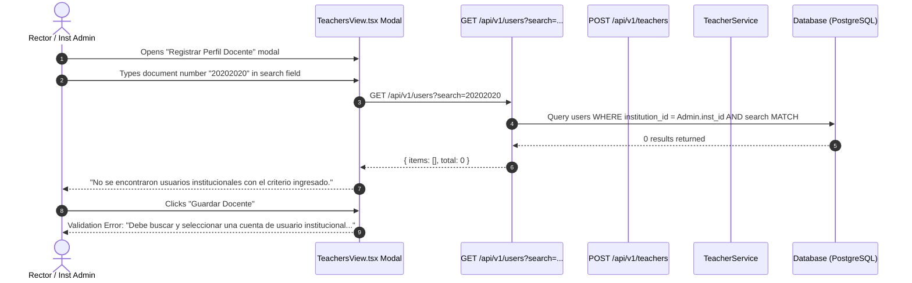
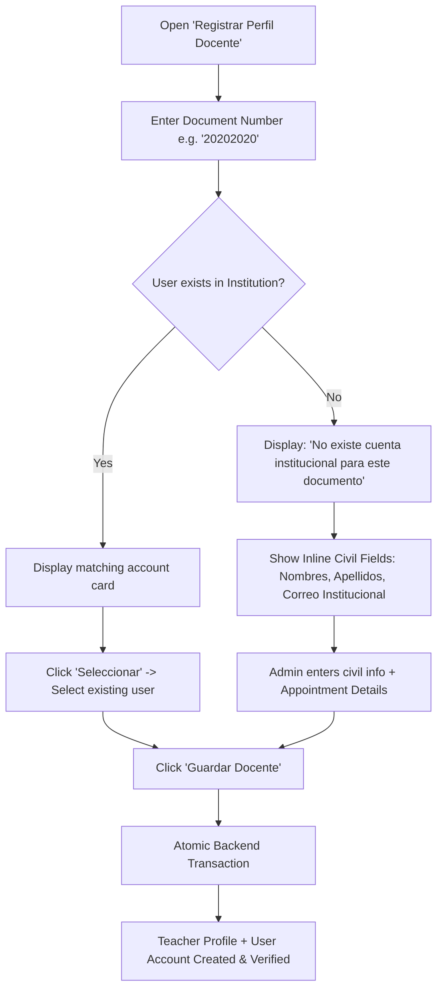

# PEvN — Phase 12A Forensic Gap Analysis & Architectural Blueprint
## Production-Grade Real User Provisioning for Institutional Educator Lifecycle

---

### Executive Summary

During manual testing of the *Plataforma Educativa Virtual Nacional (PEvN)*, an institutional administrator (Rector) attempting to register a new teacher with national document `20202020` was blocked because the user account did not previously exist in the institutional directory. 

This forensic analysis examines the existing user provisioning architecture, identifies the root causes of the administrative UX gap, audits transactional and tenant boundaries, diagnoses the browser console 401 message, and presents a production-grade architectural blueprint to enable seamless, end-to-end teacher onboarding without violating RBAC, tenant isolation, or database integrity.

---

### 1. Forensic Trace of the Current Teacher Registration Lifecycle



#### Breakdown by Architectural Layer:
1. **Frontend (`TeachersView.tsx`)**:
   - Expects an existing `User` entity to be resolved via `GET /api/v1/users?search=...`.
   - Requires `selectedUser` to be non-null to populate `user_id: selectedUser.id`.
   - If no matching user exists in the tenant, the UI has no provision to input civil data (names, email, document) or trigger onboarding.
2. **API Client (`services/academic.ts`)**:
   - `academicApi.createTeacher(payload: CreateTeacherRequest)` sends `POST /api/v1/teachers` with `{ user_id, specialty_area, contract_type, escalafon_grade }`.
3. **Backend Controller (`endpoints/teachers.py`)**:
   - Endpoint: `POST /api/v1/teachers` protected by `require_permission("teachers", "create")`.
   - Validates schema `TeacherCreateRequest` requiring `user_id: uuid.UUID`.
   - Resolves `institution_id` strictly from caller context (`auth.scope` / `current_user.institution_id`).
4. **Domain Service (`TeacherService.create_teacher`)**:
   - Step 1: Queries `User` table for `User.id == user_id` AND `User.institution_id == institution_id`. Raises `CrossTenantMismatchError` if not found.
   - Step 2: Queries `Teacher` table for `Teacher.user_id == user_id`. Raises `AcademicDomainError` if profile already exists.
   - Step 3: Inserts `Teacher` row and emits audit event `TEACHER_CREATED`.
5. **Where the Lifecycle Requires an Existing `user_id`**:
   - The entire backend stack treats `user_id` as a mandatory foreign key to an already-committed `users` record.
6. **Nature of the Limitation**:
   - It is a **combination of an incomplete end-to-end provisioning workflow and a UI gap**. While the separation between `User` (identity/credentials) and `Teacher` (professional appointment) is correct domain modeling, the platform lacked an integrated provisioning mechanism to create both in a single administrative operation when onboarding a new educator.

---

### 2. Audit of Existing User Provisioning & Invitation Architecture

The codebase was audited to identify all existing user creation, role assignment, and invitation implementations:

| Provisioning Path | Service / Endpoint | Method / Mechanism | Target Role | Activation / Password Flow |
| :--- | :--- | :--- | :--- | :--- |
| **Rector Provisioning** | `RectorOnboardingService` / `POST /institutions/{id}/rector-invitation` | Pre-creates `User(is_active=False)` with random unusable hash, links `UserRole(role=rector, is_active=False)`, generates 48-byte URL-safe cryptographic token (`RectorInvitation`). | `rector` | Public token redemption via `POST /auth/rector-onboarding` sets password & activates user. |
| **Guardian Provisioning** | `GuardianOnboardingService` / `POST /guardians` + `POST /guardians/{id}/students/{id}` | Creates `Guardian` civil record; tokenized invitation via `GuardianInvitation` creates/activates `User` account with `guardian` role. | `guardian` | Public token redemption via `POST /auth/guardian-activation`. |
| **Student Provisioning** | `StudentService` / `POST /api/v1/students` | Takes pre-existing `user_id: UUID` and creates `Student` profile with SIMAT uniqueness and inclusion metadata. | `student` | Pre-existing user account required. |
| **Teacher Provisioning** | `TeacherService` / `POST /api/v1/teachers` | Takes pre-existing `user_id: UUID` and creates `Teacher` profile with contract/escalafón metadata. | `teacher` | Pre-existing user account required. |
| **User Domain Service** | `UserService` (`user_service.py`) | Contains `list_users` (tenant-scoped search) and `get_user_by_id`. Does NOT yet contain a generic `provision_user` method. | N/A | Queries only. |

---

### 3. Investigation of the Browser Console 401 Error

In the browser developer tools shown in the diagnostic screenshot:
```text
Failed to load resource: the :3000/api/v1/auth/refresh:1 server responded with a status of 401 (Unauthorized)
Failed to load resource: the server :3000/favicon.ico:1 responded with a status of 404 (Not Found)
```

#### Forensic Findings:
1. **Originating Request**: `POST /api/v1/auth/refresh` triggered by `initAuth()` in `frontend/src/context/AuthContext.tsx` during initial application mount.
2. **Mechanism**: On cold application boot (or browser reload), the frontend attempts silent background session recovery by sending an HTTP request with `withCredentials: true` to check if a valid `pevn_refresh_token` cookie exists.
3. **Root Cause of 401**: When a user first opens the browser before logging in (or if the refresh cookie expired), no cookie is sent. The backend `refresh_token` endpoint correctly returns HTTP 401 (`Refresh token ausente en la solicitud`).
4. **Impact on Active Session**: **Zero**. Once the administrator logs in via `POST /api/v1/auth/login`, access and refresh tokens are established, and subsequent authenticated API calls (e.g., `GET /api/v1/users`, `POST /api/v1/teachers`) succeed normally. The initial 401 logged in the browser console is standard browser logging for unauthenticated cold starts.
5. **Recommendation**: No security relaxation. The 401 is expected behavior for cold starts and does not impair Teacher Registration.

---

### 4. Critical Architectural Decision & Evaluation of Alternatives

Three structural approaches were evaluated to resolve the provisioning gap:

```
┌─────────────────────────────────────────────────────────────────────────────┐
│ OPTION A: Separate User Management Screen / Endpoint                        │
│ - Add POST /api/v1/users and a separate "Gestión de Usuarios" menu.         │
│ - Flaw: High administrative friction. Administrator must navigate away      │
│   from "Planta Docente", create a raw User, return, search, and link.       │
│ - Verdict: REJECTED (Poor operational UX, fragments user lifecycle).       │
├─────────────────────────────────────────────────────────────────────────────┤
│ OPTION B: Inline User Creation inside TeacherService                        │
│ - Embed User entity creation directly inside TeacherService.create_teacher. │
│ - Flaw: Violates Single Responsibility Principle; duplicates User           │
│   validation, password hashing, and role assignment inside TeacherService.  │
│ - Verdict: REJECTED (High technical debt, duplicated business logic).       │
├─────────────────────────────────────────────────────────────────────────────┤
│ OPTION C: Unified Domain Provisioning via UserService & Integrated Workflow │
│ - Implement UserService.provision_user (identity, role, tenant).           │
│ - Extend Teacher Registration to accept either existing user_id OR new     │
│   educator civil details in a single atomic transaction.                   │
│ - Frontend modal seamlessly transitions between search & provisioning.      │
│ - Verdict: RECOMMENDED (Authoritative, DRY, single-transaction atomic).     │
└─────────────────────────────────────────────────────────────────────────────┘
```

---

### 5. Target Architecture & Production-Grade Lifecycle Blueprint

#### A. Target Administrator Experience (Zero UUID Exposure)



#### B. Data Contract & Payload Design

The endpoint `POST /api/v1/teachers` will support two complementary modes in a single backward-compatible schema:

```typescript
// Mode 1: Link Existing Institutional User (Existing Contract Preserved)
interface CreateTeacherExistingUser {
  user_id: string; // UUID
  specialty_area?: string;
  contract_type: 'PROPIEDAD' | 'PROVISIONAL' | 'TEMPORAL';
  escalafon_grade?: string;
}

// Mode 2: Provision New Institutional User + Teacher Profile (Integrated)
interface CreateTeacherNewUser {
  new_user: {
    first_name: string;
    last_name: string;
    document_type: 'CC' | 'TI' | 'CE' | 'PEP' | 'PPT' | 'PASSPORT';
    document_number: string;
    email: string;
    phone?: string;
  };
  specialty_area?: string;
  contract_type: 'PROPIEDAD' | 'PROVISIONAL' | 'TEMPORAL';
  escalafon_grade?: string;
}
```

#### C. Backend Execution & Atomic Transaction Flow

```
BEGIN TRANSACTION;
  1. Validate caller permission ('teachers:create' AND 'users:create').
  2. Resolve target_institution_id from caller context.
  
  IF new_user provided:
    3. Validate document uniqueness (uq_users_document).
    4. Validate email uniqueness (uq_users_email).
    5. Hash initial secure temporary credential with Argon2id.
    6. Insert User(institution_id=target_institution_id, is_active=True, is_verified=True, ...).
    7. Fetch Role('teacher').
    8. Insert UserRole(user_id=new_user.id, role_id=teacher_role.id, institution_id=target_institution_id).
    9. resolved_user_id = new_user.id.
  ELSE:
    3. Validate existing user belongs to target_institution_id.
    4. resolved_user_id = payload.user_id.
  
  10. Validate 1:1 Teacher uniqueness (select Teacher WHERE user_id = resolved_user_id).
  11. Insert Teacher(user_id=resolved_user_id, institution_id=target_institution_id, ...).
  12. Record AuditEvent(TEACHER_CREATED, metadata={user_id, is_new_user}).
COMMIT TRANSACTION;
```

---

### 6. Security, RBAC & Multi-Tenant Invariants

1. **RBAC Authorization**:
   - `rector` and `institution_admin` **already possess** `users:create` and `teachers:create` in `ROLE_PERMISSIONS_CONFIG`.
   - **Zero RBAC modifications** or permission broadening required.
2. **Server-Side Tenant Containment**:
   - `institution_id` is ALWAYS extracted from the caller's verified `AuthorizationContext` / JWT claims.
   - Any attempt by an institutional admin to supply or target an external `institution_id` is strictly rejected.
3. **Cross-Tenant Privacy**:
   - If a document or email collision occurs with a different institution, the system returns a generic conflict error (`"El documento o correo electrónico ya se encuentra registrado en el sistema."`) without leaking the external institution's name or metadata.
4. **Duplicate Prevention**:
   - Database unique constraint `uq_users_document` on `(document_type, document_number)` prevents duplicate accounts.
   - Database unique constraint `uq_teachers_user_id` on `teachers.user_id` prevents duplicate teacher profiles.

---

### 7. Transactional Failure Modes & Consistency Matrix

| Failure Point | System Action | Resulting State |
| :--- | :--- | :--- |
| **Document/Email Duplicate on User Creation** | Database / Service raises `ConflictError`. Transaction rolls back. | Clean rollback: 0 users created, 0 teachers created. |
| **Invalid Escalafón / Contract Data on Teacher Profile** | Service raises `ValidationError`. Transaction rolls back. | Clean rollback: User creation is rolled back; no orphaned user left. |
| **Audit Logging Failure** | Audit error intercepted within transaction stack. | Clean rollback ensuring complete auditability. |
| **Network Interruption during Submission** | Client receives error / timeout. Transaction either committed completely or rolled back completely. | Strict ACID consistency. |

---

### 8. Implementation Scope & Acceptance Criteria

#### Backend Scope:
1. Implement `UserService.provision_institutional_user(session, ...)` for reusable, tenant-safe user creation and role assignment.
2. Extend `POST /api/v1/teachers` and `TeacherService.create_teacher` to support atomic `new_user` provisioning.
3. Add unit and integration tests covering:
   - Creating a teacher with a new user from scratch (document `"20202020"`).
   - Linking a teacher with an existing user.
   - Cross-tenant injection rejection (HTTP 403).
   - Duplicate document/email rejection (HTTP 409).
   - Duplicate teacher profile rejection (HTTP 400).

#### Frontend Scope:
1. Update `TeachersView.tsx` modal:
   - When search returns 0 results for an entered query, present a clean option: `"+ Registrar como nuevo docente en la institución"`.
   - Expanding this reveals civil fields: *Nombres, Apellidos, Tipo/Número de Documento, Correo Institucional*.
   - Submitting sends the unified payload.
   - The user UUID remains 100% invisible.
2. Update Vitest test suites to verify the complete new-user teacher registration flow.

---

### 9. Forensic Conclusion & Stop Point

The diagnosis is complete:
- The system currently enforces a valid relational constraint (Teacher requires User), but lacked the unified domain workflow to provision a new User and Teacher profile atomically in one administrative step.
- The recommended Option C architecture cleanly resolves the issue at the root cause, reuses existing RBAC permissions, preserves multi-tenant isolation, guarantees ACID transactional rollback, and delivers an intuitive, zero-UUID administrative UX.

**Status**: FORENSIC AUDIT COMPLETE. AWAITING USER REVIEW & AUTHORIZATION TO PROCEED TO IMPLEMENTATION.
