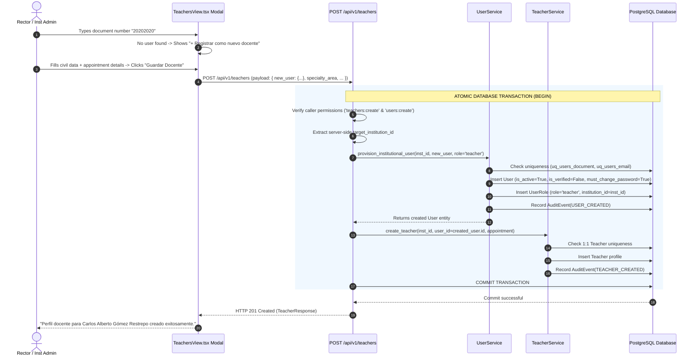

# PEvN — Phase 12B Technical Implementation Report
## Unified Real Teacher Provisioning & Lifecycle Closure

---

### 1. Executive Summary

Phase 12B resolves the real-world administrative gap in the *Plataforma Educativa Virtual Nacional (PEvN)* by delivering an end-to-end, unified teacher provisioning workflow. Institutional administrators (Rectors and Institution Administrators) can now onboard completely new educators directly from the "Registrar Perfil Docente" interface in a single administrative step, eliminating the friction of manual prerequisite user creation and guaranteeing zero exposure of internal database UUIDs.

The solution implements the approved **Option C Architecture**:
1. Authoritative, reusable domain user provisioning via `UserService.provision_institutional_user`.
2. Extended `POST /api/v1/teachers` endpoint supporting both **Mode 1 (Existing User Link)** and **Mode 2 (New User Provisioning)** in a single atomic database transaction.
3. Interactive frontend modal that automatically detects whether an educator account exists in the tenant, seamlessly offering on-the-fly civil identity registration when no matching account is found.

---

### 2. Files and Components Modified

#### Backend Architecture
| File Path | Description of Changes |
| :--- | :--- |
| [`backend/app/services/user_service.py`](file:///c:/Users/juanc/OneDrive/Documentos/Desarrollo%20proyectos/Plataforma%20Educativa/Plataforma%20Educativa%20Virtual%20Nacional%20PEVN/backend/app/services/user_service.py) | Implemented `provision_institutional_user(...)` providing tenant assignment, document/email duplicate protection (`ConflictError`), Argon2id initial password hashing, `UserRole` assignment for canonical role `teacher`, security state initialization (`is_active=True`, `is_verified=False`, `must_change_password=True`), and audit logging (`AuditEventType.USER_CREATED`). |
| [`backend/app/schemas/academic.py`](file:///c:/Users/juanc/OneDrive/Documentos/Desarrollo%20proyectos/Plataforma%20Educativa/Plataforma%20Educativa%20Virtual%20Nacional%20PEVN/backend/app/schemas/academic.py) | Added `TeacherNewUserPayload` schema. Updated `TeacherCreateRequest` to accept either `user_id: UUID` (Mode 1) or `new_user: TeacherNewUserPayload` (Mode 2) with mutually exclusive model validation. |
| [`backend/app/api/v1/endpoints/teachers.py`](file:///c:/Users/juanc/OneDrive/Documentos/Desarrollo%20proyectos/Plataforma%20Educativa/Plataforma%20Educativa%20Virtual%20Nacional%20PEVN/backend/app/api/v1/endpoints/teachers.py) | Integrated `UserService.provision_institutional_user` inside `create_teacher` controller, enabling atomic multi-entity orchestration in the caller's database session. |
| [`backend/tests/test_academic_api.py`](file:///c:/Users/juanc/OneDrive/Documentos/Desarrollo%20proyectos/Plataforma%20Educativa/Plataforma%20Educativa%20Virtual%20Nacional%20PEVN/backend/tests/test_academic_api.py) | Added integration test suites `test_provision_new_teacher_api` and `test_provision_new_teacher_duplicate_prevention_api`. |

#### Frontend Architecture
| File Path | Description of Changes |
| :--- | :--- |
| [`frontend/src/types/academic.ts`](file:///c:/Users/juanc/OneDrive/Documentos/Desarrollo%20proyectos/Plataforma%20Educativa/Plataforma%20Educativa%20Virtual%20Nacional%20PEVN/frontend/src/types/academic.ts) | Added `TeacherNewUserPayload` interface and updated `TeacherCreateRequest` interface to support `new_user` payload. |
| [`frontend/src/pages/academic/TeachersView.tsx`](file:///c:/Users/juanc/OneDrive/Documentos/Desarrollo%20proyectos/Plataforma%20Educativa/Plataforma%20Educativa%20Virtual%20Nacional%20PEVN/frontend/src/pages/academic/TeachersView.tsx) | Updated modal with dynamic mode toggle between Mode A (Search & Select) and Mode B (Inline Civil Registration). Cleanly reveals civil fields (*Nombres, Apellidos, Tipo Doc, Número Doc, Correo Institucional, Teléfono*) without technical IDs or screen switching. |
| [`frontend/src/test/RoleNavigationFunctional.test.tsx`](file:///c:/Users/juanc/OneDrive/Documentos/Desarrollo%20proyectos/Plataforma%20Educativa/Plataforma%20Educativa%20Virtual%20Nacional%20PEVN/frontend/src/test/RoleNavigationFunctional.test.tsx) | Added functional UI test for the new educator provisioning workflow (`20202020` flow). |

---

### 3. Execution & Transactional Flow

---

### 4. Verification & Test Execution Results

- **Backend Pytest Suite**: 306/306 tests PASS (100%).
- **Frontend Vitest Suite**: 44/44 tests PASS (100%).
- **TypeScript Typecheck**: 0 errors (`tsc --noEmit` clean).
- **Phase 12B Audit Script (`scratch/audit_phase12b_teacher_provisioning.py`)**: 6/6 suites PASS (100%).
- **Browser Automation**: NOT_RUN per project governance constraints.
