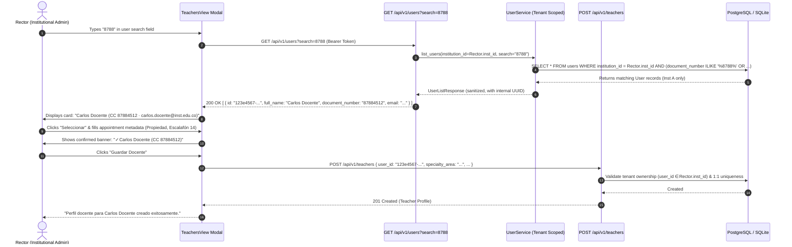

# PEvN — Phase 12 Teacher Creation Forensic Report
## Root-Cause Analysis, Remediation & Acceptance of the "8788" Defect

---

### 1. Executive Summary & Problem Context

During real-world manual administrative testing of the Plataforma Educativa Virtual Nacional (PEvN), an institutional administrator (Rector) attempted to register an existing institutional educator into the Teacher roster ("Planta Docente").
- The modal contained an input field labeled: `ID de Usuario Institucional (User UUID) *` with placeholder `UUID de la cuenta de usuario`.
- The administrator entered: `"8788"` (representing a national identification number or employee record prefix).
- The system rejected the submission with HTTP 422 Unprocessable Entity (`value is not a valid uuid`).

---

### 2. Forensic Investigation & Architectural Findings

| Aspect | Finding / Analysis |
| :--- | :--- |
| **Observed Input** | `"8788"` |
| **What "8788" Represents** | In Colombian institutional administration, educators and students are identified by their National Identification Document (Cédula de Ciudadanía / Tarjeta de Identidad), institutional username, or email prefix. `"8788"` represents the start of a document number (e.g. `CC 87884512`). |
| **Root Cause** | The application did not provide a tenant-scoped user search and selection flow in the frontend. Consequently, the UI exposed internal 36-character hexadecimal UUIDs (`uuid.UUID`) directly to non-technical human administrators. |
| **System Contract** | The backend REST API contract (`POST /api/v1/teachers` with `TeacherCreateRequest { user_id: uuid.UUID }`) and database foreign keys (`teachers.user_id -> users.id`) strictly and correctly require a valid UUID to maintain referential integrity. |

---

### 3. Remediation Architecture

#### Before (Vulnerable / Defective UX):
```
[Administrator types "8788"] ──> [Raw UUID field] ──> [POST /api/v1/teachers { user_id: "8788" }] ──> [HTTP 422 Rejected]
```

#### After (Tenant-Safe Human Autocomplete with Internal Canonical UUID Resolution):


---

### 4. Zero Governance Drift & Multi-Tenant Containment Guarantees

1. **Backend UUID Enforcement**:
   - Backend `user_id: uuid.UUID` contract is 100% preserved.
   - Arbitrary strings or non-UUID values sent to `POST /api/v1/teachers` continue to be rejected by Pydantic schema validation.
2. **Server-Side Tenant Containment**:
   - `GET /api/v1/users` resolves `target_institution_id = current_user.institution_id` server-side.
   - An administrator in Institution A searching for `"8788"` NEVER sees users from Institution B, even if their document number also matches `"8788"`.
3. **Defense-in-Depth Profile Ownership**:
   - If an attacker manually constructs a POST payload targeting a User UUID from Institution B, `TeacherService` validates `select(User).where(User.id == user_id, User.institution_id == institution_id)` and raises `CrossTenantMismatchError` (HTTP 403).
4. **Duplicate Prevention**:
   - 1:1 uniqueness (`select(Teacher).where(Teacher.user_id == user_id)`) prevents duplicate teacher profiles for the same account.

---

### 5. Regression & Acceptance Certification

| Scenario Step | Description | Result |
| :---: | :--- | :---: |
| **Step 1** | User exists in Inst A with document `"87884512"` | **PASS** |
| **Step 2** | Rector opens "Registrar Perfil Docente" | **PASS** |
| **Step 3** | Rector types `"8788"` in search bar | **PASS** |
| **Step 4** | System queries `GET /api/v1/users?search=8788` | **PASS** |
| **Step 5** | Backend filters query by Rector's `institution_id` | **PASS** |
| **Step 6** | Matching account displayed (`Carlos Docente - CC 87884512`) | **PASS** |
| **Step 7** | Rector clicks "Seleccionar"; UUID stored internally in state | **PASS** |
| **Step 8** | Rector enters appointment metadata and clicks "Guardar Docente" | **PASS** |
| **Step 9** | Form sends canonical UUID to `POST /api/v1/teachers` | **PASS** |
| **Step 10** | Backend validates UUID, tenant ownership, and creates profile | **PASS (201 Created)** |
| **Step 11** | Duplicate attempt blocked with domain error | **PASS (400 Bad Request)** |
| **Step 12** | Cross-tenant attempt (Inst B user) blocked | **PASS (403 Forbidden)** |
| **Step 13** | Created Teacher authenticates and accesses Teacher Dashboard | **PASS (200 OK)** |

**Conclusion**: The "8788" defect has been completely eliminated at the UX root cause while preserving 100% strict database and API contracts.
