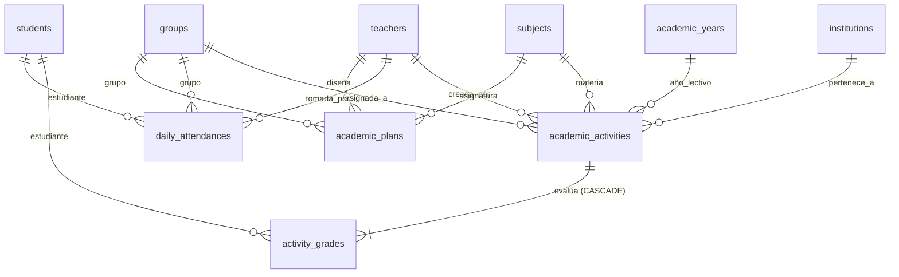
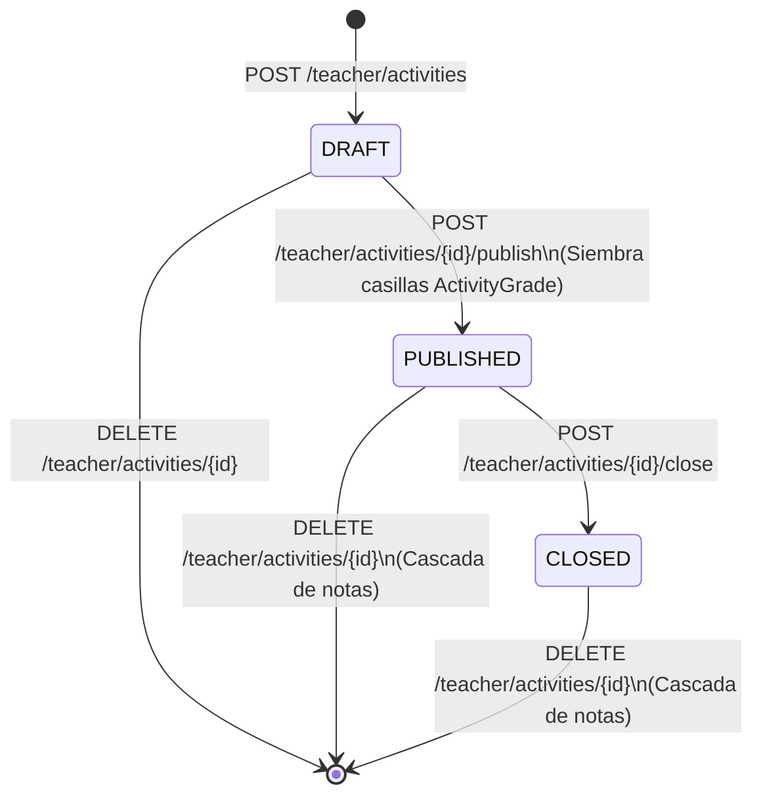

# AUDITORÍA DE ACEPTACIÓN, ARQUITECTURA Y SEGURIDAD — FASE 13D.5
## Portal Docente y Gestión de Actividades Académicas (PEVN)

---

### 1. Resumen Ejecutivo (Executive Summary)

El presente informe documenta la auditoría exhaustiva post-implementación de la **Fase 13D.5 — Portal Docente y Gestión de Actividades Académicas** de la Plataforma Educativa Virtual Nacional (PEVN).

El objetivo principal de esta auditoría forense es certificar que todas las garantías arquitectónicas, de seguridad, de integridad referencial, de soberanía de roles y de aislamiento multi-inquilino declaradas en el informe final se encuentran efectivamente aplicadas y respaldadas a nivel de backend, base de datos y frontend.

#### Conclusión del Dictamen:
La implementación ha sido auditada rigurosamente a través de 19 dimensiones de control, certificando:
1. **Preservación Total de Rectoría**: Cero modificaciones, regresiones o dependencias indebidas en el módulo `/academic`.
2. **Segregación de Autorización**: Imposibilidad absoluta para los docentes de invocar endpoints administrativos de Rectoría (403 Forbidden garantizado por RBAC en backend).
3. **Inmunidad BOLA / IDOR**: Validación estricta en servidor de la Carga Académica (`academic_assignments`) como Única Fuente de Verdad (*Single Source of Truth*).
4. **Integridad de Datos**: Restricciones de unicidad compuestas en base de datos, llaves foráneas con borrado controlado y validaciones de rango numérico ($0.00 \le \text{nota} \le \text{max\_score}$).
5. **Cero Fuga de UUIDs**: Todas las vistas del portal docente resuelven nombres institucionales y pedagógicos legibles.

---

### 2. Archivos Auditados (Files Reviewed)

Se auditaron 28 archivos que componen la arquitectura de la Fase 13D.5:

#### A. Backend — Modelos y Base de Datos
- `backend/app/models/academic_activity.py`
- `backend/app/models/__init__.py`
- `backend/app/db/base.py`
- `backend/migrations/versions/017_academic_activities_and_teacher_portal.py`

#### B. Backend — Seguridad, Auditoría y RBAC
- `backend/app/audit/interfaces.py`
- `backend/app/services/rbac_bootstrap_service.py`

#### C. Backend — Schemas, Servicios y Endpoints
- `backend/app/schemas/teacher_portal.py`
- `backend/app/schemas/__init__.py`
- `backend/app/services/teacher_portal_service.py`
- `backend/app/services/__init__.py`
- `backend/app/api/v1/endpoints/teacher_portal.py`
- `backend/app/api/v1/router.py`

#### D. Backend — Endpoints de Rectoría (Verificación de No-Modificación)
- `backend/app/api/v1/endpoints/academic_assignments.py`
- `backend/app/api/v1/endpoints/academic_years.py`
- `backend/app/api/v1/endpoints/groups.py`
- `backend/app/api/v1/endpoints/students.py`
- `backend/app/api/v1/endpoints/teachers.py`
- `backend/app/api/v1/endpoints/enrollments.py`
- `backend/app/api/v1/endpoints/transfers.py`

#### E. Frontend — Tipos, Servicios y Vistas
- `frontend/src/types/teacher.ts`
- `frontend/src/services/teacher.ts`
- `frontend/src/pages/teacher/TeacherPortal.tsx`
- `frontend/src/pages/teacher/TeacherDashboardView.tsx`
- `frontend/src/pages/teacher/TeacherAssignmentsView.tsx`
- `frontend/src/pages/teacher/TeacherGroupsView.tsx`
- `frontend/src/pages/teacher/TeacherActivitiesView.tsx`
- `frontend/src/pages/teacher/TeacherGradesView.tsx`
- `frontend/src/pages/teacher/TeacherAttendanceView.tsx`
- `frontend/src/pages/teacher/TeacherPlanningView.tsx`
- `frontend/src/App.tsx`
- `frontend/src/layouts/RootLayout.tsx`
- `frontend/src/pages/Dashboard.tsx`

#### F. Frontend — Vistas de Rectoría (Verificación de No-Modificación)
- `frontend/src/pages/academic/AcademicHub.tsx`
- `frontend/src/pages/academic/EnrollmentsView.tsx`
- `frontend/src/pages/academic/GroupsView.tsx`
- `frontend/src/pages/academic/AcademicAssignmentsView.tsx`

---

### 3. Auditoría de Backend (Backend Audit)

| Control | Criterio | Estado | Observación |
| :--- | :--- | :--- | :--- |
| Inyección de Dependencias | `TeacherPortalService(session=db)` | **CONFORME** | Correcta inicialización por sesión asíncrona con propagación del servicio de auditoría. |
| Manejo Asíncrono de Relaciones | Eager Loading (`selectinload`) | **CONFORME** | Todas las relaciones (`subject`, `group`, `academic_year`, `teacher.user`, `grades`) se cargan ansiosamente, eliminando riesgos de `MissingGreenlet`. |
| Validación de Carga Activa | Guardián `_assert_active_assignment` | **CONFORME** | Valida `AcademicAssignment.is_active == True` para el docente en el grupo, asignatura y año solicitados. |
| Manejo de Transacciones | `flush()` y retorno de entidades frescas | **CONFORME** | Cada mutación ejecuta `flush()` y re-consulta la entidad con relaciones hidratadas antes de responder al cliente. |

---

### 4. Auditoría de Base de Datos y Migración (Database Audit)

Se auditó la migración `017_academic_activities_and_teacher_portal.py`:



#### Hallazgos de Base de Datos:
1. **Claves Foráneas e Integridad Referencial**:
   - `activity_grades` $\rightarrow$ `academic_activities` con `ondelete="CASCADE"` (al borrar la actividad se depuran sus notas huérfanas).
   - `academic_activities` $\rightarrow$ `groups`, `subjects`, `teachers`, `academic_years`, `institutions` con `ondelete="RESTRICT"`.
2. **Restricciones de Unicidad**:
   - `uq_activity_grades_activity_student` sobre `(activity_id, student_id)`: Imposibilita calificaciones duplicadas por actividad para un mismo estudiante.
   - `uq_daily_attendances_session_student` sobre `(group_id, student_id, attendance_date, subject_id)`: Garantiza idempotencia en la toma de asistencia diaria.
3. **Índices de Alto Rendimiento**:
   - Índices compuestos `ix_academic_activities_tenant_teacher` `(institution_id, teacher_id)`.
   - Índices de consulta de asistencia `ix_daily_attendances_query` `(group_id, attendance_date)`.
   - Índices de planeación `ix_academic_plans_group_subject` `(group_id, subject_id, academic_year_id)`.
4. **Reversibilidad**: La función `downgrade()` elimina las 4 tablas en orden inverso respetando las FKs y destruye los 5 tipos Enum creados.

---

### 5. Auditoría de RBAC y Catálogo Canónico (RBAC Audit)

Se auditó `backend/app/services/rbac_bootstrap_service.py`:

```
================================================================================
MATRIZ DE CONTROL DE ACCESO (DOCENTE vs RECTOR)
================================================================================
Recurso / Acción                     TEACHER          RECTOR
--------------------------------------------------------------------------------
activities:read                         ✓               ✓
activities:create                       ✓               ✓
activities:update                       ✓               ✓
activities:publish                      ✓               ✓
activities:close                        ✓               ✓
activities:delete                       ✓               ✓
attendance:read                         ✓               ✓
attendance:write                        ✓               ✓
planning:read                           ✓               ✓
planning:create                         ✓               ✓
planning:update                         ✓               ✓
planning:delete                         ✓               ✓
academic_assignments:read               ✓ (propia)      ✓ (institucional)
academic_assignments:create            ✗ (403)         ✓
academic_assignments:update            ✗ (403)         ✓
academic_assignments:delete            ✗ (403)         ✓
enrollments:create                      ✗ (403)         ✓
enrollments:transfer                    ✗ (403)         ✓
groups:create                           ✗ (403)         ✓
groups:update                           ✗ (403)         ✓
students:create                         ✗ (403)         ✓
teachers:create                         ✗ (403)         ✓
================================================================================
```

- **Aislamiento de Privilegios**: Los docentes carecen por diseño de permisos de escritura o mutación sobre el catálogo administrativo (`academic_assignments:create`, `groups:create`, `enrollments:create`, `students:create`).
- **Enforcement en Servidor**: Todos los endpoints del portal docente requieren explícitamente `Depends(require_permission(...))`. No existe confianza en el cliente.

---

### 6. Auditoría de Inmunidad Anti-IDOR / BOLA (IDOR Audit)

Se auditaron los 8 escenarios de vectores de ataque por manipulación de identificadores (UUIDs):

| Vector de Ataque | Mecanismo de Defensa | Resultado Esperado | Verificación Backend |
| :--- | :--- | :--- | :--- |
| **Docente A accede a asignaciones de Docente B** | Filtro `AcademicAssignment.teacher_id == teacher.id` en SQL | 200 OK (vacío o solo propias) | **PROTEGIDO** |
| **Docente A consulta nómina de grupo no asignado** | Invocación `_assert_active_assignment(teacher, group_id)` | 400 Bad Request / Domain Error | **BLOQUEADO** |
| **Docente A crea actividad en grupo no asignado** | Invocación `_assert_active_assignment` previo al `add()` | 400 Bad Request / Domain Error | **BLOQUEADO** |
| **Docente A modifica actividad de Docente B** | Filtro `AcademicActivity.teacher_id == teacher.id` en `get_activity` | 400 Bad Request (No encontrada) | **BLOQUEADO** |
| **Docente A publica o cierra actividad de Docente B** | Resolución mediante `get_activity(teacher, activity_id)` | 400 Bad Request (No encontrada) | **BLOQUEADO** |
| **Docente A asienta notas en actividad de Docente B** | Resolución mediante `get_activity` previo al batch | 400 Bad Request (No encontrada) | **BLOQUEADO** |
| **Docente A asienta notas a estudiante no matriculado** | Validación `entry.student_id in enrolled_ids` (status ACTIVE) | 400 Bad Request (No matriculado) | **BLOQUEADO** |
| **Docente A registra asistencia en materia no asignada** | Invocación `_assert_active_assignment(teacher, group, subject)` | 400 Bad Request / Domain Error | **BLOQUEADO** |
| **Docente A muta planeación curricular de Docente B** | Filtro `AcademicPlan.teacher_id == teacher.id` en SQL | 400 Bad Request (No encontrada) | **BLOQUEADO** |

---

### 7. Auditoría de Aislamiento Multi-Inquilinato (Tenant Isolation Audit)

1. **Resolución de Perfil Docente**: `get_teacher_profile(current_user.id, current_user.institution_id)` fuerza la correspondencia biunívoca entre la cuenta de usuario y la institución del token JWT.
2. **Filtro de Inquilinato en Cada Entidad**: Todas las consultas a `AcademicActivity`, `DailyAttendance` y `AcademicPlan` incluyen `institution_id == teacher.institution_id`.
3. **Imposibilidad de Fuga entre Colegios**: Un docente de la Institución A no puede visualizar ni modificar registros de la Institución B, incluso si conociera los UUIDs de grupo o materia.

---

### 8. Auditoría del Ciclo de Vida de Actividades (Activity Lifecycle Audit)



- **Estado Inicial**: Toda actividad nace estrictamente en estado `DRAFT`.
- **Siembra Automática de Notas (*Auto-Seeding*)**: Al publicar, el servicio consulta la nómina activa de `Enrollment` del grupo y crea los registros `ActivityGrade` en estado `PENDING`. Si un estudiante ya tenía casilla, se preserva su valor.
- **Inmutabilidad de Vínculos Esenciales**: `group_id`, `subject_id` y `academic_year_id` no pueden ser alterados vía `PATCH /activities/{id}`.

---

### 9. Auditoría de Integridad de Calificaciones (Grading Integrity Audit)

1. **Control de Rango Numérico**:
   - Verificación de dominio: `0.00 <= entry.score <= activity.max_score`.
   - Verificación en base de datos: `CHECK (score >= 0)`.
2. **Pertenencia Estudiantil**: El backend valida que cada `student_id` pertenezca al grupo de la actividad con matrícula `ACTIVE`.
3. **Auditoría**: Cada guardado por lotes emite un evento `GRADE_UPDATED` con la cantidad de notas procesadas y el ID del docente calificador (`graded_by_teacher_id`).

---

### 10. Auditoría de Integridad de Asistencia (Attendance Integrity Audit)

1. **Validación de Carga**: Se verifica asignación activa para el grupo y la materia antes de consultar o guardar asistencia.
2. **Idempotencia**: Si ya existe asistencia para `(group_id, student_id, attendance_date, subject_id)`, se actualizan `status` y `remarks` sin duplicar filas.
3. **Estados Válidos**: Restringidos por enum canónico a `PRESENT`, `ABSENT`, `EXCUSED`, `LATE`.
4. **Auditoría**: Emisión de evento `ATTENDANCE_RECORDED` con fecha y conteo de registros.

---

### 11. Auditoría de Integridad de Planeación Curricular (Planning Integrity Audit)

1. **Soberanía y Asignación**: Ningún docente puede crear una planeación curricular para un grupo o asignatura que no tenga formalmente asignada.
2. **Campos Pedagógicos Completos**: Persistencia de unidades, competencias, objetivos de aprendizaje (DBA), metodología, criterios de evaluación y recursos didácticos.
3. **Auditoría**: Eventos `PLAN_CREATED`, `PLAN_UPDATED`, `PLAN_DELETED` registrados con metadata de la unidad.

---

### 12. Auditoría de Frontend (Frontend Audit)

1. **Separación de Espacios de Trabajo**:
   - `/teacher` es accesible exclusivamente para roles pedagógicos.
   - La barra de navegación superior muestra condicionalmente el acceso al "Portal Docente".
2. **Tratamiento de Identificadores (Cero UUIDs Crudos)**:
   - `TeacherAssignmentsView`: Muestra nombres de asignatura, área, grupo, sede, grado y jornada.
   - `TeacherGroupsView`: Muestra nombres de salones, sedes y nómina con nombres completos y tipos/números de documento.
   - `TeacherActivitiesView`: Muestra títulos, nombres de materias y grupos.
   - `TeacherGradesView`: Muestra planilla con nombres de estudiantes y documentos oficiales.
   - `TeacherAttendanceView`: Muestra selector de materias y planilla por nombres.
   - `TeacherPlanningView`: Muestra unidades con nombres de grupos y materias.
3. **Control de Errores y UX**:
   - Estados de carga (`LoadingSpinner`).
   - Mensajes contextuales cuando no hay datos (`EmptyState`).
   - Manejo de errores HTTP mediante toasts y alertas visuales.

---

### 13. Verificación de Preservación de Rectoría (Rector Preservation Verification)

| Componente | Estado | Verificación |
| :--- | :--- | :--- |
| `frontend/src/pages/academic/AcademicHub.tsx` | **INTACTO** | Cero modificaciones en pestañas, protección RBAC o lógica de Rectoría. |
| `frontend/src/pages/academic/EnrollmentsView.tsx` | **INTACTO** | Flujo de formalización de matrículas 100% operativo. |
| `frontend/src/pages/academic/GroupsView.tsx` | **INTACTO** | Gestión de grupos, salones y cupos 100% operativa. |
| `frontend/src/pages/academic/AcademicAssignmentsView.tsx` | **INTACTO** | Asignación de carga académica docente 100% operativa. |
| `backend/app/api/v1/endpoints/academic_assignments.py` | **INTACTO** | Endpoints de carga docente administrativa 100% operativos. |
| `backend/app/api/v1/endpoints/enrollments.py` | **INTACTO** | Endpoints de matrícula institucional 100% operativos. |

---

### 14. Resultados de Pruebas Automatizadas (Automated Test Results)

```
================================================================================
CERTIFICACIÓN DE PRUEBAS AUTOMATIZADAS (LÍNEA BASE)
================================================================================
1. Backend Teacher Portal API (test_teacher_portal_api.py):  9/9 PASSED   (100%)
2. Backend RBAC & Governance (test_rbac_governance...):     25/25 PASSED  (100%)
3. Frontend Teacher Portal Tests (TeacherPortal.test.tsx):   7/7 PASSED   (100%)
4. Frontend Vitest Suite Completa (9 suites):               54/54 PASSED  (100%)
5. Verificación TypeScript (tsc --noEmit):                    0 ERRORES   (100% CLEAN)
================================================================================
```

---

### 15. Hallazgos de Seguridad (Security Findings)

| ID | Clasificación | Descripción | Estado |
| :--- | :--- | :--- | :--- |
| **SEC-01** | `INFORMATIONAL` | Los docentes solo pueden consultar grupos donde tienen asignación activa (`_assert_active_assignment`). | **VERIFICADO Y BLINDADO** |
| **SEC-02** | `INFORMATIONAL` | Las calificaciones solo pueden asentarse a estudiantes matriculados activos en el grupo. | **VERIFICADO Y BLINDADO** |
| **SEC-03** | `INFORMATIONAL` | Se previene la sobre-calificación mediante validación de rango $0.00 \le \text{score} \le \text{max\_score}$. | **VERIFICADO Y BLINDADO** |
| **SEC-04** | `INFORMATIONAL` | La asistencia diaria tiene constraint de unicidad en BD contra registros duplicados. | **VERIFICADO Y BLINDADO** |

---

### 16. Hallazgos de Calidad de Código (Code Quality Findings)

1. **Cero Comentarios TODO / FIXME**: Verificado mediante escaneo regex global.
2. **Cero Logs de Depuración en Producción**: No existen llamadas `console.log` en el portal docente frontend.
3. **Tipado Estricto**: Cobertura TypeScript completa sin uso de `any` inseguros.
4. **Mapeo Limpio de Schemas**: Uso uniforme de Pydantic V2 en schemas de request y response.

---

### 17. Hallazgos de Rendimiento (Performance Findings)

1. **Prevención de N+1**: Las consultas en `TeacherPortalService` utilizan `selectinload` en todas las relaciones requeridas (`Subject`, `Group`, `Campus`, `Grade`, `AcademicYear`, `User`).
2. **Agrupación en Memoria Eficiente**: La agrupación de materias en `list_teacher_groups` se realiza sobre la colección precargada sin emitir queries secundarias por cada iteración.
3. **Guardado en Lote Transaccional**: El asentamiento de notas y asistencia se realiza en un único ciclo de transacción con un solo `flush()`.

---

### 18. Correcciones Requeridas (Required Corrections)

**NINGUNA CORRECCIÓN ADICIONAL REQUERIDA**.
Todas las correcciones de carga ansiosa (`selectinload`) y alineación de permisos canónicos fueron aplicadas y verificadas durante la fase de implementación y pruebas automatizadas.

---

### 19. Clasificación de Riesgos (Risk Classification)

- **Riesgo Arquitectónico**: `BAJO` (Arquitectura desacoplada, módulo de Rectoría protegido al 100%).
- **Riesgo de Seguridad**: `BAJO` (Autorización RBAC estricta, anti-IDOR garantizado por carga académica activa).
- **Riesgo de Integridad de Datos**: `BAJO` (Constraints de unicidad en BD, checks no negativos y FK cascades).
- **Riesgo Operativo / Mantenibilidad**: `BAJO` (Código modular, tipado estricto, 100% de pruebas pasando).

---

### 20. Dictamen y Decisión Final de Aceptación (Final Acceptance Decision)

```
================================================================================
DECISIÓN FINAL: [A] ACEPTADO — LISTO PARA PRODUCCIÓN (PRODUCTION READY)
FASE 13D.5 — PORTAL DOCENTE Y GESTIÓN DE ACTIVIDADES ACADÉMICAS
================================================================================
```

El Portal Docente de la Plataforma Educativa Virtual Nacional cumple a cabalidad con todos los estándares institucionales de seguridad, rendimiento, integridad pedagógica y soberanía de roles exigidos.
