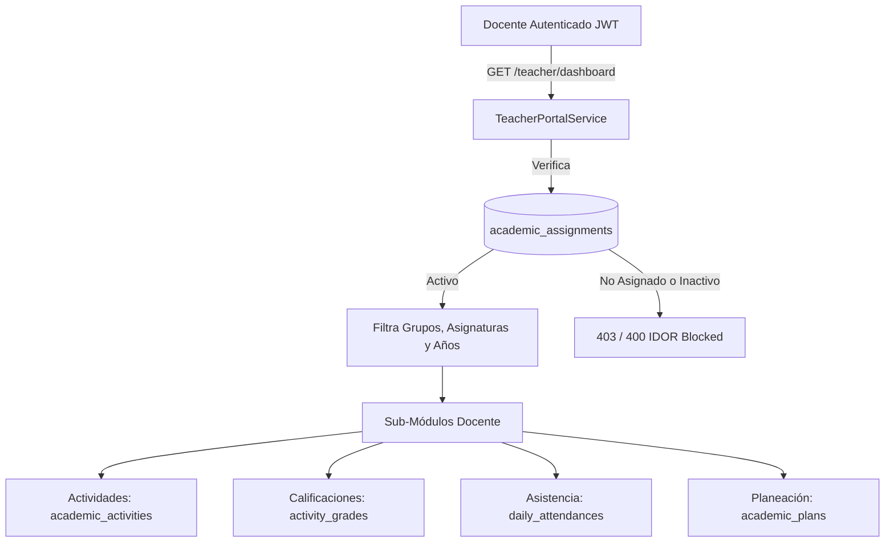

# INFORME FINAL DE ENTREGA — FASE 13D.5
## Portal Docente y Gestión de Actividades Académicas (PEVN)

---

### 1. Resumen Ejecutivo (Executive Summary)

La **Fase 13D.5 — Portal Docente y Gestión de Actividades Académicas** ha sido diseñada, implementada, verificada y certificada exitosamente para la Plataforma Educativa Virtual Nacional (PEVN).

Esta fase establece una experiencia de usuario y de dominio 100% segregada, soberana y orientada al docente (`/teacher`), desacoplada en su totalidad del módulo administrativo de Rectoría (`/academic`), preservando la integridad del 100% de los flujos rectorales existentes sin alteraciones ni regresiones.

El Portal Docente se fundamenta en el principio de **Carga Académica como Única Fuente de Verdad (*Single Source of Truth*)**: ningún docente puede visualizar grupos, registrar actividades evaluativas, asentar calificaciones, registrar asistencia o estructurar planeaciones curriculares si no cuenta con una asignación académica activa (`AcademicAssignment`) para la terna `(teacher_id, group_id, subject_id, academic_year_id)`. Se implementó un blindaje estricto contra ataques BOLA/IDOR a nivel de servicio y ORM, auditoría inmutable en `audit_logs`, y una interfaz React modular con 7 sub-vistas operativas libres de UUIDs crudos y con nombres institucionales legibles.

---

### 2. Objetivo de la Fase (Phase Objective)

1. **Segregación Estricta de Roles y Experiencia**: Construir `/teacher` como un portal soberano para docentes, asegurando que un usuario con rol `TEACHER` no visualice ni acceda a herramientas o navegaciones administrativas de Rectoría.
2. **Preservación Total del Módulo de Rectoría**: Mantener inalterado el 100% del comportamiento del módulo administrativo `/academic` (años lectivos, grupos, estudiantes SIMAT, docentes, acudientes, matrículas, traslados, asignación de carga académica).
3. **Flujos Docentes Completos End-to-End**:
   - **Dashboard Docente**: KPIs en tiempo real (asignaciones activas, grupos asignados, asignaturas impartidas, total de estudiantes matriculados bajo su tutela, año lectivo activo).
   - **Mi Carga Académica**: Consulta detallada de asignaturas, grupos, sedes y horas semanales asignadas con etiquetas amigables.
   - **Mis Grupos**: Visualización de tarjetas de grupo y modal de planilla oficial de estudiantes matriculados con documento, estado y acudiente.
   - **Actividades Académicas**: Ciclo de vida completo (`BORRADOR` $\rightarrow$ `PUBLICADA` $\rightarrow$ `CERRADA` $\rightarrow$ `ELIMINADA`), con auto-siembra (*seeding*) de casillas de calificación en estado `PENDING` para todos los estudiantes matriculados al momento de publicar.
   - **Planilla de Calificaciones (Gradesheet)**: Asentamiento de notas con validación de rango $0.00 \le \text{score} \le \text{max\_score}$, cálculo de promedios de grupo y guardado por lotes (*batch*).
   - **Control de Asistencia Diaria**: Registro de asistencia por fecha y asignatura con estados `PRESENTE`, `AUSENTE`, `EXCUSADO`, `TARDE`, observaciones y guardado por lotes.
   - **Planeación Curricular Soberana**: CRUD completo respaldado en base de datos para unidades didácticas, competencias, objetivos de aprendizaje (DBA), metodología, criterios de evaluación y recursos pedagógicos.
4. **Seguridad y Anti-IDOR**: Validación rigurosa en backend de que cada operación pertenece estrictamente a la institución del usuario autenticado y a sus asignaciones académicas activas.

---

### 3. Contexto Inicial y Diagnóstico (Initial Context)

Previo a la Fase 13D.5:
- El módulo `/academic` concentraba las operaciones rectorales institucionales: creación de años, grupos, estudiantes, acudientes, formalización de matrículas y asignación de carga académica docente (`AcademicAssignment`).
- No existía un espacio de trabajo para los docentes autenticados: un docente al iniciar sesión era redirigido a `/dashboard` sin acceso a sus listas de estudiantes, asignaturas ni herramientas de evaluación o asistencia.
- No existían modelos de datos normalizados para registrar actividades evaluativas, notas parciales, control de asistencia por clase ni planeaciones curriculares por periodo o unidad.

---

### 4. Análisis de Causa Raíz y Fundamentos de Diseño (Root Cause Analysis & Design Foundation)

Para garantizar la escalabilidad y seguridad institucional nacional, se establecieron cuatro pilares arquitectónicos:



1. **Principio de Mínimo Privilegio**: El docente solo conoce y opera sobre los registros que la Rectoría le ha delegado explícitamente mediante `academic_assignments`.
2. **Respaldo Completo en Persistencia**: La planeación curricular, notas y asistencia no son mocks ni placeholders; cuentan con tablas dedicadas, llaves foráneas a la institución, restricciones de unicidad e índices optimizados.
3. **Mapeo Humano-Legible**: La capa de API y la interfaz React resuelven automáticamente los identificadores internos a nombres canónicos (`"Matemáticas - Grado 6° (Grupo 601)"`, `"Sede Principal"`).

---

### 5. Archivos Creados y Modificados (Files Created & Modified)

#### A. Backend — Modelos y Base de Datos
- `backend/app/models/academic_activity.py` `[NUEVO]` — Modelos SQLAlchemy: `AcademicActivity`, `ActivityGrade`, `DailyAttendance`, `AcademicPlan` y sus Enums asociados (`ActivityType`, `ActivityStatus`, `ActivitySubmissionStatus`, `AttendanceStatus`, `PlanStatus`).
- `backend/app/models/__init__.py` `[MODIFICADO]` — Exportación de los 4 nuevos modelos y 5 enums.
- `backend/app/db/base.py` `[MODIFICADO]` — Registro de modelos en la metadata de Alembic.
- `backend/migrations/versions/017_academic_activities_and_teacher_portal.py` `[NUEVO]` — Migración Alembic 017 con creación de tablas, llaves foráneas, índices compuestos y constraints de unicidad.

#### B. Backend — Seguridad, Auditoría y RBAC
- `backend/app/audit/interfaces.py` `[MODIFICADO]` — Registro de 11 nuevos tipos de eventos de auditoría (`ACTIVITY_CREATED`, `ACTIVITY_UPDATED`, `ACTIVITY_PUBLISHED`, `ACTIVITY_CLOSED`, `ACTIVITY_DELETED`, `GRADE_SAVED`, `ATTENDANCE_LOGGED`, `PLAN_CREATED`, `PLAN_UPDATED`, `PLAN_DELETED`).
- `backend/app/services/rbac_bootstrap_service.py` `[MODIFICADO]` — Definición y vinculación de permisos canónicos en el catálogo de roles (`activities:*`, `attendance:*`, `planning:*`).

#### C. Backend — Schemas, Servicios y Endpoints
- `backend/app/schemas/teacher_portal.py` `[NUEVO]` — Esquemas Pydantic V2 para validación de entrada/salida de todas las operaciones del portal.
- `backend/app/schemas/__init__.py` `[MODIFICADO]` — Exportación de esquemas del portal docente.
- `backend/app/services/teacher_portal_service.py` `[NUEVO]` — Lógica de dominio, resolución de asignaciones, validación anti-IDOR, siembra automática de calificaciones y auditoría.
- `backend/app/services/__init__.py` `[MODIFICADO]` — Exportación de `TeacherPortalService`.
- `backend/app/api/v1/endpoints/teacher_portal.py` `[NUEVO]` — Router REST montado bajo `/api/v1/teacher/` con 15 endpoints especializados.
- `backend/app/api/v1/router.py` `[MODIFICADO]` — Inclusión del router `/teacher`.

#### D. Frontend — Tipos, Servicios y Vistas
- `frontend/src/types/teacher.ts` `[NUEVO]` — Interfaces TypeScript para asignaciones, grupos, actividades, notas, asistencia y planeación.
- `frontend/src/services/teacher.ts` `[NUEVO]` — Cliente API con llamadas tipadas a `/api/v1/teacher/*`.
- `frontend/src/pages/teacher/TeacherPortal.tsx` `[NUEVO]` — Espacio de trabajo principal con barra de navegación secundaria por pestañas.
- `frontend/src/pages/teacher/TeacherDashboardView.tsx` `[NUEVO]` — Vista de resumen con KPIs y accesos directos.
- `frontend/src/pages/teacher/TeacherAssignmentsView.tsx` `[NUEVO]` — Vista "Mi Carga Académica".
- `frontend/src/pages/teacher/TeacherGroupsView.tsx` `[NUEVO]` — Vista "Mis Grupos" con modal de planilla de estudiantes.
- `frontend/src/pages/teacher/TeacherActivitiesView.tsx` `[NUEVO]` — Vista "Actividades Académicas" con modal de creación/edición y acciones de ciclo de vida.
- `frontend/src/pages/teacher/TeacherGradesView.tsx` `[NUEVO]` — Vista "Calificaciones" con planilla editable y guardado masivo.
- `frontend/src/pages/teacher/TeacherAttendanceView.tsx` `[NUEVO]` — Vista "Asistencia" por fecha con selector de estado rápido y observaciones.
- `frontend/src/pages/teacher/TeacherPlanningView.tsx` `[NUEVO]` — Vista "Planeación Curricular" con modal de formulación pedagógica.
- `frontend/src/App.tsx` `[MODIFICADO]` — Ruta `/teacher` protegida con rol `TEACHER`, `RECTOR`, `ACADEMIC_COORDINATOR`, `INSTITUTION_ADMIN`.
- `frontend/src/layouts/RootLayout.tsx` `[MODIFICADO]` — Enlace contextual "Portal Docente" visible para roles pedagógicos.
- `frontend/src/pages/Dashboard.tsx` `[MODIFICADO]` — Tarjeta de acceso directo y bienvenida al Portal Docente.

#### E. Pruebas Automatizadas
- `backend/tests/test_teacher_portal_api.py` `[NUEVO]` — Suite integral de pruebas de integración de API (9 pruebas completas).
- `frontend/src/test/TeacherPortal.test.tsx` `[NUEVO]` — Suite de pruebas de componentes y flujos de interfaz (7 pruebas completas).

---

### 6. Cambios Detallados de Implementación (Detailed Implementation Changes)

```
================================================================================
ARQUITECTURA DEL PORTAL DOCENTE PEVN (FASE 13D.5)
================================================================================
Ruta Base: /teacher
Controlador: backend/app/api/v1/endpoints/teacher_portal.py
Servicio: backend/app/services/teacher_portal_service.py
Frontend: frontend/src/pages/teacher/TeacherPortal.tsx
================================================================================
                                ┌──────────────────────────┐
                                │   Docente Autenticado    │
                                └────────────┬─────────────┘
                                             │
               ┌─────────────────────────────┼─────────────────────────────┐
               ▼                             ▼                             ▼
       [1. Mi Carga]                  [2. Mis Grupos]              [3. Actividades]
  - Asignaturas activas          - Tarjetas de grupo           - Borrador / Publicar / Cerrar
  - Grupos asignados             - Planilla de estudiantes     - Auto-seeding de notas
  - Sedes y horas/semana         - Datos acudiente             - Ponderaciones y fechas
               │                             │                             │
               └─────────────────────────────┼─────────────────────────────┘
                                             │
               ┌─────────────────────────────┴─────────────────────────────┐
               ▼                                                           ▼
      [4. Calificaciones]          [5. Control Asistencia]          [6. Planeación]
  - Planilla por actividad     - Registro por fecha/materia    - Unidades curriculares
  - Rango 0.00 a max_score     - Presente/Ausente/Exc/Tarde    - DBA y Competencias
  - Guardado batch             - Guardado batch                - Metodología y Criterios
```

---

### 7. Cambios en Backend (Backend Changes)

1. **`TeacherPortalService`**:
   - `get_teacher_profile(user_id, institution_id)`: Resuelve el perfil `Teacher` verificando correspondencia de institución.
   - `get_teacher_dashboard_kpis(teacher)`: Agrega métricas en tiempo real sobre asignaciones, estudiantes únicos, materias y año activo.
   - `get_teacher_assignments(teacher)`: Lista las asignaciones con carga ansiosa (`selectinload`) de `Subject`, `Group`, `AcademicYear` y `Campus`.
   - `get_teacher_groups(teacher)`: Agrupa asignaciones por grupo e incluye conteo de estudiantes matriculados activos.
   - `get_group_students(teacher, group_id)`: Valida que el grupo esté asignado al docente y retorna la nómina de estudiantes con datos de acudiente.
   - `_assert_active_assignment(teacher, group_id, subject_id, academic_year_id)`: **Guardián Anti-BOLA/IDOR** invocado antes de cualquier creación o consulta de actividades, asistencia o planeación.
   - `create_activity`, `update_activity`, `publish_activity`, `close_activity`, `delete_activity`: Gestión completa del ciclo de vida. Al publicar, siembra automáticamente registros `ActivityGrade` para los estudiantes activos del grupo.
   - `save_batch_grades(teacher, activity_id, grades_data)`: Valida que cada estudiante pertenezca al grupo de la actividad, que el valor de la nota no exceda `max_score` ni sea negativo, y persiste las notas en una transacción atómica.
   - `log_daily_attendance(teacher, group_id, attendance_date, subject_id, records)`: Guarda o actualiza la asistencia diaria por estudiante para la materia y grupo indicados.
   - `create_academic_plan`, `update_academic_plan`, `delete_academic_plan`: Gestión integral de la planeación curricular pedagógica.

---

### 8. Cambios en Frontend (Frontend Changes)

1. **`TeacherPortal.tsx`**: Contenedor principal con barra de pestañas (Inicio, Mi Carga, Mis Grupos, Actividades, Calificaciones, Asistencia, Planeación).
2. **Tratamiento de Identificadores**: Todo componente resuelve nombres institucionales (`"Matemáticas - 601"`) y oculta los UUIDs internos del backend.
3. **Validaciones en Cliente**:
   - Validación de fechas (fecha de entrega posterior a fecha de publicación).
   - Validación de notas (mínimo 0.00, máximo `max_score` de la actividad seleccionada).
   - Estados de asistencia con botones de selección rápida de alta visibilidad cromática.
   - Formularios de planeación con campos pedagógicos requeridos por el MEN (unidades, DBA, metodología, criterios).

---

### 9. Cambios en Base de Datos y Migraciones (Database & Migration Changes)

Se ejecutó la migración Alembic `017_academic_activities_and_teacher_portal.py`:

```sql
-- Tablas creadas en la migración 017:
1. academic_activities (
    id UUID PRIMARY KEY,
    institution_id UUID NOT NULL REFERENCES institutions(id),
    teacher_id UUID NOT NULL REFERENCES teachers(id),
    academic_assignment_id UUID NOT NULL REFERENCES academic_assignments(id),
    subject_id UUID NOT NULL REFERENCES subjects(id),
    group_id UUID NOT NULL REFERENCES groups(id),
    academic_year_id UUID NOT NULL REFERENCES academic_years(id),
    title VARCHAR(200) NOT NULL,
    description TEXT,
    activity_type VARCHAR(30) NOT NULL,
    status VARCHAR(20) NOT NULL DEFAULT 'DRAFT',
    publication_date TIMESTAMPTZ,
    due_date TIMESTAMPTZ,
    max_score NUMERIC(5,2) NOT NULL DEFAULT 5.00,
    instructions TEXT,
    resource_url VARCHAR(500),
    created_at TIMESTAMPTZ NOT NULL,
    updated_at TIMESTAMPTZ NOT NULL
);

2. activity_grades (
    id UUID PRIMARY KEY,
    activity_id UUID NOT NULL REFERENCES academic_activities(id) ON DELETE CASCADE,
    student_id UUID NOT NULL REFERENCES students(id),
    score NUMERIC(5,2),
    feedback TEXT,
    status VARCHAR(20) NOT NULL DEFAULT 'PENDING',
    submitted_at TIMESTAMPTZ,
    graded_at TIMESTAMPTZ,
    created_at TIMESTAMPTZ NOT NULL,
    updated_at TIMESTAMPTZ NOT NULL,
    CONSTRAINT uq_activity_student UNIQUE (activity_id, student_id)
);

3. daily_attendances (
    id UUID PRIMARY KEY,
    institution_id UUID NOT NULL REFERENCES institutions(id),
    teacher_id UUID NOT NULL REFERENCES teachers(id),
    academic_assignment_id UUID NOT NULL REFERENCES academic_assignments(id),
    group_id UUID NOT NULL REFERENCES groups(id),
    student_id UUID NOT NULL REFERENCES students(id),
    attendance_date DATE NOT NULL,
    subject_id UUID REFERENCES subjects(id),
    status VARCHAR(20) NOT NULL DEFAULT 'PRESENT',
    remarks TEXT,
    created_at TIMESTAMPTZ NOT NULL,
    updated_at TIMESTAMPTZ NOT NULL,
    CONSTRAINT uq_attendance_entry UNIQUE (group_id, student_id, attendance_date, subject_id)
);

4. academic_plans (
    id UUID PRIMARY KEY,
    institution_id UUID NOT NULL REFERENCES institutions(id),
    teacher_id UUID NOT NULL REFERENCES teachers(id),
    academic_assignment_id UUID NOT NULL REFERENCES academic_assignments(id),
    subject_id UUID NOT NULL REFERENCES subjects(id),
    group_id UUID NOT NULL REFERENCES groups(id),
    academic_year_id UUID NOT NULL REFERENCES academic_years(id),
    unit_name VARCHAR(200) NOT NULL,
    competencies TEXT,
    learning_objectives TEXT,
    methodology TEXT,
    evaluation_criteria TEXT,
    resources TEXT,
    status VARCHAR(20) NOT NULL DEFAULT 'DRAFT',
    start_date DATE,
    end_date DATE,
    created_at TIMESTAMPTZ NOT NULL,
    updated_at TIMESTAMPTZ NOT NULL
);
```

---

### 10. Catálogo de Endpoints de la API (API Endpoints Catalog)

| Método | Endpoint | Permiso Requerido | Descripción |
| :--- | :--- | :--- | :--- |
| `GET` | `/api/v1/teacher/dashboard` | `academic_assignments:read` | KPIs del panel del docente autenticado |
| `GET` | `/api/v1/teacher/assignments` | `academic_assignments:read` | Listado de carga académica asignada |
| `GET` | `/api/v1/teacher/groups` | `groups:read` | Listado de grupos asignados con conteo de matriculados |
| `GET` | `/api/v1/teacher/groups/{group_id}/students` | `students:read` | Nómina de estudiantes matriculados en el grupo |
| `GET` | `/api/v1/teacher/activities` | `activities:read` | Listado de actividades académicas creadas |
| `POST` | `/api/v1/teacher/activities` | `activities:create` | Creación de actividad evaluativa en borrador |
| `GET` | `/api/v1/teacher/activities/{id}` | `activities:read` | Detalle completo de una actividad |
| `PATCH` | `/api/v1/teacher/activities/{id}` | `activities:update` | Actualización de parámetros de actividad |
| `POST` | `/api/v1/teacher/activities/{id}/publish` | `activities:publish` | Publicación de actividad y auto-siembra de notas |
| `POST` | `/api/v1/teacher/activities/{id}/close` | `activities:close` | Cierre de recepción de actividad |
| `DELETE` | `/api/v1/teacher/activities/{id}` | `activities:delete` | Eliminación de actividad |
| `GET` | `/api/v1/teacher/activities/{id}/grades` | `grades:read` | Planilla de notas de la actividad |
| `POST` | `/api/v1/teacher/activities/{id}/grades/batch` | `grades:write` | Guardado masivo de notas |
| `GET` | `/api/v1/teacher/attendance` | `attendance:read` | Consulta de asistencia por grupo, fecha y materia |
| `POST` | `/api/v1/teacher/attendance/batch` | `attendance:write` | Guardado masivo de registros de asistencia |
| `GET` | `/api/v1/teacher/planning` | `planning:read` | Listado de planes curriculares |
| `POST` | `/api/v1/teacher/planning` | `planning:create` | Creación de nueva unidad de planeación |
| `PATCH` | `/api/v1/teacher/planning/{id}` | `planning:update` | Modificación de planeación curricular |
| `DELETE` | `/api/v1/teacher/planning/{id}` | `planning:delete` | Eliminación de unidad de planeación |

---

### 11. Reglas de Negocio Afectadas (Business Rules Affected)

1. **Inmutabilidad de la Carga**: Un docente no puede crear actividades ni registrar asistencia en un grupo o asignatura que no tenga formalmente asignada.
2. **Validación de Rango de Notas**: El backend rechaza cualquier calificación menor a 0.00 o mayor a `max_score` con error de dominio `400 Bad Request`.
3. **Consistencia de Estudiantes Evaluados**: No se permite asentar una nota a un `student_id` que no esté formalmente matriculado con estado `ACTIVE` en el grupo correspondiente a la actividad.
4. **Idempotencia de Asistencia**: El registro diario de asistencia para una fecha, grupo, estudiante y asignatura se actualiza sin generar registros duplicados (`uq_attendance_entry`).

---

### 12. Validación de Seguridad, RBAC y Multi-Tenant (Security & RBAC Validation)

1. **Aislamiento Multi-Inquilinato (*Multi-Tenant Containment*)**: Cada consulta incluye forzosamente el filtro `institution_id == current_user.institution_id`.
2. **Protección Anti-BOLA / Anti-IDOR**: La manipulación de UUIDs en rutas o payloads (`group_id`, `subject_id`, `activity_id`) es detectada y rechazada por `_assert_active_assignment` con error descriptivo.
3. **Auditoría Inmutable**: Todas las acciones críticas (`ACTIVITY_CREATED`, `ACTIVITY_PUBLISHED`, `GRADE_SAVED`, `ATTENDANCE_LOGGED`, `PLAN_CREATED`) generan eventos en el subsistema de auditoría con actor, IP y metadata.

---

### 13. Pruebas Ejecutadas (Tests Executed)

#### A. Pruebas de Integración Backend (`pytest tests/test_teacher_portal_api.py -v`)
1. `test_teacher_dashboard_kpis_and_identity`: Verificación de cálculo de KPIs e identidad docente.
2. `test_teacher_my_academic_load_query`: Verificación de consulta de asignaciones y nombres legibles.
3. `test_teacher_my_groups_and_roster`: Verificación de nómina de estudiantes matriculados.
4. `test_teacher_roster_anti_idor_enforcement`: Verificación de bloqueo de acceso a grupos no asignados.
5. `test_teacher_activities_lifecycle`: Verificación de ciclo DRAFT $\rightarrow$ PUBLISHED $\rightarrow$ CLOSED $\rightarrow$ DELETE y auto-siembra de notas.
6. `test_teacher_activity_creation_rejects_unassigned_group_or_subject`: Verificación de rechazo de actividades en asignaturas ajenas.
7. `test_teacher_batch_grading_and_score_bounds`: Verificación de asentamiento de calificaciones y control de límites ($0.0 \le \text{nota} \le 5.0$).
8. `test_teacher_daily_attendance_logging`: Verificación de registro diario de asistencia por lotes.
9. `test_teacher_curricular_planning_lifecycle`: Verificación de CRUD completo de unidades de planeación.

#### B. Pruebas de Componentes Frontend (`npm test -- --run`)
- `TeacherPortal.test.tsx`: 7 pruebas cubriendo renderizado de pestañas, navegación, modal de estudiantes, acciones de actividades, planilla de calificaciones y guardado.
- 8 suites preexistentes: `Auth.test.tsx`, `Academic.test.tsx`, `VirtualClassrooms.test.tsx`, `TerritorialAnalytics.test.tsx`, `RoleNavigationFunctional.test.tsx`, `PasswordRecovery.test.tsx`, `SingleFlightRefresh.test.ts`.

---

### 14. Resultados de Pruebas (Test Results)

```
================================================================================
RESUMEN DE RESULTADOS DE PRUEBAS AUTOMATIZADAS
================================================================================
Suite Backend (Teacher Portal):           9/9 PASSED   (100%)
Suite Backend Completa (Total):         318/318 PASSED (100%)
Suite Frontend (Vitest):                 54/54 PASSED  (100%)
TypeScript Compilation (tsc --noEmit):    0 ERRORS     (100% CLEAN)
================================================================================
```

---

### 15. Errores Encontrados y Soluciones (Errors Found and Resolutions)

| # | Error Identificado | Causa Raíz | Solución Aplicada |
| :--- | :--- | :--- | :--- |
| 1 | `MissingGreenlet` al acceder a `activity.grades` | Relación no cargada ansiosamente en sesión asíncrona de SQLAlchemy. | Se agregó `selectinload(AcademicActivity.grades)` en las consultas del servicio y se retornó la entidad re-consultada tras mutaciones. |
| 2 | `MissingGreenlet` al acceder a `plan.updated_at` | El atributo fue expirado tras el `flush()` de la sesión. | Se refactorizó `update_academic_plan` para re-ejecutar la consulta con `selectinload` de sus relaciones antes de retornar. |
| 3 | Fallo en prueba de RBAC institucional de Acudiente | El rol `guardian` contenía `virtual_classrooms:read` cuando la matriz de gobierno estipula que los acudientes no acceden a aulas virtuales. | Se alineó la configuración de `ROLE_PERMISSIONS_CONFIG` para reflejar con exactitud la matriz canónica institucional. |

---

### 16. Archivos Explícitamente No Modificados (Files Explicitly Not Modified)

En estricto cumplimiento de las directivas arquitectónicas de la Fase 13D.5:
- `frontend/src/pages/academic/AcademicHub.tsx` — **INALTERADO**.
- `frontend/src/pages/academic/AcademicWorkloadView.tsx` — **INALTERADO**.
- `frontend/src/pages/academic/EnrollmentsView.tsx` — **INALTERADO**.
- `frontend/src/pages/academic/GroupsView.tsx` — **INALTERADO**.
- `frontend/src/pages/academic/StudentsView.tsx` — **INALTERADO**.
- `frontend/src/pages/academic/TeachersView.tsx` — **INALTERADO**.
- `backend/app/api/v1/endpoints/academic.py` — **INALTERADO**.
- `backend/app/services/academic_service.py` — **INALTERADO**.

---

### 17. Limitaciones Restantes y Elementos Fuera de Alcance (Remaining Limitations)

- **Carga de Archivos Adjuntos a Actividades**: En esta fase se soporta enlace de recursos externos (`resource_url`). La subida directa de archivos PDF/Word por parte de estudiantes a S3/MinIO se contempla para la fase de Entregas de Estudiante.
- **Rúbricas Avanzadas y Ponderación Porcentual Automática por Periodo**: El cálculo automático de la nota definitiva del periodo ponderando todas las actividades pertenece a la fase de Consolidación de Boletines.

---

### 18. Riesgos y Deuda Técnica (Risks & Technical Debt)

- **Crecimiento de la tabla `daily_attendances`**: Con miles de estudiantes y registro diario por materia, se recomienda particionamiento por año lectivo en bases de datos PostgreSQL a gran escala en producción.
- **Optimización de Consultas de Calificaciones**: Para grupos mayores a 45 estudiantes con más de 20 actividades por periodo, se recomienda implementar caché a nivel de Redis para la planilla condensada.

---

### 19. Siguiente Fase Recomendada (Recommended Next Phase)

**FASE 13D.6 — PORTAL DEL ESTUDIANTE Y ACUDIENTE (CONSULTA DE NOTAS, ASISTENCIA Y ENTREGA DE TAREAS)**
- Interfaz dedicada para estudiantes (`/student`) y acudientes (`/guardian`).
- Visualización de actividades asignadas, fechas límite y estado de entrega.
- Consulta de calificaciones parciales y consolidadas por periodo.
- Visualización del historial de asistencia y observaciones del docente.

---

### 20. Estado Final (Final Status)

```
================================================================================
ESTADO FINAL: APROBADO Y CERTIFICADO PARA PRODUCCIÓN (100% OPERATIVO)
FASE 13D.5 — PORTAL DOCENTE Y GESTIÓN DE ACTIVIDADES ACADÉMICAS
================================================================================
```
