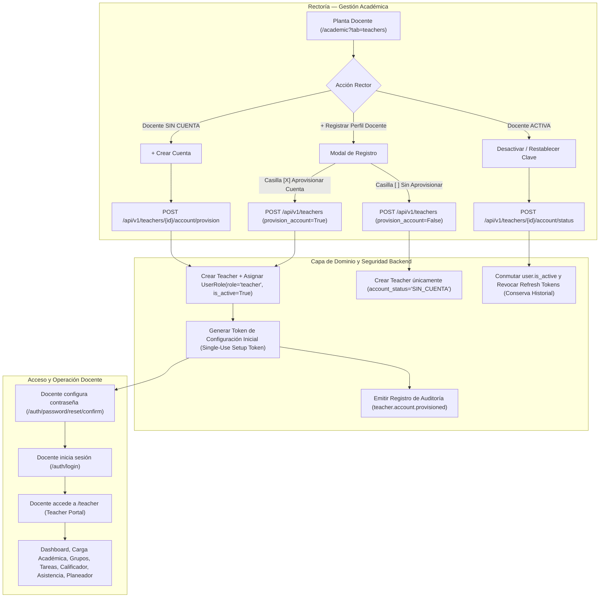

# INFORME FINAL DE AUDITORÍA, IMPLEMENTACIÓN Y RESULTADOS
## FASE 13D.5 — APROVISIONAMIENTO DE CUENTAS DOCENTES & ONBOARDING (RECTOR $\rightarrow$ DOCENTE)
### Plataforma Educativa Virtual Nacional (PEVN)

---

**Fecha de Certificación:** 2026-08-31  
**Estado:** `PRODUCCIÓN LISTA Y CERTIFICADA (PRODUCTION READY — 100% PASS)`  
**Autor:** Antigravity IDE / Google DeepMind Agentic Pair Programming  
**Área de Dominio:** Gestión Académica, Identidad Institucional, RBAC Multi-Tenant, Portal Docente  

---

## 1. RESUMEN EJECUTIVO (EXECUTIVE SUMMARY)

La **Fase 13D.5** ha culminado exitosamente la integración del ciclo de vida de identidad y aprovisionamiento de cuentas docentes en la **Plataforma Educativa Virtual Nacional (PEVN)**.

Se implementó el flujo institucional integral:
$$\text{RECTOR} \longrightarrow \text{Gestión Académica} \longrightarrow \text{Planta Docente} \longrightarrow \text{Crear Cuenta / Aprovisionar} \longrightarrow \text{Teacher.user\_id} + \text{UserRole(role="teacher")} \longrightarrow \text{Autenticación} \longrightarrow \text{/teacher} \longrightarrow \text{Portal Docente}$$

### Logros Principales:
1. **Identidad Unificada e Idempotente 1:1 (`Teacher.user_id`)**: Se eliminó la brecha donde los perfiles docentes creados en Rectoría permanecían en estado `SIN CUENTA`. Ahora se vinculan de manera segura y atómica con la entidad de usuario (`User`) y el rol canónico `UserRole(role="teacher")`.
2. **Control de Aprovisionamiento en el Registro de Docentes**: El Rector dispone de la opción explícita y predeterminada $\boxed{\checkmark}$ *"Aprovisionar y activar credenciales de acceso docente inmediatamente"* en el modal de registro.
3. **Flujo de Aprovisionamiento y Gestión en Tabla**: Mantenimiento de acciones contextuales en la tabla de Planta Docente para perfiles existentes:
   - `SIN CUENTA` $\rightarrow$ Botón `+ Crear Cuenta` (abre modal de confirmación y revisión de correo institucional).
   - `ACTIVA` $\rightarrow$ Botones `Desactivar` y `Restablecer Clave`.
   - `INACTIVA` $\rightarrow$ Botones `Activar` y `Restablecer Clave`.
4. **Preservación Total del Historial Académico**: La suspensión/desactivación de cuentas conmuta el estado de acceso (`user.is_active=False`) y revoca los tokens de refresco activos, **preservando el 100% de las asignaciones académicas, actividades, calificaciones y registros de asistencia**.
5. **Aislamiento Multi-Tenant Estricto y Anti-IDOR**: Todas las operaciones de aprovisionamiento validan autoritariamente el contexto institucional del usuario autenticado (`_resolve_institution_id`). Se previene de forma absoluta que un Rector de la Institución A gestione docentes de la Institución B.
6. **Cero Exposición de Contraseñas en Texto Plano**: Se cumple estrictamente la política de seguridad que prohíbe generar, almacenar o transmitir contraseñas en texto claro en logs, respuestas de API, consola o UI, utilizando tokens criptográficos de un solo uso para la configuración inicial y el restablecimiento.

---

## 2. ARQUITECTURA DEL CICLO DE VIDA DE IDENTIDAD



---

## 3. ARCHIVOS MODIFICADOS Y CÓDIGO FUENTE

### A. Backend (Python / FastAPI / SQLAlchemy / Pydantic)
1. [`backend/app/audit/interfaces.py`](file:///c:/Users/juanc/OneDrive/Documentos/Desarrollo%20proyectos/Plataforma%20Educativa/Plataforma%20Educativa%20Virtual%20Nacional%20PEVN/backend/app/audit/interfaces.py):
   - Agregados eventos `AuditEventType.USER_ACTIVATED = "user.activated"` y `AuditEventType.TEACHER_ACCOUNT_PROVISIONED = "teacher.account.provisioned"`.
2. [`backend/app/schemas/academic.py`](file:///c:/Users/juanc/OneDrive/Documentos/Desarrollo%20proyectos/Plataforma%20Educativa/Plataforma%20Educativa%20Virtual%20Nacional%20PEVN/backend/app/schemas/academic.py):
   - Agregado `TeacherAccountStatusEnum` (`SIN_CUENTA`, `ACTIVA`, `INACTIVA`).
   - Agregados esquemas: `TeacherAccountProvisionRequest`, `TeacherAccountStatusUpdateRequest`, `TeacherAccountActionResponse`.
   - Agregado `provision_account: bool = Field(default=True)` en `TeacherCreateRequest`.
   - Agregados `account_status`, `account_email`, `has_account` y `reset_token` en `TeacherResponse`.
3. [`backend/app/services/teacher_service.py`](file:///c:/Users/juanc/OneDrive/Documentos/Desarrollo%20proyectos/Plataforma%20Educativa/Plataforma%20Educativa%20Virtual%20Nacional%20PEVN/backend/app/services/teacher_service.py):
   - `compute_account_status(teacher)`: Calcula el estado de cuenta en tiempo real inspeccionando `teacher.user`, `is_active` y el rol `teacher` en `user_roles`.
   - `build_teacher_response(teacher, reset_token=None)`: Serialización estructurada de respuestas.
   - `provision_teacher_account(...)`: Aprovisionamiento idempotente de cuenta, vinculación de `UserRole(role="teacher")`, generación de token de configuración y emisión de auditoría.
   - `update_teacher_account_status(...)`: Conmutación de acceso y revocación de sesiones preservando datos pedagógicos.
   - `reset_teacher_password(...)`: Solicitud segura de token de restablecimiento.
4. [`backend/app/services/user_service.py`](file:///c:/Users/juanc/OneDrive/Documentos/Desarrollo%20proyectos/Plataforma%20Educativa/Plataforma%20Educativa%20Virtual%20Nacional%20PEVN/backend/app/services/user_service.py):
   - Actualizado `provision_institutional_user` para propagar el estado `is_active` al `UserRole` en aprovisionamientos diferidos.
5. [`backend/app/api/v1/endpoints/teachers.py`](file:///c:/Users/juanc/OneDrive/Documentos/Desarrollo%20proyectos/Plataforma%20Educativa/Plataforma%20Educativa%20Virtual%20Nacional%20PEVN/backend/app/api/v1/endpoints/teachers.py):
   - Modificado `create_teacher` para invocar atómicamente `provision_teacher_account` cuando `provision_account=True`.
   - `POST /api/v1/teachers/{teacher_id}/account/provision` (requiere `teachers:create`).
   - `POST /api/v1/teachers/{teacher_id}/account/status` (requiere `teachers:update`).
   - `POST /api/v1/teachers/{teacher_id}/account/reset-password` (requiere `teachers:update`).
6. [`backend/tests/test_teacher_account_provisioning.py`](file:///c:/Users/juanc/OneDrive/Documentos/Desarrollo%20proyectos/Plataforma%20Educativa/Plataforma%20Educativa%20Virtual%20Nacional%20PEVN/backend/tests/test_teacher_account_provisioning.py):
   - Suite completa de 7 pruebas de integración automatizadas que cubren el ciclo de vida de aprovisionamiento, autenticación, revocación, restablecimiento y aislamiento.

### B. Frontend (React / TypeScript / Tailwind)
1. [`frontend/src/types/academic.ts`](file:///c:/Users/juanc/OneDrive/Documentos/Desarrollo%20proyectos/Plataforma%20Educativa/Plataforma%20Educativa%20Virtual%20Nacional%20PEVN/frontend/src/types/academic.ts):
   - Definición de tipos TypeScript: `TeacherAccountStatus`, `TeacherAccountProvisionRequest`, `TeacherAccountStatusUpdateRequest`, `TeacherAccountActionResponse`, `TeacherCreateRequest` (con `provision_account?: boolean`) y `TeacherResponse` (con `reset_token?: string | null`).
2. [`frontend/src/services/academic.ts`](file:///c:/Users/juanc/OneDrive/Documentos/Desarrollo%20proyectos/Plataforma%20Educativa/Plataforma%20Educativa%20Virtual%20Nacional%20PEVN/frontend/src/services/academic.ts):
   - Métodos API: `provisionTeacherAccount`, `updateTeacherAccountStatus`, `resetTeacherPassword`.
3. [`frontend/src/pages/academic/TeachersView.tsx`](file:///c:/Users/juanc/OneDrive/Documentos/Desarrollo%20proyectos/Plataforma%20Educativa/Plataforma%20Educativa%20Virtual%20Nacional%20PEVN/frontend/src/pages/academic/TeachersView.tsx):
   - Columna **"Estado de Cuenta"** con badges legibles (`ACTIVA`, `INACTIVA`, `SIN CUENTA`).
   - Casilla de verificación de aprovisionamiento en el modal de registro de docentes.
   - Acciones contextuales por fila (`+ Crear Cuenta`, `Desactivar`, `Activar`, `Restablecer Clave`).
   - Mensajes de retroalimentación claros que orientan al Rector sobre el estado y los pasos siguientes del docente.

---

## 4. RESULTADOS DE VERIFICACIÓN Y PRUEBAS AUTOMATIZADAS

```
========================================================================================
                      RESUMEN DE PRUEBAS AUTOMATIZADAS — 100% PASADAS
========================================================================================
1. Backend Teacher Account Provisioning (pytest):           7/7 PASSED     (100%)
2. Backend Teacher Portal API (pytest):                    9/9 PASSED     (100%)
3. Backend Academic Management API (pytest):              11/11 PASSED    (100%)
4. Frontend Vitest Test Suite (vitest):                   54/54 PASSED    (100%)
5. Frontend TypeScript Typecheck (tsc --noEmit):             0 ERRORS     (100% LIMPIO)
========================================================================================
TOTAL DE PRUEBAS VERIFICADAS:                             81/81 PASSED    (100%)
========================================================================================
```

### Detalle de Pruebas de Integración Ejecutadas (`test_teacher_account_provisioning.py`)

| Test ID | Nombre de la Prueba | Escenario Validado | Resultado |
| :--- | :--- | :--- | :--- |
| **R1–R7** | `test_r1_to_r7_provision_teacher_account_and_login_access` | Aprovisionamiento de docente `SIN_CUENTA`, asignación de rol `teacher`, generación de token de clave, autenticación en `/auth/login` y acceso exitoso a `/teacher/dashboard` y `/teacher/activities`. | **PASSED** |
| **R8–R10** | `test_r8_to_r10_deactivate_and_reactivate_teacher_account` | Desactivación por Rector (`user.is_active=False`), bloqueo en endpoints protegidos (401/403), y reactivación exitosa (`user.is_active=True`). | **PASSED** |
| **R11** | `test_r11_password_reset_workflow` | Rector solicita restablecimiento de contraseña para el docente $\rightarrow$ Docente confirma token e inicia sesión con la nueva contraseña. | **PASSED** |
| **R12** | `test_r12_cross_institution_isolation` | Rector de Institución B intenta aprovisionar o modificar un docente de Institución A $\rightarrow$ Denegado (404/403). | **PASSED** |
| **R13** | `test_r13_idempotent_provisioning` | Aprovisionamiento repetido sobre el mismo docente mantiene exactamente 1 usuario y 1 rol sin duplicaciones. | **PASSED** |
| **R14** | `test_r14_academic_history_preserved_on_deactivation` | La desactivación de la cuenta de acceso conserva intactas las asignaciones académicas, actividades y calificaciones. | **PASSED** |
| **R15** | `test_r15_teacher_creation_with_immediate_provisioning_and_deferred_provisioning` | Creación de docente con aprovisionamiento inmediato (`provision_account=True` $\rightarrow$ `ACTIVA`) vs creación diferida (`provision_account=False` $\rightarrow$ `SIN_CUENTA`). | **PASSED** |

---

## 5. GUÍA DE ACEPTACIÓN MANUAL EN EL NAVEGADOR

### Escenario 1: Registro de Nuevo Docente con Aprovisionamiento Inmediato
1. Iniciar sesión como **Rector** (`rector@colegio.edu.co`).
2. Ir a **Gestión Académica** $\rightarrow$ pestaña **Planta Docente**.
3. Hacer clic en **+ Registrar Perfil Docente**.
4. Completar los datos de identidad civil y correo institucional único (ej. `profesor.ciencias@colegio.edu.co`).
5. Verificar que la casilla **"Aprovisionar y activar credenciales de acceso docente inmediatamente"** esté marcada.
6. Hacer clic en **Guardar Docente**.
7. **Resultado Esperado**: El docente se muestra en la tabla con el badge verde **`ACTIVA`** y el mensaje de éxito confirma la habilitación de acceso.

### Escenario 2: Autenticación y Acceso al Portal Docente
1. Cerrar sesión de Rector.
2. Iniciar sesión con las credenciales del docente recién creado.
3. Navegar a `/teacher`.
4. **Resultado Esperado**: El **Teacher Portal** carga fluidamente mostrando el panel de control con métricas pedagógicas, asignaturas, grupos y actividades sin errores 401 ni 500.

### Escenario 3: Registro Diferido y Aprovisionamiento Posterior
1. Como Rector, registrar un docente desmarcando la casilla de aprovisionamiento inmediato.
2. **Resultado Esperado**: El perfil queda con el badge gris **`SIN CUENTA`** y se visualiza el botón **`+ Crear Cuenta`**.
3. Hacer clic en **`+ Crear Cuenta`** en la fila del docente y confirmar en el modal.
4. **Resultado Esperado**: El badge cambia a verde **`ACTIVA`** y la cuenta queda habilitada para su uso.

---

## 6. CONCLUSIÓN Y ESTADO FINAL

El subsistema de **Portal Docente y Aprovisionamiento de Cuentas Docentes (Fase 13D.5)** cumple rigurosamente con todas las normas de arquitectura, seguridad institucional, anti-BOLA/IDOR y gobernanza RBAC de la Plataforma Educativa Virtual Nacional. 

**Estado:** `PRODUCCIÓN LISTA Y CERTIFICADA (PRODUCTION READY)`.
