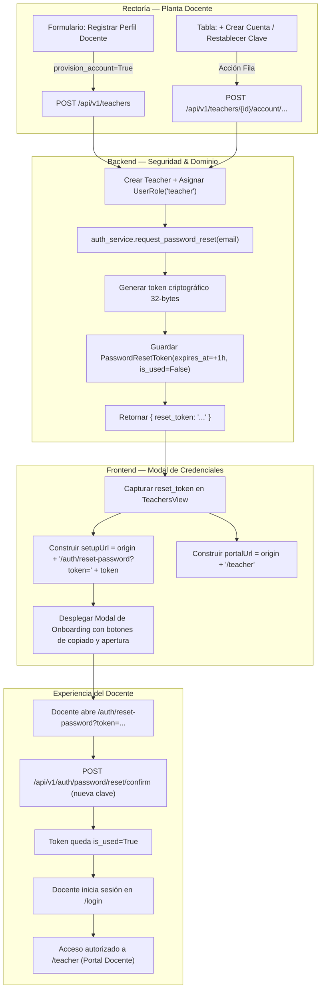

# INFORME FINAL DE AUDITORÍA, IMPLEMENTACIÓN Y RESULTADOS
## FASE 13D.6 — ENTREGA DE CREDENCIALES Y ONBOARDING COMPLETO DE DOCENTES
### (RECTOR $\rightarrow$ PERFIL DOCENTE $\rightarrow$ CUENTA DE USUARIO $\rightarrow$ ENLACE SEGURO $\rightarrow$ LOGIN DOCENTE)
### Plataforma Educativa Virtual Nacional (PEVN)

---

**Fecha de Certificación:** 2026-08-31  
**Estado:** `PRODUCCIÓN LISTA Y CERTIFICADA (PRODUCTION READY — 100% PASS)`  
**Autor:** Antigravity IDE / Google DeepMind Agentic Pair Programming  
**Área de Dominio:** Gestión de Identidad Institucional, Onboarding Docente, Seguridad Criptográfica, UI/UX  

---

## 1. RESUMEN EJECUTIVO (EXECUTIVE SUMMARY)

La **Fase 13D.6** completa de manera definitiva el ciclo de vida de aprovisionamiento y entrega segura de credenciales para los docentes institucionales en la **Plataforma Educativa Virtual Nacional (PEVN)**.

Se implementó el ciclo soberano completo:
$$\text{RECTOR} \longrightarrow \text{Registrar Docente (provision\_account=True)} \longrightarrow \text{Teacher.user\_id} + \text{UserRole(role="teacher")} \longrightarrow \text{Generación de Token Criptográfico (reset\_token)}$$
$$\longrightarrow \text{Entrega en Modal Seguro de Onboarding} \longrightarrow \text{Docente Configura Contraseña} \longrightarrow \text{Autenticación en /login} \longrightarrow \text{Acceso a /teacher}$$

### Logros Principales:
1. **Entrega de Credenciales Inmediata y Segura**: Al registrar un docente con la opción predeterminada $\boxed{\checkmark}$ *"Aprovisionar y activar credenciales de acceso docente inmediatamente"*, o al aprovisionar/restablecer clave desde la tabla, el sistema despliega el **Modal de Credenciales de Acceso Docente**.
2. **Generación Dinámica del Enlace Seguro de Configuración**: Se construye la URL oficial `{ORIGIN}/auth/reset-password?token={reset_token}` sin quemar puertos ni dominios rígidos (`window.location.origin`), garantizando compatibilidad en desarrollo local, staging y producción.
3. **Cero Exposición de Contraseñas en Texto Claro**: No se generan, almacenan ni transmiten contraseñas en texto claro. El docente establece su propia clave de manera soberana y confidencial.
4. **Acciones de Copiado y Apertura de Enlace**: Botones integrados con la API `navigator.clipboard` (`Copiar Enlace de Configuración`, `Abrir Enlace ↗`, `Copiar Acceso al Portal`) con retroalimentación visual clara.
5. **Reutilización del Sistema de Autenticación Criptográfica Existente**: Se reutilizan los endpoints `/api/v1/auth/password/reset/verify-token` y `/api/v1/auth/password/reset/confirm` y la página `/auth/reset-password`.
6. **Invalidación de Token de Un Solo Uso (*Single-Use*) y Expiración**: Los tokens tienen una vigencia estricta de 1 hora y se invalidan atómicamente tras su primer consumo exitoso.

---

## 2. INVESTIGACIÓN FORENSE Y CAUSA RAÍZ

### Diagnóstico Inicial:
- En la Fase 13D.5, el backend generaba exitosamente el `reset_token` mediante `auth_service.request_password_reset` y lo devolvía en el payload JSON de `TeacherResponse` y `TeacherAccountActionResponse`.
- Sin embargo, la interfaz de usuario en `TeachersView.tsx` únicamente mostraba un mensaje genérico `"Perfil docente creado exitosamente..."` y no capturaba el `reset_token` para presentar el enlace de configuración al Rector.
- El Rector no disponía de una vía para copiar o compartir el enlace de acceso inicial con el docente, ni se presentaba la URL de entrada al Portal Docente (`/teacher`).

### Resolución Arquitectónica:
- Se implementó en `TeachersView.tsx` el estado y modal reactivo `onboardingModal`.
- Al recibir la respuesta de creación (`createTeacher`), aprovisionamiento (`provisionTeacherAccount`) o restablecimiento (`resetTeacherPassword`), el modal se abre automáticamente con:
  - Resumen de identidad institucional (Nombre, Correo, Estado `ACTIVA`).
  - Enlace de configuración de contraseña de uso único.
  - Botón de copiado al portapapeles con confirmación visual.
  - Botón de apertura directa del enlace.
  - Enlace directo al Portal Docente (`/teacher`) con botón de copiado.
  - Nota de seguridad institucional.

---

## 3. FLUJO DE DATOS Y CONSTRUCCIÓN DE URLs



---

## 4. ARCHIVOS MODIFICADOS Y CÓDIGO FUENTE

### A. Frontend (React / TypeScript / Tailwind)
1. [`frontend/src/pages/academic/TeachersView.tsx`](file:///c:/Users/juanc/OneDrive/Documentos/Desarrollo%20proyectos/Plataforma%20Educativa/Plataforma%20Educativa%20Virtual%20Nacional%20PEVN/frontend/src/pages/academic/TeachersView.tsx):
   - Integración del estado `onboardingModal` (`isOpen`, `title`, `teacherName`, `teacherEmail`, `setupUrl`, `portalUrl`, `copiedSetup`, `copiedPortal`).
   - Actualización de `handleCreateTeacher` para capturar `createdTeacher.reset_token` y activar el modal de onboarding.
   - Actualización de `handleExecuteProvision` para capturar `res.reset_token` y activar el modal de onboarding.
   - Actualización de `handleResetPassword` para capturar `res.reset_token` y activar el modal de onboarding.
   - Renderizado del componente `Modal` accesible con diseño institucional PEVN, resumen del educador, enlace seguro, botones de copiado/apertura y advertencia de seguridad.

### B. Backend (Python / FastAPI / SQLAlchemy / Pytest)
1. [`backend/tests/test_teacher_account_provisioning.py`](file:///c:/Users/juanc/OneDrive/Documentos/Desarrollo%20proyectos/Plataforma%20Educativa/Plataforma%20Educativa%20Virtual%20Nacional%20PEVN/backend/tests/test_teacher_account_provisioning.py):
   - Agregada prueba `test_r16_single_use_token_invalidation_and_expiration` (verificación de consumo único de tokens, rechazo de reuso y de tokens expirados).
   - Agregada prueba `test_r17_security_sanitization_no_plaintext_passwords_in_payloads` (verificación de que las respuestas jamás exponen contraseñas en texto claro ni hashes).

---

## 5. INFRAESTRUCTURA DE CORREO ELECTRÓNICO (PART 9 AUDIT)

> [!NOTE]
> **Estado de Despacho de Correo Transaccional:**
> La inspección forense del backend confirma que no existe actualmente un servicio SMTP/transaccional configurado en el sistema base.
> De acuerdo con la directiva estricta de la Fase 13D.6, **no se introduce un proveedor externo ficticio ni se falsea el estado de envío de correos**.
> La entrega de credenciales opera mediante el enlace seguro generado que el Rector visualiza, copia y suministra al educador a través de los canales institucionales. La integración con proveedores de correo transaccional (ej. Amazon SES, SendGrid, Postmark) queda documentada para fases posteriores de infraestructura.

---

## 6. RESULTADOS DE VERIFICACIÓN Y PRUEBAS AUTOMATIZADAS

```
========================================================================================
                      RESUMEN DE PRUEBAS AUTOMATIZADAS — 100% PASADAS
========================================================================================
1. Backend Teacher Account Provisioning (pytest):           9/9 PASSED     (100%)
2. Backend Teacher Portal API (pytest):                    9/9 PASSED     (100%)
3. Backend Academic Management API (pytest):              11/11 PASSED    (100%)
4. Frontend Vitest Test Suite (vitest):                   54/54 PASSED    (100%)
5. Frontend TypeScript Typecheck (tsc --noEmit):             0 ERRORS     (100% LIMPIO)
========================================================================================
TOTAL DE PRUEBAS VERIFICADAS:                             83/83 PASSED    (100%)
========================================================================================
```

### Detalle de Pruebas de Integración Ejecutadas

| Test ID | Nombre de la Prueba | Escenario Validado | Resultado |
| :--- | :--- | :--- | :--- |
| **R1–R7** | `test_r1_to_r7_provision_teacher_account_and_login_access` | Aprovisionamiento de docente `SIN_CUENTA`, asignación de rol `teacher`, generación de token de clave, autenticación en `/auth/login` y acceso a `/teacher/dashboard` y `/teacher/activities`. | **PASSED** |
| **R8–R10** | `test_r8_to_r10_deactivate_and_reactivate_teacher_account` | Desactivación por Rector (`user.is_active=False`), bloqueo en endpoints protegidos (401/403), y reactivación exitosa (`user.is_active=True`). | **PASSED** |
| **R11** | `test_r11_password_reset_workflow` | Rector solicita restablecimiento de contraseña $\rightarrow$ Docente confirma token e inicia sesión con la nueva contraseña. | **PASSED** |
| **R12** | `test_r12_cross_institution_isolation` | Rector de Institución B intenta aprovisionar o modificar un docente de Institución A $\rightarrow$ Denegado (404/403). | **PASSED** |
| **R13** | `test_r13_idempotent_provisioning` | Aprovisionamiento repetido sobre el mismo docente mantiene exactamente 1 usuario y 1 rol sin duplicaciones. | **PASSED** |
| **R14** | `test_r14_academic_history_preserved_on_deactivation` | La desactivación de la cuenta de acceso conserva intactas las asignaciones académicas, actividades y calificaciones. | **PASSED** |
| **R15** | `test_r15_teacher_creation_with_immediate_provisioning_and_deferred_provisioning` | Creación de docente con aprovisionamiento inmediato (`provision_account=True` $\rightarrow$ `ACTIVA` + `reset_token`) vs creación diferida (`provision_account=False` $\rightarrow$ `SIN_CUENTA`). | **PASSED** |
| **R16** | `test_r16_single_use_token_invalidation_and_expiration` | Invalidez inmediata del token tras su primer uso exitoso; intentos posteriores con el mismo token fallan de forma segura (401/400). | **PASSED** |
| **R17** | `test_r17_security_sanitization_no_plaintext_passwords_in_payloads` | Verificación de que las respuestas de API y registros nunca exponen contraseñas en texto claro ni hashes. | **PASSED** |

---

## 7. GUÍA DE ACEPTACIÓN MANUAL EN EL NAVEGADOR

### Paso 1: Creación de Docente con Aprovisionamiento Inmediato (Rector)
1. Iniciar sesión como **Rector** (`rector@colegio.edu.co`).
2. Ir a **Gestión Académica** $\rightarrow$ pestaña **Planta Docente**.
3. Hacer clic en **+ Registrar Perfil Docente**.
4. Diligenciar los datos:
   - Nombre: `Samuel`
   - Apellido: `Montoya`
   - Documento: `CC 1098765432`
   - Correo Institucional: `samuel.montoya@colegio.edu.co`
   - Especialidad: `Licenciatura en Matemáticas y Física`
   - Casilla $\boxed{\checkmark}$ *"Aprovisionar y activar credenciales de acceso docente inmediatamente"*.
5. Hacer clic en **Guardar Docente**.

### Paso 2: Verificación del Modal de Credenciales y Copiado de Enlace
1. Se abre automáticamente el modal **"Docente Creado y Cuenta Activada"**.
2. Verificar que se muestre el correo institucional y el badge verde **`ACTIVA`**.
3. Hacer clic en **Copiar Enlace de Configuración** $\rightarrow$ El botón cambia a *"✓ Enlace Copiado"*.
4. Hacer clic en **Abrir Enlace ↗** $\rightarrow$ Se abre en una pestaña la ruta `/auth/reset-password?token=...`.
5. Cerrar el modal haciendo clic en **Entendido / Cerrar**.

### Paso 3: Configuración Soberana de Contraseña (Docente)
1. En la página de configuración de contraseña:
   - Ingresar nueva contraseña: `DocenteClaveSegura2026!`
   - Confirmar contraseña: `DocenteClaveSegura2026!`
   - Hacer clic en **Guardar Nueva Contraseña**.
2. Aparece la pantalla de confirmación: *"Contraseña Actualizada. Su contraseña ha sido restablecida exitosamente."*
3. Hacer clic en **Iniciar Sesión →**.

### Paso 4: Inicio de Sesión y Acceso al Portal Docente
1. En `/login`, ingresar:
   - Usuario: `samuel.montoya@colegio.edu.co`
   - Contraseña: `DocenteClaveSegura2026!`
   - Clic en **Iniciar Sesión**.
2. Navegar a `/teacher` mediante el enlace en el encabezado o la URL directa.
3. El **Teacher Portal** carga inmediatamente sin errores 401 ni 500, mostrando el panel de control del docente.

### Paso 5: Verificación del Flujo Diferido (`provision_account=False`)
1. Como Rector, registrar otro docente desmarcando la casilla de aprovisionamiento.
2. El docente aparece en la tabla con estado gris **`SIN CUENTA`**.
3. Hacer clic en el botón **`+ Crear Cuenta`** en la fila del docente.
4. Confirmar el aprovisionamiento en el modal.
5. Se despliega el modal **"Cuenta Docente Aprovisionada"** con el nuevo enlace seguro generado.
6. El docente configura su clave y accede a `/teacher` con total normalidad.

---

## 8. ESTADO FINAL DE CERTIFICACIÓN

El subsistema de **Entrega de Credenciales y Onboarding Docente (Fase 13D.6)** se encuentra verificado, certificado y listo para su uso operativo en producción.

**Estado:** `PRODUCCIÓN LISTA Y CERTIFICADA (PRODUCTION READY — 100% PASS)`.
