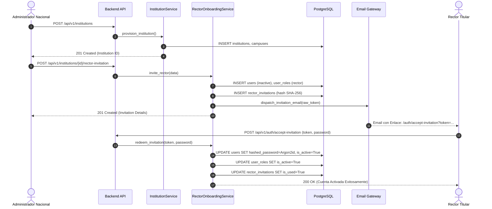

# DOCUMENTO DE DISEÑO ARQUITECTÓNICO — FASE 3C
## Aprovisionamiento Institucional y Onboarding Seguro de Rectores

**Proyecto:** Plataforma Educativa Virtual Nacional (PEVN / PEVE)  
**Fase:** Fase 3C — Diseño Arquitectónico de Aprovisionamiento  
**Tipo de Documento:** Documento Formal de Diseño de Arquitectura (Design-First — Sin Cambios de Código en Paso 1)  
**Fecha:** 2026-08-25  
**Línea Base de Referencia:** `BASELINE_PHASE_3B_BACKEND` (109/109 PASSED, 100% PASS, FROZEN)  

---

## 1. Arquitectura del Estado Actual (Current-State Architecture)

1. **Entidades Existentes en Base de Datos:**
   - `Institution`: Modelo en [`backend/app/models/institution.py`](file:///c:/Users/juanc/OneDrive/Documentos/Desarrollo%20proyectos/Plataforma%20Educativa/Plataforma%20Educativa%20Virtual%20Nacional%20PEVN/backend/app/models/institution.py). Posee clave primaria `id` (UUID), `dane_code` único de 12 dígitos, `municipality_id` (FK a catálogo territorial), nombre, email institucional, dirección, teléfono y booleano `is_active`.
   - `Campus`: Modelo de sedes vinculado a `Institution` con `dane_sede_code` único.
   - `User`: Modelo en [`backend/app/models/user.py`](file:///c:/Users/juanc/OneDrive/Documentos/Desarrollo%20proyectos/Plataforma%20Educativa/Plataforma%20Educativa%20Virtual%20Nacional%20PEVN/backend/app/models/user.py) con afiliación `institution_id` (FK `institutions.id`, `nullable=True` para nivel nacional), unicidad de documento (`uq_users_document`) y hash Argon2id.
   - `Role` y `UserRole`: Modelo RBAC en [`backend/app/models/role.py`](file:///c:/Users/juanc/OneDrive/Documentos/Desarrollo%20proyectos/Plataforma%20Educativa/Plataforma%20Educativa%20Virtual%20Nacional%20PEVN/backend/app/models/role.py) con roles canónicos (`SystemRole.SUPERADMIN`, `SystemRole.NATIONAL_ADMIN`, `SystemRole.RECTOR`, etc.) y alcance institucional `UserRole.institution_id`.
2. **Capacidades Operativas Actuales:**
   - El Administrador Nacional posee alcance global inmutable (`scope.is_national() == True`).
   - El Rector posee alcance institucional estricto (`scope.institution_id == <UUID>`).
   - El módulo de Gestión Académica (Fase 3B) y Aulas Virtuales (Fase 4) están 100% funcionales cuando existe una institución y un rector asignado.
3. **Brecha Funcional:**
   - No existe un servicio de dominio `InstitutionService`.
   - No existen endpoints REST de escritura para dar de alta instituciones ni para registrar/invitar rectores.
   - No existe una tabla ni mecanismo de invitaciones tokenizadas de un solo uso para Rectores.
   - No existe una interfaz web para el Administrador Nacional que permita gestionar el catálogo institucional.

---

## 2. Arquitectura del Estado Objetivo (Target-State Architecture)

El estado objetivo habilita el ciclo de vida completo de creación institucional y onboarding seguro de rectores mediante una arquitectura desacoplada y orientada a eventos de auditoría:

```
┌───────────────────────────────────────────────────────────────────────────┐
│                      ADMINISTRADOR NACIONAL (MEN)                         │
└─────────────────────────────────────┬─────────────────────────────────────┘
                                      │
                                      ▼ 1. POST /api/v1/institutions
┌───────────────────────────────────────────────────────────────────────────┐
│                       InstitutionService.provision()                      │
│  - Valida unicidad DANE (12 dígitos numéricos)                            │
│  - Valida existencia de municipio en catálogo DANE                        │
│  - Crea registro Institution                                              │
│  - Crea automáticamente Sede Principal (Campus)                           │
│  - Emite AuditEvent(INSTITUTION_CREATED)                                  │
└─────────────────────────────────────┬─────────────────────────────────────┘
                                      │
                                      ▼ 2. POST /api/v1/institutions/{id}/rector-invitation
┌───────────────────────────────────────────────────────────────────────────┐
│                    RectorOnboardingService.invite()                       │
│  - Valida que la institución esté activa                                  │
│  - Valida unicidad de documento de identidad (C.C. / C.E.)                │
│  - Valida que no exista ya un Rector activo o invitación pendiente        │
│  - Crea registro User (is_active=False, is_verified=False)                │
│  - Asigna UserRole(rector, institution_id, is_active=False)               │
│  - Genera token raw de alta entropía (48 bytes URL-safe)                  │
│  - Persiste RectorInvitation (con SHA-256 token_hash, expires_at=48h)     │
│  - Emite AuditEvent(RECTOR_INVITED)                                       │
│  - Despacha correo electrónico transaccional con enlace seguro            │
└─────────────────────────────────────┬─────────────────────────────────────┘
                                      │
                                      ▼ Enlace por Email: /auth/accept-invitation?token=...
┌───────────────────────────────────────────────────────────────────────────┐
│                             RECTOR TITULAR                                │
│  - Ingresa a la interfaz web de Aceptación de Invitación                  │
│  - Define su propia contraseña segura bajo política estricta              │
└─────────────────────────────────────┬─────────────────────────────────────┘
                                      │
                                      ▼ 3. POST /api/v1/auth/accept-invitation
┌───────────────────────────────────────────────────────────────────────────┐
│                    RectorOnboardingService.redeem()                       │
│  - Busca token por hash SHA-256; valida no expirado y no consumido        │
│  - Hashea nueva contraseña con Argon2id                                   │
│  - Actualiza User: is_active=True, is_verified=True, password_changed_at  │
│  - Actualiza UserRole: is_active=True                                     │
│  - Marca RectorInvitation: is_used=True, used_at=func.now()               │
│  - Invalida cualquier otra invitación previa del mismo usuario            │
│  - Emite AuditEvent(RECTOR_ONBOARDING_COMPLETED)                          │
└─────────────────────────────────────┬─────────────────────────────────────┘
                                      │
                                      ▼ 4. Login directo e ingreso a Gestión Académica
┌───────────────────────────────────────────────────────────────────────────┐
│                      DASHBOARD INSTITUCIONAL / ACADEMIC                   │
│  - El Rector accede con su colegio ya contextualizado sin errores 403     │
└───────────────────────────────────────────────────────────────────────────┘
```

---

## 3. Entidades de Dominio Involucradas

1. **`Institution`** ([`backend/app/models/institution.py`](file:///c:/Users/juanc/OneDrive/Documentos/Desarrollo%20proyectos/Plataforma%20Educativa/Plataforma%20Educativa%20Virtual%20Nacional%20PEVN/backend/app/models/institution.py)): Entidad principal de inquilino.
2. **`Campus`** ([`backend/app/models/institution.py`](file:///c:/Users/juanc/OneDrive/Documentos/Desarrollo%20proyectos/Plataforma%20Educativa/Plataforma%20Educativa%20Virtual%20Nacional%20PEVN/backend/app/models/institution.py)): Sede principal y sedes anexas.
3. **`User`** ([`backend/app/models/user.py`](file:///c:/Users/juanc/OneDrive/Documentos/Desarrollo%20proyectos/Plataforma%20Educativa/Plataforma%20Educativa%20Virtual%20Nacional%20PEVN/backend/app/models/user.py)): Identidad del Rector pre-registrada y luego activada.
4. **`Role` / `UserRole`** ([`backend/app/models/role.py`](file:///c:/Users/juanc/OneDrive/Documentos/Desarrollo%20proyectos/Plataforma%20Educativa/Plataforma%20Educativa%20Virtual%20Nacional%20PEVN/backend/app/models/role.py)): Rol `rector` (nivel 50) acotado al `institution_id`.
5. **`RectorInvitation` (Nueva Entidad de Dominio):** Registro de la invitación tokenizada de un solo uso.
6. **`AuditEvent`** ([`backend/app/audit/interfaces.py`](file:///c:/Users/juanc/OneDrive/Documentos/Desarrollo%20proyectos/Plataforma%20Educativa/Plataforma%20Educativa%20Virtual%20Nacional%20PEVN/backend/app/audit/interfaces.py)): Registro de seguridad inmutable.

---

## 4. Requerimiento de `InstitutionService`

**SÍ, es estrictamente requerido.**  
Se creará la clase `InstitutionService` en `backend/app/services/institution_service.py` siguiendo el patrón existente de inyección de sesión de SQLAlchemy y auditoría:
- **Responsabilidades:**
  - Creación atómica de Institución y Sede Principal dentro de una transacción.
  - Validación de formato de Código DANE (12 dígitos numéricos).
  - Validación de existencia del `municipality_id` en el catálogo territorial DANE.
  - Consulta paginada de instituciones con filtros por departamento, municipio, estado operativo y búsqueda libre por nombre o código DANE.
  - Transición de estados operativos de la institución (`ACTIVE`, `INACTIVE`, `SUSPENDED`).
  - Emisión de eventos de auditoría mediante `audit_service`.

---

## 5. Requerimiento de la Entidad `RectorInvitation`

**SÍ, es estrictamente requerida.**  
Para garantizar que nunca se expongan tokens en claro ni se transmitan contraseñas temporales inseguras, se creará la entidad `RectorInvitation` en `backend/app/models/invitation.py` (o en `models/token.py`).

---

## 6. Definición de Campos de Base de Datos para `RectorInvitation`

```python
class RectorInvitation(Base):
    __tablename__ = "rector_invitations"

    id: Mapped[uuid.UUID] = mapped_column(
        UUID(as_uuid=True), primary_key=True, default=uuid.uuid4, server_default=text("gen_random_uuid()")
    )
    institution_id: Mapped[uuid.UUID] = mapped_column(
        UUID(as_uuid=True), ForeignKey("institutions.id", ondelete="CASCADE"), nullable=False, index=True
    )
    user_id: Mapped[uuid.UUID] = mapped_column(
        UUID(as_uuid=True), ForeignKey("users.id", ondelete="CASCADE"), nullable=False, index=True
    )
    token_hash: Mapped[str] = mapped_column(
        String(64), unique=True, nullable=False, index=True, doc="SHA-256 digest del token raw de 48 bytes."
    )
    invited_by_id: Mapped[uuid.UUID] = mapped_column(
        UUID(as_uuid=True), ForeignKey("users.id", ondelete="RESTRICT"), nullable=False, index=True
    )
    expires_at: Mapped[datetime] = mapped_column(
        DateTime(timezone=True), nullable=False, doc="Fecha límite de expiración (UTC, por defecto 48h)."
    )
    is_used: Mapped[bool] = mapped_column(
        Boolean, default=False, nullable=False, doc="Indica si la invitación ya fue consumida."
    )
    used_at: Mapped[datetime | None] = mapped_column(
        DateTime(timezone=True), nullable=True, doc="Timestamp exacto del consumo."
    )
    is_revoked: Mapped[bool] = mapped_column(
        Boolean, default=False, nullable=False, doc="Indica si fue revocada administrativamente."
    )
    revoked_at: Mapped[datetime | None] = mapped_column(
        DateTime(timezone=True), nullable=True
    )
    created_at: Mapped[datetime] = mapped_column(
        DateTime(timezone=True), server_default=func.now(), nullable=False
    )
```

---

## 7. Máquina de Estados del Ciclo de Vida de la Invitación

```
                     ┌──────────────────┐
                     │     PENDING      │
                     │ (Creada y Activa)│
                     └────────┬─────────┘
                              │
          ┌───────────────────┼───────────────────┐
          │ (Rector define    │ (Transcurren      │ (Admin revoca
          │  su contraseña)   │  > 48 horas)      │  invitación)
          ▼                   ▼                   ▼
    ┌───────────┐       ┌───────────┐       ┌───────────┐
    │ REDEEMED  │       │  EXPIRED  │       │  REVOKED  │
    │  (USADA)  │       │ (VENCIDA) │       │(CANCELADA)│
    └───────────┘       └───────────┘       └───────────┘
```

- **Propiedad `is_valid`:** `not is_used and not is_revoked and (now_utc < expires_at)`.

---

## 8. Diseño de Endpoints de la API REST

### 8.1. Endpoints de Aprovisionamiento Institucional
1. **`POST /api/v1/institutions`**
   - **Propósito:** Creación y aprovisionamiento de una nueva Institución Educativa con su Sede Principal.
   - **Autorización Requerida:** Rol `NATIONAL_ADMIN` o `SUPERADMIN` (Permiso: `institutions:create`).
   - **Payload de Entrada:**
     ```json
     {
       "dane_code": "125001000001",
       "name": "Institución Educativa Nacional San José",
       "email": "contacto@sanjose.edu.co",
       "phone": "+57 310 1234567",
       "address": "Calle 10 # 5-20",
       "municipality_id": "a0eebc99-9c0b-4ef8-bb6d-6bb9bd380a11",
       "main_campus_name": "Sede Principal",
       "main_campus_dane": "125001000001"
     }
     ```
   - **Respuesta:** `HTTP 201 Created` con `InstitutionResponse`.

2. **`GET /api/v1/institutions`**
   - **Propósito:** Consulta paginada y filtrable del catálogo nacional de instituciones.
   - **Autorización Requerida:** Rol `NATIONAL_ADMIN` o `SUPERADMIN` (Permiso: `institutions:read`).
   - **Parámetros Query:** `page`, `page_size`, `department_id`, `municipality_id`, `is_active`, `search`.
   - **Respuesta:** `HTTP 200 OK` con `InstitutionListResponse`.

3. **`GET /api/v1/institutions/{id}`** *(Existente — Preservado)*
   - **Propósito:** Obtener detalle de institución validando alcance organizacional.
   - **Respuesta:** `HTTP 200 OK`.

4. **`PATCH /api/v1/institutions/{id}/status`**
   - **Propósito:** Activar o suspender una institución educativa.
   - **Autorización Requerida:** Rol `NATIONAL_ADMIN` o `SUPERADMIN` (Permiso: `institutions:update`).

### 8.2. Endpoints de Onboarding de Rector
5. **`POST /api/v1/institutions/{institution_id}/rector-invitation`**
   - **Propósito:** Iniciar el proceso de onboarding del Rector y generar la invitación tokenizada.
   - **Autorización Requerida:** Rol `NATIONAL_ADMIN` o `SUPERADMIN` (Permiso: `users:create_rector`).
   - **Payload de Entrada:**
     ```json
     {
       "first_name": "Carlos Alberto",
       "last_name": "Gómez Restrepo",
       "document_type": "CC",
       "document_number": "79845123",
       "email": "rector@sanjose.edu.co",
       "phone_number": "+57 300 9876543"
     }
     ```
   - **Respuesta:** `HTTP 201 Created` con metadatos de la invitación (sin exponer token en claro salvo en entorno de desarrollo/test):
     ```json
     {
       "invitation_id": "c1a2b3c4-...",
       "institution_id": "...",
       "user_id": "...",
       "email": "rector@sanjose.edu.co",
       "expires_at": "2026-08-27T15:00:00Z",
       "status": "PENDING"
     }
     ```

6. **`POST /api/v1/auth/verify-invitation` (Público / Limitado por Rate Limiting)**
   - **Propósito:** Permite a la interfaz web validar si el token recibido en la URL es válido antes de mostrar el formulario de creación de clave.
   - **Payload:** `{"token": "<raw_token_string>"}`.
   - **Respuesta:** `HTTP 200 OK` con `{"valid": true, "email": "r***@sanjose.edu.co", "institution_name": "I.E. San José"}` (ocultando datos sensibles).

7. **`POST /api/v1/auth/accept-invitation` (Público / Limitado por Rate Limiting)**
   - **Propósito:** Consumir la invitación y establecer la contraseña final del Rector.
   - **Payload:**
     ```json
     {
       "token": "<raw_token_string>",
       "password": "PasswordCompleja2026*!",
       "password_confirmation": "PasswordCompleja2026*!"
     }
     ```
   - **Respuesta:** `HTTP 200 OK` con confirmación de activación y credenciales listas para inicio de sesión.

---

## 9. Matriz de Autorización y Control de Acceso

| Endpoint / Operación | Rol Requerido | Alcance (Scope) Requerido | Permiso Atómico |
|---|---|---|---|
| `POST /api/v1/institutions` | `NATIONAL_ADMIN`, `SUPERADMIN` | `is_national() == True` | `institutions:create` |
| `GET /api/v1/institutions` | `NATIONAL_ADMIN`, `SUPERADMIN` | `is_national() == True` | `institutions:read` |
| `PATCH /api/v1/institutions/{id}/status` | `NATIONAL_ADMIN`, `SUPERADMIN` | `is_national() == True` | `institutions:update` |
| `POST /api/v1/institutions/{id}/rector-invitation` | `NATIONAL_ADMIN`, `SUPERADMIN` | `is_national() == True` | `users:create_rector` |
| `POST /api/v1/auth/verify-invitation` | Público (Unauthenticated) | N/A (Token-bounded) | Rate-limited |
| `POST /api/v1/auth/accept-invitation` | Público (Unauthenticated) | N/A (Token-bounded) | Rate-limited |
| `GET /api/v1/academic-years` | `RECTOR`, `COORDINATOR` | `institution_id == target` | `academic_years:read` |

---

## 10. Reglas de Aislamiento Multi-Inquilino (Tenant Isolation Rules)

1. **Aislamiento del Administrador Nacional:** Opera en `scope.is_national() == True`. No puede asumir identidades institucionales de forma implícita; debe especificar explícitamente el `institution_id` en las operaciones de consulta o gestión.
2. **Aislamiento del Rector:** Su usuario `User` tiene `institution_id = <ID>` y su rol `UserRole` tiene `institution_id = <ID>`. Cualquier intento de operar sobre otra institución es rechazado por `CentralizedAuthorizationService` con `HTTP 404 Not Found`.
3. **Restricción de Creación:** Un Rector **NO TIENE** permiso `institutions:create`. Si un Rector intenta invocar `POST /api/v1/institutions`, el sistema devuelve `403 Forbidden: PERMISSION_DENIED`.

---

## 11. Secuencia de Onboarding del Rector



---

## 12. Secuencia y Política de Creación de Contraseñas

1. **Algoritmo Obligatorio:** **Argon2id** (mediante [`backend/app/core/security/password.py`](file:///c:/Users/juanc/OneDrive/Documentos/Desarrollo%20proyectos/Plataforma%20Educativa/Plataforma%20Educativa%20Virtual%20Nacional%20PEVN/backend/app/core/security/password.py)).
2. **Requisitos de Complejidad:**
   - Mínimo 8 caracteres (recomendado 12+).
   - Al menos una letra mayúscula, una letra minúscula, un número y un carácter especial.
   - Prohibido el uso de secuencias comunes o el correo del usuario.
3. **Garantía de Confidencialidad:** El Administrador Nacional **nunca** conoce, visualiza ni asigna la contraseña.

---

## 13. Estrategia de Generación y Almacenamiento de Tokens

1. **Generación:** `raw_token = secrets.token_urlsafe(48)` $\implies$ Token criptográficamente seguro de 384 bits de entropía.
2. **Almacenamiento:** Se almacena **únicamente el hash SHA-256** del token en la base de datos:
   $$\texttt{token\_hash} = \text{SHA-256}(\texttt{raw\_token})$$
3. **Búsqueda:** Al recibir el token desde la web, el backend calcula su hash SHA-256 y busca por `token_hash == computed_hash`.
4. **Prohibición de Logs:** Los tokens en claro están explícitamente excluidos de los logs de la aplicación.

---

## 14. Estrategia de Expiración

- **Tiempo de Vida:** 48 horas a partir del momento de generación (`expires_at = now_utc + timedelta(hours=48)`).
- **Validación:** `datetime.now(UTC) < invitation.expires_at`.
- **Expiración Temprana:** Si se emite una nueva invitación para el mismo usuario antes de que venza la anterior, la invitación anterior pasa automáticamente a `is_revoked = True`.

---

## 15. Prevención de Ataques de Repetición (Replay Prevention)

1. **Consumo Atómico:** La marcación `is_used = True` y `used_at = now()` se ejecuta dentro de la misma transacción de actualización de contraseña.
2. **Unicidad de Hash:** La columna `token_hash` posee restricción `UNIQUE` en PostgreSQL.
3. **Invalidación de Familia:** Al canjear un token, cualquier otro token de invitación emitido para ese mismo usuario es revocado atómicamente.

---

## 16. Requisitos de Trazabilidad y Auditoría (Audit Trail)

El módulo emitirá eventos inmutables hacia `AuditService`:
- `INSTITUTION_CREATED`: Registra DANE, municipio, creador e IP.
- `RECTOR_INVITED`: Registra ID del Rector, institución, creador e IP.
- `RECTOR_ONBOARDING_COMPLETED`: Registra fecha/hora de activación e IP de origen del Rector.
- `INSTITUTION_STATUS_UPDATED`: Registra cambio de estado y motivo administrativo.

---

## 17. Arquitectura de Despacho de Correo Electrónico (Email Delivery)

1. **Patrón Proveedor:** Interfaz `IEmailService` desacoplada.
2. **Entornos de Ejecución:**
   - **Desarrollo / Pruebas:** Implementación `MockEmailProvider` o `ConsoleEmailProvider` (registra el correo en logs/consola o expone el token en la respuesta de test para validar el flujo E2E).
   - **Producción:** Adaptador SMTP / Amazon SES / SendGrid con plantillas HTML responsivas y accesibles.

---

## 18. Pantallas e Interfaces de Usuario Requeridas (Frontend UX)

1. **Ruta `/admin/institutions` (Panel de Aprovisionamiento Nacional):**
   - Tabla con listado de colegios, buscador por DANE/Nombre, filtros por Departamento/Municipio.
   - Botón modal `+ Nueva Institución Educativa`.
   - Botón de acción por fila: `Invitar Rector`, `Ver Detalle`, `Desactivar`.
2. **Ruta `/auth/accept-invitation` (Pantalla Pública de Activación de Rector):**
   - Validación automática de validez del token en URL (`?token=...`).
   - Visualización de datos de bienvenida (*"Bienvenido a la I.E. San José"*).
   - Formulario con campos: Nueva Contraseña, Confirmación de Contraseña, Aceptación de Términos y Tratamiento de Datos Personales (Ley 1581 de 2012).
   - Redirección automática a `/login` tras el éxito.

---

## 19. Manejo de Errores y Códigos HTTP

| Situación | Código HTTP | Código de Error de Dominio | Mensaje al Usuario |
|---|---|---|---|
| Código DANE ya registrado | `409 Conflict` | `DUPLICATE_DANE_CODE` | "El código DANE ya se encuentra registrado." |
| Documento de Rector ya registrado | `409 Conflict` | `DUPLICATE_DOCUMENT` | "El documento de identidad ya está asociado a otro usuario." |
| Token de invitación no encontrado | `404 Not Found` | `INVITATION_NOT_FOUND` | "Enlace de invitación no válido." |
| Token expirado | `410 Gone` | `INVITATION_EXPIRED` | "El enlace de invitación ha expirado. Solicite uno nuevo." |
| Token ya utilizado | `409 Conflict` | `INVITATION_ALREADY_USED`| "Esta invitación ya fue utilizada anteriormente." |
| Usuario sin permisos (ej. Docente creando colegio) | `403 Forbidden` | `PERMISSION_DENIED` | "No tiene permisos para aprovisionar instituciones." |

---

## 20. Consideraciones de Idempotencia

- La creación de instituciones está protegida contra duplicaciones accidentales mediante la restricción única del `dane_code`.
- La invitación de rectores valida si el usuario ya tiene rol activo en la institución antes de generar una nueva invitación.

---

## 21. Estrategia de Migración de Base de Datos

- **Migración Alembic `003_phase3c_rector_invitations.py`:**
  - Creación no destructiva de la tabla `rector_invitations`.
  - Índices sobre `token_hash`, `institution_id`, `user_id` y `expires_at`.
  - Cero alteraciones que rompan compatibilidad con tablas existentes.

---

## 22. Compatibilidad hacia Atrás (Backward Compatibility)

- La totalidad de las 109 pruebas de la línea base de la Fase 3B seguirán ejecutándose contra el mismo esquema de datos sin verse afectadas, dado que `rector_invitations` es una tabla aditiva.
- Las consultas institucionales existentes (`GET /institutions/me`, `GET /institutions/{id}`) se mantendrán 100% idénticas.

---

## 23. Estrategia de Pruebas Automatizadas

Se diseñará una suite de pruebas focalizada en `backend/tests/test_institution_provisioning.py`:
1. `test_provision_institution_success_national_admin` (201 Created, genera Campus Principal).
2. `test_provision_institution_rejected_for_rector_or_teacher` (403 Forbidden).
3. `test_provision_institution_duplicate_dane_rejected` (409 Conflict).
4. `test_invite_rector_success_and_token_hashing` (201 Created, token SHA-256 almacenado).
5. `test_accept_invitation_lifecycle_argon2_activation` (200 OK, usuario activado, rol rector activo).
6. `test_accept_invitation_replay_attack_rejected` (409 Conflict en segundo intento).
7. `test_accept_invitation_expired_token_rejected` (410 Gone tras vencer plazo).
8. `test_activated_rector_can_immediately_access_academic_years` (Sin error 403 de contexto institucional).

---

## 24. Estado del Paso 1 y Próximos Pasos

```
========================================================================================
                               PHASE_3C_STEP_1_STATUS
========================================================================================
DESIGN:                                COMPLETE & FULLY DOCUMENTED
PRODUCTION CODE CHANGES:               0
DATABASE CHANGES:                      0
TEST CHANGES:                          0
PHASE_3B_BASELINE (109/109 PASS):      PRESERVED & FROZEN
SECURITY INVARIANTS:                   PRESERVED
NEXT STEP:                             AWAITING EXPLICIT AUTHORIZATION
========================================================================================
```
