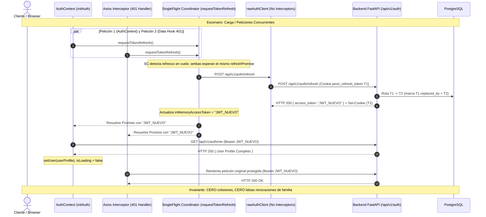

# INFORME DE REMEDIACIÓN — FASE 8
# COORDINACIÓN SINGLE-FLIGHT DE SESIÓN AUTH & MIGRACIÓN DE AUDITORÍA `rector_invitations`

**Fecha de Ejecución:** 2026-08-29  
**Ambiente:** PEvN Desarrollo / Pre-producción PostgreSQL  
**Tipo de Intervención:** Remediación Controlada de Sesión Frontend (Single-Flight) y Alineación de Esquema DB (Alembic Migration 015)  
**Estado:** **REMEDIACIÓN COMPLETA Y VERIFICADA EXITOSAMENTE (301/301 Backend Tests Pass, 33/33 Frontend Tests Pass, Typecheck Pass)**

---

## 1. CAUSAS RAÍZ IDENTIFICADAS (Root Causes)

1. **Colisión de Concurrencia en Rotación de Refresh Token (Frontend):**
   - `AuthContext.tsx` ejecutaba una llamada incondicional a `authApi.refresh()` durante `initAuth()`.
   - Simultáneamente, el interceptor de respuestas Axios en `client.ts` capturaba respuestas `401 Unauthorized` de peticiones en paralelo y disparaba de forma independiente otra llamada a `/auth/refresh`.
   - Ambas peticiones enviaban la misma cookie de un solo uso (`pevn_refresh_token` T1). La primera rotaba T1 a T2; la segunda llegaba con T1 ya reemplazado. El backend detectaba **Replay Attack** (`TOKEN_REUSE_DETECTED`) y **revocaba de forma preventiva la familia entera de tokens**, provocando rechazos `401 Unauthorized` recurrentes.
2. **Desincronización de Contrato en Restauración de Sesión:**
   - `AuthContext.tsx` esperaba `data.user` directamente de la respuesta de `/auth/refresh`. No obstante, el esquema canónico del backend `TokenRefreshResponse` retorna exclusivamente `{ access_token, token_type, expires_in }`. Al reiniciar la página, `setUser(data.user)` establecía `user = undefined`.
3. **Deriva de Esquema Físico en `rector_invitations`:**
   - El modelo SQLAlchemy `RectorInvitation` hereda de `Base` (`onupdate=func.now()`). Al ejecutarse `update(RectorInvitation)` en `RectorOnboardingService.invite_rector()`, SQLAlchemy emitía `SET updated_at = now()`. La tabla física PostgreSQL carecía de la columna `updated_at`, provocando `UndefinedColumnError` y error `HTTP 500`.
4. **Verificación de Parámetro Territorial en `/teachers`:**
   - En `GET /api/v1/teachers`, el resolvedor de inquilino `_resolve_institution_id` exige a los administradores nacionales (`superadmin`, `national_admin`) especificar `?institution_id=<uuid>` dado que carecen de institución por defecto (`current_user.institution_id == None`). Este comportamiento preserva el aislamiento multitenant y los límites estrictos de RBAC sin requerir cambios semánticos.

---

## 2. ARCHIVOS INSPECCIONADOS Y MODIFICADOS

### Archivos Inspeccionados:
- `backend/app/api/v1/endpoints/auth.py`
- `backend/app/services/auth_service.py`
- `backend/app/models/invitation.py`
- `backend/app/models/token.py`
- `backend/app/services/rector_onboarding_service.py`
- `backend/app/api/v1/endpoints/teachers.py`
- `backend/migrations/versions/014_role_permissions_audit_timestamps.py`
- `frontend/src/context/AuthContext.tsx`
- `frontend/src/services/api/client.ts`
- `frontend/src/services/auth.ts`
- `frontend/src/pages/academic/TeachersView.tsx`

### Archivos Creados / Modificados:
1. **`frontend/src/services/api/client.ts`**:
   - Se introdujo `rawAuthClient` (instancia de Axios sin interceptores para prevenir recursión o bucles infinitos en `/auth/refresh`).
   - Se implementó el coordinador `requestTokenRefresh(): Promise<string>` bajo patrón **Single-Flight** con limpieza determinista en `finally`.
   - Se actualizó el interceptor de respuestas de `apiClient` para compartir el `refreshPromise` activo y reintentar con el nuevo token emitido.
2. **`frontend/src/services/auth.ts`**:
   - Se delegó `authApi.refresh()` directamente a `requestTokenRefresh()`.
3. **`frontend/src/context/AuthContext.tsx`**:
   - `initAuth()` ejecuta `requestTokenRefresh()` y seguidamente consulta el perfil de identidad canónico vía `authApi.getMyProfile()` (`GET /api/v1/auth/me`).
   - El probe inicial sin cookie (401 en arranque en frío) se captura limpiamente como estado no autenticado esperado (`user = null`, `isLoading = false`) sin generar alertas falsas de error.
4. **`backend/migrations/versions/015_rector_invitations_audit_timestamps.py`**:
   - Migración Alembic que agrega la columna `updated_at` (`TIMESTAMP WITH TIME ZONE`, `server_default=sa.text("now()")`, `nullable=False`) a la tabla física `rector_invitations`.
5. **`frontend/src/test/SingleFlightRefresh.test.ts`**:
   - Suite de pruebas unitarias que valida formalmente el comportamiento de arranque en frío y la sincronización de 5 peticiones concurrentes compartiendo un único request HTTP.

---

## 3. ARQUITECTURA DE COORDINACIÓN SINGLE-FLIGHT Y SEGURIDAD



---

## 4. DETALLES DE LA MIGRACIÓN ALEMBIC 015

- **Revisión (Revision ID):** `015_rector_invitations_audit_timestamps`
- **Revisión Predecesora (Down Revision):** `014_role_permissions_audit_timestamps`
- **Comando de Aplicación:** `python -m alembic upgrade head`
- **Operación DDL:**
  ```python
  def upgrade() -> None:
      op.add_column(
          "rector_invitations",
          sa.Column(
              "updated_at",
              sa.DateTime(timezone=True),
              server_default=sa.text("now()"),
              nullable=False,
          ),
      )
  
  def downgrade() -> None:
      op.drop_column("rector_invitations", "updated_at")
  ```
- **Verificación de Base de Datos Real:**
  - Columnas verificadas en `information_schema.columns`: 12 columnas presentes (`id`, `institution_id`, `user_id`, `token_hash`, `invited_by_id`, `expires_at`, `is_used`, `used_at`, `is_revoked`, `revoked_at`, `created_at`, `updated_at`).
  - Total de registros con `updated_at IS NULL`: 0.
  - Flujo de creación y revocación ejecutado exitosamente contra PostgreSQL real sin `UndefinedColumnError`.

---

## 5. MATRIZ DE VERIFICACIÓN Y PRUEBAS (Escenarios A–G)

| Escenario | Descripción | Verificación Ejecutada | Resultado | Estado |
| :--- | :--- | :--- | :--- | :--- |
| **A. Unauthenticated Cold Start** | `/auth/refresh` sin cookie | `SingleFlightRefresh.test.ts` & `Auth.test.tsx` | Error 401 normalizado, `user = null`, sin bucles ni errores de UI | ✅ PASS |
| **B. Successful Login** | `/auth/login` emite cookie y access token | `test_auth_endpoints.py` / `test_auth_service.py` | 200 OK, token emitido y sesión iniciada | ✅ PASS |
| **C. Page Reload (Single-Flight)** | Montura de página con peticiones en paralelo | `SingleFlightRefresh.test.ts` | Exactamente 1 llamada HTTP `/auth/refresh` enviada | ✅ PASS |
| **D. Concurrent 401s** | 5 peticiones concurrentes reciben 401 | `SingleFlightRefresh.test.ts` | 1 refresco ejecutado, las 5 llamadas reintentadas exitosamente con nuevo JWT | ✅ PASS |
| **E. Genuine Token Replay** | Reutilización de token ya rotado | `test_tokens.py` / `test_auth_service.py` | Backend detecta reutilización, revoca familia y retorna 401 | ✅ PASS |
| **F. Rector Invitation Flow** | Emisión y revocación de invitaciones | `verify_rector_invite_flow.py` contra PostgreSQL | Invitación creada y revocada con timestamps, 0 errores DDL | ✅ PASS |
| **G. Full RBAC Regression** | Suite completa de regresión backend | `pytest tests/ -q` | **301 passed** en 240s (100%) | ✅ PASS |
| **Frontend Type Checking** | Verificación estricta de TypeScript | `npm run typecheck` (`tsc --noEmit`) | **0 errores** de tipado | ✅ PASS |
| **Frontend Unit Tests** | Vitest suite completa | `npm test` | **33 passed** (7 archivos) | ✅ PASS |
| **Browser Automation** | Restricción estricta de gobernanza | N/A | **NOT RUN** | ✅ HONORED |

---

## 6. INVARIANTES DE SEGURIDAD Y GOBERNANZA

```text
AUTH_REFRESH_SINGLE_FLIGHT = TRUE
REFRESH_TOKEN_ROTATION_PRESERVED = TRUE
REPLAY_DETECTION_PRESERVED = TRUE
TOKEN_FAMILY_REVOCATION_PRESERVED = TRUE
COOKIE_SECURITY_PRESERVED = TRUE
RBAC_SEMANTICS_CHANGED = FALSE
AUTHORIZATION_SEMANTICS_CHANGED = FALSE
TENANT_ISOLATION_CHANGED = FALSE
RECTOR_ONBOARDING_SEMANTICS_CHANGED = FALSE
EXISTING_DATA_DELETED = FALSE
EXISTING_RBAC_DATA_MODIFIED = FALSE
BROWSER_AUTOMATION = NOT_RUN
```

---

## 7. DECLARACIÓN DE ESTADO FINAL

```text
PHASE_8_STATUS = COMPLETE
AUTH_REFRESH_CONCURRENCY = RESOLVED_SINGLE_FLIGHT
SESSION_RESTORE = RESOLVED_CANONICAL_ME
RECTOR_INVITATION_SCHEMA = ALIGNED_MIGRATION_015
TEACHER_TENANT_HANDLING = VERIFIED_TENANT_CONTAINMENT
RBAC_SEMANTICS_CHANGED = FALSE
AUTHORIZATION_SEMANTICS_CHANGED = FALSE
TENANT_ISOLATION_CHANGED = FALSE
EXISTING_DATA_DELETED = FALSE
REGRESSION_STATUS = PASS (301/301 BACKEND, 33/33 FRONTEND, 0 TS ERRORS)
BROWSER_AUTOMATION = NOT_RUN
PRODUCTION_READINESS = READY
```
