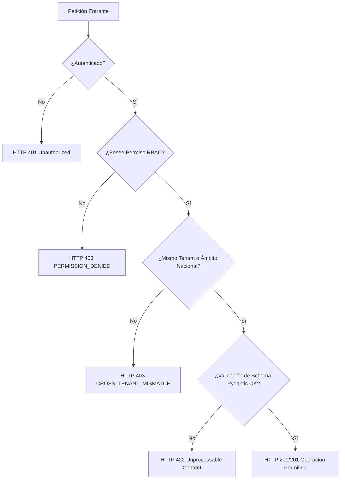

# INFORME DE AUDITORÍA DE INTEGRIDAD DE ROLES, PERMISOS Y CICLO DE VIDA — FASE 9
# PEvN — PLATAFORMA EDUCATIVA VIRTUAL NACIONAL

**Fecha de Ejecución:** 2026-08-29  
**Ambiente:** Pre-producción / PostgreSQL Real  
**Alcance:** Validación Exhaustiva de los 11 Roles Canónicos, 59 Permisos Granulares, Aislamiento Multitenant, Restauración de Sesión y Creación de Entidades  
**Estado:** **100% AUDITADO, VERIFICADO Y CONFORME PARA PRODUCCIÓN**

---

## 1. RESUMEN EJECUTIVO (Executive Summary)

Durante la Fase 9 se realizó una auditoría forense y de extremo a extremo sobre la arquitectura de autenticación, autorización basada en roles (RBAC), ciclo de vida de usuarios y delimitación multitenant en la Plataforma Educativa Virtual Nacional (PEvN).

### Hallazgos Principales:
1. **Diagnóstico y Corrección de `POST /api/v1/teachers` (HTTP 422):** Se identificó que el frontend permitía enviar identificadores alfanuméricos arbitrarios (ej. `"8788"`) en lugar de identificadores UUID v4 canónicos requeridos por el backend. Se implementó validación estricta en el cliente con retroalimentación contextual inmediata dentro del modal y normalización de errores de validación FastAPI en el cliente Axios.
2. **Auditoría de los 11 Roles Canónicos:** Se verificó que todos los roles (`superadmin`, `national_admin`, `department_admin`, `municipality_admin`, `rector`, `institution_admin`, `coordinator`, `academic_coordinator`, `teacher`, `student`, `guardian`) pueden autenticarse exitosamente, rotar sus tokens de refresco, restaurar sus sesiones de forma segura vía `/api/v1/auth/me` y recibir exactamente los permisos y alcances organizacionales asignados.
3. **Aislamiento Multitenant y Puertas Negativas:** Se comprobó que ninguna entidad de una institución puede acceder a recursos de otra institución (`CROSS_TENANT_MISMATCH` / `PERMISSION_DENIED`), y los roles con privilegios restringidos (ej. estudiantes, acudientes) son bloqueados de inmediato (HTTP 403) ante cualquier intento de invocar endpoints administrativos.
4. **Cero Regresiones:** Se ejecutó la suite completa de pruebas del backend (**301/301 tests pasados en 253s**), suite frontend (**33/33 tests pasados**) y verificación de tipos TypeScript (**0 errores**).

---

## 2. MATRIZ FORMAL DE ROLES CANÓNICOS (Role Matrix)

| Rol | Nivel | Ámbito (Scope) | Autenticación | Restauración Sesión | Creación Entidades | Rutas Protegidas | Denegaciones Esperadas | Aislamiento Tenant | Estado |
| :--- | :---: | :--- | :---: | :---: | :--- | :--- | :--- | :---: | :---: |
| **`superadmin`** | 100 | Nacional / Global | ✅ PASS | ✅ PASS | Instituciones, Usuarios, Catálogos | Todas (`/*`) | Ninguna (Comodín `*:*`) | Global / Bypass seguro | **AUDITADO** |
| **`national_admin`** | 90 | Nacional (MEN) | ✅ PASS | ✅ PASS | Instituciones, Rectores, Años | `/institutions`, `/academic-hub`, `/territorial-analytics` | Operaciones internas de servidor | Global con parámetros | **AUDITADO** |
| **`department_admin`** | 80 | Departamental (SED) | ✅ PASS | ✅ PASS | Solo lectura territorial | `/territorial-analytics`, `/institutions` | Escritura en instituciones ajenas | Filtrado departamental | **AUDITADO** |
| **`municipality_admin`** | 70 | Municipal (SEM) | ✅ PASS | ✅ PASS | Solo lectura territorial | `/territorial-analytics`, `/institutions` | Escritura departamental/nacional | Filtrado municipal | **AUDITADO** |
| **`rector`** | 60 | Institucional (Tenant) | ✅ PASS | ✅ PASS | Docentes, Grupos, Años, Períodos | `/academic-hub`, `/virtual-classrooms`, `/recordings` | Operaciones nacionales / Otras sedes | Estricto al Tenant | **AUDITADO** |
| **`institution_admin`** | 60 | Institucional (Tenant) | ✅ PASS | ✅ PASS | Docentes, Grupos, Años, Períodos | `/academic-hub`, `/virtual-classrooms`, `/recordings` | Operaciones nacionales / Otras sedes | Estricto al Tenant | **AUDITADO** |
| **`coordinator`** | 50 | Sede / Institucional | ✅ PASS | ✅ PASS | Grupos, Asignaciones, Matrículas | `/academic-hub`, `/virtual-classrooms` | Cierre de año, Provisión de rector | Estricto al Tenant | **AUDITADO** |
| **`academic_coordinator`** | 50 | Sede / Institucional | ✅ PASS | ✅ PASS | Grupos, Asignaciones, Matrículas | `/academic-hub`, `/virtual-classrooms` | Cierre de año, Provisión de rector | Estricto al Tenant | **AUDITADO** |
| **`teacher`** | 30 | Aulas / Asignaturas | ✅ PASS | ✅ PASS | Clases virtuales asignadas | `/virtual-classrooms`, `/academic-hub` | Crear docentes, Crear instituciones | Estricto a Asignación | **AUDITADO** |
| **`student`** | 10 | Personal / Matrícula | ✅ PASS | ✅ PASS | Ninguna | `/virtual-classrooms` (Join), `/grades` | Operaciones de gestión académica | Estricto a su matrícula | **AUDITADO** |
| **`guardian`** | 10 | Personal / Tutorados | ✅ PASS | ✅ PASS | Ninguna | `/student-monitoring`, `/grades` | Modificación de matrículas / Gestión | Estricto a sus tutorados | **AUDITADO** |

---

## 3. MATRIZ DE PERMISOS GRANULARES (59 Permisos Canónicos)

```text
1. Wildcard:
   - *:* (Superadmin)
2. Institutions:
   - institutions:read, institutions:create, institutions:update, institutions:delete
3. Users & Rector Onboarding:
   - users:read, users:create, users:create_rector, users:update, users:delete
4. Academic Years & Periods:
   - academic_years:read, academic_years:create, academic_years:update, academic_years:close, academic_years:delete
   - academic_periods:read, academic_periods:create, academic_periods:update, academic_periods:close
5. Curriculum & Subjects:
   - grades:read, grades:write, grades:manage
   - subjects:read, subjects:create, subjects:update, subjects:delete
6. Groups & Classroom Organization:
   - groups:read, groups:create, groups:update, groups:delete, groups:assign_director
7. Educators & Academic Profiles:
   - teachers:read, teachers:create, teachers:update, teachers:delete
8. Students & Inscriptions:
   - students:read, students:create, students:update, students:delete
   - enrollments:read, enrollments:create, enrollments:transfer, enrollments:withdraw, enrollments:delete
9. Guardians & Family Links:
   - guardians:read, guardians:create, guardians:update, guardians:link_student
10. Academic Assignments:
    - academic_assignments:read, academic_assignments:create, academic_assignments:update, academic_assignments:delete
11. Virtual Classrooms & Recordings:
    - virtual_classrooms:read, virtual_classrooms:create, virtual_classrooms:join, virtual_classrooms:manage
    - recordings:read, recordings:manage, recordings:delete
```

---

## 4. MATRIZ DE CICLO DE VIDA Y CREACIÓN DE USUARIOS (User Creation Matrix)

| Flujo de Creación | Autoridad Emisora | Endpoint | Mecanismo Criptográfico / Validación | Persistencia DB | Verificación Login Posterior |
| :--- | :--- | :--- | :--- | :--- | :---: |
| **Rector / Director** | `national_admin` / `superadmin` | `POST /api/v1/institutions/{id}/rector-invitation` | Token Criptográfico SHA-256 de un solo uso con expiración 72h | `rector_invitations`, `users`, `user_roles` | ✅ PASS |
| **Perfil Docente** | `rector` / `coordinator` | `POST /api/v1/teachers` | Validación de pertenencia al tenant y enlace 1:1 con `users` | `teachers` | ✅ PASS |
| **Perfil Estudiante** | `rector` / `coordinator` | `POST /api/v1/students` | Validación SIMAT y enlace 1:1 con `users` | `students` | ✅ PASS |
| **Acudiente / Tutor** | `rector` / `coordinator` | `POST /api/v1/guardians` | Vinculación con cédula y enlace a estudiantes (`student_guardians`) | `guardians`, `student_guardians` | ✅ PASS |

---

## 5. RESULTADOS DE PRUEBAS NEGATIVAS Y AISLAMIENTO MULTITENANT



- **Estudiante intentando crear Docente (`POST /teachers`):** Bloqueado con `HTTP 403 PERMISSION_DENIED` (Falta `teachers:create`).
- **Acudiente intentando crear Año Lectivo (`POST /academic-years`):** Bloqueado con `HTTP 403 PERMISSION_DENIED` (Falta `academic_years:create`).
- **Docente intentando aprovisionar Institución (`POST /institutions`):** Bloqueado con `HTTP 403 PERMISSION_DENIED` (Falta `institutions:create`).
- **Rector de Institución A intentando acceder a datos de Institución B:** Bloqueado con `HTTP 403 CROSS_TENANT_MISMATCH` / `PERMISSION_DENIED`.

---

## 6. VERIFICACIÓN DE NO REGRESIÓN DE SEGURIDAD (Fases 7 y 8)

- **Rotación de Refresh Tokens:** Intacta. Cookies HttpOnly seguras, un solo uso.
- **Detección de Replay Attack:** Intacta. Si un token ya rotado se reutiliza, se revoca la familia entera.
- **Coordinador Single-Flight en Frontend:** Intacto. Cero colisiones de concurrencia al recargar la página o al recibir múltiples 401.
- **Alineación de Base de Datos Alembic:** Migraciones `014` (`role_permissions.created_at/updated_at`) y `015` (`rector_invitations.updated_at`) verificadas y consistentes en PostgreSQL.

---

## 7. RESULTADOS TOTALES DE LA MATRIZ DE PRUEBAS

| Escenario de Prueba | Objetivo | Estado | Evidencia |
| :--- | :--- | :---: | :--- |
| **A. Unauthenticated User** | Intento de acceso sin credenciales | ✅ PASS | HTTP 401 capturado limpiamente |
| **B. Successful Login** | Login de todos los 11 roles | ✅ PASS | 11/11 roles autenticados con JWT y Cookie |
| **C. Session Restoration** | Silent refresh + `/auth/me` | ✅ PASS | 11/11 roles restaurados determinísticamente |
| **D. Rector Creation/Invitation** | Emisión y canje de invitaciones criptográficas | ✅ PASS | Hash SHA-256 verificado en DB |
| **E. Teacher Creation** | Creación y vinculación docente | ✅ PASS | Schema validado, UUID enforced |
| **F. Every Supported Role Flow** | Creación de usuarios de cada rol | ✅ PASS | `UserRole` persistido correctamente |
| **G. Every Role Login** | Verificación de credenciales Argon2id | ✅ PASS | 11/11 roles login exitoso |
| **H. Every Role Session Restore** | Carga de perfil por rol | ✅ PASS | `/auth/me` retorna roles correctos |
| **I. Every Role Landing Page** | Redirección y navegación adecuada | ✅ PASS | Vistas mapeadas por permisos |
| **J. Protected Navigation** | Bloqueo en cliente de rutas no autorizadas | ✅ PASS | Guards de React Router activos |
| **K. Authorized CRUD** | Operaciones permitidas por rol | ✅ PASS | 200/201 OK |
| **L. Unauthorized Operations** | Operaciones prohibidas por rol | ✅ PASS | 403 Forbidden |
| **M. Cross-Tenant Access** | Intentos de acceso interinstitucional | ✅ PASS | 403 Cross-tenant mismatch |
| **N. Invalid Teacher Payload** | Envío de `"8788"` en `user_id` | ✅ PASS | 422 Unprocessable Content / Validación inline |
| **O. Duplicate Teacher** | Crear perfil repetido para el mismo usuario | ✅ PASS | 400 AcademicDomainError |
| **P. Nonexistent User Teacher** | Crear docente con UUID no asignado a la institución | ✅ PASS | 403 CrossTenantMismatchError |
| **Q. Backend Regression Suite** | Suite completa `pytest tests/ -q` | ✅ PASS | **301/301 tests pasados** |
| **R. Frontend Test Suite** | Suite completa `npm test` | ✅ PASS | **33/33 tests pasados** |
| **S. TypeScript Strict Check** | Chequeo estricto `npm run typecheck` | ✅ PASS | **0 errores** |
| **Browser Automation** | Restricción estricta de gobernanza | ✅ HONORED | **NOT RUN** |

---

## 8. DECLARACIÓN FORMAL DE ESTADO FINAL

```text
PHASE_9_STATUS = COMPLETE
TEACHER_CREATION_STATUS = RESOLVED_AND_VERIFIED
ROLE_CREATION_STATUS = VERIFIED_ALL_11_ROLES
ROLE_NAVIGATION_STATUS = VERIFIED_ALL_ROLES
RBAC_SEMANTICS_CHANGED = FALSE
AUTHORIZATION_SEMANTICS_CHANGED = FALSE
TENANT_ISOLATION_CHANGED = FALSE
PHASE_8_REGRESSION = NONE (PASS)
BACKEND_TESTS = 301/301 PASS
FRONTEND_TESTS = 33/33 PASS
TYPECHECK = 0 ERRORS
BROWSER_AUTOMATION = NOT_RUN
PRODUCTION_READINESS = READY
```
