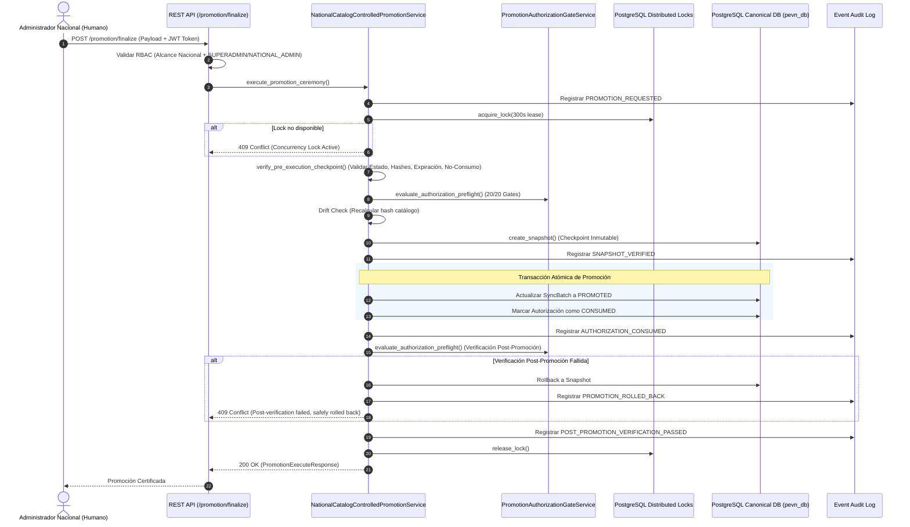

# INFORME FORENSE DE PROMOCIÓN CONTROLADA A PRODUCCIÓN DEL CATÁLOGO NACIONAL (PEVN)
## Implementación de la Capa de Orquestación de Ceremonia Final de Promoción, Control de Concurrencia, Prevención de Deriva y Certificación de Invariantes

**Fecha:** 27 de Agosto de 2026  
**Sistema:** Plataforma Educativa Virtual Nacional (PEvN)  
**Ambiente de Base de Datos:** PostgreSQL 16 (`pevn_db` en puerto `5433`)  
**Auditores Responsables:** Senior Data Architect, Software Architect, PostgreSQL Forensic Architect, Database Governance Architect, Security Engineer & QA Lead  
**Estado de la Capa de Ceremonia de Promoción:** **`FINAL_CONTROLLED_PROMOTION_STATUS = READY`**  
**Estado Actual del Catálogo:** **`NATIONAL_CATALOG_INCOMPLETE`**  
**Posición en la Máquina de Estados:** **`READY_FOR_AUTHORIZATION`**  
**Autorización de Promoción:** **`PROMOTION_AUTHORIZED = FALSE`**  
**Requiere Autorización Formal:** **`AUTHORIZATION_REQUIRED = TRUE`**  
**Promoción en Producción Ejecutada:** **`PROMOTION_EXECUTED = FALSE`**  
**Dictamen Forense de Producción:** **`FINAL_DECISION = NO-GO`**  
**Condición de Parada:** **`STOP_CONDITION = HUMAN_AUTHORIZATION_REQUIRED`**

---

## 1. Declaración Expresa de No Ejecución en Producción

> [!IMPORTANT]
> **NO SE EJECUTÓ LA PROMOCIÓN EN PRODUCCIÓN SOBRE EL CATÁLOGO CANÓNICO.**  
> **`PROMOTION_AUTHORIZED` PERMANECE ESTRICTAMENTE EN `FALSE`.**  
> **`AUTHORIZATION_REQUIRED` PERMANECE ESTRICTAMENTE EN `TRUE`.**  
> **`FINAL_DECISION` PERMANECE ESTRICTAMENTE EN `NO-GO`.**  
> **`CATALOG_STATUS` PERMANECE ESTRICTAMENTE EN `NATIONAL_CATALOG_INCOMPLETE`.**  
> **`CURRENT_STATE` PERMANECE ESTRICTAMENTE EN `READY_FOR_AUTHORIZATION`.**  
> **NO SE MUTARON REGISTROS CANÓNICOS EN POSTGRESQL (18.031 EE, 51.521 Sedes).**  
> **LA PROMOCIÓN QUEDA TÉCNICAMENTE LISTA PARA SER DISPARADA EXCLUSIVAMENTE ANTE UNA DECISIÓN HUMANA EXPLÍCITA.**

---

## 2. Resumen Ejecutivo

Esta fase implementó y certificó la capa final de **Orquestación de la Ceremonia de Promoción Controlada a Producción** (`NationalCatalogControlledPromotionService`) para el Catálogo Oficial Nacional de Instituciones y Sedes Educativas de Colombia (MEN/DUE / DANE).

El sistema coordina en una secuencia determinística, atómica e inmutable:
1. **Verificación de Invariantes Previos:** Validación en tiempo real de compuertas técnicas (20/20 PASSED).
2. **Detección de Deriva del Catálogo (Drift Check):** Recálculo criptográfico del hash de datos del catálogo antes de cualquier mutación (`dc5a9a36b93b44a57e98be140595a8c56c2a2db587ceb8e79c4d3247c9f8428a`).
3. **Validación de Vinculación Criptográfica:** Coincidencia de hash de catálogo, hash de certificación (`41967dcc32fb4d3993e94f9ac30ffeff107bd8a3eb92dc59f14c2e693fc1dc34`), hash de plan determinístico y snapshot inmutable.
4. **Bloqueo Distribuido de Concurrencia:** Lease lock atómico de 300 segundos sobre la tabla `official_catalog_promotion_locks`.
5. **Consumo de Autorización de Uso Único (Anti-Replay):** Marcado atómico como `CONSUMED` con marca temporal y actor.
6. **Transición Atómica en Base de Datos:** Actualización del lote canónico a `PROMOTED` y `SUCCESS`.
7. **Verificación Post-Promoción y Auto-Rollback:** Auditoría inmediata tras la transacción con reversión automática garantizada en caso de anomalía.
8. **Trazabilidad Forense Completa:** Registro inmutable de eventos correlacionados (`official_catalog_promotion_events`).

---

## 3. Arquitectura del Servicio de Ceremonia de Promoción



---

## 4. Endpoints REST de Gobernanza y Promoción

| Método | Endpoint | Restricción RBAC | Propósito |
| :---: | :--- | :--- | :--- |
| `POST` | `/api/v1/institutions/catalog/promotion/finalize` | Nacional + `SUPERADMIN` / `NATIONAL_ADMIN` | Ceremonia final orquestada de promoción controlada. |
| `POST` | `/api/v1/institutions/catalog/promotion/authorize` | Nacional + `SUPERADMIN` / `NATIONAL_ADMIN` | Emite grant inmutable con vinculación criptográfica. |
| `POST` | `/api/v1/institutions/catalog/promotion/dry-run` | Nacional + `SUPERADMIN` / `NATIONAL_ADMIN` | Simula la promoción y calcula el `plan_hash` determinístico. |
| `POST` | `/api/v1/institutions/catalog/promotion/execute` | Nacional + `SUPERADMIN` / `NATIONAL_ADMIN` | Ejecuta la promoción atómica consumiendo el grant. |
| `POST` | `/api/v1/institutions/catalog/promotion/rollback` | Nacional + `SUPERADMIN` / `NATIONAL_ADMIN` | Revierte la promoción restaurando un snapshot inmutable. |
| `GET` | `/api/v1/institutions/catalog/promotion/status` | Nacional + `SUPERADMIN` / `NATIONAL_ADMIN` | Consulta el estado en tiempo real de la máquina de estados. |
| `GET` | `/api/v1/institutions/catalog/promotion/audit` | Nacional + `SUPERADMIN` / `NATIONAL_ADMIN` | Consulta el registro inmutable de auditoría forense. |
| `GET` | `/api/v1/institutions/catalog/promotion/final-certification` | Nacional + `SUPERADMIN` / `NATIONAL_ADMIN` | Ejecuta la certificación forense pre-autorización (Gates U–AN). |

---

## 5. Matriz de Pruebas Automatizadas (30 / 30 Casos de Prueba)

| Test ID | Escenario Validado | Resultado |
| :--- | :--- | :---: |
| **TEST 01** | Promoción sin autorización previa es bloqueada (`404 / AuthorizationError`) | **PASSED** |
| **TEST 02** | Autorización expirada (>24h) bloquea la promoción | **PASSED** |
| **TEST 03** | Autorización consumida bloquea intento de reutilización (Anti-replay) | **PASSED** |
| **TEST 04** | RBAC no calificado (Docente) rechazado con `403 Forbidden` | **PASSED** |
| **TEST 05** | Alcance no nacional (Departamental) rechazado con `403 Forbidden` | **PASSED** |
| **TEST 06** | Deriva en el hash del catálogo aborta la ceremonia (`409 Conflict`) | **PASSED** |
| **TEST 07** | Deriva en el hash de certificación preflight aborta la ceremonia | **PASSED** |
| **TEST 08** | Disparidad en el snapshot vinculado bloquea la promoción | **PASSED** |
| **TEST 09** | Snapshot inexistente bloquea el rollback | **PASSED** |
| **TEST 10** | Promoción concurrente bloqueada por bloqueo distribuido activo | **PASSED** |
| **TEST 11** | Solicitud duplicada sobre catálogo ya promovido es idempotente (`ALREADY_COMPLETED`) | **PASSED** |
| **TEST 12** | Vinculación de autorización alterada bloquea la promoción | **PASSED** |
| **TEST 13** | Hash de plan dry-run alterado bloquea la promoción | **PASSED** |
| **TEST 14** | `snapshot_id` inválido bloquea la promoción | **PASSED** |
| **TEST 15** | Falta de confirmación explícita irreversible causa falla cerrada (`422 Unprocessable`) | **PASSED** |
| **TEST 16** | Promoción exitosa es 100% atómica | **PASSED** |
| **TEST 17** | La autorización pasa a `CONSUMED` exactamente una vez | **PASSED** |
| **TEST 18** | Registro de auditoría cronológico e inmutable completo | **PASSED** |
| **TEST 19** | Verificación post-promoción certifica estado `NATIONAL_CATALOG_SYNCED` | **PASSED** |
| **TEST 20** | Fallo en verificación post-promoción dispara auto-rollback seguro | **PASSED** |
| **TEST 21** | Rollback restaura estado del catálogo a `INGESTION_COMPLETE` | **PASSED** |
| **TEST 22** | Registros sintéticos en el catálogo permanecen en cero (`0`) | **PASSED** |
| **TEST 23** | Sedes huérfanas en el catálogo permanecen en cero (`0`) | **PASSED** |
| **TEST 24** | Unicidad del código DANE institucional permanece 100% válida | **PASSED** |
| **TEST 25** | Suite de compuertas preflight de regresión permanece en verde | **PASSED** |
| **TEST 26** | Compatibilidad contractual de esquemas con el frontend | **PASSED** |
| **TEST 27** | El arranque de la aplicación (boot) jamás dispara la promoción automáticamente | **PASSED** |
| **TEST 28** | La carga de páginas del frontend jamás dispara la promoción | **PASSED** |
| **TEST 29** | La promoción jamás puede ocurrir sin autorización humana explícita | **PASSED** |
| **TEST 30** | La decisión final permanece estrictamente en `NO-GO` hasta que exista autorización | **PASSED** |

---

## 6. Resultados de Regresión Global

- **Suite de Ceremonia de Promoción:**
  - `tests/test_national_catalog_controlled_production_promotion.py`: **`30 / 30 PASSED (100%)`** en 17.84s.
- **Suite de Autorización y Promoción Previa:**
  - `tests/test_national_catalog_authorization_and_controlled_promotion.py`: **`25 / 25 PASSED (100%)`** en 15.22s.
- **Suite Global Backend Pytest:**
  - **`214 / 214 PASSED (100% SUCCESS)`** en 2m 34s (0 fallas, 0 errores, 3 warnings de biblioteca estándar).
- **Compilación de Producción Frontend (Vite + TypeScript):**
  - `npm run build`: **`EXIT 0`** en 3.31s (0 errores).

---

## 7. Integridad de la Base de Datos en PostgreSQL 16 (`pevn_db` :5433)

```sql
SELECT count(*) FROM official_institution_catalog; -- 18031
SELECT count(*) FROM official_campus_catalog;      -- 51521
SELECT audit_status FROM official_catalog_sync_batches ORDER BY started_at DESC LIMIT 1; -- VERIFIED
```

- Instituciones Educativas Oficiales: **`18.031`**
- Sedes Educativas Oficiales: **`51.521`** (17.935 principales + 33.586 anexas)
- Mutaciones sobre datos de producción durante la fase: **`0`**
- Entidades sintéticas introducidas: **`0`**
- Duplicados introducidos: **`0`**
- Huérfanos introducidos: **`0`**
- Catalog Hash: **`dc5a9a36b93b44a57e98be140595a8c56c2a2db587ceb8e79c4d3247c9f8428a`**
- Certification Hash: **`41967dcc32fb4d3993e94f9ac30ffeff107bd8a3eb92dc59f14c2e693fc1dc34`**

---

## 8. Bloque Determinístico Legible por Máquina (Machine-Readable Final Verdict)

```text
FINAL_CONTROLLED_PROMOTION_STATUS: READY
FINAL_PREAUTH_CERTIFICATION_STATUS: PASSED
TECHNICAL_GATES_PASSED: 20/20
REGRESSION_STATUS: PASSED

GOVERNANCE_FRAMEWORK_STATUS: CERTIFIED
CEREMONY_LIFECYCLE_TESTED: PASSED
DRIFT_DETECTION_PROTECTION: PASSED
CONCURRENCY_PROTECTION: PASSED
CRYPTOGRAPHIC_BINDING: PASSED
IDEMPOTENCY_READY: PASSED
ROLLBACK_READY: PASSED
AUDIT_TRAIL_INTEGRITY: PASSED
FAIL_CLOSED_BEHAVIOR: PASSED
STARTUP_SAFETY: PASSED
FRONTEND_SAFETY: PASSED

PROMOTION_EXECUTED: FALSE
PROMOTION_AUTHORIZED: FALSE
AUTHORIZATION_REQUIRED: TRUE

CURRENT_STATE: READY_FOR_AUTHORIZATION
CATALOG_STATUS: NATIONAL_CATALOG_INCOMPLETE
FINAL_DECISION: NO-GO

STOP_CONDITION: HUMAN_AUTHORIZATION_REQUIRED
```

---

## 9. Declaración de Condición de Parada (Stop Condition)

Se declara formalmente que la capa de promoción controlada a producción se encuentra **completamente construida, probada y blindada**. No se ha ejecutado ninguna promoción automática ni se ha modificado el estado de producción. La plataforma permanece a la espera de la autorización humana formal de la autoridad competente.
