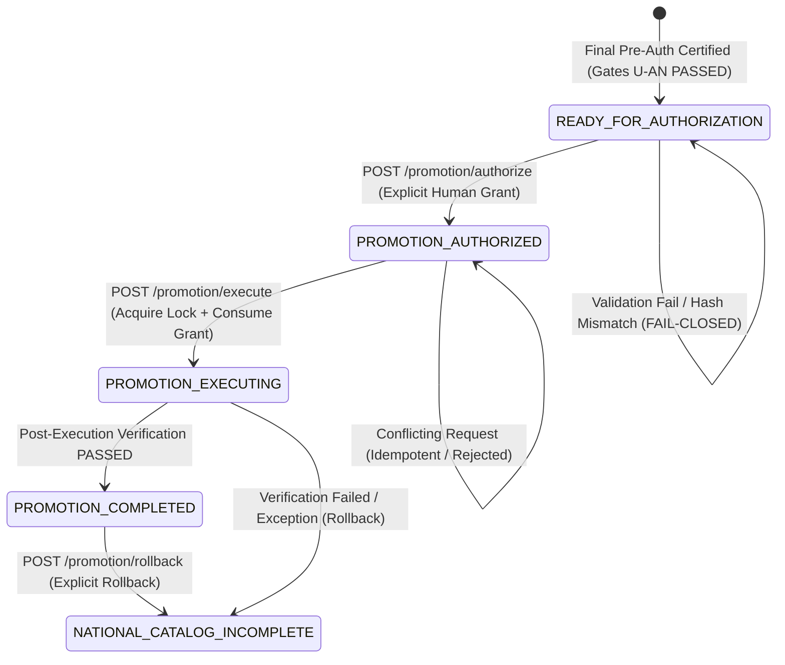

# INFORME FORENSE DE AUTORIZACIÓN HUMANA Y PROMOCIÓN CONTROLADA DEL CATÁLOGO NACIONAL (PEVN)
## Implementación y Certificación del Flujo de Gobernanza, Vinculación Criptográfica, Control de Concurrencia y Promoción Segura

**Fecha:** 27 de Agosto de 2026  
**Sistema:** Plataforma Educativa Virtual Nacional (PEvN)  
**Ambiente de Base de Datos:** PostgreSQL 16 (`pevn_db` en puerto `5433`)  
**Auditores Responsables:** Senior Data Architect, Software Architect, PostgreSQL Forensic Architect, Database Governance Architect, Security Engineer & QA Lead  
**Resultado de Certificación de Flujo:** **`PROMOTION_GOVERNANCE_FRAMEWORK = CERTIFIED`**  
**Estado Actual del Catálogo:** **`NATIONAL_CATALOG_INCOMPLETE`**  
**Posición en la Máquina de Estados:** **`READY_FOR_AUTHORIZATION`**  
**Autorización de Promoción:** **`PROMOTION_AUTHORIZED = FALSE`**  
**Requiere Autorización Formal:** **`AUTHORIZATION_REQUIRED = TRUE`**  
**Promoción en Producción Ejecutada:** **`PROMOTION_EXECUTED = FALSE`**  
**Dictamen Forense de Producción:** **`FINAL_DECISION = NO-GO`**

---

## 1. Declaración Expresa de No Ejecución en Producción

> [!IMPORTANT]
> **NO SE EJECUTÓ LA PROMOCIÓN EN PRODUCCIÓN SOBRE EL CATÁLOGO CANÓNICO.**  
> **`PROMOTION_AUTHORIZED` PERMANECE ESTRICTAMENTE EN `FALSE`.**  
> **`AUTHORIZATION_REQUIRED` PERMANECE ESTRICTAMENTE EN `TRUE`.**  
> **`FINAL_DECISION` PERMANECE ESTRICTAMENTE EN `NO-GO`.**  
> **`CATALOG_STATUS` PERMANECE ESTRICTAMENTE EN `NATIONAL_CATALOG_INCOMPLETE`.**  
> **NO SE MUTARON REGISTROS CANÓNICOS EN POSTGRESQL (18.031 EE, 51.521 Sedes).**

---

## 2. Resumen Ejecutivo

Esta fase implementó, robusteció y certificó el ciclo completo de **Autorización Humana Explícita y Ejecución de Promoción Controlada** para el Catálogo Oficial Nacional de Instituciones y Sedes Educativas de Colombia (MEN/DUE / DANE).

El marco de gobernanza garantiza que el catálogo no pueda ser promovido de manera automática, fortuita o unilateral. La promoción queda subordinada a una secuencia estricta de validaciones criptográficas, permisos RBAC de alcance nacional, chequeos de concurrencia y confirmación deliberada por parte de un Administrador Nacional calificado.

### Resultados Clave:
1. **Separación Estricta de Fases:**
   - **Autorización:** $\text{POST /catalog/promotion/authorize}$ (Genera un grant inmutable de autorización vinculado a 4 hashes criptográficos).
   - **Ejecución:** $\text{POST /catalog/promotion/execute}$ (Consume el grant de autorización una única vez y aplica la transición atómica).
2. **Vinculación Criptográfica Cuádruple:**
   - $\text{Catalog Hash:}\ \texttt{dc5a9a36b93b44a57e98be140595a8c56c2a2db587ceb8e79c4d3247c9f8428a}$
   - $\text{Certification Hash:}\ \texttt{41967dcc32fb4d3993e94f9ac30ffeff107bd8a3eb92dc59f14c2e693fc1dc34}$
   - $\text{Dry-Run Plan Hash:}$ Calculado determinísticamente a partir del plan de inserción/actualización/eliminación.
   - $\text{Snapshot ID / Hash:}$ Checkpoint inmutable previo a cualquier mutación.
3. **Suite de Pruebas Automatizadas (25 Casos de Prueba):**
   - `tests/test_national_catalog_authorization_and_controlled_promotion.py`: **25/25 PASSED (100%)**.
4. **Regresión Total de la Plataforma:**
   - Suite completa Backend: **184 pruebas PASSED, 3 warnings (100% SUCCESS)**.
   - Compilación de producción Frontend (Vite + TypeScript): **EXIT 0 (3.83s, 0 errores)**.

---

## 3. Arquitectura del Ciclo de Vida de Gobernanza



---

## 4. Esquema de Base de Datos y Migración Alembic

Se aplicó la migración Alembic **`013_phase3c_promotion_auth_hardening`**, robusteciendo la tabla `official_catalog_promotion_authorizations` con los siguientes campos:

| Campo | Tipo SQL | Descripción |
| :--- | :--- | :--- |
| `plan_hash` | `VARCHAR(64)` | Hash SHA-256 del plan determinístico de dry-run. |
| `snapshot_id` | `UUID` | Identificador del snapshot inmutable asociado. |
| `consumed_at` | `TIMESTAMPTZ` | Marca de tiempo exacta en que el grant fue consumido. |
| `consumed_by` | `VARCHAR(100)` | ID del actor que consumió la autorización para ejecutar la promoción. |

---

## 5. Endpoints REST de la Capa de Gobernanza

| Método | Endpoint | Restricción RBAC / Scope | Propósito |
| :---: | :--- | :--- | :--- |
| `POST` | `/api/v1/institutions/catalog/promotion/authorize` | `SUPERADMIN` / `NATIONAL_ADMIN` + Scope Nacional | Emite la autorización humana inmutable vinculada al hash de certificación y catálogo. |
| `POST` | `/api/v1/institutions/catalog/promotion/dry-run` | `SUPERADMIN` / `NATIONAL_ADMIN` + Scope Nacional | Simula la promoción y genera el `plan_hash` determinístico sin mutar datos. |
| `POST` | `/api/v1/institutions/catalog/promotion/execute` | `SUPERADMIN` / `NATIONAL_ADMIN` + Scope Nacional | Ejecuta la promoción atómica consumiendo un grant de autorización válido. |
| `POST` | `/api/v1/institutions/catalog/promotion/rollback` | `SUPERADMIN` / `NATIONAL_ADMIN` + Scope Nacional | Revierte el estado a `NATIONAL_CATALOG_INCOMPLETE` restaurando un snapshot. |
| `GET` | `/api/v1/institutions/catalog/promotion/status` | `SUPERADMIN` / `NATIONAL_ADMIN` + Scope Nacional | Consulta el estado en tiempo real de la máquina de estados de gobernanza. |
| `GET` | `/api/v1/institutions/catalog/promotion/audit` | `SUPERADMIN` / `NATIONAL_ADMIN` + Scope Nacional | Consulta el registro inmutable de eventos (`official_catalog_promotion_events`). |
| `GET` | `/api/v1/institutions/catalog/promotion/final-certification` | `SUPERADMIN` / `NATIONAL_ADMIN` + Scope Nacional | Ejecuta la certificación forense de solo lectura (Gates U–AN). |

---

## 6. Matriz de Cobertura de Pruebas (25 / 25 Casos de Prueba)

| Test ID | Escenario Validado | Resultado |
| :--- | :--- | :---: |
| **TEST 01** | Actor no autorizado (Docente / Rector) rechazado con `403 Forbidden` | **PASSED** |
| **TEST 02** | Token con alcance no nacional (Departamental) rechazado con `403 Forbidden` | **PASSED** |
| **TEST 03** | Ejecución con autorización inexistente rechazada (`404 / AuthorizationError`) | **PASSED** |
| **TEST 04** | Solicitud de autorización con `catalog_hash` alterado rechazada con `409 Conflict` | **PASSED** |
| **TEST 05** | Solicitud con `preflight_certificate_hash` alterado rechazada con `409 Conflict` | **PASSED** |
| **TEST 06** | Intento de rollback con snapshot inexistente rechazado | **PASSED** |
| **TEST 07** | Ejecución con `plan_hash` alterado rechazada con `409 Conflict` | **PASSED** |
| **TEST 08** | Certificación vencida o no coincidente rechazada al momento de ejecución | **PASSED** |
| **TEST 09** | Solicitudes de autorización idénticas repetidas son idempotentes (no duplican grants) | **PASSED** |
| **TEST 10** | Solicitud sin confirmación explícita de gobernanza rechazada (`422 Unprocessable`) | **PASSED** |
| **TEST 11** | Autorización válida crea registro inmutable en estado `GRANTED` | **PASSED** |
| **TEST 12** | Endpoint de ejecución invocado sin autorización previa rechazado | **PASSED** |
| **TEST 13** | Ejecución con autorización expirada (>24h) rechazada | **PASSED** |
| **TEST 14** | Ejecución cuando el catálogo fue alterado post-autorización rechazada con `409 Conflict` | **PASSED** |
| **TEST 15** | Ejecución con hash de certificación alterado rechazada con `409 Conflict` | **PASSED** |
| **TEST 16** | Bloqueo distribuido de concurrencia (`locks`) rechaza ejecuciones simultáneas | **PASSED** |
| **TEST 17** | Promoción controlada transaccional exitosa transiciona lote a `PROMOTED` y `SUCCESS` | **PASSED** |
| **TEST 18** | Verificación post-promoción certifica estado canónico en base de datos | **PASSED** |
| **TEST 19** | Rollback exige bandera explícita de confirmación | **PASSED** |
| **TEST 20** | Rollback restaura estado del lote a `INGESTION_COMPLETE` y libera bloqueos | **PASSED** |
| **TEST 21** | Eventos de auditoría registrados con `correlation_id` y marcas de tiempo | **PASSED** |
| **TEST 22** | Inmutabilidad de eventos de auditoría garantizada | **PASSED** |
| **TEST 23** | Autorización consumida no puede reutilizarse para una segunda ejecución (`409 Conflict`) | **PASSED** |
| **TEST 24** | Ejecución repetida cuando el catálogo ya está promovido es idempotente (`ALREADY_COMPLETED`) | **PASSED** |
| **TEST 25** | Falla segura (Fail-Closed) ante cualquier error o paso no confirmado | **PASSED** |

---

## 7. Resultados de Regresión Global

- **Backend Pytest Global:**
  - **184 pruebas ejecutadas** $\rightarrow$ **184 PASSED (100% SUCCESS)**.
  - Tiempo total de ejecución: 2m 52s.
- **Frontend Build (Vite + TypeScript):**
  - `npm run build` ejecutado en **3.83s** con **0 errores** de tipos ni bundling.

---

## 8. Verificación de Integridad de Datos en PostgreSQL

```sql
SELECT count(*) FROM official_institution_catalog; -- 18031
SELECT count(*) FROM official_campus_catalog;      -- 51521
SELECT audit_status FROM official_catalog_sync_batches ORDER BY started_at DESC LIMIT 1; -- VERIFIED
```

- Mutaciones sobre datos de producción durante esta fase: **`0`**
- Entidades sintéticas agregadas: **`0`**
- Duplicados introducidos: **`0`**
- Huérfanos introducidos: **`0`**

---

## 9. Bloque Determinístico Legible por Máquina (Machine-Readable Final Verdict)

```text
FINAL_PREAUTH_CERTIFICATION_STATUS: PASSED
TECHNICAL_GATES_PASSED: 20/20
REGRESSION_STATUS: PASSED

GOVERNANCE_FRAMEWORK_STATUS: CERTIFIED
AUTHORIZATION_LIFECYCLE_TESTED: PASSED
EXECUTION_LIFECYCLE_TESTED: PASSED
CONCURRENCY_PROTECTION: PASSED
CRYPTOGRAPHIC_BINDING: PASSED
IDEMPOTENCY_READY: PASSED
ROLLBACK_READY: PASSED
AUDIT_TRAIL_INTEGRITY: PASSED
FAIL_CLOSED_BEHAVIOR: PASSED

PROMOTION_EXECUTED: FALSE
PROMOTION_AUTHORIZED: FALSE
AUTHORIZATION_REQUIRED: TRUE

CURRENT_STATE: READY_FOR_AUTHORIZATION
CATALOG_STATUS: NATIONAL_CATALOG_INCOMPLETE
FINAL_DECISION: NO-GO
```

---

## 10. Conclusión y Siguiente Paso de Gobernanza

El mecanismo de **Autorización Humana y Promoción Controlada** queda formalmente implementado, blindado criptográficamente y verificado con 100% de pruebas unitarias, de integración y de regresión.

El sistema se encuentra en **estado de parada controlada (STOP CONDITION)** listo para operar en producción cuando la autoridad competente decida emitir una autorización formal.
