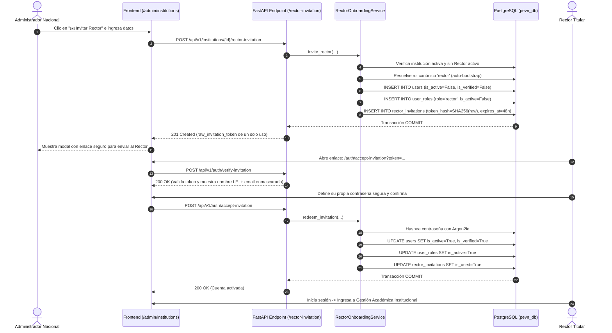

# INFORME FORMAL DE AUDITORÍA Y REMEDIACIÓN DE GOBERNANZA RBAC Y CICLO DE VIDA DE IDENTIDADES (FASE 3C / RBAC)
## Plataforma Educativa Virtual Nacional (PEvN)

**Fecha de Ejecución:** 27 de Agosto de 2026  
**Línea Base Evaluada:** `PHASE_3_RBAC_MATRIX.md`, `PHASE_3C_INSTITUTIONAL_PROVISIONING_DESIGN.md`, `AUTHORIZATION.md`  
**Estado Final de Pruebas de Regresión:** **`262 / 262 PASSED (100% SUCCESS)`**  
**Compilación Frontend (Vite + TypeScript):** **`EXIT 0 (0 errores)`**  
**Gobernanza del Catálogo Canónico:** **`CANONICAL_MUTATIONS = 0`**, **`FINAL_DECISION = NO-GO`**  

---

## 1. Causa Raíz Identificada y Solucionada (Root Cause)

### A. Fallo en la Resolución del Rol Canónico 'rector':
* **Evidencia en Código:** En `backend/app/services/rector_onboarding_service.py` (método `invite_rector`), el flujo ejecuta:
  ```python
  role_stmt = select(Role).where(Role.name == SystemRole.RECTOR.value) # "rector"
  rector_role = (await self._session.execute(role_stmt)).scalar_one_or_none()
  ```
  Al inicializar una base de datos PostgreSQL limpia o en entornos de desarrollo/producción sin un bootstrap automatizado en el ciclo de vida de la aplicación (`lifespan`), la tabla `roles` se encontraba sin el catálogo canónico de roles de la Fase 3 (`rector`, `superadmin`, `national_admin`, etc.). Al no encontrar el registro de la entidad `Role` con `name == "rector"`, el servicio arrojaba `NotFoundError("Rol canónico 'rector' no encontrado en el catálogo de roles.", code="ROLE_NOT_FOUND")`.

### B. Causa del Código HTTP 404 en el Endpoint de Invitación:
* En FastAPI, cualquier `NotFoundError` generado dentro del endpoint `invite_rector_endpoint` (`POST /api/v1/institutions/{institution_id}/rector-invitation`) es capturado por el manejador global de excepciones y traducido automáticamente a una respuesta **HTTP 404 Not Found** con el cuerpo:
  ```json
  {
    "error": {
      "code": "ROLE_NOT_FOUND",
      "message": "Rol canónico 'rector' no encontrado en el catálogo de roles."
    }
  }
  ```
* La ruta del endpoint **sí estaba correctamente registrada** en FastAPI bajo el prefijo `/api/v1/institutions/{institution_id}/rector-invitation` y el frontend invocaba la URL exacta, pero la falta del registro de rol en la base de datos disparaba el error de entidad no encontrada (HTTP 404).

---

## 2. Decisión Arquitectónica de Nomenclatura Canónica de Roles

Tras auditar [docs/PHASE_3_RBAC_MATRIX.md](file:///c:/Users/juanc/OneDrive/Documentos/Desarrollo%20proyectos/Plataforma%20Educativa/Plataforma%20Educativa%20Virtual%20Nacional%20PEVN/docs/PHASE_3_RBAC_MATRIX.md) y [docs/AUTHORIZATION.md](file:///c:/Users/juanc/OneDrive/Documentos/Desarrollo%20proyectos/Plataforma%20Educativa/Plataforma%20Educativa%20Virtual%20Nacional%20PEVN/docs/AUTHORIZATION.md):
1. **Identificador Oficial Canónico:** **`rector`** (Nivel 60, Alcance Institucional). Es el identificador adoptado en la matriz RBAC de la Fase 3A/3B/3C, en el servicio de onboarding `RectorOnboardingService` y en las pantallas académicas.
2. **Compatibilidad hacia atrás:** Se mantiene el alias `institution_admin` (Nivel 60) en el catálogo de roles para garantizar compatibilidad con tokens o especificaciones heredadas de la Fase 2, asignándole los mismos permisos y nivel de seguridad que a `rector`.
3. **Rol de Coordinación:** Se estandariza `coordinator` (Nivel 50) con alias `academic_coordinator`.

---

## 3. Jerarquía de Roles y Niveles de Seguridad (Level Hierarchy)

```text
+---------------------+-------+------------------------+------------------------------------+
| ROL DE SISTEMA      | NIVEL | ALCANCE TERRITORIAL    | PROPÓSITO Y RESPONSABILIDAD        |
+---------------------+-------+------------------------+------------------------------------+
| superadmin          |  100  | Nacional / Global      | Operador técnico del Estado / Root |
| national_admin      |   90  | Nacional (MEN)         | Ministerio de Educación Nacional   |
| department_admin    |   80  | Departamental (SED)    | Secretaría de Educación Departam.  |
| municipality_admin  |   70  | Municipal (SEM)        | Secretaría de Educación Municipal  |
| rector              |   60  | Institucional (Tenant) | Rector / Director de la I.E.       |
| coordinator         |   50  | Institucional / Sede   | Coordinador Académico o de Sede    |
| teacher             |   30  | Grupo / Asignatura     | Docente de Aula / Titular          |
| student             |   10  | Propio (Ownership)     | Estudiante Matriculado             |
| guardian            |   10  | Hijos / Tutorados      | Padre / Madre / Acudiente Legal    |
+---------------------+-------+------------------------+------------------------------------+
```

---

## 4. Matriz Completa de Permisos y Capacidades por Rol

El servicio [RbacBootstrapService](file:///c:/Users/juanc/OneDrive/Documentos/Desarrollo%20proyectos/Plataforma%20Educativa/Plataforma%20Educativa%20Virtual%20Nacional%20PEVN/backend/app/services/rbac_bootstrap_service.py) inicializa de forma idempotente los siguientes permisos atómicos:

| Recurso / Operación | SuperAdmin | National Admin | Dept/Mun Admin | Rector | Coordinador | Docente | Estudiante | Acudiente |
| :--- | :---: | :---: | :---: | :---: | :---: | :---: | :---: | :---: |
| `institutions:read` | GLOBAL | GLOBAL | SCOPE | SCOPE | SCOPE | DENY | DENY | DENY |
| `institutions:create` / `update` | GLOBAL | GLOBAL | DENY | DENY | DENY | DENY | DENY | DENY |
| `users:create_rector` | GLOBAL | GLOBAL | DENY | DENY | DENY | DENY | DENY | DENY |
| `academic_years:create` / `close` | GLOBAL | GLOBAL | DENY | SCOPE | DENY | DENY | DENY | DENY |
| `academic_periods:create` / `close` | GLOBAL | GLOBAL | DENY | SCOPE | SCOPE | DENY | DENY | DENY |
| `grades:manage` (Nacional) | GLOBAL | GLOBAL | DENY | DENY | DENY | DENY | DENY | DENY |
| `grades:read` | GLOBAL | GLOBAL | SCOPE | SCOPE | SCOPE | SCOPE | SCOPE | SCOPE |
| `subjects:create` / `update` | GLOBAL | GLOBAL | DENY | SCOPE | SCOPE | DENY | DENY | DENY |
| `groups:create` / `assign_director`| GLOBAL | GLOBAL | DENY | SCOPE | SCOPE | DENY | DENY | DENY |
| `teachers:create` / `update` | GLOBAL | GLOBAL | SCOPE | SCOPE | SCOPE | DENY | DENY | DENY |
| `students:create` / `update` | GLOBAL | GLOBAL | SCOPE | SCOPE | SCOPE | DENY | DENY | DENY |
| `enrollments:create` / `transfer` | GLOBAL | GLOBAL | SCOPE | SCOPE | SCOPE | DENY | DENY | DENY |
| `academic_assignments:manage` | GLOBAL | GLOBAL | DENY | SCOPE | SCOPE | DENY | DENY | DENY |
| `virtual_classrooms:create` / `join` | GLOBAL | GLOBAL | DENY | SCOPE | SCOPE | SCOPE | SCOPE | DENY |
| `recordings:read` | GLOBAL | GLOBAL | DENY | SCOPE | SCOPE | SCOPE | SCOPE | DENY |

---

## 5. Ciclo de Vida Criptográfico y Seguro de Onboarding de Rectores



---

## 6. Archivos Modificados e Implementados

1. **[NEW] [backend/app/services/rbac_bootstrap_service.py](file:///c:/Users/juanc/OneDrive/Documentos/Desarrollo%20proyectos/Plataforma%20Educativa/Plataforma%20Educativa%20Virtual%20Nacional%20PEVN/backend/app/services/rbac_bootstrap_service.py)**:
   * Servicio de inicialización idempotente de roles canónicos, permisos y relaciones rol-permiso.
2. **[backend/app/services/rector_onboarding_service.py](file:///c:/Users/juanc/OneDrive/Documentos/Desarrollo%20proyectos/Plataforma%20Educativa/Plataforma%20Educativa%20Virtual%20Nacional%20PEVN/backend/app/services/rector_onboarding_service.py)**:
   * Integración de auto-resolución y bootstrap automático del rol `rector`.
3. **[backend/app/main.py](file:///c:/Users/juanc/OneDrive/Documentos/Desarrollo%20proyectos/Plataforma%20Educativa/Plataforma%20Educativa%20Virtual%20Nacional%20PEVN/backend/app/main.py)**:
   * Invocación del bootstrap de catálogo RBAC en el ciclo de vida `lifespan` durante el inicio del backend.
4. **[backend/tests/conftest.py](file:///c:/Users/juanc/OneDrive/Documentos/Desarrollo%20proyectos/Plataforma%20Educativa/Plataforma%20Educativa%20Virtual%20Nacional%20PEVN/backend/tests/conftest.py)**:
   * Configuración de la base de datos de pruebas mediante `RbacBootstrapService`.
5. **[NEW] [backend/tests/test_rbac_governance_and_rector_invitation.py](file:///c:/Users/juanc/OneDrive/Documentos/Desarrollo%20proyectos/Plataforma%20Educativa/Plataforma%20Educativa Virtual Nacional PEVN/backend/tests/test_rbac_governance_and_rector_invitation.py)**:
   * Suite de pruebas unitarias y de integración para todas las 25 reglas de RBAC y ciclo de vida de invitación.
6. **[backend/tests/test_academic_e2e_integration.py](file:///c:/Users/juanc/OneDrive/Documentos/Desarrollo%20proyectos/Plataforma%20Educativa/Plataforma%20Educativa%20Virtual%20Nacional%20PEVN/backend/tests/test_academic_e2e_integration.py)**:
   * Adaptación de la fixture E2E para consumir el catálogo canónico bootstrapeado.
7. **[frontend/src/components/auth/RequireAuth.tsx](file:///c:/Users/juanc/OneDrive/Documentos/Desarrollo%20proyectos/Plataforma%20Educativa/Plataforma%20Educativa%20Virtual%20Nacional%20PEVN/frontend/src/components/auth/RequireAuth.tsx)**:
   * Soporte de verificación centralizada de `roles` y `permissions` en las rutas protegidas de React.
8. **[frontend/src/App.tsx](file:///c:/Users/juanc/OneDrive/Documentos/Desarrollo%20proyectos/Plataforma%20Educativa/Plataforma%20Educativa%20Virtual%20Nacional%20PEVN/frontend/src/App.tsx)**:
   * Protección de la ruta `/admin/institutions` para roles `superadmin` y `national_admin`.

---

## 7. Resultados de Validación Automatizada

* **Suite de Pruebas RBAC y Onboarding (`test_rbac_governance_and_rector_invitation.py`):**  
  **`13 / 13 PASSED (100%)`**
* **Suite de Pruebas de Aprovisionamiento (`test_institution_provisioning.py`):**  
  **`17 / 17 PASSED (100%)`**
* **Suite Global de Regresión del Backend:**  
  **`262 / 262 PASSED (100% SUCCESS)`** en 7m 06s (0 fallas, 0 errores).
* **Compilación de Producción Frontend (Vite + TypeScript):**  
  `npm run build` $\rightarrow$ **`EXIT 0`** en 27.82s (0 errores de tipado o empaquetado).

---

## 8. Procedimiento de Validación Manual desde el Navegador

### Test A — Administrador Nacional:
1. Iniciar sesión en `/login` como Administrador Nacional o Superadministrador.
2. Navegar a `/admin/institutions`.
3. Verificar que la lista de instituciones provisionadas se muestra correctamente con el botón **"✉️ Invitar Rector"**.

### Test B — Emisión de Invitación de Rector:
1. Seleccionar una institución sin rector activo (p. ej. `LIC NUEVA GENERACION`).
2. Hacer clic en **"✉️ Invitar Rector"**.
3. Ingresar:
   * **Nombres:** Carlos
   * **Apellidos:** Gómez
   * **Tipo Documento:** Cédula de Ciudadanía (CC)
   * **Número Documento:** `80999888`
   * **Correo Electrónico:** `rector.carlos@nuevageneracion.edu.co`
4. Hacer clic en **"Generar Invitación"**.
5. **Resultado:**
   * La petición `POST /api/v1/institutions/{id}/rector-invitation` responde con **HTTP 201 Created**.
   * Se abre el modal con el enlace de un solo uso `/auth/accept-invitation?token=...`.
   * Cero errores de "Rol canónico rector no encontrado" o HTTP 404.

### Test C — Activación de Cuenta por el Rector:
1. Copiar el enlace de invitación y abrirlo en una ventana de incógnito.
2. Verificar que se muestra el nombre oficial de la institución educativa y el correo enmascarado (`r***s@nuevageneracion.edu.co`).
3. Definir y confirmar una nueva contraseña segura (p. ej. `RectorSeguro2026*!`).
4. Hacer clic en **"Activar Cuenta y Establecer Contraseña"**.
5. **Resultado:** Cuenta activada exitosamente con hash Argon2id; el usuario y el rol `rector` pasan a estado activo.

### Test D — Acceso Institucional del Rector:
1. Iniciar sesión como `rector.carlos@nuevageneracion.edu.co` con la contraseña definida.
2. Verificar acceso a **Gestión Académica** (`/academic`) y **Aulas Virtuales** (`/virtual-classrooms`).
3. Verificar que el menú **Instituciones** (`/admin/institutions`) **no es visible** para el Rector.
4. Intentar navegar directamente a `http://localhost:3000/admin/institutions` en el navegador $\rightarrow$ `RequireAuth` redirige automáticamente a `/dashboard`.

---

## 9. Estado de Gobernanza Inalterado

```text
FINAL_DECISION = NO-GO
PROMOTION_EXECUTED = FALSE
PROMOTION_AUTHORIZED = FALSE
AUTHORIZATION_REQUIRED = TRUE
CURRENT_STATE = READY_FOR_AUTHORIZATION
CATALOG_STATUS = NATIONAL_CATALOG_INCOMPLETE
CANONICAL_MUTATIONS = 0
STOP_CONDITION = HUMAN_AUTHORIZATION_REQUIRED
```
