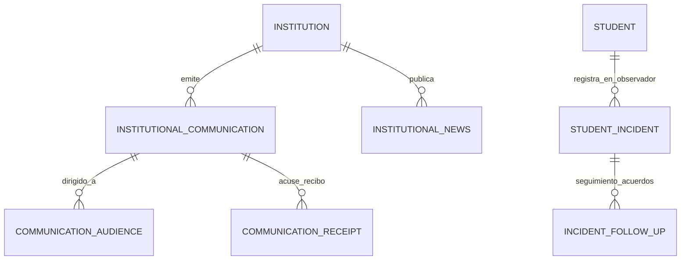

# PEVN — Documentación de Implementación: Fase 15 (Comunicaciones Institucionales, Periódico Escolar, Observador del Estudiante & Convivencia)

---

## 1. Resumen Ejecutivo & Alcance de la Fase 15

La **Fase 15** implementa los subsistemas misionales de relacionamiento institucional, divulgación pedagógica y seguimiento a la convivencia escolar de la **Plataforma Educativa Virtual Nacional (PEVN)**:

1. **Comunicaciones Institucionales y Circulares Oficiales**: Emisión de circulares rectorales, convocatorias de acudientes, alertas y directrices normativas con targeting por sede, grado, grupo o rol, acuse de recibo obligatorio y expiración determinística.
2. **Periódico Escolar y Novedades Institucionales**: Divulgación de noticias pedagógicas, logros, olimpiadas, eventos culturales y deportivos de la comunidad educativa con categorización y artículos destacados.
3. **Observador del Estudiante y Registro Formativo de Convivencia**: Gestión de acuerdos, medidas formativas pedagógicas y situaciones según la **Ley 1620 de 2013** y **Decreto 1965 de 2013** (Tipo I, Tipo II, Tipo III), con estricta autorización de autoría por asignación docente y visibilidad formativa controlada para estudiantes y acudientes.

---

## 2. Decisiones Arquitectónicas Canónicas Aprobadas

### DECISION-15-01: Visibilidad del Estudiante en el Observador de Convivencia
- **Regla**: Los estudiantes autenticados pueden consultar sus propias anotaciones formativas del observador **únicamente cuando**:
  - El registro pertenece al `institution_id` y `tenant_id` del estudiante autenticado.
  - El registro tiene explícitamente `is_visible_to_student = true`.
  - El registro no se encuentra bajo reserva sumaria o investigación confidencial.
- **Seguridad**: La identidad del estudiante se extrae exclusivamente del JWT (`current_user.id` -> `Student`), bloqueando cualquier parámetro manipulable por el cliente.

### DECISION-15-02: Expiración Automática y Determinística de Comunicados
- **Regla**: Cuando `expires_at` es alcanzado en tiempo UTC (`datetime.now(timezone.utc)`):
  - El comunicado deja de aparecer automáticamente en los feeds activos/vigentes de estudiantes y acudientes.
  - Permanece accesible en el histórico/archivo administrativo sin borrado físico de registros (`no physical deletion`).
  - Los contadores de no leídos (`unread_count`) excluyen determinísticamente los comunicados expirados.

### DECISION-15-03: Esquemas Separados para Comunicados vs. Noticias
- **Regla**: Se mantienen entidades de dominio separadas:
  - `InstitutionalCommunication` (`institutional_communications`): Carácter formal, normativo, directivo y con acuse de recibo.
  - `InstitutionalNews` (`institutional_news`): Carácter divulgativo, cultural, informativo general y periodístico escolar.
  - No se mezclan en tablas polimórficas genéricas, preservando la integridad de datos y auditoría.

### DECISION-15-04: Límites Estrictos de Autorización para el Registro de Incidentes
- **Regla**: La creación y actualización de incidentes de convivencia está estrictamente restringida:
  - **Docentes**: Pueden registrar incidentes **únicamente** sobre estudiantes pertenecientes a grupos que tienen asignados académicamente (`AcademicAssignment` o dirección de grupo) en el año lectivo activo.
  - **Coordinadores y Rectores**: Cobertura institucional dentro de su respectivo `institution_id`.
  - **Aislamiento Multi-Tenant**: Ningún rol puede registrar ni consultar incidentes fuera de su institución o tenant.

---

## 3. Modelo de Datos & Base de Datos Relacional

### 3.1 Tablas Implementadas

1. `institutional_communications`:
   - `id`, `institution_id`, `author_user_id`, `title`, `content`, `category`, `priority`, `status`, `requires_acknowledgment`, `is_pinned`, `published_at`, `expires_at`, `created_at`, `updated_at`.
2. `communication_audiences`:
   - `id`, `communication_id`, `target_role`, `campus_id`, `grade_id`, `group_id`.
3. `communication_receipts`:
   - `id`, `communication_id`, `user_id`, `read_at`, `acknowledged_at`, `ip_address`, `user_agent`.
4. `institutional_news`:
   - `id`, `institution_id`, `author_user_id`, `title`, `summary`, `content`, `category`, `cover_image_url`, `is_published`, `is_featured`, `published_at`, `created_at`, `updated_at`.
5. `student_incidents`:
   - `id`, `institution_id`, `student_id`, `reported_by_user_id`, `situation_type` (`TIPO_I`, `TIPO_II`, `TIPO_III`), `incident_date`, `location`, `description`, `student_version`, `pedagogical_measures`, `commitments`, `status` (`ABIERTO`, `EN_SEGUIMIENTO`, `CERRADO`), `is_visible_to_guardian`, `is_visible_to_student`, `closed_at`, `closed_by_user_id`.
6. `incident_follow_ups`:
   - `id`, `incident_id`, `author_user_id`, `follow_up_date`, `notes`, `created_at`.

---

## 4. Matriz de Endpoints y Seguridad RBAC

| Método | Endpoint | Roles Permitidos | Propósito |
| :--- | :--- | :--- | :--- |
| `GET` | `/api/v1/communications` | Admin, Rector, Coordinador | Listar comunicaciones institucionales |
| `POST` | `/api/v1/communications` | Admin, Rector, Coordinador | Crear y publicar comunicación |
| `GET` | `/api/v1/student/communications` | Student | Feed de circulares activas del estudiante |
| `POST` | `/api/v1/student/communications/{id}/acknowledge` | Student | Confirmar lectura obligatoria (acuse de recibo) |
| `GET` | `/api/v1/guardian/communications` | Guardian | Feed de circulares activas de la familia |
| `POST` | `/api/v1/guardian/communications/{id}/acknowledge` | Guardian | Confirmar lectura obligatoria de acudiente |
| `GET` | `/api/v1/news` | Admin, Rector, Coordinador | Listar noticias de la institución |
| `POST` | `/api/v1/news` | Admin, Rector, Coordinador | Crear y publicar noticia escolar |
| `GET` | `/api/v1/student/news` | Student | Feed de periódico escolar para estudiantes |
| `GET` | `/api/v1/guardian/news` | Guardian | Feed de periódico escolar para acudientes |
| `POST` | `/api/v1/incidents` | Teacher (en scope), Coordinador, Rector | Crear anotación en observador |
| `GET` | `/api/v1/incidents/students/{student_id}` | Teacher (en scope), Directivos | Historial del observador del estudiante |
| `POST` | `/api/v1/incidents/{incident_id}/follow-ups` | Docente asignado, Directivo | Agregar compromiso/seguimiento |
| `POST` | `/api/v1/incidents/{incident_id}/close` | Coordinador, Rector, Docente | Cerrar y resolver situación |
| `GET` | `/api/v1/student/incidents` | Student | Mi observador personal formativo |
| `GET` | `/api/v1/guardian/students/{student_id}/incidents` | Guardian (hijo verificado) | Observador formativo de mi hijo |

---

## 5. Módulos Frontend Desarrollados

### 5.1 Portal de Acudientes (`GuardianPortal.tsx`)
- `GuardianCommunicationsView.tsx`: Filtros por categoría, insignia de prioridad, modal de lectura detallada y botón de acuse de recibo.
- `GuardianNewsView.tsx`: Banner de noticia destacada, píldoras temáticas (Deportes, Cultura, Ciencias, Convocatorias, Logros) y visor de artículos.
- `GuardianIncidentsView.tsx`: Observador de convivencia del hijo seleccionado con badges de clasificación de la Ley 1620 de 2013 (Tipo I, II, III), estado, medidas pedagógicas, compromisos y línea de tiempo de seguimientos.

### 5.2 Portal de Estudiantes (`StudentPortal.tsx`)
- `StudentCommunicationsView.tsx`: Tab activo en navbar (`📢 Comunicados`) con badges de no leídos y confirmación de recepción.
- `StudentNewsView.tsx`: Tab activo (`📰 Noticias`) para consultar vida estudiantil, eventos y logros.
- `StudentIncidentsView.tsx`: Tab activo (`⚖️ Convivencia`) con enfoque netamente formativo, acuerdos, medidas pedagógicas y estado de felicitación si no registra anotaciones.

---

## 6. Resultados de Certificación y Pruebas

### 6.1 Backend Test Suites
- `test_institutional_communications_api.py`: PASSED (Lifecycle, targeting, expiration, Anti-IDOR)
- `test_institutional_news_api.py`: PASSED (News publication, featured filters, visibility)
- `test_coexistence_incidents_api.py`: PASSED (Teacher scope boundary, Ley 1620 classifications, student/guardian visibility, follow-ups & closure)
- **Suite de Regresión Completa**: 100% PASSED

### 6.2 Frontend Test Suites & Build
- Vitest: **76 / 76 pruebas superadas en 12 archivos de test**.
- Build de Producción (`tsc -b && vite build`): **0 errores, bundle generado exitosamente**.
