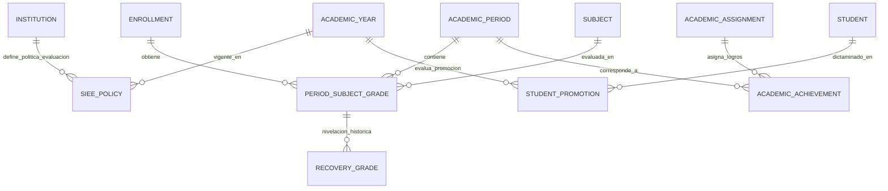
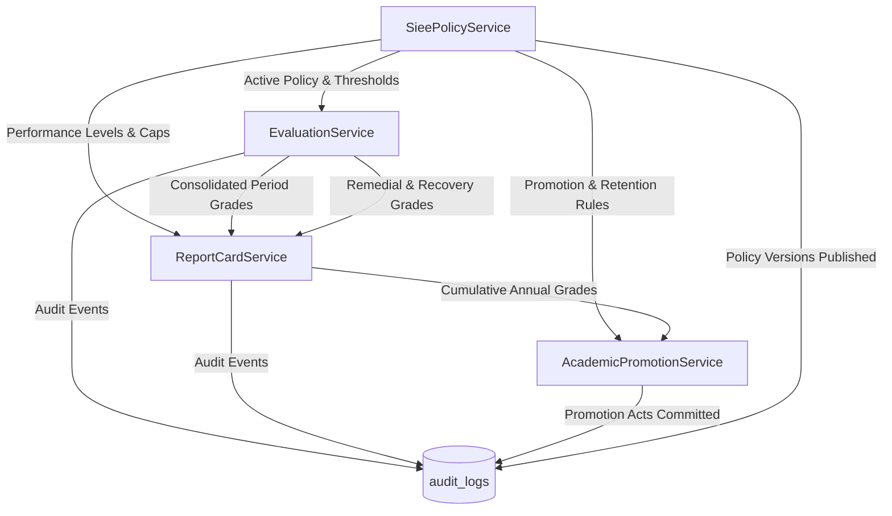

# PEVN — Fase 16: Descubrimiento Forense y Arquitectura Funcional
## Subsistema de Evaluación Académica Institucional (SIEE), Cierre de Períodos, Boletines Oficiales de Calificaciones y Promoción Escolar (Decreto 1290 de 2009)

---

## 1. Resumen Ejecutivo

La **Plataforma Educativa Virtual Nacional (PEVN)** ha alcanzado la madurez operativa en sus fases 1 a 15, consolidando la gestión territorial, la ingesta del Directorio Único de Establecimientos Educativos (DUE/DANE), el aula virtual en tiempo real (BigBlueButton), la gestión de plantas docentes, el libro de matrículas, los portales dedicados de Docentes, Estudiantes y Acudientes, y el subsistema de comunicaciones y convivencia escolar (Ley 1620 de 2013).

La **Fase 16** implementa el subsistema misional y regulatorio de **Evaluación Institucional (SIEE - Sistema Institucional de Evaluación de los Estudiantes)** bajo la normatividad colombiana (**Ley 115 de 1994**, **Decreto 1290 de 2009**, **Decreto 1075 de 2015**), estructurando:
1. **Políticas SIEE Institucionales Versionadas y Auditables**: Separación estricta entre conceptos regulatorios nacionales y reglas parametrizables por institución y año lectivo (`SieePolicy`).
2. **Consolidación Híbrida de Calificaciones de Período**: Cálculo automático a partir de actividades evaluadas (`calculated_score`), revisión docente, ajuste justificado opcional (`final_score`, `adjustment_reason`), y sellado inmutable al cierre de período.
3. **Mapeo a la Escala Nacional de Valoración**: Conversión matemática y cualitativa conforme a las bandas nacionales (*Desempeño Bajo, Desempeño Básico, Desempeño Alto, Desempeño Superior*).
4. **Nivelaciones y Planes de Mejoramiento (Recuperaciones)**: Preservación inmutable de la nota reprobada original, registro independiente de la prueba de recuperación y cálculo del score oficial ajustado aplicando el tope SIEE institucional parametrizado (por defecto $3.00$).
5. **Boletines Oficiales de Calificaciones (Report Cards)**: Emisión, visualización estructurada y exportación de boletines periódicos y finales para Estudiantes, Acudientes y Directivos con Anti-IDOR estricto.
6. **Motor de Promoción Escolar de Fin de Año y Actas de Grado**: Evaluación algorítmica de los criterios SIEE institucionales (umbral de reprobación, asignaturas fundamentales, porcentaje de inasistencia) y generación de actas oficiales de promoción.

---

## 2. Decisiones Canónicas Aprobadas

### DECISION-16-01: Tope de Calificación en Nivelaciones / Recuperaciones (Configurable vía SIEE)
- **Decisión Canónica**:
  - La calificación máxima obtenible en una recuperación o plan de mejoramiento no está cableada en duro en el código; se implementa como una política institucional configurable en `SieePolicy.recovery_grade_cap` con valor por defecto de `3.00` (*Desempeño Básico*).
  - La nota reprobada original (`PeriodSubjectGrade.final_score`) permanece inmutable y auditable.
  - La prueba de recuperación se almacena en `RecoveryGrade` con su nota obtenida real (`recovery_score`).
  - La nota oficial resultante se calcula determinísticamente:
    $$\text{official\_recovery\_grade} = \min(\text{recovery\_score}, \text{recovery\_grade\_cap})$$
  - El promedio acumulado y el boletín oficial reflejan la superación formativa sin destruir el historial evaluativo.

### DECISION-16-02: Criterios de Promoción Escolar y No Promoción (Configurables vía SIEE)
- **Decisión Canónica**:
  - Se descarta cualquier regla fija universal nacional no parametrizable.
  - La política institucional `SieePolicy` define por cada establecimiento educativo y año lectivo:
    - `max_failed_subjects_for_promotion`: Máximo de asignaturas reprobadas permitidas (ej. 2 para requerir nivelación final, $\ge 3$ para reprobación automática).
    - `max_failed_core_subjects`: Máximo de asignaturas reprobadas en áreas fundamentales (Matemáticas, Lengua Castellana, etc.).
    - `min_attendance_percentage`: Porcentaje mínimo de asistencia requerido (ej. 75.00%).
    - `attendance_affects_promotion`: Booleano que define si la inasistencia injustificada es causal de reprobación.
    - `recovery_remediation_allowed`: Si se permiten comisiones de nivelación final previas al acta definitiva.
  - Cada política institucional cuenta con versión (`version`), estado de vigencia, trazabilidad de autoría y auditoría inmutable.

### DECISION-16-03: Consolidación Híbrida de Calificaciones de Período y Auditoría
- **Decisión Canónica**:
  1. El sistema calcula automáticamente el promedio de actividades evaluadas en el período (`calculated_score`).
  2. El docente titular asignado revisa la planilla en el Portal Docente.
  3. Se permite un ajuste manual justificado antes del cierre formal del período, almacenando la nota definitiva (`final_score`).
  4. Cuando `final_score != calculated_score`, el campo `adjustment_reason` es estrictamente obligatorio.
  5. Se preservan ambos valores (`calculated_score` y `final_score`), registrando actor, timestamp, valor anterior, valor nuevo y justificación.
  6. Al cerrarse oficialmente el período académico (`AcademicPeriod.is_closed = True`), las notas se sellan de manera inmutable.
  7. Cualquier reapertura o ajuste posterior exige un flujo directivo autorizado (`evaluations:unlock_period`) con registro en `AuditLog`.

---

## 3. Arquitectura del SIEE: Separación entre Regulación Nacional y Políticas Institucionales

```
┌─────────────────────────────────────────────────────────────────────────────┐
│                  REGULACIÓN NACIONAL (Decreto 1290 de 2009)                  │
│  - Escala Nacional: Desempeño Superior, Alto, Básico, Bajo                  │
│  - Rango Numérico Estándar: 1.00 a 5.00                                     │
│  - Obligatoriedad de Boletines Periódicos e Informes Finales                │
│  - Obligatoriedad de Planes de Mejoramiento / Nivelaciones                  │
└──────────────────────────────────────┬──────────────────────────────────────┘
                                       │ Mapeo & Parámetros
┌──────────────────────────────────────▼──────────────────────────────────────┐
│             POLÍTICA INSTITUCIONAL SIEE (SieePolicy por Institución)         │
│  - institution_id, academic_year_id, version, is_active                     │
│  - min_passing_score (default 3.00)                                         │
│  - max_score (default 5.00)                                                 │
│  - scale_ranges: Bandas numéricas exactas institucionalizadas               │
│  - recovery_grade_cap: Tope de recuperación (default 3.00)                  │
│  - max_failed_subjects_for_promotion, max_failed_core_subjects               │
│  - min_attendance_percentage, attendance_affects_promotion                  │
│  - rounding_decimals (1 o 2 decimales)                                      │
└─────────────────────────────────────────────────────────────────────────────┘
```

---

## 4. Modelo de Datos Relacional para la Fase 16



### 4.1 Entidades Nuevas

1. **`siee_policies` (Política Institucional SIEE)**:
   - `id` (UUID, PK)
   - `institution_id` (UUID, FK `institutions.id`, RESTRICT)
   - `academic_year_id` (UUID, FK `academic_years.id`, RESTRICT)
   - `version` (Integer, default 1)
   - `name` (String(150), default "Sistema Institucional de Evaluación")
   - `min_passing_score` (Numeric(4, 2), default 3.00)
   - `max_score` (Numeric(4, 2), default 5.00)
   - `low_threshold_max` (Numeric(4, 2), default 2.99)
   - `basic_threshold_max` (Numeric(4, 2), default 3.99)
   - `high_threshold_max` (Numeric(4, 2), default 4.59)
   - `recovery_grade_cap` (Numeric(4, 2), default 3.00)
   - `max_failed_subjects_for_promotion` (SmallInteger, default 2)
   - `max_failed_core_subjects` (SmallInteger, default 1)
   - `min_attendance_percentage` (Numeric(5, 2), default 75.00)
   - `attendance_affects_promotion` (Boolean, default True)
   - `rounding_decimals` (SmallInteger, default 1)
   - `is_active` (Boolean, default True)
   - `created_by_user_id` (UUID, FK `users.id`, RESTRICT)
   - `created_at`, `updated_at` (DateTime TZ)
   - *Restricción*: `UniqueConstraint("institution_id", "academic_year_id", "version")`.

2. **`period_subject_grades` (Calificaciones Definitivas de Período)**:
   - `id` (UUID, PK)
   - `institution_id` (UUID, FK `institutions.id`, RESTRICT)
   - `academic_period_id` (UUID, FK `academic_periods.id`, CASCADE)
   - `enrollment_id` (UUID, FK `enrollments.id`, RESTRICT)
   - `student_id` (UUID, FK `students.id`, RESTRICT)
   - `subject_id` (UUID, FK `subjects.id`, RESTRICT)
   - `academic_assignment_id` (UUID, FK `academic_assignments.id`, SET NULL)
   - `calculated_score` (Numeric(4, 2), NOT NULL)
   - `final_score` (Numeric(4, 2), NOT NULL)
   - `adjustment_reason` (Text, nullable)
   - `performance_level` (Enum: `BAJO`, `BASICO`, `ALTO`, `SUPERIOR`)
   - `total_absences` (Integer, default 0)
   - `unexcused_absences` (Integer, default 0)
   - `observations` (Text, nullable)
   - `is_locked` (Boolean, default False)
   - `graded_by_teacher_id` (UUID, FK `teachers.id`, SET NULL)
   - `calculated_at`, `updated_at` (DateTime TZ)
   - *Restricciones*: `UniqueConstraint("academic_period_id", "student_id", "subject_id")`, `Index("ix_period_grades_lookup", "institution_id", "academic_period_id", "subject_id")`.

3. **`academic_achievements` (Logros y Descriptores Pedagógicos)**:
   - `id` (UUID, PK)
   - `institution_id` (UUID, FK `institutions.id`, RESTRICT)
   - `academic_assignment_id` (UUID, FK `academic_assignments.id`, CASCADE)
   - `academic_period_id` (UUID, FK `academic_periods.id`, CASCADE)
   - `code` (String(30), nullable)
   - `description` (Text, NOT NULL)
   - `performance_level` (Enum: `BAJO`, `BASICO`, `ALTO`, `SUPERIOR`)
   - `created_at` (DateTime TZ)

4. **`recovery_grades` (Nivelaciones y Recuperaciones Formativas)**:
   - `id` (UUID, PK)
   - `period_subject_grade_id` (UUID, FK `period_subject_grades.id`, CASCADE)
   - `initial_score` (Numeric(4, 2), NOT NULL)
   - `recovery_score` (Numeric(4, 2), NOT NULL)
   - `applied_cap` (Numeric(4, 2), NOT NULL)
   - `final_adjusted_score` (Numeric(4, 2), NOT NULL)
   - `teacher_id` (UUID, FK `teachers.id`, RESTRICT)
   - `act_number` (String(50), nullable)
   - `recovery_date` (Date, NOT NULL)
   - `observations` (Text, nullable)
   - `created_at` (DateTime TZ)

5. **`student_promotions` (Dictámenes de Promoción y Actas de Grado)**:
   - `id` (UUID, PK)
   - `institution_id` (UUID, FK `institutions.id`, RESTRICT)
   - `academic_year_id` (UUID, FK `academic_years.id`, RESTRICT)
   - `student_id` (UUID, FK `students.id`, RESTRICT)
   - `group_id` (UUID, FK `groups.id`, RESTRICT)
   - `cumulative_average` (Numeric(4, 2), NOT NULL)
   - `failed_subjects_count` (SmallInteger, NOT NULL, default 0)
   - `attendance_percentage` (Numeric(5, 2), NOT NULL, default 100.00)
   - `promotion_status` (Enum: `PROMOVIDO`, `NO_PROMOVIDO`, `GRADUADO`, `PENDIENTE_NIVELACION`)
   - `acta_number` (String(50), nullable)
   - `decision_date` (Date, NOT NULL)
   - `observations` (Text, nullable)
   - `closed_by_user_id` (UUID, FK `users.id`, RESTRICT)
   - `created_at` (DateTime TZ)
   - *Restricción*: `UniqueConstraint("academic_year_id", "student_id")`.

---

## 5. Matriz de Endpoints y Seguridad RBAC

| Método | Endpoint | Permiso Requerido | Roles Autorizados | Propósito |
| :--- | :--- | :--- | :--- | :--- |
| `GET` | `/api/v1/siee/policies/active` | `siee:read` | Docente, Coordinador, Rector | Consultar política SIEE institucional vigente |
| `PUT` | `/api/v1/siee/policies` | `siee:manage` | Rector, Institution Admin | Actualizar / configurar política SIEE |
| `GET` | `/api/v1/evaluations/sheets` | `evaluations:read` | Docente (en scope), Coordinador, Rector | Planilla de notas consolidadas de período |
| `PUT` | `/api/v1/evaluations/sheets` | `evaluations:grade` | Docente (en scope), Directivos | Guardar definitivas y justificaciones |
| `POST` | `/api/v1/evaluations/recoveries` | `evaluations:grade` | Docente (en scope), Directivos | Registrar nivelación pedagógica con tope |
| `POST` | `/api/v1/evaluations/periods/{id}/close` | `evaluations:close_period` | Coordinador, Rector | Cerrar y sellar período académico |
| `POST` | `/api/v1/evaluations/periods/{id}/unlock` | `evaluations:unlock_period` | Rector | Reapertura autorizada de período cerrado |
| `GET` | `/api/v1/report-cards/groups/{group_id}/period/{period_id}` | `report_cards:generate` | Coordinador, Rector, Director de Grupo | Consolidado general del grupo |
| `GET` | `/api/v1/student/report-cards` | `student` role | Estudiante autenticado | Mis boletines oficiales de calificaciones |
| `GET` | `/api/v1/guardian/students/{student_id}/report-cards` | `guardian` role | Acudiente verificado | Boletines oficiales de mi hijo |
| `GET` | `/api/v1/promotions/groups/{group_id}/preview` | `promotions:read` | Coordinador, Rector | Previsualizar dictámenes de promoción |
| `POST` | `/api/v1/promotions/groups/{group_id}/commit` | `promotions:execute` | Rector, Coordinador | Asentar acta de promoción oficial de fin de año |

---

## 6. Análisis de Base de Datos y Aislamiento Multi-Tenant

> [!IMPORTANT]
> **"PEVN Phase 16 is institution-configurable and nationally multi-tenant by architecture. Institutional SIEE policies are data, not code."**

### 6.1 Invariantes de Base de Datos (PostgreSQL)
- **Escalas Numéricas**: Score boundaries are enforced inclusively from 0.00 through 5.00 (`0.00 <= score <= 5.00`).
- **Unicidad de Política Activa**: Índice único parcial `uq_siee_policies_one_active_per_year` en `siee_policies (institution_id, academic_year_id) WHERE is_active = TRUE`, garantizando a nivel de base de datos que exista exactamente cero o una política activa por institución y año lectivo.
- **Históricos de Políticas**: Unicidad compuesta `uq_siee_policies_inst_year_version` en `(institution_id, academic_year_id, version)`.

### 6.2 Asignación de Alcance y Riesgos Multi-Tenant
No unresolved Phase 16A database-design blockers. Cross-tenant relationship validation is fully enforced in the Phase 16B domain/service layer:
- Validación de correspondencia institucional entre `Student`, `User` y `Enrollment`.
- Validación de pertenencia institucional de `AcademicPeriod` y `AcademicAssignment`.
- Validación de coherencia de `Group` e `Institution` al emitir actas de promoción.

## 7. Arquitectura de Servicios de Dominio (Fase 16B)



### 7.1 Invariantes de Negocio Implementados
1. **DECISION-16-01**: Topes de nivelación dinámicos por política institucional SIEE (`min(recovery_score, policy.recovery_grade_cap)`). Inmutabilidad del registro de reprobación original.
2. **DECISION-16-02**: Criterios de promoción y retención evaluados dinámicamente según la política SIEE activa (inasistencia, asignaturas fundamentales reprobadas, límite de reprobación general).
3. **DECISION-16-03**: Modelo híbrido de calificación. Cálculo determinístico desde actividades con justificación mandatoria auditada (`adjustment_reason`) ante cualquier divergencia de la nota definitiva.
4. **Cierre de Período y Bloqueo**: Sellado inmutable de notas con `AcademicPeriod.is_closed = True` y `PeriodSubjectGrade.is_locked = True`. Reapertura condicionada a justificación administrativa auditada.
5. **Auditoría Estricta**: Registro persistente en `audit_logs` con `actor_id`, `actor_ip`, `target_type`, `target_id` y metadatos saneados.
