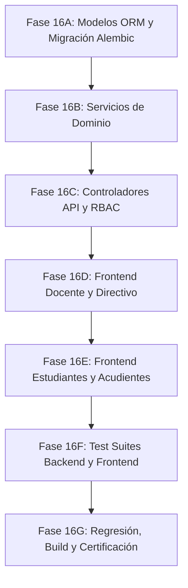

# PEVN — Fase 16: Plan Detallado de Implementación
## Subsistema de Evaluación Académica Institucional (SIEE), Cierre de Períodos, Boletines Oficiales de Calificaciones y Promoción Escolar

---

## 1. Objetivo y Alcance

El objetivo de la **Fase 16** es implementar de extremo a extremo el **Sistema Institucional de Evaluación de los Estudiantes (SIEE)** para la **Plataforma Educativa Virtual Nacional (PEVN)** bajo la normatividad del Decreto 1290 de 2009 y las directrices canónicas ratificadas:

1. **Arquitectura de Políticas SIEE Institucionales (`SieePolicy`)**:
   - Parametrización configurable por institución y año lectivo (tope de recuperaciones, umbral de reprobación, escala numérica y cualitativa, ponderación de asistencia).
   - Versionamiento y auditoría inmutable de la política SIEE.
2. **Consolidación Híbrida de Calificaciones de Período (`PeriodSubjectGrade`)**:
   - Cálculo automático sugerido (`calculated_score`), digitación/ajuste docente con justificación obligatoria (`final_score`, `adjustment_reason`), descriptores de logros pedagógicos (`AcademicAchievement`).
   - Cierre formal del período académico (`AcademicPeriod.is_closed = True`) y flujo de reapertura auditada (`evaluations:unlock_period`).
3. **Planes de Mejoramiento y Nivelaciones (`RecoveryGrade`)**:
   - Preservación de la nota reprobada original, registro de la prueba y cálculo del score ajustado según `SieePolicy.recovery_grade_cap` (por defecto `3.00`).
4. **Boletines Oficiales de Calificaciones (Report Cards)**:
   - Endpoints optimizados y vistas de impresión/consulta para Estudiantes, Acudientes y Directivos con Anti-IDOR estricto.
5. **Motor de Promoción de Fin de Año y Actas de Grado (`StudentPromotion`)**:
   - Evaluación algorítmica de los criterios SIEE (asignaturas reprobadas, fundamentales, asistencia) y asentamiento formal del acta de promoción.

---

## 2. Etapas de Implementación

### Fase 16A — Base de Datos, Modelos ORM y Migración Alembic
- Creación de `backend/app/models/evaluation.py`:
  - `PerformanceLevelEnum` (`BAJO`, `BASICO`, `ALTO`, `SUPERIOR`).
  - `PromotionStatusEnum` (`PROMOVIDO`, `NO_PROMOVIDO`, `GRADUADO`, `PENDIENTE_NIVELACION`).
  - `SieePolicy` (`siee_policies`): con índice único parcial `uq_siee_policies_one_active_per_year` (`institution_id, academic_year_id` WHERE `is_active = TRUE`).
  - `PeriodSubjectGrade` (`period_subject_grades`).
  - `AcademicAchievement` (`academic_achievements`).
  - `RecoveryGrade` (`recovery_grades`).
  - `StudentPromotion` (`student_promotions`).
- Exportación de modelos en `backend/app/models/__init__.py`.
- Generación y ejecución de la migración Alembic `019_siee_evaluations_and_promotions.py`.
- Score boundaries are enforced inclusively from 0.00 through 5.00 (`0.00 <= score <= 5.00`).
- No unresolved Phase 16A database-design blockers. Cross-tenant relationship validation is intentionally deferred to the Phase 16B domain/service layer.

### Fase 16B — Servicios de Dominio y Lógica de Negocio [COMPLETADO]
- `backend/app/services/siee_policy_service.py` [IMPLEMENTADO Y PROBADO]:
  - `get_active_policy(institution_id, academic_year_id)`
  - `get_or_create_default_policy(institution_id, academic_year_id, user_id)`
  - `create_policy_version(institution_id, academic_year_id, data, user_id)`
  - `list_policy_history(institution_id, academic_year_id)`
  - `map_score_to_performance_level(score, policy)`
- `backend/app/services/evaluation_service.py` [IMPLEMENTADO Y PROBADO]:
  - `get_period_sheet(institution_id, period_id, group_id, subject_id, teacher_id, is_directive)`
  - `save_period_grades(institution_id, period_id, group_id, subject_id, teacher_id, items, achievements, user_id, is_directive)` (Enforces DECISION-16-03 mandatory `adjustment_reason` on final vs calculated divergence)
  - `record_recovery_grade(...)` (Enforces DECISION-16-01 dynamic `recovery_grade_cap` & immutable initial score)
  - `close_period(institution_id, period_id, user_id)` & `unlock_period(institution_id, period_id, user_id, reason)`
- `backend/app/services/report_card_service.py` [IMPLEMENTADO Y PROBADO]:
  - `get_student_report_card(institution_id, student_id, period_id, actor_user_id)` (Con ranking de grupo y logros)
  - `get_student_final_report_card(institution_id, student_id, academic_year_id, actor_user_id)` (Con consolidado anual ponderado)
  - `get_group_consolidation_matrix(institution_id, group_id, period_id)` (Sábana de notas para comisiones)
- `backend/app/services/academic_promotion_service.py` [IMPLEMENTADO Y PROBADO]:
  - `calculate_promotion_preview(institution_id, group_id, academic_year_id)` (Enforces DECISION-16-02 SIEE criteria)
  - `commit_group_promotions(...)` (Asentamiento transaccional de actas y transición a `GRADUATED`)
- **Pruebas de Dominio:** `backend/tests/test_siee_and_evaluations_domain_services.py` (6/6 passing - 100%).
- **Pruebas de Regresión:** 33/33 passing across Portals (Phases 1-15).

### Fase 16C — Controladores API, Esquemas Pydantic y RBAC
- Creación de esquemas en `backend/app/schemas/evaluation.py` y `backend/app/schemas/report_card.py`.
- Adición de permisos en `rbac_bootstrap_service.py`: `siee:read`, `siee:manage`, `evaluations:read`, `evaluations:grade`, `evaluations:close_period`, `evaluations:unlock_period`, `report_cards:read`, `report_cards:generate`, `promotions:read`, `promotions:execute`.
- Creación de enrutadores en `backend/app/api/v1/endpoints/`:
  - `siee.py`
  - `evaluations.py`
  - `report_cards.py`
  - `promotions.py`
- Extensión de `student_portal.py` y `guardian_portal.py` con subrutas de boletines de calificaciones.

### Fase 16D — Frontend: Planillas Docentes y Gestión Directiva
- Creación de `frontend/src/types/evaluation.ts` y servicio `frontend/src/services/evaluation.ts`.
- Actualización de `frontend/src/pages/teacher/TeacherGradesView.tsx` con soporte completo para cálculo automático, ajuste con justificación, descriptores de logro y registro de nivelaciones.
- Actualización de `frontend/src/pages/academic/AcademicHub.tsx` con tabs para "Configuración SIEE", "Cierre de Períodos" y "Comisión de Promoción".

### Fase 16E — Frontend: Boletines en Portales de Estudiante y Acudiente
- Actualización de `frontend/src/pages/student/StudentGradesView.tsx` con visualizador interactivo y descargable de Boletines Oficiales (Períodos 1..4 y Final).
- Actualización de `frontend/src/pages/guardian/GuardianGradesView.tsx` con visualizador de boletines por hijo.

### Fase 16F — Pruebas Automatizadas (Backend & Frontend)
- Suites Pytest en `backend/tests/`:
  - `test_siee_policy_and_evaluation_api.py` (Cálculo híbrido, justificación, tope de recuperación, cierres y reaperturas).
  - `test_report_cards_and_anti_idor_api.py` (Boletines oficiales para estudiante/acudiente con Anti-IDOR).
  - `test_academic_promotions_api.py` (Motor de promoción institucional parametrizado y actas).
- Suites Vitest en `frontend/src/test/`:
  - `AcademicEvaluationsAndReportCards.test.tsx`.

### Fase 16G — Certificación, Regresión y Cierre
- Regresión backend (`pytest -v`).
- Pruebas frontend (`npm test -- --run`).
- Compilación de producción (`tsc -b && vite build`).
- Generación de `docs/phase16_siee_report_cards_walkthrough.md` y actualización de `walkthrough.md`.
