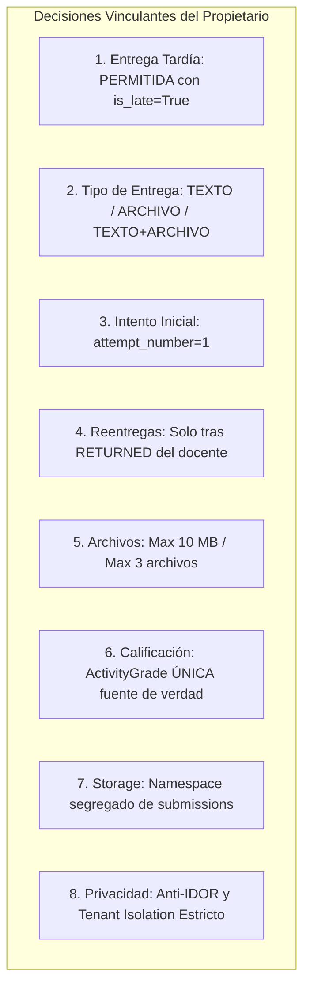
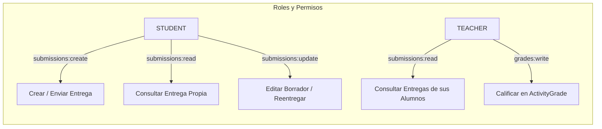
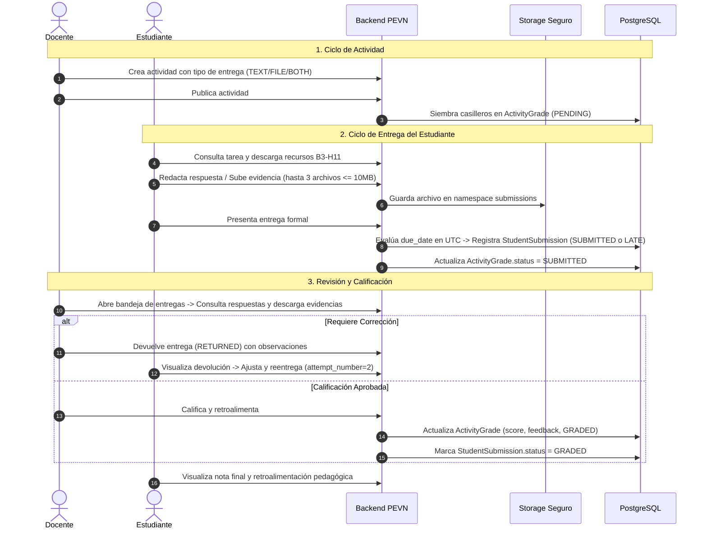

# PEVN — B3-H12.1
## Contrato Funcional de Entregas de Estudiantes (Submissions)
### Documento Pre-Implementación — Solo Documentación

**Fecha de Formalización:** 2026-09-12  
**Entorno:** PEVN Local Development & QA  
**Fase de Origen:** B3-H12 (Auditoría Read-Only — Entregas de Estudiantes)  
**Fase Contractual:** B3-H12.1 (Contrato Funcional de Submissions)  
**Fase de Destino:** B3-H13 (Implementación Controlada de Entregas — Sujeta a Autorización Explícita)  
**Modalidad:** ESTRICTAMENTE DOCUMENTAL / Read-Only (0 código de producto, 0 migraciones, 0 modificaciones en BD)  

---

## 1. Objetivo

Formalizar de manera vinculante, precisa e inequívoca el **Contrato Funcional** que regirá la futura implementación técnica de las **Entregas de Estudiantes (Student Submissions)** en la fase **B3-H13**.

Este documento establece:
1. El comportamiento esperado del sistema ante las acciones de estudiantes y docentes.
2. Las acciones explícitamente permitidas y prohibidas en el ciclo de entrega.
3. Las reglas de negocio autoritativas resueltas oficialmente por el propietario de PEVN.
4. Los límites técnicos y fronteras de seguridad que el equipo de desarrollo/agente **NO debe reinterpretar ni flexibilizar**.
5. Las decisiones pendientes que requerirán validación específica antes de iniciar el código de B3-H13.

---

## 2. Alcance y Gobernanza

La presente fase **B3-H12.1** opera bajo estricto control de gobernanza y no autoriza modificaciones de producto:
- **NO** se implementa `StudentSubmission` ni `SubmissionAttachment`.
- **NO** se crean modelos, esquemas, servicios ni controladores.
- **NO** se crean ni aplican migraciones Alembic.
- **NO** se modifica el esquema físico ni datos en PostgreSQL.
- **NO** se modifica la matriz RBAC ni permisos en base de datos.
- **NO** se modifica el frontend de Student Portal ni Teacher Portal.
- **NO** se altera el subsistema B3-H11 (`ActivityResource` y `StorageService`).
- **NO** se modifica la entidad `ActivityGrade` ni el motor SIEE.
- **NO** se ejecutan comandos destructivos de git (`reset`, `restore`, `clean`, `stash`, `commit`, `push`).

### Verificación de Documentos de Gobernanza

En cumplimiento del procedimiento previo, se verificaron los 9 documentos de gobernanza del repositorio:

| Documento Requerido | Estado en Repositorio | Observación / Ruta |
|---|---|---|
| 1. `AGENTS.md` | **No existe standalone** | Se verificó la regla activa en [`.agents/rules/delivery_reports.md`](file:///c:/Users/juanc/OneDrive/Documentos/Desarrollo%20proyectos/Plataforma%20Educativa/Plataforma%20Educativa%20Virtual%20Nacional%20PEVN/.agents/rules/delivery_reports.md). |
| 2. `ARCHITECTURE.md` | **EXISTE** | Localizado en [`docs/ARCHITECTURE.md`](file:///c:/Users/juanc/OneDrive/Documentos/Desarrollo%20proyectos/Plataforma%20Educativa/Plataforma%20Educativa%20Virtual%20Nacional%20PEVN/docs/ARCHITECTURE.md). |
| 3. `SECURITY.md` | **EXISTE** | Localizado en [`docs/SECURITY.md`](file:///c:/Users/juanc/OneDrive/Documentos/Desarrollo%20proyectos/Plataforma%20Educativa/Plataforma%20Educativa%20Virtual%20Nacional%20PEVN/docs/SECURITY.md). |
| 4. `PRODUCT_REQUIREMENTS.md` | **No existe standalone** | Requisitos derivados de los informes de fase y contratos funcionales. |
| 5. `DATABASE.md` | **EXISTE** | Localizado en [`docs/DATABASE.md`](file:///c:/Users/juanc/OneDrive/Documentos/Desarrollo%20proyectos/Plataforma%20Educativa/Plataforma%20Educativa%20Virtual%20Nacional%20PEVN/docs/DATABASE.md). |
| 6. `API_CONTRACT.md` | **No existe standalone** | Localizado equivalente en [`docs/PHASE_3_API_CONTRACTS.md`](file:///c:/Users/juanc/OneDrive/Documentos/Desarrollo%20proyectos/Plataforma%20Educativa/Plataforma%20Educativa%20Virtual%20Nacional%20PEVN/docs/PHASE_3_API_CONTRACTS.md). |
| 7. `DEVELOPMENT_WORKFLOW.md` | **No existe standalone** | Flujo regido por las reglas de fases y gates institucionales. |
| 8. `CERTIFICATION_STATUS.md` | **No existe standalone** | Localizado equivalente en [`docs/reports/PROJECT_MASTER_STATUS.md`](file:///c:/Users/juanc/OneDrive/Documentos/Desarrollo%20proyectos/Plataforma%20Educativa/Plataforma%20Educativa%20Virtual%20Nacional%20PEVN/docs/reports/PROJECT_MASTER_STATUS.md). |
| 9. `B3-H12_SUBMISSIONS_PRE_IMPLEMENTATION_AUDIT.md` | **EXISTE** | Localizado en [`docs/reports/B3-H12_SUBMISSIONS_PRE_IMPLEMENTATION_AUDIT.md`](file:///c:/Users/juanc/OneDrive/Documentos/Desarrollo%20proyectos/Plataforma%20Educativa/Plataforma%20Educativa%20Virtual%20Nacional%20PEVN/docs/reports/B3-H12_SUBMISSIONS_PRE_IMPLEMENTATION_AUDIT.md). |

---

## 3. Decisiones Oficiales del Propietario

Las siguientes directrices han sido aprobadas oficialmente por el propietario de PEVN y constituyen mandatos de obligatorio cumplimiento para la fase B3-H13:



---

## 4. Política de Entregas Tardías

1. **Permisión Oficial:** Se **PERMITE** la entrega tardía de actividades académicas.
2. **Autoridad del Servidor:** La determinación de si una entrega es tardía corresponde **exclusivamente al backend**:
   - Se evaluará en UTC: `now_utc = datetime.now(timezone.utc)`.
   - Si `activity.due_date` está definida y `now_utc > activity.due_date`, la entrega es tardía.
   - El backend asignará autoritativamente `is_late = True`.
   - Si `now_utc <= activity.due_date` o `due_date is None`, `is_late = False`.
3. **Inviolabilidad por el Cliente:** El frontend **NO** tiene autoridad para definir `is_late` ni puede enviar dicho valor en el payload de creación/actualización.
4. **Registro Temporal:** La fecha y hora exacta de recepción en el servidor se registrará de manera inmutable en `submitted_at`.
5. **Experiencia de Usuario (UI):**
   - El sistema no bloqueará el botón de envío tras expirar la fecha límite (salvo que la actividad esté en estado `CLOSED`).
   - Una vez presentada, la interfaz mostrará claramente al estudiante y al docente la insignia: **`ENTREGA TARDÍA`**.

---

## 5. Tipos de Entrega (Configuración de Actividad)

La plataforma admitirá tres modalidades de entrega por actividad:

| Tipo de Entrega | Respuesta Textual | Archivo Adjunto | Regla de Validación en Servidor |
|---|---|---|---|
| **`TEXT`** (Solo Texto) | **Obligatorio** | Bloqueado / No requerido | Exige `student_response.strip() != ""` y 0 archivos. |
| **`FILE`** (Solo Archivo) | Opcional | **Obligatorio** | Exige al menos 1 archivo adjunto (máx. 3). |
| **`TEXT_AND_FILE`** (Texto y Archivo) | **Obligatorio** | **Obligatorio** | Exige `student_response` no vacío Y al menos 1 archivo. |

### Reglas de Negocio
- El estudiante no debe ser forzado a cargar archivos cuando la tarea exige solo texto.
- El estudiante no puede omitir el archivo cuando la tarea exige evidencia documental.
- El estudiante no puede omitir la respuesta textual cuando es requerida.
- **Nota de Implementación B3-H13:** La definición del campo en `AcademicActivity` (e.g., columna `delivery_type` o `submission_type`) deberá diseñarse en B3-H13 manteniendo total compatibilidad con las actividades existentes (default `TEXT_AND_FILE` o `FILE`).

---

## 6. Política de Reentregas y Modificaciones

1. **Prohibición de Edición Libre:** El estudiante **NO** puede editar ni reemplazar a voluntad una entrega que ya fue formalmente remitida (`SUBMITTED` o `LATE`).
2. **Condición de Reentrega:** Una reentrega únicamente procede cuando el docente revisa la tarea y la marca formalmente como devuelta (**`RETURNED`**), registrando observaciones sobre lo que debe corregirse.
3. **Ciclo de Estados Autorizado:**
   ```text
   DRAFT (Borrador alumno)
       ↓
   SUBMITTED / LATE (Entrega formal)
       ↓
   RETURNED (Docente solicita corrección)
       ↓
   SUBMITTED / LATE (Reentrega del estudiante con attempt_number incrementado)
       ↓
   GRADED (Calificación final en ActivityGrade)
   ```
4. **Intento Inicial:** Toda primera entrega formal se registra con `attempt_number = 1`. Al reentregar tras una devolución, se incrementa `attempt_number = attempt_number + 1`.
5. **Prohibiciones Absolutas:**
   - Prohibido sobrescribir silenciosamente una entrega enviada.
   - Prohibido eliminar el historial de entregas.
   - Prohibido modificar el contenido de una entrega sin generar el correspondiente evento de auditoría.
6. **Alerta de Diseño B3-H13:** Antes de codificar el modelo definitivo, B3-H13 deberá asegurar que la estructura de base de datos soporte la trazabilidad de reentregas sin generar conflictos de unicidad. Si el modelo 1:1 propuesto originalmente colisiona con el historial de intentos previos, **DETENERSE** y requerir decisión técnica del propietario antes de proceder.

---

## 7. Límites de Archivos

Para salvaguardar la estabilidad, almacenamiento y seguridad del servidor:
1. **Tamaño Máximo por Archivo:** **10 MB** (10,485,760 bytes).
2. **Cantidad Máxima de Archivos por Entrega:** **3 archivos**.
3. **Validación Triple Obligatoria:**
   - Validación de extensión contra lista blanca permitida.
   - Validación de cabecera MIME.
   - Validación binaria estricta de Magic Bytes en servidor.
4. **Bloqueo de Formatos Peligrosos:** Bloqueo innegociable de ejecutables, scripts o documentos activos (`.exe`, `.sh`, `.bat`, `.cmd`, `.js`, `.py`, `.vbs`, `.ps1`, `.html`, `.msi`, `.dll`, etc.).
5. **Reutilización de Storage B3-H11:** Se debe emplear la infraestructura existente (`StorageService` y `LocalStorageDriver`). Prohibido alterar el núcleo certificado de B3-H11 salvo dependencia estrictamente justificada y reportada.

---

## 8. Seguridad y Privacidad

1. **Carácter Confidencial:** Las entregas y evidencias de los estudiantes constituyen información académica privada protegida por la Ley 1581 de 2012.
2. **Reglas Anti-IDOR Innegociables:**
   - **Estudiante:** Solo puede consultar, enviar y descargar sus propias entregas asociadas a su matrícula activa. Jamás puede consultar entregas ni descargar archivos de otros estudiantes.
   - **Docente:** Solo puede consultar entregas y descargar archivos de actividades que le pertenecen institucionalmente según su carga académica activa.
   - **Instituciones:** Una institución no puede acceder a las entregas de otra institución bajo ninguna circunstancia.
   - **Principio Fundamental:** El conocimiento o posesión de un UUID **NUNCA** otorga derecho de acceso. Toda consulta debe resolver la cadena de pertenencia relacional en base de datos.
3. **Descarga Segura:** Toda descarga de evidencias debe realizarse mediante endpoint autenticado y streaming (`FileResponse`). Ningún archivo debe exponerse en directorios públicos ni URLs estáticas directas.

---

## 9. Almacenamiento y Segregación de Namespaces

1. **Separación Física Obligatoria:** Queda terminantemente **PROHIBIDO** reutilizar el path de recursos pedagógicos docentes para almacenar archivos de entregas:
   - *Ruta Docente B3-H11 (Intacta):*  
     `{institution_id}/activities/{activity_id}/resources/`
2. **Namespace Exclusivo para Entregas (B3-H13):**
   ```text
   {institution_id}/submissions/{activity_id}/{student_id}/{submission_id}/{attachment_id}{ext}
   ```
3. **Ofuscación de Nombres:** El nombre físico en disco debe ser un UUID generado por el servidor. El nombre original del archivo (`original_filename`) se preserva únicamente como metadato sanitizado en base de datos para la visualización y descarga.
4. **Path Traversal:** Todo path relativo debe validarse mediante `LocalStorageDriver._resolve_safe_path` asegurando que sea estrictamente descendiente del directorio raíz autorizado.

---

## 10. RBAC (Control de Acceso Basado en Roles)

B3-H13 formalizará los permisos granulares para el módulo de entregas:



### Reglas RBAC
- Los permisos de calificar y retroalimentar continúan gobernados por `grades:write` sobre `ActivityGrade`.
- No se otorgarán permisos de entrega a roles administrativos (Rector, Coordinador) salvo consulta en solo lectura si la auditoría institucional lo requiere formalmente en el futuro.
- Toda verificación de permisos debe conjugar:
  $$\text{Acceso} = \text{RBAC} \land \text{Tenant Isolation} \land \text{Relational Ownership} \land \text{Anti-IDOR}$$

---

## 11. Integración con Calificaciones y SIEE

### Regla Absoluta de Integración
> **`ActivityGrade` ES Y SEGUIRÁ SIENDO LA ÚNICA FUENTE DE VERDAD DE LAS CALIFICACIONES EN PEVN.**

1. **Diseño Prohibido (Anti-Patrón):**
   - Crear columnas `StudentSubmission.score` o `StudentSubmission.feedback`.
   - Calcular notas finales o consolidados SIEE a partir de la tabla de submissions.
2. **Diseño Obligatorio:**
   ```text
   [Estudiante entrega] ──> StudentSubmission (Respuesta / Archivos / Evidencias)
                                   ↓
   [Docente califica]   ──> ActivityGrade (score / feedback / graded_at / graded_by)
                                   ↓
   [Consolidado SIEE]   ──> ReportCards / Evaluaciones de Período
   ```
3. **Sincronización:** Cuando el docente califica una entrega en la vista de submissions, la acción actualiza atómicamente el registro existente en `ActivityGrade` y actualiza el estado de la entrega a `GRADED`. Si durante B3-H13 surgiera cualquier duda de acoplamiento con el SIEE, **DETENERSE INMEDIATAMENTE**.

---

## 12. Estados Funcionales

### Máquina de Estados de `StudentSubmission`

| Estado | Significado Funcional | Editable por Estudiante | Visible para Docente |
|---|---|:---:|:---:|
| **`DRAFT`** | El estudiante prepara su respuesta y carga adjuntos preliminares. | Sí | No |
| **`SUBMITTED`** | Entrega remitida formalmente dentro del plazo (`submitted_at <= due_date`). | No | Sí |
| **`LATE`** | Entrega remitida formalmente fuera del plazo (`submitted_at > due_date`). | No | Sí |
| **`RETURNED`** | El docente devolvió la entrega solicitando ajustes. | Sí (nueva versión) | Sí (historial) |
| **`GRADED`** | La entrega fue evaluada y cuenta con nota oficial en `ActivityGrade`. | No | Sí |

### Sincronización con `ActivityGrade.status`
- Al sembrar la actividad: `ActivityGrade.status = PENDING`.
- Al presentar entrega el estudiante: `ActivityGrade.status = SUBMITTED`.
- Al asentar calificación el docente: `ActivityGrade.status = GRADED`.

---

## 13. Auditoría de Eventos

Se prepararán los siguientes tipos en `AuditEventType` para asegurar la trazabilidad institucional:
- `SUBMISSION_CREATED`: Registro de envío formal de la entrega (incluye `is_late`, `attempt_number`).
- `SUBMISSION_RETURNED`: Registro de devolución por el docente (con observaciones de devolución).
- `SUBMISSION_RESUBMITTED`: Registro de reentrega por el estudiante.
- `SUBMISSION_DOWNLOADED`: Descarga de archivo de evidencia por estudiante o docente.

### Principio de Privacidad en Auditoría
Queda terminantemente prohibido registrar en metadatos de auditoría:
- Respuestas completas de estudiantes o texto masivo.
- Contraseñas, tokens o hashes.
- Contenido binario o Base64 de archivos adjuntos.

---

## 14. Corrección de Métricas

Se establece como requisito correctivo para B3-H13:
- **Estado Actual:** `AcademicActivityResponse.total_submissions` actualmente mapea a `len(activity.grades)` (casilleros sembrados).
- **Comportamiento Requerido en B3-H13:** `total_submissions` debe calcular estrictamente la cantidad de entregas reales presentadas (filas en `StudentSubmission` con estado `SUBMITTED`, `LATE`, `RETURNED` o `GRADED`).
- Durante la presente fase B3-H12.1 este código permanece inalterado.

---

## 15. Flujos Funcionales Objetivo



---

## 16. Casos de Prueba Futuros (Matriz de Aceptación Humana B3-H13)

La fase B3-H13 deberá ser validada mediante los siguientes 16 escenarios funcionales obligatorios:

| ID | Escenario de Prueba | Acción / Entrada | Resultado Esperado |
|---|---|---|---|
| **TEST H1** | Entrega modo TEXTO | Actividad configurada `TEXT`. Estudiante escribe respuesta y envía. | Docente visualiza texto. Califica. Estudiante ve nota/feedback. |
| **TEST H2** | Entrega modo ARCHIVO | Actividad configurada `FILE`. Estudiante sube PDF y envía. | Docente descarga PDF idéntico. Se valida correspondencia de alumno. |
| **TEST H3** | Entrega TEXTO + ARCHIVO | Actividad `TEXT_AND_FILE`. Estudiante remite ambos elementos. | Docente visualiza texto y descarga adjunto satisfactoriamente. |
| **TEST H4** | Entrega dentro de plazo | Estudiante remite con `now <= due_date`. | Estado registrado: `SUBMITTED`, `is_late = False`. |
| **TEST H5** | Entrega tardía | Estudiante remite con `now > due_date`. | Estado: `LATE`, `is_late = True`. Entrega aceptada en plataforma. |
| **TEST H6** | Anti-IDOR consulta | Estudiante 1 intenta consultar submission de Estudiante 2. | **DENEGADO** (HTTP 403 o 404). |
| **TEST H7** | Anti-IDOR descarga | Estudiante 1 intenta descargar archivo de Estudiante 2 por UUID. | **DENEGADO** (HTTP 403 o 404). |
| **TEST H8** | Anti-IDOR docente ajeno | Docente de Grupo A intenta ver entregas de Grupo B no asignado. | **DENEGADO** (HTTP 403 o 404). |
| **TEST H9** | Aislamiento multi-tenant | Usuario de Institución X intenta acceder a submission de Inst Y. | **DENEGADO** (HTTP 403 o 404). |
| **TEST H10** | Integración con SIEE | Docente califica submission. | `ActivityGrade` se actualiza. SIEE consume `ActivityGrade`. |
| **TEST H11** | Devolución y reentrega | Docente marca `RETURNED`. Estudiante corrige y reenvía. | Se genera reentrega con `attempt_number = 2`. |
| **TEST H12** | Trazabilidad de reentrega | Se audita el historial de intentos de una tarea devuelta. | Historial y eventos de auditoría íntegros y consultables. |
| **TEST H13** | Seguridad Magic Bytes | Intento de subir script `.sh` o ejecutable renombrado a `.pdf`. | **DENEGADO** (Error 400 FILE_VALIDATION_ERROR). |
| **TEST H14** | Límite de tamaño | Intento de subir archivo de 11 MB (> 10 MB). | **DENEGADO** (Error 400 por exceso de tamaño). |
| **TEST H15** | Límite de cantidad | Intento de adjuntar un 4to archivo (> 3 archivos). | **DENEGADO** (Error 400 por exceso de archivos). |
| **TEST H16** | Anti-Path Traversal | Intento de enviar ruta con escapes `../../` en descarga. | **DENEGADO** (STORAGE_SECURITY_ERROR / Bloqueo). |

---

## 17. Reglas de No Regresión

B3-H13 tiene la prohibición categórica de degradar o alterar:
1. El subsistema de almacenamiento B3-H11 (`StorageService`, `LocalStorageDriver`).
2. La entidad `ActivityResource` y la capacidad docente de gestionar materiales pedagógicos.
3. Las vistas operativas existentes del docente (`TeacherActivitiesView`, `TeacherGradesView`, `TeacherAttendanceView`, `TeacherPlanningView`).
4. Las vistas operativas del estudiante (`StudentTasksView`, `StudentGradesView`).
5. La integridad del modelo `ActivityGrade` y la consolidación SIEE de calificaciones.
6. El esquema RBAC certificado y las reglas de aislamiento territorial y multi-tenant.

**Protocolo de Bloqueo:** Si durante el desarrollo de B3-H13 se detectara que una funcionalidad existente requiere modificación, el agente debe **DETENERSE INMEDIATAMENTE** y presentar al propietario:
- Componente afectado.
- Causa técnica de la dependencia.
- Impacto en funcionalidad certificada.
- Alternativas de mitigación.
- Solicitud explícita de decisión.

---

## 18. Decisiones Pendientes del Propietario

Las siguientes particularidades de detalle quedan registradas como decisiones pendientes para el inicio de la fase B3-H13:

1. **DECISIÓN PENDIENTE 1: Política de Persistencia de Archivos en Reentregas:**
   - *Pregunta:* Cuando una entrega devuelta (`RETURNED`) es corregida por el estudiante, ¿los archivos del intento previo deben ser archivados físicamente como históricos en disco, o se reemplazan conservando la bitácora en auditoría?
   - *Recomendación Técnica:* Para no desbordar el disco, permitir reemplazar archivos de la entrega manteniendo en base de datos la metadata y log de auditoría del intento anterior.
2. **DECISIÓN PENDIENTE 2: Plazo Máximo para Entregas Tardías:**
   - *Pregunta:* ¿La entrega tardía está permitida indefinidamente mientras la actividad esté abierta (`PUBLISHED`), o debe existir un período de gracia máximo (e.g. 5 días después de `due_date`)?
   - *Recomendación Técnica:* Permitir entrega tardía mientras la actividad permanezca en estado `PUBLISHED`; al pasar a `CLOSED`, bloquear toda entrega.
3. **DECISIÓN PENDIENTE 3: Notificación de Devolución:**
   - *Pregunta:* ¿La devolución de una entrega debe generar una notificación institucional automática en el módulo de comunicaciones?
   - *Recomendación Técnica:* Para el MVP inicial de B3-H13, reflejar el estado en el portal de tareas del estudiante; diferir notificaciones push/email a una fase posterior.

---

## 19. Gate B3-H12.1

```text
======================================================================
B3-H12.1 GATE = PASS
======================================================================
```

### Justificación del Veredicto
1. **Contrato Funcional Exhaustivo:** Se definieron y documentaron formalmente las 19 secciones exigidas por la gobernanza de PEVN.
2. **Fidelidad Absoluta a las Decisiones del Propietario:** Se incorporaron con exactitud las decisiones sobre entregas tardías, tipos de entrega, reentregas, límites de archivo, privacidad y preservación de `ActivityGrade`/SIEE.
3. **Cero Modificación de Producto:** No se alteró código fuente, no se crearon migraciones, no se modificó la base de datos PostgreSQL y no se alteró RBAC.
4. **No Regresión Garantizada:** El estado funcional certificado de B3-H11 y de los portales permanece intacto.
5. **Transición Controlada:** La fase B3-H13 queda plenamente acotada contractualmente y detenida formalmente a la espera de la autorización humana explícita del propietario de PEVN.
