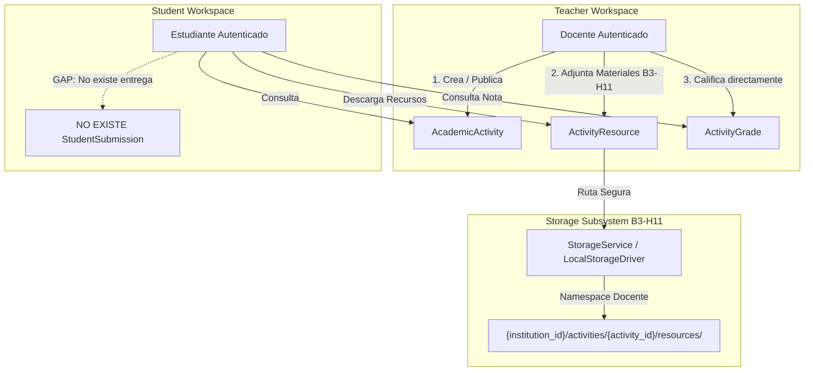
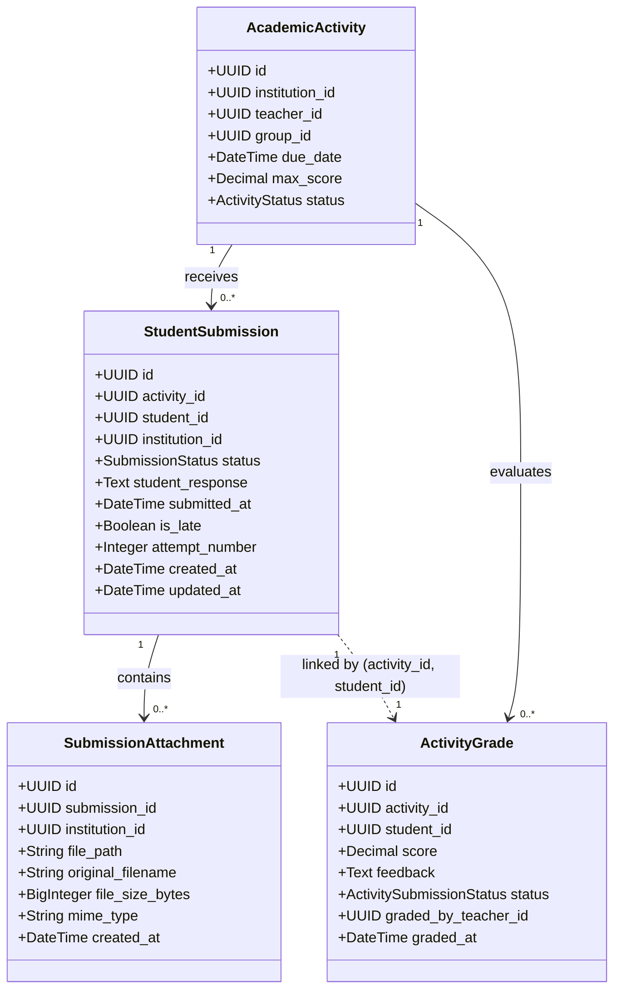

# PEVN — B3-H12
## Auditoría Técnica y Funcional Read-Only: Entregas de Estudiantes (Submissions)

**Fecha de Ejecución:** 2026-09-12  
**Entorno:** PEVN Local Development & QA  
**Fase de Origen:** B3-H11 (Recursos Pedagógicos & Storage Certificados)  
**Fase Auditada:** B3-H12 (Auditoría Read-Only — Entregas de Estudiantes)  
**Fase de Implementación Futura:** B3-H13 (Sujeta a Autorización Explícita)  
**Modalidad:** READ-ONLY / No invasiva (0 modificaciones de código, 0 migraciones, 0 escrituras en BD)  

---

## 1. Objetivo

Realizar una auditoría exhaustiva, rigurosa e imparcial del estado actual de la plataforma PEVN en relación con el ciclo de vida de las **Entregas de Estudiantes (Student Submissions)** para actividades académicas.

El propósito principal es:
1. Evidenciar formalmente qué componentes existen, cuáles son parciales y cuáles no existen en el backend, frontend, base de datos, sistema de archivos, RBAC y auditoría.
2. Certificar la estricta separación conceptual y técnica entre los recursos pedagógicos del docente (B3-H11) y las entregas/evidencias del estudiante.
3. Proponer un diseño arquitectónico, modelo de datos, endpoints y estrategia de almacenamiento para una futura implementación segura en la fase B3-H13.
4. Identificar las decisiones funcionales y de negocio que deben ser tomadas exclusivamente por el propietario de PEVN antes de iniciar el desarrollo.
5. Emitir el veredicto del **B3-H12 AUDIT GATE**.

---

## 2. Alcance

La presente auditoría se ejecutó bajo la regla de **ESTRICTO MODO READ-ONLY**:
- **NO** se implementó ninguna funcionalidad de entrega de tareas.
- **NO** se modificó código de producto en backend ni frontend.
- **NO** se crearon ni aplicaron migraciones Alembic.
- **NO** se modificó el esquema físico ni datos en PostgreSQL.
- **NO** se alteró la matriz de permisos RBAC ni roles del sistema.
- **NO** se alteraron actividades académicas, asistencias, incidencias ni calificaciones existentes.
- **NO** se modificaron componentes ni rutas de Student Portal ni Teacher Portal.
- **NO** se ejecutaron comandos destructivos de git (`reset`, `restore`, `clean`, `stash`, `commit`, `push`).

---

## 3. Estado Actual

Tras la implementación y certificación humana de la fase **B3-H11** (Recursos Pedagógicos de Actividades + Storage Seguro), el estado de los componentes relacionados con tareas y evaluaciones en PEVN es el siguiente:

1. **Ciclo de Actividad del Docente:**
   - El docente crea actividades en estado borrador (`DRAFT`).
   - El docente puede editar o eliminar actividades en borrador.
   - El docente adjunta materiales de apoyo mediante la entidad `ActivityResource` (B3-H11) de tipo enlace web (`URL`) o archivo físico (`FILE`).
   - El docente publica la actividad (`PUBLISHED`). En este momento, el backend siembra automáticamente registros en la tabla `activity_grades` con estado `PENDING` para cada estudiante matriculado activamente en el grupo destinatario.
   - El docente puede cerrar la actividad (`CLOSED`).

2. **Ciclo de Consulta del Estudiante:**
   - El estudiante consulta las actividades asignadas a su grupo en `StudentTasksView`.
   - Al abrir una actividad en `StudentTaskDetailModal`, visualiza: título, asignatura, docente, fecha de entrega, puntaje máximo, instrucciones pedagógicas y los recursos B3-H11 adjuntos (con capacidad de descarga segura mediante streaming autenticado).
   - Si la actividad fue calificada previamente por el docente en la planilla, el estudiante visualiza su nota y retroalimentación cualitativa.

3. **Hallazgo Central sobre Entregas:**
   - **NO EXISTE** ningún flujo que permita al estudiante redactar una respuesta, adjuntar evidencias (archivos o documentos) ni presionar un botón de "Entregar".
   - El modal de detalle del estudiante (`StudentTaskDetailModal.tsx`) concluye únicamente con un botón `Cerrar`.
   - El docente en su vista de calificaciones (`TeacherGradesView.tsx`) califica directamente a los estudiantes en una grilla tabular (`score` y `feedback`), sin poder consultar qué respondió el alumno ni descargar evidencias entregadas.

---

## 4. Arquitectura Actual



### Separación Conceptual Obligatoria

| Dimensión | Recursos Pedagógicos (B3-H11) | Entregas de Estudiantes (B3-H12/H13) |
|---|---|---|
| **Flujo** | Docente $\rightarrow$ Actividad $\rightarrow$ Estudiante | Estudiante $\rightarrow$ Actividad $\rightarrow$ Docente |
| **Entidad** | `ActivityResource` | `StudentSubmission` / `SubmissionAttachment` *(por crear)* |
| **Propósito** | Material de estudio, guías, talleres, bibliografía | Respuestas, evidencias, resolución de problemas |
| **Almacenamiento** | Namespace de recursos docentes | Namespace aislado y segregado de entregas |
| **Visibilidad** | Pública para todo el grupo matriculado | Privada (solo el estudiante autor y su docente) |

---

## 5. Backend Auditado

Se inspeccionaron los siguientes módulos y archivos del backend:

1. **Modelos de Dominio (`backend/app/models/academic_activity.py`):**
   - `AcademicActivity` (Líneas 103-250): Representa la tarea o evaluación.
   - `ActivityResource` (Líneas 255-350): Representa materiales de apoyo docente (URL/FILE).
   - `ActivityGrade` (Líneas 355-430): Representa el casillero de calificación individual del estudiante.
   - `ActivitySubmissionStatus` (Líneas 76-81): Enum con valores `PENDING`, `SUBMITTED`, `GRADED`.
   - `ActivityStatus` (Líneas 69-74): Enum con valores `DRAFT`, `PUBLISHED`, `CLOSED`.

2. **Esquemas Pydantic (`backend/app/schemas/student_portal.py` y `teacher_portal.py`):**
   - `StudentActivityItemResponse`: Incluye `submission_status: str`, `score`, `feedback`, `graded_at`, `resources`.
   - `TeacherDashboardSummaryResponse`: Incluye `total_pending_grades`.
   - `AcademicActivityResponse`: Incluye `total_submissions` (actualmente mapeado a `len(grades)`).
   - `ActivityGradeBatchUpdateRequest`: Permite al docente actualizar `score` y `feedback` en bloque.

3. **Servicios de Dominio:**
   - `StudentPortalService` (`backend/app/services/student_portal_service.py`):
     - `list_activities`: Calcula en tiempo de ejecución el `computed_status`: si `grade.status == GRADED` $\rightarrow$ `GRADED`; si `grade.status == SUBMITTED` $\rightarrow$ `SUBMITTED`; si `PENDING` y `due_date < now` $\rightarrow$ `OVERDUE`; de lo contrario $\rightarrow$ `PENDING`.
     - `get_activity_detail`: Aplica la misma derivación de estado y lista los recursos pedagógicos.
     - `list_activity_resources` y `get_resource_for_download`: Descarga autenticada de materiales de apoyo.
   - `TeacherPortalService` (`backend/app/services/teacher_portal_service.py`):
     - `publish_activity`: Siembra filas en `activity_grades` para los alumnos activos del grupo con `status=PENDING`.
     - `batch_grade_activity`: Recibe `score` y `feedback`. Si `score is not None`, asigna `grade.status = GRADED`; de lo contrario `PENDING`.

4. **Controladores y Endpoints API:**
   - `backend/app/api/v1/endpoints/student_portal.py`: Endpoints de actividades, recursos y calificaciones.
   - `backend/app/api/v1/endpoints/teacher_portal.py`: Endpoints de gestión de actividades, materiales y planilla.

---

## 6. Modelo de Datos: Existente vs. Faltante

### 6.1. Entidades Existentes en Base de Datos

1. **`academic_activities` (Existe):**
   - Columnas: `id`, `institution_id`, `teacher_id`, `academic_assignment_id`, `subject_id`, `group_id`, `academic_year_id`, `title`, `description`, `activity_type`, `status`, `publication_date`, `due_date`, `max_score`, `instructions`, `resource_url`, `created_at`, `updated_at`.

2. **`activity_resources` (Existe — B3-H11):**
   - Columnas: `id`, `activity_id`, `institution_id`, `resource_type`, `title`, `url`, `file_path`, `original_filename`, `file_size_bytes`, `mime_type`, `created_at`, `updated_at`.

3. **`activity_grades` (Existe):**
   - Columnas: `id`, `activity_id`, `student_id`, `score`, `feedback`, `status`, `graded_by_teacher_id`, `graded_at`, `created_at`, `updated_at`.
   - **Nota Crítica:** No cuenta con `institution_id` directo (se resuelve por `activity_id`). No tiene campos de texto de entrega, archivos adjuntos, fecha de entrega ni banderas de entrega tardía.

### 6.2. Componentes Faltantes (NO EXISTEN)

1. **Entidad de Entrega (`student_submissions` / `activity_submissions`):** **NO EXISTE**.
   - No hay tabla física en PostgreSQL.
   - No hay modelo SQLAlchemy.
   - No hay esquemas Pydantic para `SubmissionCreate`, `SubmissionUpdate`, `SubmissionResponse`.

2. **Entidad de Evidencias / Archivos del Estudiante (`submission_attachments`):** **NO EXISTE**.
   - No hay tabla para registrar archivos subidos por el estudiante.
   - No hay relación entre una entrega y archivos físicos en disco.

3. **Campos Específicos No Soportados:**
   - `submitted_at`: Timestamp real en que el estudiante remitió su respuesta.
   - `is_late`: Indicador booleano calculado autoritativamente por el servidor.
   - `student_comments` / `response_text`: Contenido textual o solución desarrollada por el estudiante.
   - `attempt_number` / `resubmission_count`: Contador de versiones o reentregas.

---

## 7. API Existente

### Endpoints del Portal Estudiante
- `GET /api/v1/student/activities`: Lista tareas del grupo del alumno con `submission_status` dinámico.
- `GET /api/v1/student/activities/{activity_id}`: Consulta detalle de la tarea.
- `GET /api/v1/student/activities/{activity_id}/resources`: Lista materiales docentes B3-H11.
- `GET /api/v1/student/activities/{activity_id}/resources/{resource_id}/download`: Descarga material docente.
- `GET /api/v1/student/grades`: Historial de notas publicadas.

### Endpoints del Portal Docente
- `GET /api/v1/teacher/activities`: Lista tareas creadas por el docente.
- `POST /api/v1/teacher/activities`: Crea actividad en borrador.
- `GET /api/v1/teacher/activities/{activity_id}`: Detalle de la tarea.
- `PATCH /api/v1/teacher/activities/{activity_id}`: Actualiza borrador.
- `POST /api/v1/teacher/activities/{activity_id}/publish`: Publica y siembra casilleros de calificación.
- `POST /api/v1/teacher/activities/{activity_id}/close`: Cierra la actividad.
- `DELETE /api/v1/teacher/activities/{activity_id}`: Elimina borrador.
- `GET /api/v1/teacher/activities/{activity_id}/resources`: Lista recursos pedagógicos.
- `POST /api/v1/teacher/activities/{activity_id}/resources/url`: Agrega enlace web.
- `POST /api/v1/teacher/activities/{activity_id}/resources/file`: Carga archivo pedagógico.
- `DELETE /api/v1/teacher/activities/{activity_id}/resources/{resource_id}`: Elimina recurso docente.
- `GET /api/v1/teacher/activities/{activity_id}/resources/{resource_id}/download`: Descarga material docente.
- `GET /api/v1/teacher/activities/{activity_id}/grades`: Obtiene la planilla de notas de la actividad.
- `PUT /api/v1/teacher/activities/{activity_id}/grades`: Guarda notas y retroalimentaciones en lote.

### Gaps en la API:
- **NO EXISTE** `POST /api/v1/student/activities/{activity_id}/submissions` (Crear o enviar entrega).
- **NO EXISTE** `GET /api/v1/student/activities/{activity_id}/submission` (Consultar entrega propia).
- **NO EXISTE** `POST /api/v1/student/activities/{activity_id}/submissions/files` (Subir archivo de evidencia).
- **NO EXISTE** `GET /api/v1/teacher/activities/{activity_id}/submissions` (Consultar entregas de los estudiantes).
- **NO EXISTE** `GET /api/v1/teacher/activities/{activity_id}/submissions/{student_id}` (Ver detalle de entrega).
- **NO EXISTE** `GET /api/v1/teacher/activities/{activity_id}/submissions/{student_id}/attachments/{id}/download` (Descargar evidencia del estudiante).

---

## 8. Frontend — Portal Estudiante

### Componentes Auditados
- `frontend/src/pages/student/StudentTasksView.tsx`
- `frontend/src/components/student/StudentTaskDetailModal.tsx`
- `frontend/src/components/student/StudentTaskCard.tsx`
- `frontend/src/components/student/StudentStatusBadge.tsx`

### Diagnóstico de UI/UX Estudiante
1. **Filtros de Estado:** En `StudentTasksView.tsx`, existen pestañas para filtrar por `PENDING`, `OVERDUE`, `SUBMITTED`, `GRADED`. Sin embargo, `SUBMITTED` nunca se activa por acción del estudiante, pues no existe formulario de envío.
2. **Modal de Detalle (`StudentTaskDetailModal.tsx`):**
   - Renderiza encabezado con insignia de estado y materia.
   - Despliega metadatos: docente, fecha límite, puntaje máximo.
   - Despliega instrucciones detalladas.
   - Despliega bloque de materiales B3-H11 con botones para abrir links o descargar archivos.
   - Despliega bloque de calificación y retroalimentación cuando `isGraded === true`.
   - **Footer:** Contiene exclusivamente el botón `Cerrar`.
3. **Punto de Integración Natural para B3-H13:**
   - En el cuerpo del modal, debajo de las instrucciones y recursos, debe ubicarse la sección: **"Mi Entrega" / "Envío de Evidencias"**.
   - Si el estado es `PENDING` u `OVERDUE` (si se permite entrega tardía), desplegar el formulario de entrega (caja de texto y/o zona de carga de archivos).
   - Si ya fue entregada (`SUBMITTED` o `GRADED`), mostrar la evidencia entregada en modo lectura (texto enviado, archivos adjuntos con botón de descarga propia, y fecha/hora de remisión).

---

## 9. Frontend — Portal Docente

### Componentes Auditados
- `frontend/src/pages/teacher/TeacherActivitiesView.tsx`
- `frontend/src/pages/teacher/TeacherGradesView.tsx`
- `frontend/src/pages/teacher/TeacherPortal.tsx`

### Diagnóstico de UI/UX Docente
1. **Tabla de Actividades (`TeacherActivitiesView.tsx`):**
   - En la columna de acciones para actividades publicadas, existen los botones: `👁️ Ver`, `📎 Materiales`, `📊 Calificar`, `🔒 Cerrar`.
   - **NO EXISTE** un botón "Entregas" o "Revisión".
2. **Planilla de Calificaciones (`TeacherGradesView.tsx`):**
   - Permite seleccionar una actividad publicada y renderiza una tabla con: `#`, `Estudiante`, `Documento`, `Nota (input)`, `Retroalimentación (input)`, `Estado (EVALUADO/PENDIENTE)`.
   - **Carencia Crítica:** El docente no tiene forma de ver qué respondió el alumno antes de asignarle una nota. No hay enlaces a los archivos entregados ni visor de respuestas.
3. **Punto de Integración Natural para B3-H13:**
   - Opción A: Agregar una acción `📥 Entregas` en la tabla de actividades de `TeacherActivitiesView.tsx` que abra un modal o vista de revisión estudiante por estudiante.
   - Opción B: Integrar un botón de inspección `📄 Ver Entrega` en cada fila de la planilla de `TeacherGradesView.tsx`, permitiendo calificar mientras se visualiza la evidencia del estudiante.

---

## 10. Storage Subsystem (Infraestructura B3-H11)

### Capacidades Auditadas
El subsistema implementado en B3-H11 (`backend/app/core/storage/`) cuenta con:
- `LocalStorageDriver`: Manejo de rutas base, resolución segura de paths con prevención estricta de Path Traversal (`target.relative_to(base_path)`), compatibilidad con rutas extendidas en Windows (`\\?\`), operaciones asíncronas no bloqueantes vía `asyncio.to_thread`.
- `StorageService`:
  - Validación de extensiones contra lista blanca institucional (`.pdf`, `.png`, `.jpg`, `.jpeg`, `.docx`, `.xlsx`, `.pptx`, `.zip`, etc.).
  - Bloqueo intransigente de extensiones peligrosas / ejecutables (`.exe`, `.sh`, `.bat`, `.js`, `.py`, `.ps1`, `.html`, etc.).
  - Validación de magic bytes binarios para evitar suplantación de extensiones.
  - Validación de tamaño máximo (`MAX_UPLOAD_SIZE_BYTES`, default 10MB/20MB).

### Evaluación de Reutilización para Submissions
- **Veredicto:** El motor de almacenamiento (`LocalStorageDriver` y las funciones de validación de `StorageService`) es completamente robusto y **PUEDE REUTILIZARSE** como infraestructura base.
- **Restricción Obligatoria:** **NO SE DEBE MEZCLAR** el path de recursos pedagógicos con el path de entregas estudiantiles.
- **Estructura Recomendada para Entregas:**
  ```text
  {institution_id}/submissions/{activity_id}/{student_id}/{submission_id}/{attachment_id}{ext}
  ```
  Esto garantiza particionamiento estricto por institución, actividad, estudiante y entrega, impidiendo colisiones y fugas entre estudiantes o con materiales docentes.

---

## 11. Seguridad de Archivos

| Control | Estado en B3-H11 | Aplicabilidad en Submissions |
|---|---|---|
| Lista blanca de extensiones | Implementado | Requiere definir extensiones permitidas a estudiantes |
| Bloqueo de ejecutables | Implementado | Aplica estrictamente a entregas estudiantiles |
| Verificación Magic Bytes | Implementado | Aplica estrictamente a entregas estudiantiles |
| Límite de tamaño en bytes | Implementado | Requiere definir cuota por archivo y por entrega |
| Sanitización de nombres | Implementado | Nombre físico en disco es UUID opaco; original_filename sanitizado |
| Almacenamiento no estático | Implementado | Archivos residen fuera del directorio web público |
| Descarga autenticada streaming | Implementado | `FileResponse` con validación de permisos en backend |
| Path Traversal Protection | Implementado | Bloqueo automático de escapes `../` |

---

## 12. Matriz RBAC

Auditando `backend/app/services/rbac_bootstrap_service.py` y `backend/app/core/security/authorization.py`:

### Permisos Actuales
- **Docente (`TEACHER`):** `activities:read`, `activities:create`, `activities:update`, `activities:publish`, `activities:close`, `activities:delete`, `grades:read`, `grades:write`.
- **Estudiante (`STUDENT`):** `activities:read`, `grades:read`.
- **Acudiente (`GUARDIAN`):** `activities:read`, `grades:read`.

### Permisos Requeridos para Submissions (Evaluación para B3-H13)
- Para `STUDENT`:
  - `submissions:create`: Crear y remitir su entrega.
  - `submissions:read`: Consultar su propia entrega y descargar sus propios archivos.
  - `submissions:update`: Modificar borrador (si la política lo permite).
- Para `TEACHER`:
  - `submissions:read`: Ver entregas de sus actividades asignadas y descargar archivos.
  - `submissions:grade`: Calificar y retroalimentar (integrado con `grades:write`).

---

## 13. Anti-IDOR (Insecure Direct Object References)

Se verificó que los endpoints de PEVN aplican validación relacional en servidor:
1. **Estudiante $\rightarrow$ Actividad:** El backend verifica que la actividad pertenezca al `group_id` de la matrícula activa (`Enrollment`) del estudiante (`student_portal_service.py` L366).
2. **Docente $\rightarrow$ Actividad:** El backend verifica `activity.teacher_id == teacher.id` y `activity.institution_id == teacher.institution_id` (`teacher_portal_service.py` L497-498).
3. **Requisito Obligatorio para B3-H13:**
   - Un estudiante **NUNCA** debe poder consultar, descargar o modificar una entrega referenciando un `submission_id` o `attachment_id` ajeno.
   - La consulta de descarga debe validar: `submission.student_id == authenticated_student.id` (si es estudiante) O `activity.teacher_id == authenticated_teacher.id` (si es docente).
   - NUNCA confiar únicamente en el UUID del archivo.

---

## 14. Aislamiento Multi-Tenant

1. Toda entidad debe contener o resolver `institution_id`.
2. Las rutas físicas en disco inician con `{institution_id}/`.
3. El `CentralizedAuthorizationService` valida que el `target_scope.institution_id` coincida con el `context.scope.institution_id` del token JWT.
4. Dos instituciones distintas con actividades idénticas permanecen completamente aisladas lógica y físicamente.

---

## 15. Integración con Calificaciones y SIEE

Este punto es de **máxima sensibilidad arquitectónica**:

1. **Fuente de Verdad Actual:** La tabla `activity_grades` almacena `score` y `feedback`. Esta información alimenta directamente las vistas del estudiante (`/student/grades`) y el consolidado del Sistema Institucional de Evaluación de los Estudiantes (**SIEE** - Fase 16D).
2. **Riesgo Crítico:** Si la futura implementación de submissions crea un sistema paralelo de notas (e.g. `StudentSubmission.score`), se generaría una dualidad de fuentes de verdad, desincronización con el SIEE y corrupción de datos académicos.
3. **Arquitectura de Integración Recomendada:**
   - Mantener `ActivityGrade` como la entidad oficial de calificación.
   - Relacionar `StudentSubmission` con `AcademicActivity` y `Student` (1 a 1 por actividad/estudiante).
   - Al calificar una entrega, el docente actualiza `ActivityGrade` y opcionalmente marca `StudentSubmission.status = GRADED` y `ActivityGrade.status = GRADED`.

---

## 16. Ciclo de Vida y Estados de la Entrega

Actualmente, solo existe `ActivitySubmissionStatus`:
- `PENDING` (Pendiente)
- `SUBMITTED` (Entregada)
- `GRADED` (Calificada)

En el backend actual (`student_portal_service.py`), el estado `OVERDUE` (Vencida) se calcula al vuelo en memoria cuando `status == PENDING` y `due_date < now()`.

Para B3-H13, la máquina de estados sugerida para una entrega (`SubmissionStatus`) es:
- `DRAFT`: El estudiante está preparando su respuesta y adjuntando archivos (aún no visible para el docente).
- `SUBMITTED`: El estudiante remitió formalmente su entrega antes de la fecha límite.
- `LATE`: El estudiante remitió la entrega después de la fecha límite (si la política lo permite).
- `RETURNED`: El docente devolvió la entrega para corrección o ajustes.
- `GRADED`: La entrega ha sido revisada y evaluada con nota y retroalimentación en `ActivityGrade`.

---

## 17. Manejo de Fechas Límite (Deadlines)

1. `AcademicActivity.due_date` se almacena con zona horaria (`timestamptz`).
2. Actualmente, el backend no valida si una actividad está vencida al momento de recibir acciones de estudiantes, dado que no existen endpoints de entrega.
3. En B3-H13, el servidor debe ser la **autoridad absoluta** al comparar `datetime.now(UTC)` contra `activity.due_date` para clasificar la entrega como `SUBMITTED`, `LATE` o rechazarla con HTTP 400 (`DEADLINE_EXCEEDED`).

---

## 18. Reentregas y Versionado

1. **Estado Actual:** No existe soporte para reentregas ni historial de versiones.
2. **Definición Requerida:** La dirección pedagógica debe definir si un estudiante puede modificar su entrega después de haberla enviado, o si el envío es final y definitivo a menos que el docente solicite una reentrega (`RETURNED`).

---

## 19. Tests Existentes y Evidencia

Se inspeccionó la suite de pruebas del backend (51 archivos de test).

### Ejecución de Pruebas Read-Only
Se ejecutó la suite de integración de portales y almacenamiento:
```bash
pytest tests/test_teacher_portal_api.py tests/test_student_portal_api.py tests/test_activity_resources_and_storage.py -v
```

**Resultado:**
- **32 tests ejecutados**
- **32 tests PASSED** (100% de éxito)
- Tiempo de ejecución: 85.96s

Evidencias comprobadas en tests:
- `test_student_list_activities_and_status`: Valida cómputo de `PENDING` y `GRADED`.
- `test_student_activity_detail_and_anti_idor`: Valida bloqueo 404 ante intentos de acceso cruzado entre grupos.
- `test_activity_resources_and_storage`: Valida aislamiento multi-tenant, subida de archivos de docentes y prevención de path traversal.

---

## 20. Datos QA Existentes en Base de Datos

Se inspeccionó la base de datos PostgreSQL local (`localhost:5433 / pevn_db`):
- **Actividades Existentes:**
  - `B3 — Prueba Persistencia DRAFT EDITADA` (ID: `81f97b82-fe92-41f1-b36e-0e62546d03bc`, Estado: `PUBLISHED`, Grupo: `e131b6a3-3990-44e8-be23-a36b913e26c3`, Max Score: 5.00).
- **Estudiantes de Prueba:**
  - Sofia Zuleta (`a878782a-6a74-4dc8-86fe-fb833502be55`)
  - Lura Paz (`79e419d6-9979-40b6-8397-dc552d22e627`)
  - Ramiro Rey (`09e7beab-090a-46b8-9f51-91cb402c103a`)
  - Samuel Rua (`2b049452-de46-48be-80b1-45291c9387d9`)
- **Calificaciones Registradas:**
  - 4 registros en `activity_grades` (uno por estudiante del grupo).
  - 1 calificado con nota y retroalimentación; 3 en estado `PENDING`.
- **Tablas de Submissions:** 0 encontradas en PostgreSQL (total de 55 tablas públicas en el catálogo).

---

## 21. Gaps Identificados

1. **Gap de Modelo:** Ausencia de tablas `student_submissions` y `submission_attachments`.
2. **Gap de Endpoints:** Ausencia de API para entregar tareas y revisar entregas.
3. **Gap de UX Estudiante:** `StudentTaskDetailModal` carece de interfaz para redactar respuestas o cargar archivos.
4. **Gap de UX Docente:** `TeacherActivitiesView` y `TeacherGradesView` no ofrecen visualización ni descarga de evidencias entregadas por estudiantes.
5. **Gap de Métricas:** `AcademicActivityResponse.total_submissions` en el backend devuelve el número de casilleros de notas sembrados (`len(grades)`), no la cantidad de entregas reales presentadas.

---

## 22. Riesgos Técnicos y Funcionales

1. **Riesgo de Ruptura con SIEE (Alto):** Desacoplar la nota de la entrega de la entidad `ActivityGrade` causaría inconsistencia con las actas de período y boletines.
2. **Riesgo de Confusión Conceptual (Alto):** Intentar reutilizar `ActivityResource` para guardar entregas de alumnos violaría la separación pedagógica y mezclaría materiales del profesor con tareas de estudiantes.
3. **Riesgo de IDOR y Privacidad de Evidencias (Alto):** Si un estudiante pudiera descargar los archivos de entrega de sus compañeros o alterar el trabajo de otro.
4. **Riesgo de Almacenamiento y Seguridad de Archivos (Medio):** Carga masiva de archivos pesados o intentos de inyección de scripts ejecutable por parte de alumnos. Requiere aplicar las validaciones de B3-H11 con cuotas estrictas.

---

## 23. Decisiones Funcionales Requeridas del Propietario

Las siguientes decisiones funcionales **NO** deben ser asumidas por el agente y deben ser determinadas formalmente por el propietario del producto:

1. **Política de Entregas Tardías:**
   - *Opción A:* Bloquear estrictamente el botón de entrega al vencer `due_date`.
   - *Opción B:* Permitir la entrega pero etiquetarla visualmente como `LATE` para conocimiento del docente.
2. **Formatos de Entrega Permitidos:**
   - *Opción A:* Permitir texto libre, archivos adjuntos o ambos combinados.
   - *Opción B:* Permitir que el docente configure en la actividad si la entrega exige archivo, texto o es libre.
3. **Política de Reentregas:**
   - *Opción A:* Una sola entrega definitiva. No se puede modificar una vez enviada.
   - *Opción B:* El estudiante puede editar su entrega mientras la actividad esté abierta y no haya sido calificada.
   - *Opción C:* El estudiante solo puede reentregar si el docente devuelve la actividad (`RETURNED`).
4. **Límites de Archivos para Estudiantes:**
   - Tamaño máximo por archivo (e.g., 5 MB o 10 MB).
   - Cantidad máxima de archivos por entrega (e.g., hasta 3 archivos).
   - Tipos de archivo admitidos (e.g., `.pdf`, `.docx`, `.png`, `.jpg`, `.zip`).

---

## 24. Matriz de Hallazgos

| Dimensión | Estado | Evidencia | Riesgo |
|---|---|---|---|
| **Student Submission (Entidad)** | **NO EXISTE** | Catálogo PostgreSQL (55 tablas, 0 de submissions); `academic_activity.py` no tiene modelo. | Alto: Imposibilidad de registrar entregas formales. |
| **Respuesta Textual del Estudiante** | **NO EXISTE** | No existe campo en ningún modelo para guardar texto de respuesta del alumno. | Medio: Obliga a que todo sea externo o verbal. |
| **Archivo / Evidencia del Estudiante** | **NO EXISTE** | No existe entidad `submission_attachments` ni relación con el driver de storage. | Alto: Pérdida de soporte para tareas que exigen archivos. |
| **Fecha de Entrega (Registro)** | **NO EXISTE** | `ActivityGrade` solo tiene `graded_at`; no existe `submitted_at`. | Medio: Imposible auditar cuándo entregó el alumno. |
| **Entrega Tardía (Detección Servidor)**| **PARCIAL** | `StudentPortalService` calcula `OVERDUE` dinámicamente, pero no hay lógica de recepción tardía. | Medio: Falta de reglas claras de admisión o bloqueo. |
| **Reentrega / Historial** | **NO EXISTE** | Esquema carece de control de versiones o múltiples intentos. | Bajo: Aceptable para MVP inicial de 1 intento. |
| **Revisión Docente de Evidencias** | **NO EXISTE** | `TeacherActivitiesView` y `TeacherGradesView` no tienen interfaz de lectura de entregas. | Alto: Docente califica a ciegas sin ver la tarea. |
| **Calificación (Scoring)** | **EXISTE** | `ActivityGrade.score` operativo en `TeacherGradesView` y respaldado en BD. | N/A: Subsistema existente y certificado. |
| **Retroalimentación Pedagógica** | **EXISTE** | `ActivityGrade.feedback` operativo y visible para estudiante. | N/A: Subsistema existente y certificado. |
| **Storage Subsystem (Motor)** | **EXISTE** | `LocalStorageDriver` y `StorageService` certificados en B3-H11. | N/A: Reutilizable de forma segura. |
| **RBAC para Entregas** | **PARCIAL** | Roles `TEACHER` y `STUDENT` existen, pero faltan permisos granulares de submissions. | Medio: Riesgo de ambigüedad si no se norman permisos. |
| **Anti-IDOR (Aislamiento Alumno)** | **EXISTE** | Lógica de validación relacional implementada en servicios de portales. | Bajo: Base sólida para replicar en submissions. |
| **Tenant Isolation (Multi-institución)**| **EXISTE** | Particionamiento por `institution_id` en queries y storage validado. | N/A: Sólido en toda la plataforma. |
| **Auditoría de Eventos** | **PARCIAL** | Existen eventos para actividades y recursos; faltan `SUBMISSION_CREATED`, etc. | Bajo: Fácilmente extensible en `AuditEventType`. |
| **Portal Estudiante (Formulario Entrega)**| **NO EXISTE** | `StudentTaskDetailModal.tsx` solo tiene botón `Cerrar`. | Alto: Bloqueo de interacción del estudiante. |
| **Portal Docente (Bandeja Entregas)**| **NO EXISTE** | No existe bandeja de entregas ni descarga de evidencias en UI docente. | Alto: Bloqueo de revisión docente. |
| **Integración Grades / SIEE** | **EXISTE** | `ActivityGrade` consolidado y vinculado a calificaciones de período. | Alto si se duplica; N/A si se integra correctamente. |

---

## 25. Arquitectura Propuesta (Para Fase B3-H13)



### Principios del Diseño Propuesto
1. **No mezclar recursos con entregas:** `ActivityResource` permanece intacto para el docente. `SubmissionAttachment` es exclusivo para evidencias del estudiante.
2. **Sincronización con SIEE:** `ActivityGrade` permanece como la única fuente de notas para el período. Cuando el docente califica una `StudentSubmission`, el valor se asienta en `ActivityGrade`.
3. **Almacenamiento Aislado:** Namespace segregado para evidencias estudiantiles.

---

## 26. Endpoints Propuestos (Para Fase B3-H13)

### Estudiante
1. `GET /api/v1/student/activities/{activity_id}/submission`: Consulta el estado y contenido de su propia entrega.
2. `POST /api/v1/student/activities/{activity_id}/submissions`: Crea o remite su entrega (texto y metadatos).
3. `POST /api/v1/student/activities/{activity_id}/submissions/files`: Sube un archivo adjunto a su entrega (`multipart/form-data`).
4. `DELETE /api/v1/student/activities/{activity_id}/submissions/files/{attachment_id}`: Elimina un archivo antes del envío definitivo.
5. `GET /api/v1/student/activities/{activity_id}/submissions/files/{attachment_id}/download`: Descarga su propio archivo entregado.

### Docente
1. `GET /api/v1/teacher/activities/{activity_id}/submissions`: Lista las entregas de los estudiantes para una actividad (estudiante, estado, fecha de entrega, tardía, conteo de archivos).
2. `GET /api/v1/teacher/activities/{activity_id}/submissions/{student_id}`: Consulta la respuesta textual y lista de archivos del estudiante.
3. `GET /api/v1/teacher/activities/{activity_id}/submissions/{student_id}/attachments/{attachment_id}/download`: Descarga autenticada de la evidencia del estudiante.
4. `POST /api/v1/teacher/activities/{activity_id}/submissions/{student_id}/grade`: Atajo para asentar nota y feedback directamente a `ActivityGrade`.

---

## 27. Modelo de Datos Propuesto (SQLAlchemy Conceptual)

```python
class SubmissionStatus(enum.StrEnum):
    DRAFT = "DRAFT"
    SUBMITTED = "SUBMITTED"
    LATE = "LATE"
    RETURNED = "RETURNED"
    GRADED = "GRADED"

class StudentSubmission(Base):
    __tablename__ = "student_submissions"
    __table_args__ = (
        UniqueConstraint("activity_id", "student_id", name="uq_student_submissions_activity_student"),
        Index("ix_student_submissions_tenant", "institution_id", "activity_id"),
    )

    id: Mapped[uuid.UUID] = mapped_column(UUID(as_uuid=True), primary_key=True, default=uuid.uuid4)
    institution_id: Mapped[uuid.UUID] = mapped_column(UUID(as_uuid=True), ForeignKey("institutions.id", ondelete="RESTRICT"), nullable=False)
    activity_id: Mapped[uuid.UUID] = mapped_column(UUID(as_uuid=True), ForeignKey("academic_activities.id", ondelete="CASCADE"), nullable=False)
    student_id: Mapped[uuid.UUID] = mapped_column(UUID(as_uuid=True), ForeignKey("students.id", ondelete="RESTRICT"), nullable=False)
    status: Mapped[SubmissionStatus] = mapped_column(SQLEnum(SubmissionStatus), default=SubmissionStatus.SUBMITTED, nullable=False)
    student_response: Mapped[str | None] = mapped_column(Text, nullable=True)
    submitted_at: Mapped[datetime] = mapped_column(DateTime(timezone=True), nullable=False)
    is_late: Mapped[bool] = mapped_column(Boolean, default=False, nullable=False)
    attempt_number: Mapped[int] = mapped_column(Integer, default=1, nullable=False)
    created_at: Mapped[datetime] = mapped_column(DateTime(timezone=True), server_default=func.now())
    updated_at: Mapped[datetime] = mapped_column(DateTime(timezone=True), server_default=func.now(), onupdate=func.now())

    # Relaciones
    activity: Mapped[AcademicActivity] = relationship("AcademicActivity")
    student: Mapped[Student] = relationship("Student")
    attachments: Mapped[list[SubmissionAttachment]] = relationship("SubmissionAttachment", back_populates="submission", cascade="all, delete-orphan")

class SubmissionAttachment(Base):
    __tablename__ = "submission_attachments"
    __table_args__ = (
        Index("ix_submission_attachments_tenant", "institution_id", "submission_id"),
    )

    id: Mapped[uuid.UUID] = mapped_column(UUID(as_uuid=True), primary_key=True, default=uuid.uuid4)
    institution_id: Mapped[uuid.UUID] = mapped_column(UUID(as_uuid=True), ForeignKey("institutions.id", ondelete="RESTRICT"), nullable=False)
    submission_id: Mapped[uuid.UUID] = mapped_column(UUID(as_uuid=True), ForeignKey("student_submissions.id", ondelete="CASCADE"), nullable=False)
    file_path: Mapped[str] = mapped_column(String(500), nullable=False)
    original_filename: Mapped[str] = mapped_column(String(255), nullable=False)
    file_size_bytes: Mapped[int] = mapped_column(BigInteger, nullable=False)
    mime_type: Mapped[str] = mapped_column(String(100), nullable=False)
    created_at: Mapped[datetime] = mapped_column(DateTime(timezone=True), server_default=func.now())

    submission: Mapped[StudentSubmission] = relationship("StudentSubmission", back_populates="attachments")
```

---

## 28. Estrategia de Archivos y Storage para Submissions

1. **Reutilización Segura:** Reutilizar `IStorageDriver` y `LocalStorageDriver` sin modificar su núcleo.
2. **Método Especializado en `StorageService`:**
   ```python
   def build_submission_attachment_path(
       self,
       institution_id: uuid.UUID,
       activity_id: uuid.UUID,
       student_id: uuid.UUID,
       submission_id: uuid.UUID,
       attachment_id: uuid.UUID,
       extension: str,
   ) -> str:
       safe_ext = extension.lower() if extension.startswith(".") else f".{extension.lower()}"
       return f"{institution_id}/submissions/{activity_id}/{student_id}/{submission_id}/{attachment_id}{safe_ext}"
   ```
3. **Limpieza en Cascada:** Al eliminar o reemplazar un archivo, invocar `driver.delete(relative_path)` para evitar archivos huérfanos.

---

## 29. Plan de Implementación por Subfases (Para Fase B3-H13)

Una vez aprobadas las decisiones funcionales por el propietario, B3-H13 se estructurará en 4 subfases controladas:

- **Subfase 1: Modelo y Persistencia (Backend Core)**
  - Migración Alembic `023_student_submissions_and_attachments`.
  - Creación de modelos `StudentSubmission` y `SubmissionAttachment`.
  - Integración en `AuditEventType` (`SUBMISSION_CREATED`, `SUBMISSION_DOWNLOADED`).
  - Tests unitarios y de modelos.

- **Subfase 2: Servicios y Endpoints de API**
  - Implementación de `StudentSubmissionService` con validación de fechas, anti-IDOR y storage.
  - Endpoints en `student_portal.py` y `teacher_portal.py`.
  - Tests de integración de endpoints (Happy path, Anti-IDOR, Deadlines, Permisos).

- **Subfase 3: Frontend Portal Estudiante**
  - Integración del formulario de entrega en `StudentTaskDetailModal.tsx`.
  - Subida de archivos con barra de progreso y validación cliente.
  - Modo lectura para entregas presentadas.
  - Tests de integración frontend.

- **Subfase 4: Frontend Portal Docente & Sincronización SIEE**
  - Vista/modal de revisión de entregas en `TeacherActivitiesView` / `TeacherGradesView`.
  - Botón de descarga de evidencias por estudiante.
  - Sincronización atómica de nota y feedback con `ActivityGrade`.
  - Validación E2E completa.

---

## 30. Gate Final

```text
======================================================================
B3-H12 AUDIT GATE = READY FOR IMPLEMENTATION
======================================================================
```

### Justificación del Gate
1. La auditoría se completó de manera 100% no destructiva en modo READ-ONLY.
2. No se modificó código de producto, no se crearon migraciones y no se alteró la base de datos.
3. Se certificó la no colisión con B3-H11 (recursos pedagógicos).
4. La infraestructura existente de storage, RBAC y calificaciones (SIEE) está claramente mapeada y lista para recibir las extensiones en B3-H13.
5. El proyecto se detiene formalmente a la espera de la resolución de las decisiones funcionales por parte del propietario y su autorización explícita para comenzar la fase B3-H13.
