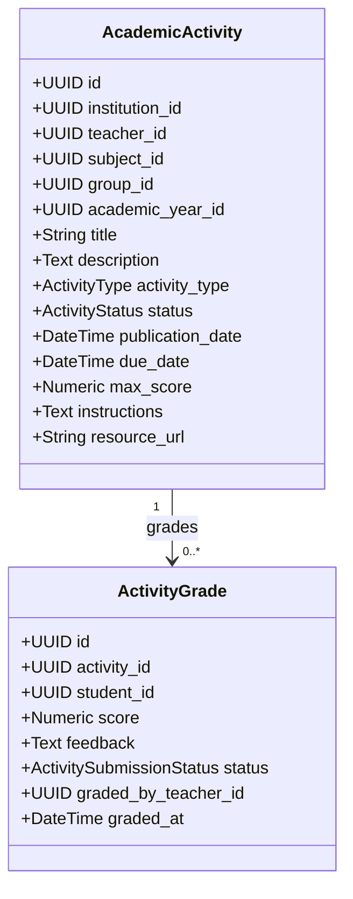
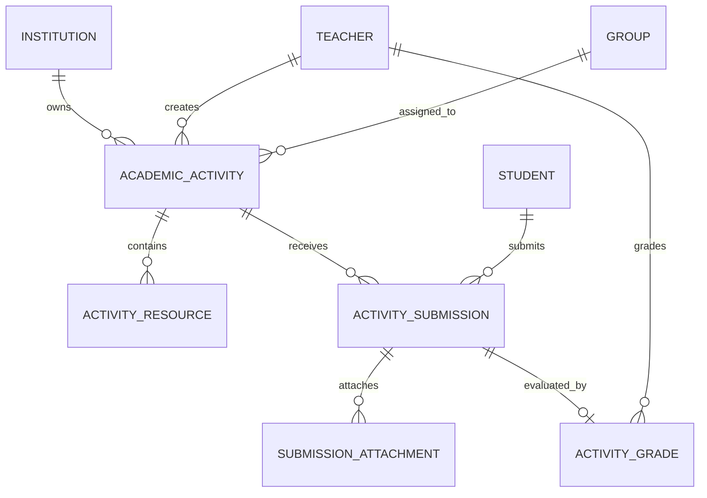

# PEVN — B3-H10 — AUDITORÍA TÉCNICA READ-ONLY
## Entregas de Estudiantes, Recursos Pedagógicos de Actividades y Almacenamiento Seguro

**Fecha de Auditoría:** 2026-09-12 09:45:00 -05:00  
**Fase de Origen:** Fase B3 — Portal Docente / Validación Transversal B3-H10 (Student Submissions & Activity Resources)  
**Tipo de Análisis:** Auditoría de Arquitectura e Implementación Read-Only (Sin modificaciones a código, base de datos ni RBAC)  
**Herramienta Autorizada:** Google Antigravity (Entorno de Desarrollo Oficial PEVN)  

---

## 1. Executive Summary

La presente auditoría técnica *Read-Only* fue realizada sobre el backend FastAPI, el frontend React/TypeScript, el esquema de base de datos PostgreSQL y la infraestructura de seguridad de la **Plataforma Educativa Virtual Nacional (PEVN)**.

### Hallazgos Principales:
1. **Flujo de Tareas y Calificaciones Actual:**
   - La creación, publicación y cierre de actividades pedagógicas por parte de docentes funciona correctamente (`EXISTE`).
   - El estudiante puede descubrir actividades publicadas para su grupo, consultar instrucciones y fecha límite (`EXISTE`).
   - El docente puede calificar y emitir retroalimentación cualitativa en lote (`EXISTE`).
   - El estudiante recibe su nota y retroalimentación en la vista de detalle y en *Mis Calificaciones* (`EXISTE`).
2. **Capacidad de Entrega del Estudiante (Submissions):**
   - El estudiante **NO dispone actualmente de mecanismos para realizar la entrega**: no existe campo de respuesta textual, ni adjunción de archivos, ni guardado de borrador, ni envío formal, ni consulta de entregas históricas (`NO EXISTE`).
   - La tabla `activity_grades` almacena únicamente `score`, `feedback` y un enum `status` (`PENDING`, `SUBMITTED`, `GRADED`). No existen columnas ni modelos para la carga del estudiante (`student_response`, `submitted_at`, `attachments`).
3. **Recursos y Materiales de Actividades:**
   - Actualmente sólo existe una columna de texto simple `resource_url` (String 500) en `academic_activities` para un único enlace externo (`PARCIAL`).
   - No existe un modelo para soportar múltiples recursos, ni adjunción de archivos subidos por el docente (`NO EXISTE`).
4. **Infraestructura de Almacenamiento de Archivos:**
   - PEVN **NO cuenta actualmente con un subsistema de almacenamiento físico de archivos** (no hay endpoints de upload/download de ficheros, ni abstracción de storage local/S3/MinIO, ni tablas de metadata de adjuntos) (`NO EXISTE`).
5. **Estado del Gate:**
   - El diseño arquitectónico está claramente delimitado y desacoplado del sistema SIEE y de la gobernanza institucional.
   - La implementación es técnicamente viable mediante una arquitectura mínima no invasiva que preserve el modelo actual de calificaciones y el aislamiento multi-tenant.

---

## 2. Current State (Estado Actual del Sistema)

| Componente / Característica | Estado Actual | Clasificación |
| :--- | :--- | :---: |
| **Docente crea/edita actividad** | Crea actividades en borrador asociadas a una asignación académica. | `EXISTE` |
| **Docente publica actividad** | Pasa a `PUBLISHED` y genera registros `ActivityGrade` en `PENDING` para los estudiantes matriculados. | `EXISTE` |
| **Estudiante descubre tareas** | Lista actividades con estados calculados (`PENDING`, `OVERDUE`, `SUBMITTED`, `GRADED`). | `EXISTE` |
| **Estudiante consulta instrucciones** | Modal `StudentTaskDetailModal` muestra instrucciones y enlace único `resource_url`. | `EXISTE` |
| **Estudiante redacta respuesta textual** | No existe textarea ni campo de respuesta en backend ni UI. | `NO EXISTE` |
| **Estudiante adjunta archivos** | No existe componente de carga ni endpoint de subida de archivos. | `NO EXISTE` |
| **Estudiante envía formalmente tarea** | No existe endpoint `POST /student/activities/{id}/submissions`. | `NO EXISTE` |
| **Estudiante consulta estado de entrega** | Visualiza únicamente si está `PENDING`, `OVERDUE`, `SUBMITTED` o `GRADED`. | `PARCIAL` |
| **Docente consulta entregas de alumnos** | Planilla en `TeacherGradesView` lista alumnos para calificar pero no muestra respuestas ni archivos. | `PARCIAL` |
| **Docente adjunta múltiples recursos** | Sólo existe un campo de texto `resource_url` para un único enlace. | `PARCIAL` |
| **Almacenamiento de archivos seguro** | No existe módulo de subida/descarga de archivos con autorización server-side. | `NO EXISTE` |

---

## 3. Existing Backend

### 3.1 Modelos de Dominio Existentes (`backend/app/models/academic_activity.py`)



#### Limitaciones Detectadas en el Backend:
1. **`ActivityGrade` actúa como entidad híbrida:** Contiene tanto el estado de evaluación (`status: PENDING | SUBMITTED | GRADED`) como la calificación (`score`, `feedback`, `graded_at`). No almacena el contenido producido por el estudiante.
2. **Carencia de `submitted_at`:** No existe timestamp que registre el momento exacto en que el estudiante realizó la entrega para validar si fue a tiempo o tardía.
3. **Carencia de `student_response`:** No existe campo para almacenar texto enriquecido o respuestas abiertas.
4. **Carencia de tabla de adjuntos:** No existen entidades para `submission_attachments` ni `activity_resources`.

### 3.2 Servicios Backend Existentes
- **`StudentPortalService` (`backend/app/services/student_portal_service.py`):**
  - `list_activities()`: Realiza `outerjoin` con `ActivityGrade` y calcula el estado dinámico (`PENDING`, `OVERDUE`, `SUBMITTED`, `GRADED`). `EXISTE`.
  - `get_activity_detail()`: Valida aislamiento por grupo y devuelve `StudentActivityItemResponse`. `EXISTE`.
  - *No posee métodos para recibir entregas ni adjuntos*.
- **`TeacherPortalService` (`backend/app/services/teacher_portal_service.py`):**
  - `create_activity()`, `update_activity()`, `publish_activity()`, `close_activity()`, `delete_activity()`. `EXISTE`.
  - `list_activity_grades()`: Devuelve listado de notas por actividad para el docente asignado. `EXISTE`.
  - `batch_grade_activity()`: Actualiza masivamente notas y retroalimentaciones. `EXISTE`.
  - *No posee métodos para consultar respuestas enviadas por estudiantes ni descargar archivos*.

---

## 4. Existing API

### 4.1 Endpoints del Portal Estudiante (`/api/v1/student`)
| Método | Endpoint | Permiso Requerido | Descripción | Estado |
| :--- | :--- | :--- | :--- | :---: |
| `GET` | `/student/activities` | `activities:read` | Listar actividades con filtros | `EXISTE` |
| `GET` | `/student/activities/{activity_id}` | `activities:read` | Detalle de actividad e instrucciones | `EXISTE` |
| `POST` | `/student/activities/{activity_id}/submission` | — | Crear/actualizar entrega de tarea | `NO EXISTE` |
| `GET` | `/student/activities/{activity_id}/submission` | — | Consultar entrega propia y adjuntos | `NO EXISTE` |
| `POST` | `/student/activities/{activity_id}/attachments` | — | Subir archivo adjunto de entrega | `NO EXISTE` |
| `GET` | `/student/activities/{activity_id}/resources/{id}/download` | — | Descargar material pedagógico | `NO EXISTE` |

### 4.2 Endpoints del Portal Docente (`/api/v1/teacher`)
| Método | Endpoint | Permiso Requerido | Descripción | Estado |
| :--- | :--- | :--- | :--- | :---: |
| `GET` | `/teacher/activities` | `activities:read` | Listar actividades creadas | `EXISTE` |
| `POST` | `/teacher/activities` | `activities:create` | Crear actividad en borrador | `EXISTE` |
| `GET` | `/teacher/activities/{activity_id}` | `activities:read` | Consultar detalle de actividad | `EXISTE` |
| `PATCH` | `/teacher/activities/{activity_id}` | `activities:update` | Modificar actividad | `EXISTE` |
| `POST` | `/teacher/activities/{activity_id}/publish` | `activities:publish` | Publicar actividad | `EXISTE` |
| `POST` | `/teacher/activities/{activity_id}/close` | `activities:close` | Cerrar actividad | `EXISTE` |
| `DELETE` | `/teacher/activities/{activity_id}` | `activities:delete` | Eliminar actividad | `EXISTE` |
| `GET` | `/teacher/activities/{activity_id}/grades` | `grades:read` | Planilla de notas | `EXISTE` |
| `PUT` | `/teacher/activities/{activity_id}/grades` | `grades:write` | Calificación masiva | `EXISTE` |
| `GET` | `/teacher/activities/{activity_id}/submissions/{student_id}` | — | Consultar entrega individual de estudiante | `NO EXISTE` |
| `POST` | `/teacher/activities/{activity_id}/resources` | — | Adjuntar recurso/material docente | `NO EXISTE` |
| `DELETE` | `/teacher/activities/{activity_id}/resources/{id}` | — | Eliminar recurso docente | `NO EXISTE` |

---

## 5. Existing Database

### 5.1 Esquema Actual de Tablas Relevantes (Migración `017_academic_activities_and_teacher_portal.py`)

#### Tabla `academic_activities`:
- `id` (UUID PK)
- `institution_id` (UUID FK $\rightarrow$ `institutions.id`) [Tenant Boundary]
- `teacher_id` (UUID FK $\rightarrow$ `teachers.id`)
- `academic_assignment_id` (UUID FK $\rightarrow$ `academic_assignments.id`, nullable)
- `subject_id` (UUID FK $\rightarrow$ `subjects.id`)
- `group_id` (UUID FK $\rightarrow$ `groups.id`)
- `academic_year_id` (UUID FK $\rightarrow$ `academic_years.id`)
- `title` (VARCHAR(200))
- `description` (TEXT)
- `activity_type` (ENUM: `TASK`, `WORKSHOP`, `QUIZ`, `EXAM`, `PROJECT`, `CLASS_ACTIVITY`)
- `status` (ENUM: `DRAFT`, `PUBLISHED`, `CLOSED`)
- `publication_date` (TIMESTAMPTZ)
- `due_date` (TIMESTAMPTZ)
- `max_score` (NUMERIC(4,2), default 5.00)
- `instructions` (TEXT)
- `resource_url` (VARCHAR(500), nullable)
- `created_at`, `updated_at` (TIMESTAMPTZ)

#### Tabla `activity_grades`:
- `id` (UUID PK)
- `activity_id` (UUID FK $\rightarrow$ `academic_activities.id` ON DELETE CASCADE)
- `student_id` (UUID FK $\rightarrow$ `students.id` ON DELETE RESTRICT)
- `score` (NUMERIC(4,2), nullable)
- `feedback` (TEXT, nullable)
- `status` (ENUM: `PENDING`, `SUBMITTED`, `GRADED`)
- `graded_by_teacher_id` (UUID FK $\rightarrow$ `teachers.id`, nullable)
- `graded_at` (TIMESTAMPTZ, nullable)
- `created_at`, `updated_at` (TIMESTAMPTZ)
- **Constraint:** `uq_activity_grades_activity_student (activity_id, student_id)`

---

## 6. Existing Frontend

### 6.1 Portal Estudiante
1. **`StudentTasksView.tsx` (`frontend/src/pages/student/StudentTasksView.tsx`):**
   - Pestañas de estado: *Todas, Pendientes, Vencidas, Entregadas, Calificadas*. `EXISTE`.
   - Filtros por materia y ordenamiento por fecha límite. `EXISTE`.
   - Tarjetas `StudentTaskCard.tsx` con badges de estado y llamada a modal de detalle. `EXISTE`.
2. **`StudentTaskDetailModal.tsx` (`frontend/src/components/student/StudentTaskDetailModal.tsx`):**
   - Muestra docente, fecha límite, puntaje máximo, instrucciones y retroalimentación pedagógica si está calificada. `EXISTE`.
   - Renderiza un botón para abrir `resource_url` si existe. `EXISTE`.
   - **Limitación crítica:** El pie del modal únicamente contiene el botón `Cerrar`. No contiene formularios, campos de texto, botones de subida ni acciones de entrega.

### 6.2 Portal Docente
1. **`TeacherActivitiesView.tsx` (`frontend/src/pages/teacher/TeacherActivitiesView.tsx`):**
   - Modal de creación/edición de actividad con campo único `resourceUrl` (input de texto). `EXISTE`.
   - Publicación, cierre y borrado de actividades. `EXISTE`.
2. **`TeacherGradesView.tsx` (`frontend/src/pages/teacher/TeacherGradesView.tsx`):**
   - Planilla en tabla con columnas: `#`, `Estudiante`, `Documento`, `Nota (0 - max)`, `Retroalimentación Pedagógica`, `Estado`. `EXISTE`.
   - Permite guardar notas por lote vía `teacherApi.batchUpdateActivityGrades()`. `EXISTE`.
   - **Limitación crítica:** No permite inspeccionar si el estudiante subió texto o archivos adjuntos ni descargarlos.

---

## 7. Existing File Infrastructure (Infraestructura de Archivos)

| Criterio Técnico | Diagnóstico PEVN Actual | Clasificación |
| :--- | :--- | :---: |
| **Manejador de archivos (Storage Driver)** | No existe módulo de almacenamiento en `backend/app/core/` ni servicios de subida. | `NO EXISTE` |
| **Object Storage (S3 / MinIO)** | No configurado ni integrado. | `NO EXISTE` |
| **Almacenamiento en Filesystem Local** | No configurado para recepción de uploads. | `NO EXISTE` |
| **Modelos de Metadata de Archivos** | No existen tablas para `file_name`, `mime_type`, `file_size`, `storage_path`, `checksum`. | `NO EXISTE` |
| **Validación de MIME Types / Magic Bytes** | Inexistente. | `NO EXISTE` |
| **Protección contra Path Traversal** | N/A (no hay endpoints de archivos). | `NO EXISTE` |
| **Descarga Autenticada con Anti-IDOR** | Inexistente. | `NO EXISTE` |

---

## 8. Security Findings & Multi-Tenant Boundaries

Para implementar entregas y recursos sin vulnerabilidades, deben satisfacerse los siguientes requerimientos estrictos de seguridad server-side:

1. **Aislamiento Multi-Tenant (Tenant Boundary):**
   - Todo archivo (recurso de docente o entrega de estudiante) debe pertenecer a una `institution_id` extraída del token JWT autenticado.
   - El backend **nunca debe permitir el acceso a archivos de un Tenant B por parte de un usuario del Tenant A**, rechazando la solicitud con `404 Not Found` (evitando divulgación de existencia).
2. **Aislamiento Estudiante-Estudiante (Anti-IDOR):**
   - El estudiante $A$ sólo puede crear, modificar, consultar y adjuntar archivos a **su propia entrega**.
   - El backend debe validar que `student.user_id == current_user.id` y que la entrega corresponda a dicho `student_id`.
   - Un estudiante $B$ que intente acceder al `submission_id` o `attachment_id` del estudiante $A$ debe recibir `404 Not Found`.
3. **Aislamiento Docente-Grupo:**
   - El docente sólo puede acceder a las entregas de actividades pertenecientes a grupos y asignaturas en las que posee una **asignación académica activa (`AcademicAssignment.is_active == True`)**.
4. **Seguridad Física de Archivos en Disco:**
   - **Nunca** almacenar archivos con el nombre original provisto por el usuario (evitar `../../etc/passwd` o inyecciones de ejecutables `.exe`, `.sh`, `.php`).
   - El nombre en disco debe ser un UUID v4 opaco: `<attachment_uuid>.<safe_ext>`.
   - La metadata original (`original_filename`, `mime_type`, `file_size_bytes`) se almacena en PostgreSQL.
   - **Acceso Exclusivamente Autenticado:** No servir archivos como recursos estáticos públicos en URLs predecibles (`/static/uploads/...`). Toda descarga debe pasar por un endpoint de streaming autenticado con validación de permisos.

---

## 9. Gaps (Brechas Funcionales y Técnicas Identificadas)

| # | Brecha Identificada | Impacto |
| :---: | :--- | :--- |
| **G-01** | Ausencia de entidad `ActivitySubmission` o campos de entrega en `ActivityGrade` | Impide que el estudiante guarde respuestas textuales y fecha de entrega. |
| **G-02** | Ausencia de entidad `SubmissionAttachment` | Impide adjuntar archivos a una entrega. |
| **G-03** | Ausencia de entidad `ActivityResource` | Limita la actividad a un solo link de texto `resource_url`, impidiendo subir múltiples PDFs/guías. |
| **G-04** | Falta de servicio centralizado de almacenamiento seguro (`StorageService`) | Impide guardar y despachar archivos con aislamiento multi-tenant y Anti-IDOR. |
| **G-05** | Ausencia de endpoints para envío de tareas en `/student/activities/{id}` | La API actual es de sólo consulta. |
| **G-06** | Falta de interfaz de entrega en `StudentTaskDetailModal.tsx` | La UI del estudiante no tiene formulario de respuesta ni dropzone de archivos. |
| **G-07** | Falta de visor de entregas de estudiantes en `TeacherGradesView.tsx` | El docente califica "a ciegas" sin poder ver lo que el alumno envió. |

---

## 10. Reusable Components (Componentes Reutilizables Existentes)

1. **RBAC & Dependencias de Seguridad (`app/api/deps.py`):**
   - `CurrentUserDep`, `SessionDep`, `require_permission("activities", "read")`, `require_permission("grades", "write")`.
2. **Módulo de Auditoría Forense (`app/audit/service.py`):**
   - `AuditService` y `AuditEvent` para registrar eventos `SUBMISSION_CREATED`, `SUBMISSION_UPDATED`, `ATTACHMENT_UPLOADED`.
3. **Servicio de Validación de Asignaciones (`TeacherPortalService._assert_active_assignment`):**
   - Reutilizable para validar que el docente tenga permiso sobre el grupo antes de ver entregas.
4. **Servicio de Validación de Matrícula Activa (`StudentPortalService.get_active_enrollment`):**
   - Reutilizable para validar que el estudiante pertenezca al grupo de la actividad antes de recibir una entrega.
5. **Componentes UI Base (`Button`, `LoadingSpinner`, `StudentStatusBadge`):**
   - Listos para componer la nueva interfaz de entrega y visor de adjuntos.

---

## 11. Required Changes (Cambios Requeridos para Futura Implementación)

### 11.1 Backend
1. **Modelos:**
   - Crear modelo `ActivityResource` (materiales del docente: URL externa o archivo subido).
   - Crear modelo `ActivitySubmission` (o enriquecer `ActivityGrade` con `student_response`, `submitted_at`, `is_late`, `status`) para almacenar la entrega.
   - Crear modelo `SubmissionAttachment` (archivos adjuntos del estudiante).
2. **Servicio de Almacenamiento Seguro (`StorageService`):**
   - Implementar abstracción local segura (`LocalStorageDriver`) que guarde en directorio aislado configurable (`STORAGE_LOCAL_PATH`).
   - Generación de rutas seguras basadas en UUID: `storage/{institution_id}/activities/{activity_id}/submissions/{submission_id}/{attachment_id}.bin`.
3. **Servicios de Aplicación:**
   - En `StudentPortalService`: implementar `submit_task()`, `upload_submission_attachment()`, `delete_submission_attachment()`, `download_activity_resource()`.
   - En `TeacherPortalService`: implementar `get_student_submission_detail()`, `add_activity_resource()`, `delete_activity_resource()`, `download_submission_attachment()`.
4. **Endpoints FastAPI:**
   - Agregar endpoints en `student_portal.py` y `teacher_portal.py`.

### 11.2 Frontend
1. **Portal Estudiante:**
   - Rediseñar `StudentTaskDetailModal.tsx` para incluir pestañas/secciones: *Instrucciones & Recursos*, *Mi Entrega (Respuesta de texto + Adjuntos)*, y *Resultado de Evaluación*.
   - Agregar controles de: redacción de respuesta, adjunción de archivos (máx 3 archivos, máx 20MB c/u), botón "Guardar Borrador", botón "Enviar Tarea Definitiva".
2. **Portal Docente:**
   - En `TeacherActivitiesView.tsx`: permitir adjuntar múltiples recursos (archivos o enlaces) al crear/editar actividad.
   - En `TeacherGradesView.tsx`: agregar botón "👁️ Ver Entrega" por cada estudiante para abrir un modal con la respuesta textual, fecha de entrega, indicador de entrega tardía y enlaces de descarga de los archivos entregados.

---

## 12. Migration Impact (Impacto en Base de Datos)

La futura implementación requerirá una **nueva migración de Alembic** (`022_activity_submissions_and_resources.py`).

### Tablas a Crear:
1. **`activity_resources`**:
   - `id` (UUID PK)
   - `activity_id` (UUID FK $\rightarrow$ `academic_activities.id` ON DELETE CASCADE)
   - `resource_type` (ENUM: `URL`, `FILE`)
   - `title` (VARCHAR(200))
   - `url` (VARCHAR(500), nullable)
   - `file_path` (VARCHAR(500), nullable)
   - `file_name` (VARCHAR(255), nullable)
   - `file_size_bytes` (BIGINT, nullable)
   - `mime_type` (VARCHAR(100), nullable)
   - `created_at` (TIMESTAMPTZ)
2. **`activity_submissions`** (o refactorización no destructiva de `activity_grades`):
   - `id` (UUID PK)
   - `activity_id` (UUID FK $\rightarrow$ `academic_activities.id` ON DELETE CASCADE)
   - `student_id` (UUID FK $\rightarrow$ `students.id` ON DELETE RESTRICT)
   - `content_text` (TEXT, nullable)
   - `submitted_at` (TIMESTAMPTZ, nullable)
   - `is_late` (BOOLEAN, default FALSE)
   - `created_at`, `updated_at` (TIMESTAMPTZ)
   - `UniqueConstraint(activity_id, student_id)`
3. **`submission_attachments`**:
   - `id` (UUID PK)
   - `submission_id` (UUID FK $\rightarrow$ `activity_submissions.id` ON DELETE CASCADE)
   - `file_name` (VARCHAR(255))
   - `file_path` (VARCHAR(500))
   - `file_size_bytes` (BIGINT)
   - `mime_type` (VARCHAR(100))
   - `created_at` (TIMESTAMPTZ)

> [!NOTE]
> **Preservación del Modelo de Calificaciones:**  
> La tabla `activity_grades` puede mantenerse vinculada $1:1$ con la entrega o unificarse limpiamente sin perder las calificaciones preexistentes.

---

## 13. Proposed Architecture (Propuesta de Arquitectura Limpia)



### Separación de Responsabilidades:
1. **`ACADEMIC_ACTIVITY`**: Define qué se debe hacer, ponderación y fechas.
2. **`ACTIVITY_RESOURCE`**: Documentos guía, rúbricas o enlaces aportados por el docente.
3. **`ACTIVITY_SUBMISSION`**: Lo que el estudiante produjo (texto + archivos + fecha).
4. **`SUBMISSION_ATTACHMENT`**: Archivos individuales subidos por el estudiante.
5. **`ACTIVITY_GRADE`**: Dictamen cuantitativo y cualitativo emitido por el docente.

---

## 14. Proposed API Contract (Contrato de API Propuesto)

### 14.1 Endpoints para Estudiante
```http
POST /api/v1/student/activities/{activity_id}/submission
Content-Type: application/json

{
  "content_text": "Profesor, adjunto el informe del taller de Dinámica.",
  "is_draft": false
}
```

```http
POST /api/v1/student/activities/{activity_id}/submission/attachments
Content-Type: multipart/form-data

file: <archivo binario>
```

```http
GET /api/v1/student/activities/{activity_id}/submission
Response: 200 OK
{
  "id": "uuid",
  "activity_id": "uuid",
  "status": "SUBMITTED",
  "content_text": "Profesor, adjunto...",
  "submitted_at": "2026-09-12T10:00:00Z",
  "is_late": false,
  "attachments": [
    {
      "id": "uuid",
      "file_name": "Taller_Fisica_Leyes_Newton.pdf",
      "file_size_bytes": 1048576,
      "mime_type": "application/pdf"
    }
  ]
}
```

```http
GET /api/v1/student/activities/{activity_id}/resources/{resource_id}/download
Response: 200 OK (Binary Stream / Content-Disposition: attachment)
```

### 14.2 Endpoints para Docente
```http
POST /api/v1/teacher/activities/{activity_id}/resources
Content-Type: multipart/form-data

file: <archivo>
title: "Guía de Laboratorio 1.pdf"
```

```http
GET /api/v1/teacher/activities/{activity_id}/submissions/{student_id}
Response: 200 OK
{
  "student_id": "uuid",
  "student_name": "Valeria Gómez",
  "status": "SUBMITTED",
  "submitted_at": "2026-09-12T09:30:00Z",
  "is_late": false,
  "content_text": "...",
  "attachments": [...],
  "score": 4.8,
  "feedback": "Excelente desarrollo metodológico."
}
```

```http
GET /api/v1/teacher/activities/{activity_id}/submissions/{student_id}/attachments/{attachment_id}/download
Response: 200 OK (Binary Stream con Anti-IDOR verificado)
```

---

## 15. Proposed UI Flow (Flujo de Usuario Propuesto)

### 15.1 Flujo Estudiante (Realizar y Enviar Tarea):
```text
1. Portal Estudiante -> Pestaña "Mis Tareas"
2. Clic en tarjeta de tarea pendiente -> Abre StudentTaskDetailModal
3. Pestaña 1: "Instrucciones & Materiales" (Consulta guía y descarga recursos del docente)
4. Pestaña 2: "Mi Entrega"
   - Escribe respuesta en editor de texto
   - Arrastra archivo(s) PDF/Word a la zona de carga
   - Clic en "Guardar Borrador" (opcional) o "Enviar Tarea"
5. Confirmación visual con diálogo de seguridad: "¿Desea realizar el envío definitivo?"
6. Estado cambia a SUBMITTED con timestamp registrado.
```

### 15.2 Flujo Docente (Revisar y Calificar):
```text
1. Portal Docente -> Pestaña "Calificaciones" -> Selecciona Actividad
2. En la tabla de estudiantes, la columna "Estado" muestra badge interactivo "ENTREGADA (1 archivo)"
3. Clic en botón "👁️ Ver Entrega"
4. Abre modal con la respuesta del alumno y lista de archivos entregados
5. Descarga/visualiza el archivo del alumno
6. Ingresa Nota (0.0 a 5.0) y Retroalimentación cualitativa en el mismo modal o en la planilla
7. Guarda calificación -> El estudiante recibe la nota en tiempo real.
```

---

## 16. Test Matrix (Matriz de Pruebas Propuesta)

| Código | Caso de Prueba | Tipo | Criterio de Aceptación |
| :---: | :--- | :---: | :--- |
| **T-A** | Docente crea actividad en borrador | Backend/API | `201 Created`, estado `DRAFT`. |
| **T-B** | Docente adjunta recurso PDF a actividad | Backend/API | Archivo guardado en storage seguro, metadata en BD. |
| **T-C** | Estudiante ve actividad publicada | Frontend/API | Aparece en lista de tareas con estado `PENDING`. |
| **T-D** | Estudiante ve recursos adjuntos | Frontend | Lista de materiales visibles con botón de descarga. |
| **T-E** | Estudiante descarga recurso pedagógico | Backend/Sec | `200 OK`, streaming binario correcto. |
| **T-F** | Estudiante inicia borrador de entrega | Backend/API | `content_text` persiste en estado borrador. |
| **T-G** | Estudiante adjunta archivo a su entrega | Backend/API | Archivo almacenado con nombre UUID, vinculado a la entrega. |
| **T-H** | Estudiante envía entrega definitiva | Backend/API | Estado pasa a `SUBMITTED`, `submitted_at` fijado en UTC. |
| **T-I** | Docente ve estado `SUBMITTED` | Frontend/API | Planilla muestra indicador de entrega realizada. |
| **T-J** | Docente abre detalle de entrega de estudiante | Backend/API | Devuelve texto y lista de adjuntos del estudiante. |
| **T-K** | Docente descarga archivo entregado | Backend/Sec | `200 OK` para docente asignado. |
| **T-L** | Docente califica y retroalimenta | Backend/API | `ActivityGrade` actualizado, estado `GRADED`. |
| **T-M** | Estudiante ve nota y feedback | Frontend/API | Reflejado en modal de tarea y en *Mis Calificaciones*. |
| **T-N** | Persistencia tras recarga | E2E | Todos los datos permanecen inalterados tras refresh. |
| **T-O** | Anti-IDOR Estudiante A vs Estudiante B | Seguridad | Estudiante B intentando ver/descargar entrega de A recibe `404 Not Found`. |
| **T-P** | Anti-IDOR Docente no autorizado | Seguridad | Docente sin asignación en el grupo intentando descargar entrega recibe `404 Not Found`. |
| **T-Q** | Tenant Isolation | Seguridad | Intento de descarga con token de otra institución recibe `404 Not Found`. |
| **T-R** | Control de Fecha Límite / Entrega Tardía | Lógica | Entrega después de `due_date` se marca automáticamente como `is_late = True`. |
| **T-S** | Validación de Tipo/Tamaño de Archivo | Validación | Rechazo `422/400` para archivos `.exe` o mayores a 20MB. |
| **T-T** | Reintento de entrega tras calificación | Regla Negocio | Rechazo de modificación de entrega si ya fue calificada (`GRADED`). |

---

## 17. Risks & Mitigation Strategies (Riesgos Identificados)

1. **Riesgo: Almacenamiento no controlado de archivos grandes (Denial of Storage).**
   - *Mitigación:* Límite estricto de tamaño por archivo (ej. 20MB) y máximo 3 archivos por entrega.
2. **Riesgo: Inyección de archivos maliciosos (Malware / Web Shells).**
   - *Mitigación:* Nombres físicos UUID opacos en disco, validación de extensiones permitidas (`.pdf`, `.docx`, `.xlsx`, `.pptx`, `.zip`, `.jpg`, `.png`), validación de MIME types reales y almacenamiento fuera del DocumentRoot de la web.
3. **Riesgo: Disrupción del sistema SIEE / Calificaciones consolidadas.**
   - *Mitigación:* Mantener la entidad de evaluación desacoplada; las entregas alimentan la nota de actividad, la cual a su vez consolida en el SIEE institucional ya certificado en Fase 16.

---

## 18. Decisions Required (Decisiones Requeridas del Propietario)

| # | Decisión Funcional / Arquitectónica | Opciones Disponibles | Recomendación |
| :---: | :--- | :--- | :--- |
| **DEC-01** | **¿Permitir re-envíos (múltiples entregas)?** | **A:** Una sola entrega definitiva.<br>**B:** Permitir re-envío mientras esté antes de la fecha límite y no esté calificada.<br>**C:** Solo permitir re-envío si el docente "reabre" la tarea. | **Opción B** (Estándar pedagógico flexible). |
| **DEC-02** | **¿Permitir entregas tardías (después de due_date)?** | **A:** Bloqueo estricto (no se permite enviar).<br>**B:** Permitir entrega pero marcar con badge visual `ENTREGA TARDÍA`. | **Opción B** (Permite evaluación con penalización a criterio del docente). |
| **DEC-03** | **Almacenamiento Físico de Archivos:** | **A:** Filesystem local protegido en servidor (`/var/data/pevn_storage`).<br>**B:** Compatible S3/MinIO para despliegues distribuidos. | **Opción A** con interfaz abstracta lista para S3. |
| **DEC-04** | **Límite de archivos por entrega:** | **A:** 1 archivo máximo.<br>**B:** Hasta 3 archivos (máx 20MB cada uno). | **Opción B**. |

---

## 19. Implementation Recommendation (Recomendación de Implementación)

1. **Procedimiento Recomendado:**
   - La auditoría confirma que **el código fuente actual de PEVN se encuentra 100% íntegro, limpio y sin bloqueos de diseño**.
   - Se recomienda aprobar la arquitectura propuesta para la fase correspondiente de implementación de entregas y recursos de actividades.
2. **Fases Sugeridas para la Futura Implementación:**
   - **Paso 1:** Migración de Base de Datos (`activity_resources`, `activity_submissions`, `submission_attachments`) y módulo de almacenamiento seguro `StorageService`.
   - **Paso 2:** Endpoints y lógica de backend para subida/descarga autenticada de recursos docentes y entregas de estudiantes.
   - **Paso 3:** Componentes de Frontend: formulario de entrega y dropzone en Portal Estudiante (`StudentTaskDetailModal`).
   - **Paso 4:** Componentes de Frontend: gestor de materiales y visor de entregas de estudiantes en Portal Docente (`TeacherGradesView` / `TeacherActivitiesView`).
   - **Paso 5:** Suite de pruebas automatizadas y validación humana transversal.

---

## 20. Conclusión del Gate B3-H10

```text
================================================================================
GATE B3-H10: AUDITORÍA TÉCNICA COMPLETADA — READ-ONLY
================================================================================
B3-H10 = READY FOR IMPLEMENTATION
================================================================================
```
