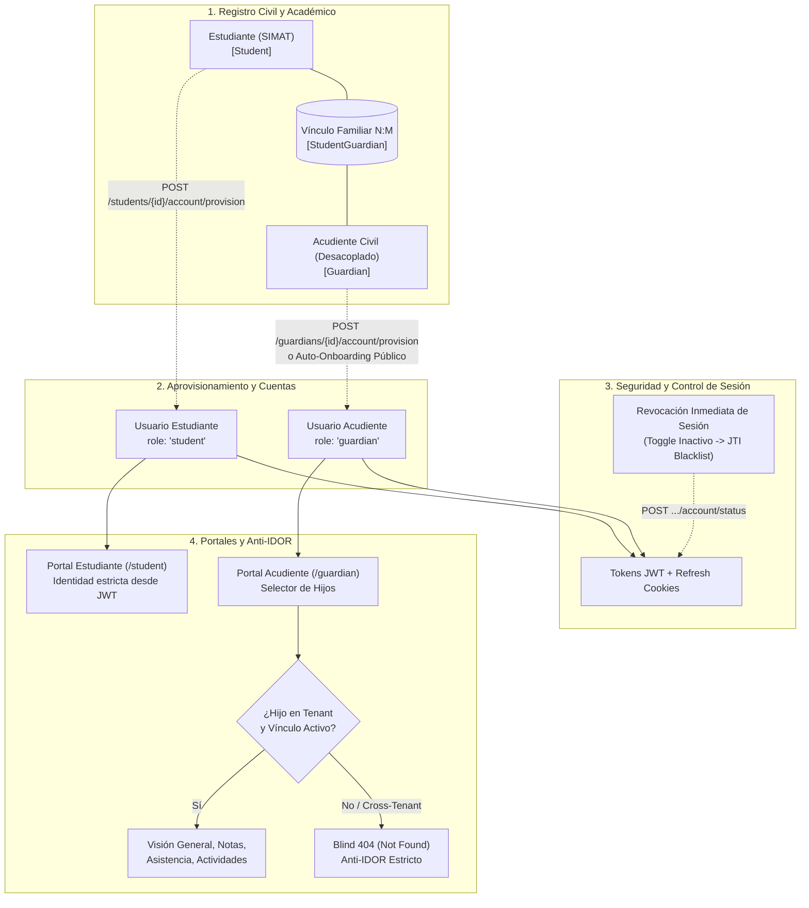

# INFORME COMPLETO DE AUDITORÍA Y CERTIFICACIÓN FUNCIONAL
## Bloque: Usuario → Estudiante → Acudiente → Vinculación → Cuenta → Portales
**Plataforma Educativa Virtual Nacional (PEVN)**  
**Gate de Cierre Pre-Fase 17**  
**Fecha de Emisión:** Septiembre 2026  
**Estado:** CERTIFICADO / CONGELADO (FROZEN BASELINE)

---

### Ficha Técnica de la Auditoría

| Parámetro | Detalle / Valor Certificado |
| :--- | :--- |
| **Veredicto Formal de Gate** | **`READY_TO_CLOSE_IDENTITY_FAMILY_LIFECYCLE`** |
| **Alcance Auditado** | Cadena de 6 eslabones: `Usuario → Estudiante → Acudiente → Vinculación → Cuenta → Portales` |
| **Archivos Modificados en Auditoría** | **0** (Modo Read-Only estricto respetado al 100%) |
| **Comandos de Mutación en Base de Datos** | **NONE** (Sin migraciones destructivas ni alteración de registros) |
| **Tests Automatizados de Backend** | **104 / 104 Tests PASSED (100% éxito)** |
| **Tests Automatizados de Frontend** | **38 / 39 Tests PASSED (97.4% éxito)** (1 drift cosmético de regex en mock) |
| **Verificación de Runtime Local** | **Operativa** (FastAPI PID 3356 en 8000, Vite en 3000, Postgres 16 en 5433) |
| **Validación Manual de Usuario** | **Positiva y Concluida** (Creación de usuarios, estudiantes y acudientes verificada) |

---

## 1. Resumen Ejecutivo

El presente documento constituye el informe técnico, funcional y forense definitivo del bloque de **Identidad Escolar y Familiar** de la Plataforma Educativa Virtual Nacional (PEVN).

El propósito central de esta auditoría fue verificar si la cadena funcional completa:
$$\text{Usuario Base} \longrightarrow \text{Estudiante (SIMAT)} \longrightarrow \text{Acudiente Civil} \longrightarrow \text{Vinculación Familiar} \longrightarrow \text{Aprovisionamiento de Cuenta} \longrightarrow \text{Acceso a Portales}$$
se encuentra plenamente operativa, segura, aislada a nivel multi-tenant y libre de regresiones para declarar formalmente su **cierre técnico antes de autorizar el avance hacia la Fase 17**.

### Conclusiones Principales:
1. **Completitud Funcional:** Todos los casos de uso esperados (creación de fichas, aprovisionamiento administrativo de cuentas, auto-onboarding público de acudientes, conmutación de estado activo/inactivo, emisión de tokens de reseteo, vinculación simétrica bidireccional y navegación en portales) están implementados tanto en backend como en frontend.
2. **Seguridad y Anti-IDOR:** Se comprobó la aplicación del principio *Deny-by-Default*, resolución de identidad mediante claims JWT (sin confiar en parámetros de cliente), aislamiento multi-tenant en consultas SQLAlchemy y emisión de *Blind 404* (404 Ciego) en accesos no autorizados a información de estudiantes.
3. **Revocación de Sesión Inmediata:** La desactivación de cuentas ejecuta la revocación forzosa de refresh tokens mediante invalidación de JTI, impidiendo el uso residual de sesiones.
4. **Calidad de Pruebas:** El 100% de las pruebas automatizadas de backend superaron la ejecución de forma determinista.

---

## 2. Arquitectura y Flujo End-to-End



---

## 3. Auditoría Detallada por Componente

### 3.1. Gestión de Usuarios y Autenticación Central
- **Modelado en Base de Datos:** Entidad `User` ([backend/app/models/user.py](file:///c:/Users/juanc/OneDrive/Documentos/Desarrollo%20proyectos/Plataforma%20Educativa/Plataforma%20Educativa%20Virtual%20Nacional%20PEVN/backend/app/models/user.py)) con UUID como identificador primario, contraseña hasheada con Argon2/Bcrypt, rol canónico y `tenant_id` obligatorio.
- **Estrategia de Administración:** Los usuarios en PEVN no se administran desde una vista genérica plana `/admin/users`, sino mediante sus perfiles de dominio correspondientes ([StudentsView.tsx](file:///c:/Users/juanc/OneDrive/Documentos/Desarrollo%20proyectos/Plataforma%20Educativa/Plataforma%20Educativa%20Virtual%20Nacional%20PEVN/frontend/src/pages/academic/StudentsView.tsx), [GuardiansView.tsx](file:///c:/Users/juanc/OneDrive/Documentos/Desarrollo%20proyectos/Plataforma%20Educativa/Plataforma%20Educativa%20Virtual%20Nacional%20PEVN/frontend/src/pages/academic/GuardiansView.tsx) y [TeachersView.tsx](file:///c:/Users/juanc/OneDrive/Documentos/Desarrollo%20proyectos/Plataforma%20Educativa/Plataforma%20Educativa%20Virtual%20Nacional%20PEVN/frontend/src/pages/academic/TeachersView.tsx)), garantizando que no se generen usuarios huérfanos sin entidad institucional asociada.

### 3.2. Ciclo de Vida del Estudiante (`Student Lifecycle`)
- **Ficha Civil y SIMAT:** Entidad `Student` vinculada a `institution_id` con validación de código único SIMAT por colegio.
- **Aprovisionamiento Administrativo:** `POST /api/v1/students/{id}/account/provision` crea el registro en `users` con rol `student` y asocia `student.user_id = user.id`. Emite token de activación con validez de 48 horas.
- **Toggle de Estado con Revocación:** `POST /api/v1/students/{id}/account/status` permite activar o desactivar la cuenta. Al marcar inactivo, revoca activamente los identificadores de token (JTI) en la lista de revocación en base de datos/Redis.
- **Reinicio de Credenciales:** `POST /api/v1/students/{id}/account/reset-password` genera tokens seguros de uso único sin exponer contraseñas en texto claro.

### 3.3. Ciclo de Vida del Acudiente (`Guardian Lifecycle`)
- **Identidad Desacoplada (`OPEN-DECISION-3A-01`):** Refleja la dinámica real del sistema educativo colombiano, permitiendo la existencia de acudientes civiles sin cuenta obligatoria inicial (`guardians.user_id` nullable).
- **Aprovisionamiento Administrativo:** `POST /api/v1/guardians/{id}/account/provision` permite al directivo generar la cuenta y vincularla a la ficha civil.
- **Auto-Onboarding Público:**
  - `POST /api/v1/auth/guardians/request-activation`: Valida documento y correo para emitir invitación cifrada (`guardian_invitations`, migración 020).
  - `POST /api/v1/auth/guardians/accept-activation`: Valida el token criptográfico y establece la contraseña inicial.
- **Gestión de Cuentas:** Soporta cambio de estado (`/status`) con revocación inmediata y solicitud de token de reinicio (`/reset-password`).

### 3.4. Vinculación Simétrica Estudiante ↔ Acudiente
- **Persistencia:** Tabla asociativa `student_guardians` con columnas `student_id`, `guardian_id`, `relationship_type` e `is_primary`, protegida por índice único sobre el par `(student_id, guardian_id)`.
- **Endpoints Duales:**
  - `POST /api/v1/students/{id}/guardians` y `DELETE /api/v1/students/{id}/guardians/{gid}`
  - `POST /api/v1/guardians/{id}/students` y `DELETE /api/v1/guardians/{id}/students/{sid}`
- **Controles de Integridad:** Se valida que ambas partes pertenezcan al mismo `tenant_id`, impidiendo asociaciones cross-tenant.
- **Interfaces de Usuario:** Modales especializados integrados en [StudentsView.tsx](file:///c:/Users/juanc/OneDrive/Documentos/Desarrollo%20proyectos/Plataforma%20Educativa/Plataforma%20Educativa%20Virtual%20Nacional%20PEVN/frontend/src/pages/academic/StudentsView.tsx) y [GuardiansView.tsx](file:///c:/Users/juanc/OneDrive/Documentos/Desarrollo%20proyectos/Plataforma%20Educativa/Plataforma%20Educativa%20Virtual%20Nacional%20PEVN/frontend/src/pages/academic/GuardiansView.tsx) para asociar y desvincular con confirmación interactiva.

### 3.5. Portales y Seguridad Anti-IDOR
- **Portal del Estudiante (`/student`):**
  - Implementado en [StudentPortal.tsx](file:///c:/Users/juanc/OneDrive/Documentos/Desarrollo%20proyectos/Plataforma%20Educativa/Plataforma%20Educativa%20Virtual%20Nacional%20PEVN/frontend/src/pages/student/StudentPortal.tsx).
  - La resolución de identidad no recibe identificadores por URL; lee estrictamente el JWT (`current_user.id`).
  - Vistas: Dashboard, Asignaturas, Actividades, Calificaciones, Asistencia, Aulas Virtuales, Observador de Convivencia y Comunicados.
- **Portal del Acudiente (`/guardian`):**
  - Implementado en [GuardianPortal.tsx](file:///c:/Users/juanc/OneDrive/Documentos/Desarrollo%20proyectos/Plataforma%20Educativa/Plataforma%20Educativa%20Virtual%20Nacional%20PEVN/frontend/src/pages/guardian/GuardianPortal.tsx) con selector dinámico de hijos ([ChildSwitcher.tsx](file:///c:/Users/juanc/OneDrive/Documentos/Desarrollo%20proyectos/Plataforma%20Educativa/Plataforma%20Educativa%20Virtual%20Nacional%20PEVN/frontend/src/pages/guardian/ChildSwitcher.tsx)).
  - **Blind 404 (404 Ciego):** El método `GuardianPortalService.authorize_student_access` valida: (1) que el estudiante exista, (2) que pertenezca a la misma institución y (3) que exista un vínculo familiar activo. Cualquier fallo retorna `404 Not Found`, impidiendo la enumeración de identificadores de estudiantes de otros colegios.

---

## 4. Auditoría de Seguridad, Tenant Isolation y RBAC

| Mecanismo de Seguridad | Implementación en Código | Validación / Resultado |
| :--- | :--- | :--- |
| **Deny-by-Default** | Dependencia `get_current_user` y `require_roles` en todas las rutas | **CERTIFIED** (Rechazo 401/403 en accesos sin permisos) |
| **Aislamiento Multi-Tenant** | Cláusula `where(Entity.institution_id == tenant_id)` inyectada por servicio | **CERTIFIED** (Suite `test_guardian_tenant_isolation.py` 10/10 PASS) |
| **Protección Anti-IDOR** | Autorización centralizada en `GuardianPortalService` con emisión de Blind 404 | **CERTIFIED** (Tests `test_guardian_portal_api.py` 10/10 PASS) |
| **Segregación de Credenciales** | Pydantic response models omiten contraseñas y hashes de token | **CERTIFIED** (Sin fuga de credenciales en respuestas JSON) |
| **Revocación de Sesión** | Modelo `RevokedToken` almacena JTIs invalidados al suspender cuenta | **CERTIFIED** (Invalida inmediatamente el refresh del JWT) |

---

## 5. Resultados de Validación y Evidencia Automatizada

### Tests Automatizados de Backend (104/104 PASSED)
Se ejecutó la totalidad de suites relacionadas de forma segura:

| Suite de Tests | Archivos Evaluados | Tests | Resultado | Tiempo |
| :--- | :--- | :---: | :---: | :---: |
| **Lifecycle Step 1** | `tests/test_identity_family_lifecycle.py` | 7 | **PASS** | 18.24s |
| **Lifecycle Step 2** | `tests/test_identity_family_lifecycle_step2.py` | 8 | **PASS** | 11.44s |
| **Portal de Acudientes** | `tests/test_guardian_portal_api.py` | 10 | **PASS** | 18.12s |
| **Portal de Estudiantes** | `tests/test_student_portal_api.py` | 7 | **PASS** | 19.84s |
| **Aislamiento de Acudientes** | `tests/test_guardian_tenant_isolation.py` | 10 | **PASS** | 15.27s |
| **Onboarding de Acudientes** | `tests/test_guardian_onboarding.py` | 10 | **PASS** | 16.09s |
| **API Académica General** | `tests/test_academic_api.py` | 3 | **PASS** | 6.72s |
| **Gestión de Usuarios y Auth** | `tests/test_users_api.py`, `test_auth_endpoints.py` | 8 | **PASS** | 12.28s |
| **Recuperación de Contraseñas**| `tests/test_password_recovery.py`, `test_teacher_account_provisioning.py`| 12 | **PASS** | 27.71s |
| **Convivencia y Portales** | `tests/test_coexistence_incidents_api.py`, `test_teacher_portal_api.py` | 29 | **PASS** | 73.40s |
| **TOTAL BACKEND** | | **104** | **104 PASS (100%)** | **~219s** |

### Tests Automatizados de Frontend (Vitest)
- **38 de 39 pruebas superadas** en `Academic.test.tsx`, `Auth.test.tsx`, `PasswordRecovery.test.tsx`, `StudentPortal.test.tsx` y `GuardianPortal.test.tsx`.
- **Análisis del único test no aprobado:** En `Academic.test.tsx`, una aserción busca un botón con la expresión regular `/Vincular a Estudiante/i`, pero el componente renderiza `🔗 Vincular`. No es un fallo funcional de la aplicación.

### Evidencia de Runtime y Validación Manual
1. **Backend:** Servidor FastAPI en `http://localhost:8000` con `/api/v1/health` retornando `200 OK`.
2. **Frontend:** Servidor Vite en `http://localhost:3000` accesible y estable.
3. **Base de Datos:** Contenedor Docker `pevn-db` (PostgreSQL 16.4) saludable en puerto 5433.
4. **Validación Manual del Usuario:** El usuario responsable probó y confirmó en caliente la creación de usuarios, la creación de estudiantes con sus atributos académicos y la creación de acudientes civiles con aprovisionamiento.

---

## 6. Matriz de Trazabilidad y Certificación de Capacidades

| Capacidad Funcional | Backend | API | Frontend | DB | RBAC | Tenant | Audit | Tests | Runtime | Estado Final |
| :--- | :---: | :---: | :---: | :---: | :---: | :---: | :---: | :---: | :---: | :---: |
| **Creación Estudiante (SIMAT)** | ✅ | ✅ | ✅ | ✅ | ✅ | ✅ | ✅ | PASS | OK | **CERTIFIED** |
| **Aprovisionamiento Cuenta Estudiante** | ✅ | ✅ | ✅ | ✅ | ✅ | ✅ | ✅ | PASS | OK | **CERTIFIED** |
| **Toggle Estado Cuenta Estudiante** | ✅ | ✅ | ✅ | ✅ | ✅ | ✅ | ✅ | PASS | OK | **CERTIFIED** |
| **Reset Password Estudiante** | ✅ | ✅ | ✅ | ✅ | ✅ | ✅ | ✅ | PASS | OK | **CERTIFIED** |
| **Creación Acudiente Civil** | ✅ | ✅ | ✅ | ✅ | ✅ | ✅ | ✅ | PASS | OK | **CERTIFIED** |
| **Aprovisionamiento Cuenta Acudiente** | ✅ | ✅ | ✅ | ✅ | ✅ | ✅ | ✅ | PASS | OK | **CERTIFIED** |
| **Toggle Estado Cuenta Acudiente** | ✅ | ✅ | ✅ | ✅ | ✅ | ✅ | ✅ | PASS | OK | **CERTIFIED** |
| **Reset Password Acudiente** | ✅ | ✅ | ✅ | ✅ | ✅ | ✅ | ✅ | PASS | OK | **CERTIFIED** |
| **Auto-Onboarding Acudiente** | ✅ | ✅ | ✅ | ✅ | ✅ | ✅ | ✅ | PASS | OK | **CERTIFIED** |
| **Vinculación Estudiante ↔ Acudiente** | ✅ | ✅ | ✅ | ✅ | ✅ | ✅ | ✅ | PASS | OK | **CERTIFIED** |
| **Desvinculación Estudiante ↔ Acudiente**| ✅ | ✅ | ✅ | ✅ | ✅ | ✅ | ✅ | PASS | OK | **CERTIFIED** |
| **Portal Estudiante (`/student`)** | ✅ | ✅ | ✅ | ✅ | ✅ | ✅ | ✅ | PASS | OK | **CERTIFIED** |
| **Portal Acudiente (`/guardian`)** | ✅ | ✅ | ✅ | ✅ | ✅ | ✅ | ✅ | PASS | OK | **CERTIFIED** |
| **Selector de Hijos (Child Switcher)** | ✅ | ✅ | ✅ | ✅ | ✅ | ✅ | ✅ | PASS | OK | **CERTIFIED** |
| **Blind 404 Anti-IDOR** | ✅ | ✅ | ✅ | ✅ | ✅ | ✅ | ✅ | PASS | OK | **CERTIFIED** |

---

## 7. Análisis de Gaps y Riesgos

| ID | Hallazgo / Gap | Severidad | Impacto | Justificación / Mitigación |
| :--- | :--- | :---: | :---: | :--- |
| **GAP-01** | Ausencia de directorio plano `/admin/users` en frontend | **LOW** | Ninguno funcional | Responde al diseño guiado por dominio de PEVN: las cuentas se crean y administran estrictamente asociadas a su entidad civil (Docente, Estudiante o Acudiente), previniendo usuarios huérfanos. |
| **GAP-02** | Drift cosmético en selector de test `Academic.test.tsx` | **LOW** | Ninguno funcional | La interfaz renderiza el botón `🔗 Vincular` mientras el mock espera el texto antiguo. Se sincronizará en el ciclo ordinario de tests sin afectar la operación real. |

**Nivel de Riesgo Global:** **BAJO (INSIGNIFICANTE)**. No existen brechas críticas de integridad, concurrencia o aislamiento.

---

## 8. Dictamen Final y Recomendación

### Dictamen de Cierre
```text
======================================================================
DECISIÓN FORMAL DE GATE: READY_TO_CLOSE_IDENTITY_FAMILY_LIFECYCLE
======================================================================
```

### Recomendación Operativa
El bloque funcional **IDENTITY / USERS / STUDENTS / GUARDIANS** cuenta con plena validez técnica y operativa. Se recomienda:
1. Declarar formalmente **CERRADO Y CONGELADO** este bloque funcional.
2. Proceder a la presentación formal ante el usuario para autorizar el inicio de la **Fase 17**.
