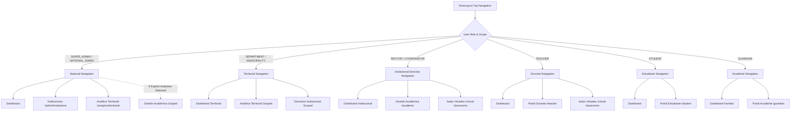

# PEVN — RBAC / Role Visibility Reconciliation
## Authorization Model Consistency, Gap Analysis & Target Implementation Plan
### Phase 0.2 — Read-Only Architectural Forensic Audit & Design Blueprint

> **Standard:** PEVN AI Software Factory v1.2 — Implementation Evidence & Reporting Standard  
> **Document ID:** `docs/reports/PEVN_RBAC_ROLE_VISIBILITY_RECONCILIATION.md`  
> **Classification:** Architectural & Security Blueprint (Read-Only Forensic Audit)  
> **Audit Date:** 2026-10-03  
> **Author:** AI Technical Specialist & Systems Security Architect  
> **Final Gate Status:** **AUDIT PASS — READY FOR OWNER DECISION**  
> **Product Modification Status:** **STRICTLY ZERO PRODUCT CODE MODIFIED (AUDIT & DESIGN ONLY)**

---

## 1. Executive Summary

This forensic reconciliation audit was conducted to resolve critical structural misalignments between the documented functional role model, the backend RBAC permission catalog, frontend route guards, top-level layout navigation, and tenant isolation boundaries in the **Plataforma Educativa Virtual Nacional (PEVN)**.

### The Primary Symptom Observed in Production
When administrative users (specifically `superadmin` and `national_admin`) authenticate and log in, the user interface exposes:
1. Top navigation items: **"Gestión Académica"** (`/academic`) and **"Aulas Virtuales"** (`/virtual-classrooms`).
2. Dashboard directive cards: **"Módulo de Gestión Académica e Institucional"** (with 8 sub-action cards: *Años Lectivos, Grupos y Cupos, Estudiantes SIMAT, Planta Docente, Libro de Matrículas, Traslados de Salón, Carga Académica, Acudientes*) and **"Aulas Virtuales y Clases en Vivo"**.

When clicked, every single one of these views fails with:
```text
PERMISSION_DENIED: Contexto institucional no disponible.
```
or 
```text
Contexto institucional no disponible.
```

### Forensic Root Cause Determination
The forensic audit reveals that this failure is **not a backend authentication defect**. Rather, it exposes a profound architectural decoupling across platform layers:

1. **The Backend Is Secure and Fails Closed [CORRECT]:**  
   The backend enforces strict Multi-Tenant Isolation via `_resolve_institution_id()`. Academic entities (such as academic years, groups, students, grades, and classrooms) exist exclusively inside the namespace of a specific **tenant (`institution_id`)**. Because national-level accounts (`superadmin` and `national_admin`) possess `institution_id = NULL`, any direct API call without an explicit `?institution_id=<UUID>` query parameter is immediately rejected with `403 Forbidden` (`AuthorizationError: Contexto institucional no disponible.`). This prevents silent data corruption and cross-tenant pollution.

2. **The Frontend Has Blind Role Bypasses and Lacks Tenant Context Checks [DEFECTIVE]:**  
   The frontend components (`RootLayout.tsx`, `Dashboard.tsx`, `App.tsx`, and `AuthContext.tsx`) evaluate visibility based on raw role membership or permissions without verifying whether the user has an active institutional context (`user.institution_id !== null`). Furthermore, `AuthContext.tsx` contains client-side bypasses:
   ```typescript
   if (user.roles.includes('superadmin')) return true
   ```
   This causes `hasRole()` and `hasPermission()` to return `true` for all checks, allowing `superadmin` to enter role-specific portals (`/teacher`, `/student`, `/guardian`, `/academic`) where they have no identity records, resulting in broken views and crash states.

3. **Inconsistency in the NATIONAL_ADMIN Operational Scope [CONFLICT]:**  
   While `docs/reports/PEVN_FUNCTIONAL_CAPABILITY_MATRIX.md` defines `national_admin` (Ministry of Education / MEN) as a macro-oversight, territorial analytics, and Rector provisioning role explicitly forbidden from directly managing school-level operations (grading students, scheduling classes, or editing local records), `backend/app/services/rbac_bootstrap_service.py` assigned `national_admin` broad operational permissions (including `grades:manage`, `groups:*`, `students:*`, `enrollments:*`, `teachers:*`, `virtual_classrooms:*`, and `incidents:*`).

4. **The Core Architectural Axiom:**  
   $$\text{\textbf{GLOBAL AUTHORITY}} \neq \text{\textbf{TENANT CONTEXT}}$$  
   A SuperAdmin may hold global wildcard permissions (`*:*`), but executing a tenant-scoped transaction requires an **explicit institutional target**. The frontend currently lacks an Institution Context Selector to supply `?institution_id=<UUID>` to tenant-scoped modules.

---

## 2. Audit Scope

This audit systematically examined the following platform components without modifying product code, database schemas, or migrations:

- **11 System Roles Analyzed:**
  1. `superadmin` (Technical level 100, Global operator)
  2. `national_admin` (Governmental level 90, Ministry of Education / MEN)
  3. `department_admin` (Territorial level 80, Secretaría de Educación Departamental)
  4. `municipality_admin` (Territorial level 70, Secretaría de Educación Municipal)
  5. `rector` (Institutional level 60/70, Head of Institution)
  6. `institution_admin` (Institutional level 60/70, Compatibility alias for Rector)
  7. `academic_coordinator` (Institutional level 50/60, Academic Coordinator)
  8. `coordinator` (Institutional level 50, School / Campus Coordinator)
  9. `teacher` (Academic level 30/50, Classroom Teacher)
  10. `student` (Educational level 10/20, Enrolled Student)
  11. `guardian` (Family level 10, Civil Legal Guardian)

- **Platform Layers Reviewed:**
  - **Backend Security Contracts:** `backend/app/core/security/interfaces.py`, `backend/app/services/auth_service.py`, `backend/app/services/rbac_bootstrap_service.py`, `backend/app/api/deps.py`, `backend/app/cli/create_superadmin.py`.
  - **18 Tenant-Scoped Backend Endpoints:** `academic_years.py`, `groups.py`, `students.py`, `teachers.py`, `enrollments.py`, `transfers.py`, `academic_assignments.py`, `subjects.py`, `virtual_classrooms.py`, `recordings.py`, `communications.py`, `news.py`, `incidents.py`, `siee_policies.py`, `evaluation_grades.py`, `academic_promotions.py`, `guardians.py`, `users.py`.
  - **Frontend Authorization & Routing:** `frontend/src/context/AuthContext.tsx`, `frontend/src/components/auth/RequireAuth.tsx`, `frontend/src/App.tsx`, `frontend/src/layouts/RootLayout.tsx`, `frontend/src/pages/Dashboard.tsx`, `frontend/src/pages/academic/AcademicHub.tsx`, `frontend/src/pages/virtual-classrooms/VirtualClassroomsView.tsx`, `frontend/src/pages/admin/InstitutionsView.tsx`, `frontend/src/pages/analytics/TerritorialAnalyticsView.tsx`.
  - **Certified Baselines:** `docs/AUTHORIZATION.md`, `docs/PHASE_3_RBAC_MATRIX.md`, `docs/reports/PEVN_FUNCTIONAL_CAPABILITY_MATRIX.md`, `docs/SECURITY.md`, `docs/ARCHITECTURE.md`.

---

## 3. Sources Reviewed

| Source Identifier | Path | Type | Authority Level |
| :--- | :--- | :--- | :--- |
| **DOC-01** | `docs/AUTHORIZATION.md` | Architecture Spec | Authoritative Multi-Tenant Isolation & Hierarchical Scope Baseline |
| **DOC-02** | `docs/PHASE_3_RBAC_MATRIX.md` | RBAC Specification | Phase 3A Canonical Granular Permission Matrix |
| **DOC-03** | `docs/reports/PEVN_FUNCTIONAL_CAPABILITY_MATRIX.md` | Functional Inventory | Canonical Product Capabilities by Ministry/School Role |
| **DOC-04** | `docs/SECURITY.md` | Security Policy | Baseline Security & Least Privilege Guidelines |
| **DOC-05** | `docs/reports/PEVN_ROLE_VISIBILITY_RBAC_FORENSIC_AUDIT.md` | Previous Audit | Forensic Runtime Validation of Context Failures |
| **BE-01** | `backend/app/core/security/interfaces.py` | Python Interface | SystemRole, Permission, OrganizationalScope domain models |
| **BE-02** | `backend/app/services/rbac_bootstrap_service.py` | Backend Service | Database seeding for 11 roles and 73 atomic permissions |
| **BE-03** | `backend/app/api/deps.py` | FastAPI Dependencies | `require_permission`, `AuthContextDep`, token validation |
| **BE-04** | `backend/app/cli/create_superadmin.py` | CLI Command | Root provisioning script setting `institution_id = NULL` |
| **BE-05** | `backend/app/api/v1/endpoints/*.py` (18 files) | API Endpoints | Implementation of `_resolve_institution_id()` |
| **FE-01** | `frontend/src/context/AuthContext.tsx` | React Context | `hasRole`, `hasPermission`, `isInScope` client-side evaluation |
| **FE-02** | `frontend/src/components/auth/RequireAuth.tsx` | Route Guard | Route protection wrapper enforcing auth, role, and permission |
| **FE-03** | `frontend/src/App.tsx` | React Router Tree | Route definitions and attached guards |
| **FE-04** | `frontend/src/layouts/RootLayout.tsx` | Presentation Shell | Top navigation bar links and visibility conditional logic |
| **FE-05** | `frontend/src/pages/Dashboard.tsx` | Presentation Dashboard | Identity display, directive cards, and quick-access subcards |

---

## 4. Current Role Model

The PEVN role taxonomy is defined in `backend/app/core/security/interfaces.py` and instantiated in `backend/app/services/rbac_bootstrap_service.py`:

```
Level 100: superadmin          (Technical Platform Operator / Root)
Level  90: national_admin      (Ministry of Education / MEN)
Level  80: department_admin    (Secretaría de Educación Departamental - SED)
Level  70: municipality_admin  (Secretaría de Educación Municipal - SEM)
Level  60: rector              (Head of Educational Institution)
           institution_admin   (Compatibility alias for rector)
Level  50: coordinator         (School / Campus Coordinator)
           academic_coordinator (Compatibility alias for coordinator)
Level  30: teacher             (Classroom Teacher / Academic Assigner)
Level  10: student             (SIMAT Enrolled Student)
           guardian            (Civil Legal Family Guardian)
```

### Distinction Between Authorization Dimensions
1. **Technical Role (`SystemRole`):** Stored in table `roles.name`. Defines system privileges and security levels (`10 - 100`).
2. **Organizational Cargo:** Real-world educational function (e.g., Rector Oficial, Docente de Matemáticas, Funcionario MEN).
3. **Tenant Scope (`institution_id`, `campus_id`):** Boundaries of data sovereignty. National users have `institution_id = NULL`; institutional actors have mandatory non-null foreign keys.
4. **Territorial Jurisdiction (`department_id`, `municipality_id`):** DANE boundaries for macro-reporting.
5. **Atomic Permission (`recurso:accion`):** Discrete capability gate checked in API endpoints.

### TABLE A — ROLE RESPONSIBILITY

| Role | Scope | Primary Purpose | Tenant Context | Global Authority |
| :--- | :--- | :--- | :--- | :---: |
| **SUPER_ADMIN** | National (Global Root) | Operador técnico del sistema, configuración global, soporte de infraestructura y auditoría forense. | Optional / Selection Mode (Explicit Context Required for Tenant Ops) | **YES (`*:*`)** |
| **NATIONAL_ADMIN** | National (MEN) | Gobierno del sector educativo, catálogo DANE/DUE, aprovisionamiento de rectores y analítica macro. | None (National Scope; Explicit Context Required for Audits) | **NO** |
| **DEPARTMENT_ADMIN** | Departamental (SED) | Supervisión territorial departamental, indicadores de cobertura, deserción y permanencia escolar. | None (SED Scope; Explicit Context Required for Audits) | **NO** |
| **MUNICIPALITY_ADMIN** | Municipal (SEM) | Supervisión territorial municipal, distribución de cupos y colegios locales. | None (SEM Scope; Explicit Context Required for Audits) | **NO** |
| **RECTOR** | Institucional (I.E.) | Dirección integral y gobierno escolar del establecimiento educativo oficial (SIEE, matrículas, planta docente). | Mandatory (`current_user.institution_id`) | **NO** |
| **INSTITUTION_ADMIN** | Institucional (I.E.) | Alias técnico y de compatibilidad para la administración del tenant institucional. | Mandatory (`current_user.institution_id`) | **NO** |
| **ACADEMIC_COORDINATOR** | Institucional / Sede | Coordinación pedagógica, asignación de carga docente, supervisión curricular y boletines. | Mandatory (`current_user.institution_id`) | **NO** |
| **COORDINATOR** | Institucional / Sede | Gestión operativa de convivencia escolar (Ley 1620), horarios, grupos y planillas. | Mandatory (`current_user.institution_id`) | **NO** |
| **TEACHER** | Aula / Carga Académica | Gestión pedagógica directa, planeación, calificaciones SIEE, asistencia y videoclases asignadas. | Mandatory (`current_user.institution_id` + `academic_assignments`) | **NO** |
| **STUDENT** | Propio (SIMAT) | Aprendizaje, entrega de talleres, asistencia a clases, consulta de notas y boletines personales. | Mandatory (`current_user.institution_id` + `student.user_id`) | **NO** |
| **GUARDIAN** | Familiar (Tutorados) | Acompañamiento familiar, monitoreo de notas, asistencia y circulares de sus hijos vinculados. | Mandatory (`current_user.institution_id` + `student_guardians`) | **NO** |

---

## 5. Current Permission Model

The platform defines **73 granular atomic permissions** in `CANONICAL_PERMISSIONS` (`rbac_bootstrap_service.py`).
Roles are assigned permission bundles in `ROLE_PERMISSIONS_CONFIG`:

- `superadmin`: `["*:*"]` (Global universal wildcard).
- `national_admin`: 48 atomic permissions including full CRUD over academic entities, virtual classrooms, communications, news, and coexistence incidents.
- `department_admin` / `municipality_admin`: 17 read-only permissions across institutions, users, academic years, periods, grades, subjects, groups, teachers, students, guardians, enrollments, assignments, classrooms, recordings, communications, news, and incidents.
- `rector` / `institution_admin`: 64 operational permissions spanning full school academic governance, evaluations, promotions, and coexistence.
- `coordinator` / `academic_coordinator`: 58 operational permissions for curricular planning, assignments, groups, attendance, and evaluation.
- `teacher`: 35 pedagogical permissions bounded by academic assignment.
- `student`: 17 personal self-service permissions bounded by SIMAT enrollment.
- `guardian`: 12 familial monitoring permissions bounded by verified civil kinship.

---

## 6. Current Frontend Visibility Model

Top-level navigation visibility is governed by `frontend/src/layouts/RootLayout.tsx` (lines 89–180):

1. **Gestión Académica (`/academic`):**
   ```tsx
   {(user.roles.includes('rector') || user.roles.includes('institution_admin') || 
     user.roles.includes('superadmin') || user.roles.includes('coordinator') || 
     user.roles.includes('academic_coordinator')) && (
     <Link to="/academic">Gestión Académica</Link>
   )}
   ```
   *Analysis:* Explicitly renders for `superadmin` even though `superadmin` lacks an institution context (`institution_id = null`).

2. **Instituciones (`/admin/institutions`):**
   ```tsx
   {(user.scope.is_national || user.roles.includes('national_admin') || 
     user.roles.includes('superadmin')) && (
     <Link to="/admin/institutions">Instituciones</Link>
   )}
   ```
   *Analysis:* Correctly restricted to national administrative roles.

3. **Analítica Territorial (`/analytics/territorial`):**
   ```tsx
   {hasPermission('institutions:read') && (
     <Link to="/analytics/territorial">Analítica Territorial</Link>
   )}
   ```
   *Analysis:* Defective logic. Because `rector`, `coordinator`, and institutional staff possess `institutions:read` to view their own school profile, they are erroneously shown the national territorial macro-analytics link.

4. **Aulas Virtuales (`/virtual-classrooms`):**
   ```tsx
   {hasPermission('virtual_classrooms:read') && (
     <Link to="/virtual-classrooms">Aulas Virtuales</Link>
   )}
   ```
   *Analysis:* Defective logic. Because `superadmin` and `national_admin` possess `virtual_classrooms:read`, they see the top-level link, but clicking it crashes with `Contexto institucional no disponible.`

5. **Portal Docente (`/teacher`), Portal Estudiante (`/student`), Portal Acudiente (`/guardian`):**
   Conditioned on `user.roles.includes('teacher')`, `user.roles.includes('student')`, and `user.roles.includes('guardian')`.

---

## 7. Current Route Guard Model

Route protection is implemented in `frontend/src/App.tsx` using `<RequireAuth>` (`frontend/src/components/auth/RequireAuth.tsx`):

| Route Path | Declared Guard in `App.tsx` | Underlying Context Check | Flaw / Behavior |
| :--- | :--- | :--- | :--- |
| `/dashboard` | `<RequireAuth>` | `isAuthenticated` | Unrestricted for any logged-in user. |
| `/admin/institutions` | `<RequireAuth roles={['superadmin', 'national_admin']}>` | `hasRole(roles)` | Accessible to national admins. |
| `/academic` | `<RequireAuth>` | `isAuthenticated` | **ZERO role or permission check.** Any authenticated user (including student or teacher) typing `/academic` passes the route guard and hits the component. |
| `/teacher` | `<RequireAuth roles={['teacher']}>` | `hasRole(['teacher'])` | Bypassed by `superadmin` due to `AuthContext.tsx` wildcard bypass. |
| `/student` | `<RequireAuth roles={['student']}>` | `hasRole(['student'])` | Bypassed by `superadmin`. |
| `/guardian` | `<RequireAuth roles={['guardian']}>` | `hasRole(['guardian'])` | Bypassed by `superadmin`. |
| `/virtual-classrooms` | `<RequireAuth permissions={['virtual_classrooms:read']}>` | `hasPermission(...)` | Allows `superadmin` and `national_admin` despite missing `institution_id`. |
| `/analytics/territorial` | `<RequireAuth permissions={['institutions:read']}>` | `hasPermission(...)` | Allows `rector` and `coordinator` to enter territorial macro dashboards. |

---

## 8. Current Tenant Context Model

In the backend, institutional tenancy is strictly checked via `_resolve_institution_id()` across 18 endpoints:

```python
def _resolve_institution_id(
    auth: AuthContextDep,
    current_user: CurrentUserDep,
    institution_id_override: uuid.UUID | None = None,
) -> uuid.UUID:
    """Resolve active institution context adhering to tenant isolation."""
    if (
        SystemRole.SUPERADMIN in auth.roles
        or SystemRole.NATIONAL_ADMIN in auth.roles
        or auth.scope.is_national()
    ) and institution_id_override:
        return institution_id_override
    if current_user.institution_id:
        return current_user.institution_id
    raise AuthorizationError("Contexto institucional no disponible.")
```

### Core Security Properties:
1. **Fails Closed:** If `institution_id` is `None` and no valid override is supplied, it aborts immediately with `403 Forbidden`.
2. **Anti-IDOR Protection:** Institutional users (`rector`, `teacher`, etc.) cannot tamper with `institution_id_override`. Their override parameter is ignored, forcing resolution to `current_user.institution_id`.
3. **Backend Extensibility:** The backend **already supports** `institution_id_override` for national roles. The deficiency is 100% on the frontend presentation layer, which lacks an Institution Context Selector.

---

## 9. SUPER_ADMIN Findings

### Observation:
- `create_superadmin.py` creates accounts with `institution_id = NULL` and role `superadmin` (level 100).
- In `AuthContext.tsx`:
  - `hasRole()` returns `true` if `user.roles.includes('superadmin')`.
  - `hasPermission()` returns `true` if `user.roles.includes('superadmin')`.
- This causes `RequireAuth` to allow `superadmin` into `/teacher`, `/student`, `/guardian`, `/academic`, and `/virtual-classrooms`.
- In `RootLayout.tsx`, `/academic` is explicitly linked for `superadmin`.
- In `Dashboard.tsx`, `superadmin` is included in `isDirective`, showing 8 academic management subcards.
- When accessed, all tenant-scoped backend calls fail with `403 Forbidden`.

### Architectural Determination:
`SUPER_ADMIN` is a **platform-level technical administrator**, not an omnipresent school rector. A SuperAdmin cannot perform school operations without specifying *which* school is being operated.
The principle is:
$$\text{\textbf{GLOBAL SUPER\_ADMIN}} \longrightarrow \text{\textbf{Institutions Catalog}} \longrightarrow \text{\textbf{Select Institution Context}} \longrightarrow \text{\textbf{Operate Tenant Modules}}$$

---

## 10. NATIONAL_ADMIN Findings

### Comprehensive Permission Classification:
Each of the 48 permissions assigned to `national_admin` in `rbac_bootstrap_service.py` was evaluated against `docs/reports/PEVN_FUNCTIONAL_CAPABILITY_MATRIX.md`:

| Resource : Action | Current Seed | Classification | Technical Justification |
| :--- | :---: | :---: | :--- |
| `institutions:read` | GRANTED | **A** | Consistent: National DANE/DUE catalog oversight. |
| `institutions:create` | GRANTED | **A** | Consistent: MEN provisions new public institutions. |
| `institutions:update` | GRANTED | **A** | Consistent: Updating official legal status in national registry. |
| `institutions:delete` | GRANTED | **D** | Security-sensitive: De-provisioning an institution can cause data loss. Requires owner decision. |
| `users:read` | GRANTED | **A** | Consistent: National identity oversight. |
| `users:create` | GRANTED | **B** | Potentially intentional: Creating MEN staff accounts. |
| `users:create_rector` | GRANTED | **A** | Consistent: Minting cryptographic invitations for official Rectors. |
| `users:update` | GRANTED | **B** | Potentially intentional: Administrative account maintenance. |
| `users:delete` | GRANTED | **D** | Security-sensitive: Account deactivation. |
| `academic_years:read` | GRANTED | **E** | Requires explicit institution context: Auditing school calendars. |
| `academic_years:create` | GRANTED | **C** | Inconsistent: School calendar creation belongs to school directives. |
| `academic_years:update` | GRANTED | **C** | Inconsistent: School calendar adjustments belong to Rector. |
| `academic_years:close` | GRANTED | **C** | Inconsistent: Annual school closing is a sovereign directive council act. |
| `academic_years:delete` | GRANTED | **C** | Inconsistent: MEN should never delete a school's academic year. |
| `academic_periods:read` | GRANTED | **E** | Requires explicit institution context: Academic period monitoring. |
| `academic_periods:create` | GRANTED | **C** | Inconsistent: Period setup belongs to school rector/coordinator. |
| `academic_periods:update` | GRANTED | **C** | Inconsistent: Period modification belongs to school directives. |
| `academic_periods:close` | GRANTED | **C** | Inconsistent: Closing a grading period belongs to Rector. |
| `grades:read` | GRANTED | **A** | Consistent: Read-only national curricular grade catalog. |
| `grades:write` | GRANTED | **C** | Inconsistent: MEN officials do not grade classroom students. |
| `grades:manage` | GRANTED | **B** | Potentially intentional if managing national grade catalog (0–11). |
| `subjects:read` | GRANTED | **E** | Requires explicit context: Reviewing institutional study plans. |
| `subjects:create/update/delete`| GRANTED | **C** | Inconsistent: Curricular autonomy (Ley 115 de 1994). |
| `groups:read` | GRANTED | **E** | Requires explicit context: Capacity and classroom monitoring. |
| `groups:create/update/delete`| GRANTED | **C** | Inconsistent: Local classroom organization belongs to school. |
| `groups:assign_director` | GRANTED | **C** | Inconsistent: Assigning group homeroom teachers belongs to Rector. |
| `teachers:read` | GRANTED | **E** | Requires explicit context: Official teacher census review. |
| `teachers:create/update/delete`| GRANTED | **C / D** | Inconsistent with local appointment; requires owner decision. |
| `students:read` | GRANTED | **E** | Requires explicit context: SIMAT national enrollment audit. |
| `students:create/update/delete`| GRANTED | **C** | Inconsistent: Student registration occurs at institutional level. |
| `guardians:read` | GRANTED | **E** | Requires explicit context: Family census auditing. |
| `guardians:create/link_student`| GRANTED | **C** | Inconsistent: Family ties are verified locally by the school. |
| `enrollments:read` | GRANTED | **E** | Requires explicit context: Official SIMAT tracking. |
| `enrollments:create/transfer/withdraw`| GRANTED | **C** | Inconsistent: School admissions belong to institutional registrars. |
| `academic_assignments:*` | GRANTED | **C** | Inconsistent: Workload assignment is an internal school function. |
| `virtual_classrooms:read` | GRANTED | **E** | Requires explicit context: Telemetry and quality inspection. |
| `virtual_classrooms:create/manage`| GRANTED | **C** | Inconsistent: MEN does not schedule local live classes. |
| `virtual_classrooms:join` | GRANTED | **D** | Security-sensitive: Can a MEN auditor enter a live video session? |
| `recordings:read` | GRANTED | **E** | Requires explicit context: Reviewing public institutional recordings. |
| `recordings:manage/delete` | GRANTED | **C / D** | Inconsistent / High Risk: MEN should not delete school recordings. |
| `communications:read` | GRANTED | **A** | Consistent: Reading circulars. |
| `communications:create/publish`| GRANTED | **B** | Potentially intentional: Future national broadcasting. |
| `news:read/create/publish` | GRANTED | **B** | Potentially intentional: National educational news desk. |
| `incidents:read` | GRANTED | **D / E** | Highly sensitive: Ley 1620 / ICBF data privacy. Owner decision needed. |
| `incidents:create/update/close`| GRANTED | **C** | Inconsistent: MEN does not author local disciplinary entries. |

---

## 11. Territorial Role Findings

### Analyzed Roles: `department_admin` (Level 80) and `municipality_admin` (Level 70)
- **Geographic Scope:** Bounded by `department_id` or `municipality_id`.
- **Visible Modules:** Territorial Dashboard, Territorial Analytics (`/analytics/territorial`), Institutional Directory within territory.
- **Academic & Virtual Classroom Modules:**
  - In `Dashboard.tsx`, territorial admins are erroneously included in `isDirective`, showing 8 school management cards.
  - Clicking any card causes a `403 Forbidden` (`Contexto institucional no disponible`) because territorial admins have `institution_id = NULL` and `is_national = False`.
  - Territorial Secretariats of Education monitor macro-indicators, coverage, and dropout rates; they do not manipulate internal school grades or teacher workloads.
  - **Remediation:** Remove territorial admins from `isDirective` and restrict navigation to territorial analytics and territorial institution directories.

---

## 12. Institutional Role Findings

| Role | Visible Modules | Accessible Routes | Operable Functions | Strictly Denied Functions |
| :--- | :--- | :--- | :--- | :--- |
| **RECTOR / INSTITUTION_ADMIN** | Dashboard, Gestión Académica (9 tabs), Aulas Virtuales | `/dashboard`, `/academic`, `/virtual-classrooms` | Full school administration, SIEE parameterization, period closure, promotions, teacher assignment, SIMAT records. | National catalog editing, territorial macro-analytics, cross-tenant school data. |
| **ACADEMIC_COORDINATOR / COORDINATOR** | Dashboard, Gestión Académica (assignments, groups, attendance, evaluations), Aulas Virtuales | `/dashboard`, `/academic`, `/virtual-classrooms` | Group creation, workload assignments, coexistence incidents (Ley 1620), period grade oversight. | Rector succession, annual school calendar closing, SIEE policy alteration without Rector consent. |
| **TEACHER** | Portal Docente, Aulas Virtuales | `/dashboard`, `/teacher`, `/virtual-classrooms` | Create/grade activities, take attendance, submit SIEE period grades, moderate live classes for assigned groups. | Cannot view or grade groups/students outside assigned academic workload (*Teacher Academic Scope*). |
| **STUDENT** | Portal Estudiante, Aulas Virtuales | `/dashboard`, `/student`, `/virtual-classrooms` | Submit assignments, join live classes as VIEWER, view own grades and attendance, acknowledge circulars. | Blind 404 on any student record, task, or class not linked to their active SIMAT enrollment. |
| **GUARDIAN** | Portal Acudiente | `/dashboard`, `/guardian` | Switch between linked children, monitor grades, verify attendance, sign circular receipts. | Blind 404 on any student not linked in `student_guardians`. Cannot submit homework or grade. |

---

## 13. Frontend Authorization Findings

1. **Client-Side SuperAdmin Bypass in `AuthContext.tsx`:**
   ```typescript
   // Lines 114, 126 in AuthContext.tsx
   if (user.roles.includes('superadmin')) return true
   ```
   *Impact:* Completely invalidates route guards on actor-specific portals (`/teacher`, `/student`, `/guardian`). A superadmin typing `/teacher` enters the Teacher Portal, triggering API failures because no teacher profile exists for that user ID.
2. **Missing Institution Context Guard in `RequireAuth.tsx`:**
   `RequireAuth` checks only `isAuthenticated`, `roles`, and `permissions`. It has no mechanism to assert `requireInstitutionContext={true}`.
3. **Hardcoded Navbar Roles in `RootLayout.tsx`:**
   `user.roles.includes('superadmin')` is explicitly hardcoded into the `/academic` navigation link, directly causing users to navigate to broken views.
4. **Permissive Dashboard Cards in `Dashboard.tsx`:**
   `isDirective` contains 8 roles including national and territorial admins who lack institutional context.

---

## 14. Route Matrix

### TABLE C — ROUTE ACCESS

| Route | Current Guard | Intended Role | Context Required | Current Problem |
| :--- | :--- | :--- | :---: | :--- |
| `/dashboard` | `<RequireAuth>` | All authenticated users | NO | None (User profile & role-specific home). |
| `/admin/institutions` | `<RequireAuth roles={['superadmin', 'national_admin']}>` | `superadmin`, `national_admin`, `department_admin` (read), `municipality_admin` (read) | NO (National/Territorial) | Territorial admins cannot access directory of institutions in their jurisdiction. |
| `/analytics` | *(Redirect to /analytics/territorial)* | `superadmin`, `national_admin`, `department_admin`, `municipality_admin` | NO (Territorial) | Route currently unaliased in top-level router. |
| `/analytics/territorial` | `<RequireAuth permissions={['institutions:read']}>` | `superadmin`, `national_admin`, `department_admin`, `municipality_admin` | NO (Territorial) | Exposed to `rector` and `coordinator` because they hold `institutions:read`. |
| `/academic` | `<RequireAuth>` | `rector`, `coordinator`, `institution_admin`, `academic_coordinator` | **YES (`institution_id`)** | **Zero role/permission guard in App.tsx.** Accessible to `superadmin` and `national_admin` who encounter 403 context error. |
| `/virtual-classrooms` | `<RequireAuth permissions={['virtual_classrooms:read']}>` | `rector`, `coordinator`, `teacher`, `student` | **YES (`institution_id`)** | Accessible to `superadmin` and `national_admin` who encounter 403 context error. |
| `/teacher` | `<RequireAuth roles={['teacher']}>` | `teacher` | **YES (`institution_id` + Docente)** | Bypassed by `superadmin` due to `AuthContext.tsx` wildcard logic, causing unlinked identity crash. |
| `/student` | `<RequireAuth roles={['student']}>` | `student` | **YES (`institution_id` + SIMAT)** | Bypassed by `superadmin` due to client-side bypass. |
| `/guardian` | `<RequireAuth roles={['guardian']}>` | `guardian` | **YES (`institution_id` + Acudiente)** | Bypassed by `superadmin` due to client-side bypass. |

---

## 15. Permission Matrix

### TABLE D — PERMISSIONS

Authoritative comparison across high-risk permissions defined in `docs/PHASE_3_RBAC_MATRIX.md` and `rbac_bootstrap_service.py`:

| Permission | SUPER_ADMIN | NATIONAL_ADMIN | TERRITORIAL | RECTOR | COORDINATOR | TEACHER | STUDENT | GUARDIAN |
| :--- | :---: | :---: | :---: | :---: | :---: | :---: | :---: | :---: |
| `institutions:read` | GLOBAL | GLOBAL | SCOPE | OWN_INST | OWN_INST | DENY | DENY | DENY |
| `institutions:create` | GLOBAL | GLOBAL | DENY | DENY | DENY | DENY | DENY | DENY |
| `institutions:update` | GLOBAL | GLOBAL | DENY | DENY | DENY | DENY | DENY | DENY |
| `institutions:delete` | GLOBAL | DECISION (D) | DENY | DENY | DENY | DENY | DENY | DENY |
| `academic_years:read` | GLOBAL* | CONTEXT* (E) | SCOPE | OWN_INST | OWN_INST | OWN_INST | OWN_INST | OWN_INST |
| `academic_years:create`| GLOBAL* | DENY (C) | DENY | OWN_INST | DENY | DENY | DENY | DENY |
| `academic_years:update`| GLOBAL* | DENY (C) | DENY | OWN_INST | DENY | DENY | DENY | DENY |
| `academic_years:close` | GLOBAL* | DENY (C) | DENY | OWN_INST | DENY | DENY | DENY | DENY |
| `academic_years:delete`| GLOBAL* | DENY (C) | DENY | OWN_INST | DENY | DENY | DENY | DENY |
| `grades:read` | GLOBAL | GLOBAL | SCOPE | OWN_INST | OWN_INST | OWN_INST | OWN | OWN |
| `grades:write` | GLOBAL* | DENY (C) | DENY | OWN_INST | OWN_INST | ASSIGNED | DENY | DENY |
| `grades:manage` | GLOBAL | GLOBAL (B) | DENY | DENY | DENY | DENY | DENY | DENY |
| `subjects:read` | GLOBAL* | CONTEXT* (E) | SCOPE | OWN_INST | OWN_INST | OWN_INST | OWN_INST | DENY |
| `subjects:create` | GLOBAL* | DENY (C) | DENY | OWN_INST | OWN_INST | DENY | DENY | DENY |
| `subjects:update` | GLOBAL* | DENY (C) | DENY | OWN_INST | OWN_INST | DENY | DENY | DENY |
| `subjects:delete` | GLOBAL* | DENY (C) | DENY | OWN_INST | OWN_INST | DENY | DENY | DENY |
| `groups:read` | GLOBAL* | CONTEXT* (E) | SCOPE | OWN_INST | OWN_INST | ASSIGNED | ENROLLED | LINKED |
| `groups:create` | GLOBAL* | DENY (C) | DENY | OWN_INST | OWN_INST | DENY | DENY | DENY |
| `groups:update` | GLOBAL* | DENY (C) | DENY | OWN_INST | OWN_INST | DENY | DENY | DENY |
| `groups:delete` | GLOBAL* | DENY (C) | DENY | OWN_INST | OWN_INST | DENY | DENY | DENY |
| `teachers:read` | GLOBAL* | CONTEXT* (E) | SCOPE | OWN_INST | OWN_INST | OWN_INST | OWN_INST | OWN_INST |
| `teachers:create` | GLOBAL* | DECISION (C/D)| SCOPE | OWN_INST | OWN_INST | DENY | DENY | DENY |
| `teachers:update` | GLOBAL* | DENY (C) | DENY | OWN_INST | OWN_INST | DENY | DENY | DENY |
| `teachers:delete` | GLOBAL* | DENY (C) | DENY | OWN_INST | DENY | DENY | DENY | DENY |
| `students:read` | GLOBAL* | CONTEXT* (E) | SCOPE | OWN_INST | OWN_INST | ASSIGNED | OWN | LINKED |
| `students:create` | GLOBAL* | DENY (C) | DENY | OWN_INST | OWN_INST | DENY | DENY | DENY |
| `students:update` | GLOBAL* | DENY (C) | DENY | OWN_INST | OWN_INST | DENY | DENY | DENY |
| `students:delete` | GLOBAL* | DENY (C) | DENY | OWN_INST | DENY | DENY | DENY | DENY |
| `guardians:read` | GLOBAL* | CONTEXT* (E) | SCOPE | OWN_INST | OWN_INST | ASSIGNED | DENY | OWN |
| `guardians:create` | GLOBAL* | DENY (C) | DENY | OWN_INST | OWN_INST | DENY | DENY | OWN |
| `guardians:update` | GLOBAL* | DENY (C) | DENY | OWN_INST | OWN_INST | DENY | DENY | OWN |
| `guardians:link_student`| GLOBAL* | DENY (C) | DENY | OWN_INST | OWN_INST | DENY | DENY | DENY |
| `enrollments:read` | GLOBAL* | CONTEXT* (E) | SCOPE | OWN_INST | OWN_INST | ASSIGNED | OWN | LINKED |
| `enrollments:create` | GLOBAL* | DENY (C) | DENY | OWN_INST | OWN_INST | DENY | DENY | DENY |
| `enrollments:transfer`| GLOBAL* | DENY (C) | DENY | OWN_INST | OWN_INST | DENY | DENY | DENY |
| `enrollments:withdraw`| GLOBAL* | DENY (C) | DENY | OWN_INST | OWN_INST | DENY | DENY | DENY |
| `enrollments:delete` | GLOBAL* | DENY (C) | DENY | OWN_INST | DENY | DENY | DENY | DENY |
| `academic_assignments:read`| GLOBAL* | CONTEXT* (E) | SCOPE | OWN_INST | OWN_INST | ASSIGNED | OWN | LINKED |
| `academic_assignments:create`| GLOBAL* | DENY (C) | DENY | OWN_INST | OWN_INST | DENY | DENY | DENY |
| `academic_assignments:update`| GLOBAL* | DENY (C) | DENY | OWN_INST | OWN_INST | DENY | DENY | DENY |
| `academic_assignments:delete`| GLOBAL* | DENY (C) | DENY | OWN_INST | OWN_INST | DENY | DENY | DENY |
| `virtual_classrooms:read`| GLOBAL* | CONTEXT* (E) | SCOPE | OWN_INST | OWN_INST | ASSIGNED | ENROLLED | LINKED |
| `virtual_classrooms:create`| GLOBAL* | DENY (C) | DENY | OWN_INST | OWN_INST | ASSIGNED | DENY | DENY |
| `virtual_classrooms:join` | GLOBAL* | DECISION (D)| DENY | OWN_INST | OWN_INST | MODERATOR | VIEWER | DENY |
| `virtual_classrooms:manage`| GLOBAL* | DENY (C) | DENY | OWN_INST | OWN_INST | ASSIGNED | DENY | DENY |
| `recordings:read` | GLOBAL* | CONTEXT* (E) | SCOPE | OWN_INST | OWN_INST | ASSIGNED | ENROLLED | LINKED |
| `recordings:manage` | GLOBAL* | DENY (C) | DENY | OWN_INST | OWN_INST | OWN_REC | DENY | DENY |
| `recordings:delete` | GLOBAL* | DENY (C) | DENY | OWN_INST | OWN_INST | OWN_REC | DENY | DENY |
| `communications:read`| GLOBAL | GLOBAL | SCOPE | OWN_INST | OWN_INST | OWN_INST | OWN_INST | OWN_INST |
| `communications:create`| GLOBAL | DECISION (B)| DENY | OWN_INST | OWN_INST | DENY | DENY | DENY |
| `communications:update`| GLOBAL | DECISION (B)| DENY | OWN_INST | OWN_INST | DENY | DENY | DENY |
| `communications:publish`| GLOBAL | DECISION (B)| DENY | OWN_INST | OWN_INST | DENY | DENY | DENY |
| `communications:delete`| GLOBAL | DECISION (B)| DENY | OWN_INST | OWN_INST | DENY | DENY | DENY |
| `news:read` | GLOBAL | GLOBAL | SCOPE | OWN_INST | OWN_INST | OWN_INST | OWN_INST | OWN_INST |
| `news:create` | GLOBAL | DECISION (B)| DENY | OWN_INST | OWN_INST | DENY | DENY | DENY |
| `news:update` | GLOBAL | DECISION (B)| DENY | OWN_INST | OWN_INST | DENY | DENY | DENY |
| `news:publish` | GLOBAL | DECISION (B)| DENY | OWN_INST | OWN_INST | DENY | DENY | DENY |
| `news:delete` | GLOBAL | DECISION (B)| DENY | OWN_INST | OWN_INST | DENY | DENY | DENY |
| `incidents:read` | GLOBAL* | DECISION (D/E)| SCOPE | OWN_INST | OWN_INST | ASSIGNED | OWN | LINKED |
| `incidents:create` | GLOBAL* | DENY (C) | DENY | OWN_INST | OWN_INST | ASSIGNED | DENY | DENY |
| `incidents:update` | GLOBAL* | DENY (C) | DENY | OWN_INST | OWN_INST | ASSIGNED | DENY | DENY |
| `incidents:close` | GLOBAL* | DENY (C) | DENY | OWN_INST | OWN_INST | DENY | DENY | DENY |

*\* Requires explicit institution context (`?institution_id=<UUID>`).*

---

## 16. Visibility Matrix

### TABLE B — MODULE VISIBILITY

| Role | Dashboard | Institutions | Territorial Analytics | Academic | Virtual Classrooms | Teacher Portal | Student Portal | Guardian Portal |
| :--- | :---: | :---: | :---: | :---: | :---: | :---: | :---: | :---: |
| **SUPER_ADMIN** | YES | YES | YES | CONTEXT ONLY | CONTEXT ONLY | NO | NO | NO |
| **NATIONAL_ADMIN** | YES | YES | YES | NO | NO | NO | NO | NO |
| **DEPARTMENT_ADMIN** | YES (Territorial)| YES (Scope) | YES (Scope) | NO | NO | NO | NO | NO |
| **MUNICIPALITY_ADMIN**| YES (Territorial)| YES (Scope) | YES (Scope) | NO | NO | NO | NO | NO |
| **RECTOR** | YES (Directive) | NO | NO | YES (Full) | YES | NO | NO | NO |
| **INSTITUTION_ADMIN** | YES (Directive) | NO | NO | YES (Full) | YES | NO | NO | NO |
| **ACADEMIC_COORDINATOR**| YES (Directive)| NO | NO | YES (Pedag.)| YES | NO | NO | NO |
| **COORDINATOR** | YES (Directive) | NO | NO | YES (Oper.) | YES | NO | NO | NO |
| **TEACHER** | YES (Teacher) | NO | NO | NO | YES (Assigned) | YES | NO | NO |
| **STUDENT** | YES (Student) | NO | NO | NO | YES (Enrolled) | NO | YES | NO |
| **GUARDIAN** | YES (Guardian)| NO | NO | NO | NO | NO | NO | YES |

---

## 17. Security Findings

1. **Anti-IDOR Security Invariant Preserved:**  
   Backend isolation in `_resolve_institution_id()` successfully repels unauthorized access. Even though the frontend erroneously invited national users to click academic links, the backend rejected the requests, preventing data breaches.
2. **False Sense of Security from Frontend Hiding:**  
   The frontend currently relies on omitting links rather than robust route-level validation. `/academic` has zero role checks in `App.tsx`.
3. **Blind SuperAdmin Bypass Vulnerability:**  
   The blanket return of `true` in `AuthContext.tsx` for `superadmin` bypasses functional separation of duties. While SuperAdmin can manage infrastructure, bypassing role checks on the client leads to application errors and invalid API calls.

---

## 18. Documentation vs Implementation Conflicts

### TABLE E — CONFLICTS

| Source | Current Behavior | Documented Behavior | Conflict | Risk | Decision Required |
| :--- | :--- | :--- | :--- | :---: | :--- |
| `backend/app/services/rbac_bootstrap_service.py` vs. `docs/reports/PEVN_FUNCTIONAL_CAPABILITY_MATRIX.md` | `national_admin` is seeded with 48 operational permissions (grades, students, groups, enrollments). | MEN official is strictly an oversight role; prohibited from altering grades or local student data. | Direct contradiction between bootstrap configuration and functional capability baseline. | **HIGH** | **YES (Owner Decision 02)** |
| `frontend/src/layouts/RootLayout.tsx` vs. `docs/AUTHORIZATION.md` | Hardcoded `user.roles.includes('superadmin')` displays `/academic` to tenantless root users. | Institutional containment requires valid `institution_id` for academic resources. | UI displays links that the backend will legitimately reject with 403 Forbidden. | **MEDIUM** | **YES (Owner Decision 01)** |
| `frontend/src/context/AuthContext.tsx` vs. `docs/PHASE_3_RBAC_MATRIX.md` | `hasRole()` returns `true` unconditionally for `superadmin`. | Level hierarchy prevents technical roles from posing as pedagogical actors. | Client-side bypass permits SuperAdmin into `/teacher`, `/student`, `/guardian`, causing crash views. | **MEDIUM** | **NO (Defect to remediate)** |
| `frontend/src/pages/Dashboard.tsx` vs. `docs/AUTHORIZATION.md` | `isDirective` includes `superadmin`, `national_admin`, and territorial admins. | Directive module is designed for institutional campus actors. | National and territorial users see 8 local registrar cards that fail upon click. | **LOW** | **NO (Defect to remediate)** |
| `frontend/src/App.tsx` vs. `docs/AUTHORIZATION.md` | `/academic` has `<RequireAuth>` with zero role or permission constraints. | Access restricted to verified school directivos (`rector`, `coordinator`). | Unauthorized actors can route to the academic hub without guard interception. | **MEDIUM** | **NO (Defect to remediate)** |

---

## 19. Owner Decisions Required

The following architectural decisions cannot be assumed by the auditor and require formal approval by the Project Owner:

### OWNER DECISION 01: SuperAdmin Operation of Tenant-Scoped Modules
- **Context:** `SUPER_ADMIN` possesses global technical authority (`*:*`). However, academic modules operate strictly on tenant data.
- **Option A (Recommended):** `SUPER_ADMIN` can operate tenant-scoped academic and classroom modules **only after selecting an explicit institution context** (e.g., navigating to `/admin/institutions`, selecting a school, and entering "Modo Gestión Institucional" via `?institution_id=<UUID>`). Generic top-level links remain hidden when no institution is selected.
- **Option B:** `SUPER_ADMIN` is strictly an infrastructure/security administrator and is **never** permitted to operate school-level academic modules (restricted purely to catalog, rector invitations, and system audit).
- **Option C:** Maintain current behavior (not recommended; results in runtime 403 errors).

### OWNER DECISION 02: National Admin (MEN) Permission Pruning
- **Context:** `national_admin` currently possesses 48 operational permissions in `rbac_bootstrap_service.py`, conflicting with `PEVN_FUNCTIONAL_CAPABILITY_MATRIX.md`.
- **Option A (Recommended):** **Prune operational permissions** from `national_admin`. Retain only national catalog governance (`institutions:*`, `users:create_rector`), macro analytics, and read-only inspection of SIMAT/census data. Remove direct mutation rights (`grades:write`, `groups:create/delete`, `students:create/delete`, `incidents:create/update`).
- **Option B:** **Retain broad permissions as emergency override / national support powers**, but enforce that they can only be executed when an explicit `institution_id` override is supplied.
- **Option C:** Create a separate technical role `support_national` for school intervention, keeping `national_admin` purely strategic.

### OWNER DECISION 03: Virtual Classroom & Coexistence Incident National Auditing
- **Context:** Can a Ministry of Education official (`national_admin`) join live BigBlueButton classes (`virtual_classrooms:join`) or read individual student disciplinary entries under Ley 1620 (`incidents:read`)?
- **Option A:** **Restricted to Institutional Actors.** National officials see only aggregated KPIs (e.g., number of sessions held, incident counts by type) without PII or live session eavesdropping.
- **Option B:** **Formal Audit Mode.** National officials may join live sessions or read incident logs strictly when an official audit ticket/correlation ID is recorded in the audit trail.

---

## 20. Proposed Target RBAC Architecture

*(PROPOSED TARGET MODEL — REQUIRES OWNER APPROVAL)*

```
[AUTHENTICATION: JWT Bearer + Refresh Token]
                     │
                     ▼
[ROLE HIERARCHY: SystemRole + Level Check]
                     │
                     ▼
[ORGANIZATIONAL SCOPE: DANE Containment Check]
                     │
                     ▼
[TENANT CONTEXT RESOLUTION]
  ├── Institutional Actor  ──► current_user.institution_id (Mandatory)
  └── National Actor       ──► explicit ?institution_id=<UUID> override
                                (Fails closed if None on tenant endpoints)
                     │
                     ▼
[GRANULAR PERMISSION: Resource:Action Match]
                     │
                     ▼
[RESOURCE AUTHORIZATION: Ownership & Academic Scope (Teacher/Student/Guardian)]
                     │
                     ▼
[AUDIT TRAIL LOGGING: Immutable Event Record]
```

---

## 21. Proposed Target Navigation Architecture

*(PROPOSED TARGET MODEL — REQUIRES OWNER APPROVAL)*



---

## 22. Proposed Target Route Guard Architecture

*(PROPOSED TARGET MODEL — REQUIRES OWNER APPROVAL)*

Modify `RequireAuth.tsx` to support explicit context verification:
```typescript
interface RequireAuthProps {
  children: React.ReactNode
  roles?: string | string[]
  permissions?: string | string[]
  requireInstitutionContext?: boolean // Enforces user.institution_id !== null OR explicit override
  strictRoleMatch?: boolean          // Disables SuperAdmin client bypass
}
```

Routes in `App.tsx` updated:
- `/academic`: Protected by `roles={['rector', 'coordinator', 'institution_admin', 'academic_coordinator']}` and `requireInstitutionContext={true}`.
- `/teacher`: `roles={['teacher']}` with `strictRoleMatch={true}`.
- `/student`: `roles={['student']}` with `strictRoleMatch={true}`.
- `/guardian`: `roles={['guardian']}` with `strictRoleMatch={true}`.
- `/analytics/territorial`: Protected by `roles={['superadmin', 'national_admin', 'department_admin', 'municipality_admin']}`.

---

## 23. Proposed Target Tenant Context Architecture

To enable SuperAdmin or National Support to operate an institution without compromising tenant isolation:

1. **Frontend Context Store (`InstitutionContext.tsx`):**
   - Stores `activeInstitution: InstitutionResponse | null`.
   - Persisted in session storage or URL query param (`?institution_id=<UUID>`).
2. **Context Banner:**
   - When a SuperAdmin selects an institution from `/admin/institutions`, a prominent top banner appears:  
     `"Operando en contexto de: I.E. Santander (DANE 123456789012) [Salir de Contexto]"`.
3. **API Client Interceptor:**
   - Appends `?institution_id=<UUID>` automatically to tenant-scoped API requests when `activeInstitution` is set.
4. **Backend Resolution:**
   - Existing `_resolve_institution_id()` immediately accepts this override and resolves the correct tenant.

---

## 24. Implementation Plan — Future Phase Only

*(FOR FUTURE EXECUTION — DO NOT EXECUTE IN PHASE 0.2)*

### PHASE A — Frontend Visibility Clean-Up
- **Files Expected to Change:** `frontend/src/layouts/RootLayout.tsx`.
- **Expected Functional Effect:** Top navbar displays strictly role-appropriate links. `superadmin` and `national_admin` no longer see generic broken links to `/academic` or `/virtual-classrooms`. `rector` no longer sees `/analytics/territorial`.
- **Security Considerations:** Eliminates presentation layer leakage; aligns navigation with security boundaries.
- **Regression Risk:** Very Low. Pure presentation layer conditional rendering.
- **Tests Required:** Vitest tests for `RootLayout.test.tsx` verifying rendered links for each of the 11 roles.
- **Manual Validation Required:** Log in as `admin_nacional`, `superadmin`, `rector`, `teacher`, `student`, and `guardian`. Verify top navbar links match Table B.
- **Rollback Consideration:** Revert single file `RootLayout.tsx`.

### PHASE B — Route Guard Hardening
- **Files Expected to Change:** `frontend/src/components/auth/RequireAuth.tsx`, `frontend/src/context/AuthContext.tsx`, `frontend/src/App.tsx`.
- **Expected Functional Effect:** Removes client-side `if (user.roles.includes('superadmin')) return true` bypass from `hasRole()`. Adds `requireInstitutionContext` and `strictRoleMatch` options. Protects `/academic` with directive role checks.
- **Security Considerations:** Closes horizontal privilege escalation where `superadmin` forced navigation into `/teacher` or `/student`.
- **Regression Risk:** Low. Requires ensuring legitimate SuperAdmin CLI/admin functions remain functional.
- **Tests Required:** Unit tests for `RequireAuth.test.tsx` testing redirection to `/dashboard` when context or role is missing.
- **Manual Validation Required:** Manually navigate to `/academic`, `/teacher`, `/student`, `/guardian` as `superadmin`. Verify proper redirection to `/dashboard` without console errors.
- **Rollback Consideration:** Revert `RequireAuth.tsx`, `AuthContext.tsx`, and `App.tsx`.

### PHASE C — RBAC Permission Reconciliation
- **Files Expected to Change:** `backend/app/services/rbac_bootstrap_service.py`.
- **Expected Functional Effect:** Implements Owner Decision 02. Prunes school-level mutation permissions from `national_admin`, preventing direct tampering with local grades, groups, or students.
- **Security Considerations:** Enforces Principle of Least Privilege for governmental administrative accounts.
- **Regression Risk:** Medium. Existing backend tests asserting `national_admin` capabilities must be updated to align with the new baseline.
- **Tests Required:** `pytest tests/test_rbac_bootstrap.py`, `pytest tests/test_authorization.py`.
- **Manual Validation Required:** Execute `python -m app.cli.seed_rbac` and verify database table `role_permissions`.
- **Rollback Consideration:** Re-apply previous dictionary in `ROLE_PERMISSIONS_CONFIG`.

### PHASE D — Explicit Institution Context Switcher (SuperAdmin UX)
- **Files Expected to Change:** `frontend/src/pages/admin/InstitutionsView.tsx`, `frontend/src/context/InstitutionContext.tsx` (new), `frontend/src/services/api/client.ts`.
- **Expected Functional Effect:** Enables SuperAdmin to select an institution from the catalog and operate it with an active banner, seamlessly passing `?institution_id=<UUID>` to backend APIs.
- **Security Considerations:** Preserves Multi-Tenant Isolation; tenant context is explicit, audited, and anti-IDOR compliant.
- **Regression Risk:** Medium. Must ensure query parameter propagation does not interfere with regular institutional users.
- **Tests Required:** Frontend integration tests simulating institution selection and subsequent API queries.
- **Manual Validation Required:** Log in as `superadmin`, select a school in `/admin/institutions`, enter "Modo Gestión", and verify `/academic` loads data for that school.
- **Rollback Consideration:** Remove context provider and context banner component.

### PHASE E — Dashboard Reconciliation
- **Files Expected to Change:** `frontend/src/pages/Dashboard.tsx`.
- **Expected Functional Effect:** Refactors `isDirective` to exclude national and territorial roles. National users see national provisioning and macro analytics cards; institutional actors see school management cards.
- **Security Considerations:** Prevents UX confusion and invalid API calls.
- **Regression Risk:** Low.
- **Tests Required:** `Dashboard.test.tsx` verifying card rendering per role.
- **Manual Validation Required:** Validate dashboard cards for `admin_nacional`, `rector`, `teacher`, `student`, and `guardian`.
- **Rollback Consideration:** Revert `Dashboard.tsx`.

### PHASE F — Regression Testing
- **Files Expected to Change:** None (Test execution only).
- **Expected Functional Effect:** Confirms complete platform integrity.
- **Security Considerations:** Validates that no certified module (Auth, SIEE, BBB, Communications, Incidents) has suffered regression.
- **Regression Risk:** None.
- **Tests Required:** Full backend suite (`pytest -v`), full frontend suite (`npm run test:run`), and E2E smoke tests.
- **Manual Validation Required:** Verify zero test failures across all suites.
- **Rollback Consideration:** N/A.

### PHASE G — Manual Runtime Validation
- **Files Expected to Change:** None.
- **Expected Functional Effect:** End-to-end human verification of login, navigation, and operation across all 11 roles.
- **Security Considerations:** Ensures production readiness.
- **Regression Risk:** None.
- **Tests Required:** Structured manual checklist covering all 11 roles.
- **Manual Validation Required:** Run local servers on port 8000/3000, perform live logins, record audit logs.
- **Rollback Consideration:** N/A.

### PHASE H — Certification & Code Freeze
- **Files Expected to Change:** `docs/reports/PEVN_PHASE_0_2_IMPLEMENTATION_CLOSURE_REPORT.md`.
- **Expected Functional Effect:** Formal certification and sign-off.
- **Security Considerations:** Formal audit artifact.
- **Regression Risk:** None.
- **Tests Required:** N/A.
- **Manual Validation Required:** Architecture board review.
- **Rollback Consideration:** N/A.

---

## 25. Regression Risks

| Risk ID | Potential Failure Mode | Mitigation Strategy |
| :--- | :--- | :--- |
| **REG-01** | Breaking automated tests that expect `superadmin` to have unconditional frontend bypass. | Audit existing tests; update mock assertions in frontend tests where `hasRole` was assumed to return `true`. |
| **REG-02** | Rector unable to access SIEE evaluations after guard changes. | Ensure `rector` retains full `institution_id` checks and all 64 canonical permissions. |
| **REG-03** | Teacher portal calls failing if teacher is assigned to multiple institutions. | Keep teacher scope anchored to `current_user.institution_id` and academic assignments. |

---

## 26. Certification / Gate Criteria

The future implementation phase will be certified only if:
1. `superadmin` logging in sees zero broken academic or classroom links when no institution is selected.
2. `national_admin` dashboard reflects national governance without local school subcards.
3. Rector logging in sees all 9 academic management tabs operating without permission errors.
4. Teacher, Student, and Guardian portals remain 100% functional with Anti-IDOR intact.
5. All 18 backend `_resolve_institution_id` endpoints continue to reject tenantless requests.
6. Full test suite execution achieves 100% pass rate.

---

## 27. Final Audit Status

- **Status:** **AUDIT PASS — READY FOR OWNER DECISION**
- **Product Code Modifications:** **ZERO (0)**
- **Database / Schema Alterations:** **ZERO (0)**
- **Audit Findings:** Fully documented and traceable.
