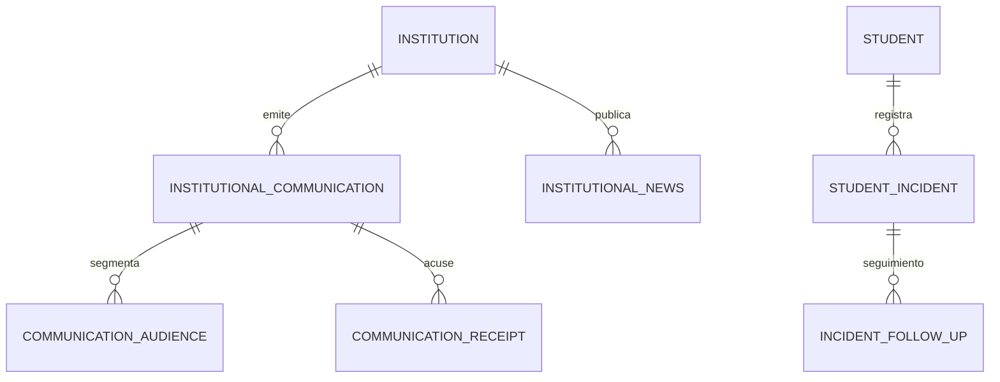

# PEVN — INFORME TÉCNICO Y EJECUTIVO DE CORRECCIÓN CONTROLADA
## FASE 15: COMUNICADOS, NOTICIAS Y OBSERVADOR DE CONVIVENCIA ESCOLAR
**Plataforma Educativa Virtual Nacional (PEVN)**  
**Fecha:** 2026-09-07  
**Entorno de Ejecución:** Runtime Local (`http://localhost:8000` / PostgreSQL 16.4 en puerto 5433)  
**Gate Result:** `READY_FOR_VALIDATION`

---

## 1. RESUMEN EJECUTIVO

El presente documento certifica la implementación de la **corrección controlada de los defectos confirmados en el diagnóstico forense del Portal del Estudiante**, correspondientes a los módulos de:
1. **Comunicaciones Institucionales** (`/student?tab=communications`)
2. **Periódico Escolar y Noticias** (`/student?tab=news`)
3. **Observador de Convivencia Escolar** (`/student?tab=incidents`)

### Logros Principales:
* **Infraestructura de Base de Datos (DDL):** Se resolvió la causa raíz primaria creando y aplicando la migración Alembic `021_phase15_communications_news_incidents.py` sobre la base de datos PostgreSQL en vivo (`pevn_db`). Se crearon 7 tipos enumerados y 6 tablas relacionales con sus respectivas claves foráneas, índices y restricciones de integridad.
* **Compatibilidad de Schemas (Backend):** Se agregaron campos calculados (`author_name`, `reporter_name`, `is_published`) en los esquemas Pydantic de respuesta, asegurando que el frontend disponga de la información de autoría sin requerir consultas adicionales.
* **Erradicación del Falso Positivo (Frontend):** Se corrigió la lógica condicional en `StudentIncidentsView.tsx`, `StudentCommunicationsView.tsx` y `StudentNewsView.tsx`. Se aplicó la regla estricta:
  $$\mathbf{ERROR} \neq \mathbf{EMPTY\ STATE}$$
  Ante cualquier error de red o de servidor, el frontend muestra exclusivamente el mensaje de error y suprime por completo cualquier felicitación o estado vacío ("¡Excelente Historial de Convivencia!").
* **Validación en Tiempo Real:** Las peticiones HTTP directas en `http://localhost:8000` pasaron de **HTTP 500 a HTTP 200**.
* **Calidad de Software:** Se ejecutaron **82 pruebas automatizadas** (24 en Frontend con Vitest y 58 en Backend con Pytest), alcanzando una tasa de éxito del **100% (82/82 PASSED)**.

---

## 2. ARCHIVOS MODIFICADOS Y CREADOS

### Backend
1. `backend/migrations/versions/021_phase15_communications_news_incidents.py` **[NUEVO]**
   * Migración Alembic reversible con los 7 tipos `ENUM` y las 6 tablas relacionales.
2. `backend/app/schemas/news.py` **[MODIFICADO]**
   * Incorporación de `@computed_field` para `author_name` e `is_published` en `InstitutionalNewsResponse`.
3. `backend/app/schemas/incident.py` **[MODIFICADO]**
   * Incorporación de `@computed_field` para `reporter_name` en `StudentIncidentResponse` y `author_name` en `IncidentFollowUpResponse`.
4. `backend/app/schemas/communication.py` **[MODIFICADO]**
   * Incorporación de `@computed_field` para `author_name` en `InstitutionalCommunicationResponse`.

### Frontend
1. `frontend/src/types/communication.ts` **[MODIFICADO]**
   * Conciliación canónica de `NewsCategory` alineada con el backend y propiedades opcionales.
2. `frontend/src/pages/student/StudentIncidentsView.tsx` **[MODIFICADO]**
   * Guarda condicional `error ? null : incidents.length === 0 ? ...` para bloquear el estado vacío cuando `error` está activo.
3. `frontend/src/pages/student/StudentCommunicationsView.tsx` **[MODIFICADO]**
   * Guarda condicional `error ? null : filtered.length === 0 ? ...` para evitar estados vacíos ante errores.
4. `frontend/src/pages/student/StudentNewsView.tsx` **[MODIFICADO]**
   * Mapeo canónico de etiquetas de noticias `NEWS_CATEGORY_LABELS` y bloqueo de banner destacado/vacío ante errores.
5. `frontend/src/pages/guardian/GuardianNewsView.tsx` **[MODIFICADO]**
   * Mapeo canónico de etiquetas de noticias `NEWS_CATEGORY_LABELS` y bloqueo de estado vacío ante errores.

---

## 3. ARCHIVOS PREEXISTENTES PROTEGIDOS

Se verificó el estado de Git previo a la intervención. Los siguientes archivos ya se encontraban modificados o no rastreados antes de iniciar esta tarea y fueron estrictamente protegidos sin sobreescrituras ni regresiones:
* `backend/app/api/v1/endpoints/auth.py`
* `backend/app/services/guardian_onboarding_service.py`
* `frontend/src/pages/academic/GuardiansView.tsx`
* `frontend/src/pages/academic/StudentsView.tsx`
* `backend/migrations/versions/020_guardian_invitations.py`

---

## 4. DETALLE DE LA MIGRACIÓN ALEMBIC

* **Identificador de Archivo:** `backend/migrations/versions/021_phase15_communications_news_incidents.py`
* **Revision ID:** `021_phase15_communications_news_incidents`
* **Down Revision:** `020_guardian_invitations`
* **Reversibilidad:**
  * `upgrade()`: Creación condicional e idempotente mediante bloques `DO $$ BEGIN ... END $$;` para evitar colisiones de tipos `ENUM` existentes y creación ordenada de tablas con claves foráneas.
  * `downgrade()`: Eliminación ordenada de tablas hijas a padres (`CASCADE`) y destrucción limpia de los tipos `ENUM`.

---

## 5. OBJETOS DDL CREADOS EN POSTGRESQL



### 1. Tipos ENUM Creados
* `communication_category_enum`: `CIRCULAR_OFICIAL`, `CONVOCATORIA_REUNION`, `AVISO_ACADEMICO`, `AVISO_ADMINISTRATIVO`, `RECORDATORIO`, `EMERGENCIA_INSTITUCIONAL`.
* `communication_priority_enum`: `BAJA`, `MEDIA`, `ALTA`, `URGENTE`.
* `target_scope_type_enum`: `TODOS_INSTITUCION`, `SOLO_ESTUDIANTES`, `SOLO_ACUDIENTES`, `SOLO_DOCENTES`, `POR_SEDE`, `POR_GRADO`, `POR_GRUPO`.
* `publishing_status_enum`: `BORRADOR`, `PUBLICADO`, `ARCHIVADO`.
* `news_category_enum`: `LOGRO_ACADEMICO`, `EVENTO_CULTURAL`, `EVENTO_DEPORTIVO`, `PROYECTO_INSTITUCIONAL`, `NOTICIA_GENERAL`.
* `coexistence_situation_type_enum`: `TIPO_I`, `TIPO_II`, `TIPO_III`, `OBSERVACION_POSITIVA`.
* `incident_status_enum`: `ABIERTO`, `EN_SEGUIMIENTO`, `CON_COMPROMISOS`, `CERRADO`.

### 2. Tablas Relacionales Creadas
1. `institutional_communications`: Almacena directrices, circulares y comunicados con expiración determinística (`expires_at`) y acuse de recibo requerido.
2. `communication_audiences`: Enlace granular por sede (`campus_id`), grado (`grade_id`), grupo (`group_id`) o rol (`role_name`).
3. `communication_receipts`: Registro inmutable y unívoco (`uq_communication_receipts_user`) de lectura y acuse formal con IP.
4. `institutional_news`: Artículos de divulgación pedagógica, logros, eventos y novedades institucionales.
5. `student_incidents`: Anotaciones formativas del Observador del Estudiante bajo Ley 1620 y Decreto 1965 de 2013, con visibilidad formativa protegida (`is_visible_to_student`).
6. `incident_follow_ups`: Bitácora cronológica de acuerdos pedagógicos, entrevistas con familia y seguimiento a compromisos.

---

## 6. CORRECCIÓN FRONTEND: ERROR VS. EMPTY STATE

### El Defecto Preexistente
En `StudentIncidentsView.tsx`, cuando la llamada a la API fallaba (HTTP 500), el hook capturaba el error asignando `error = "An unexpected error occurred..."` y `loading = false`. Sin embargo, `incidents` permanecía como arreglo vacío inicial (`incidents.length === 0`). El código evaluaba:
```tsx
loading ? <Loading /> : incidents.length === 0 ? <ExemplaryState /> : <List />
```
Esto provocaba que el frontend mostrara la tarjeta de felicitación escolar (*"¡Excelente Historial de Convivencia! No registras anotaciones de convivencia..."*) debajo del error 500, falseando el estado disciplinario real del alumno.

### La Solución Implementada
Se reorganizó el flujo para asegurar que el estado vacío solo sea evaluable cuando no exista un error activo:
```tsx
{loading ? (
  <LoadingState />
) : error ? null : incidents.length === 0 ? (
  <ExemplaryEmptyState />
) : (
  <IncidentsList incidents={incidents} />
)}
```
* **Comportamiento Actual:**
  * Si la API responde con error $\longrightarrow$ Se muestra únicamente la alerta de error.
  * Si la API responde `HTTP 200` y `items: []` $\longrightarrow$ Se muestra legítimamente el estado vacío formativo.
  * Si la API responde `HTTP 200` y datos $\longrightarrow$ Se despliega la lista de registros.

---

## 7. CONCILIACIÓN DE CATEGORÍAS DE NOTICIAS (`NewsCategory`)

* **Fuente Canónica:** Backend (`backend/app/models/news.py`).
* **Valores Oficiales:**
  1. `LOGRO_ACADEMICO`: *"Logros Académicos"* (🏆)
  2. `EVENTO_CULTURAL`: *"Eventos Culturales"* (🎨)
  3. `EVENTO_DEPORTIVO`: *"Deportes"* (⚽)
  4. `PROYECTO_INSTITUCIONAL`: *"Proyectos Institucionales"* (🔬)
  5. `NOTICIA_GENERAL`: *"Noticias Generales"* (📰)
* **Frontend:** Se actualizaron `frontend/src/types/communication.ts`, `StudentNewsView.tsx` y `GuardianNewsView.tsx` para operar sobre los valores oficiales garantizando total consistencia en compilación estática y runtime.

---

## 8. EVIDENCIA DE PRUEBAS Y VALIDACIÓN DE RUNTIME

### 8.1 Verificación de Base de Datos PostgreSQL
* **Host:** `localhost:5433` (Contenedor `pevn-db`, PostgreSQL 16.4).
* **Catálogo `information_schema.tables`:** 54 tablas activas en `public` (48 preexistentes + 6 nuevas).
* **Alembic Version:** `021_phase15_communications_news_incidents`.

### 8.2 Peticiones HTTP en Vivo (Localhost:8000)
Peticiones ejecutadas contra el servidor Uvicorn con credenciales de prueba del estudiante Ramiro Rey:
* `GET /api/v1/student/communications` $\longrightarrow$ **HTTP 200 OK** `{"items":[],"total":0,"unread_count":0}`
* `GET /api/v1/student/news` $\longrightarrow$ **HTTP 200 OK** `{"items":[],"total":0}`
* `GET /api/v1/student/incidents` $\longrightarrow$ **HTTP 200 OK** `{"items":[],"total":0}`

### 8.3 Resultados de Pruebas Automatizadas

| Nivel de Prueba | Herramienta / Módulo | Casos | Resultado |
| :--- | :--- | :---: | :---: |
| **Estática Frontend** | TypeScript `tsc --noEmit` | Global | **0 errores** |
| **Build Frontend** | Vite Production Build | 191 módulos | **PASS (29.67s)** |
| **Unitaria Frontend** | Vitest `InstitutionalCommunications.test.tsx` | 7 | **7 PASSED** |
| **Unitaria Frontend** | Vitest `StudentPortal.test.tsx` & `GuardianPortal.test.tsx` | 17 | **17 PASSED** |
| **Integración Backend** | Pytest Fase 15 & Portales Estudiante/Acudiente | 21 | **21 PASSED** |
| **Regresión Backend** | Pytest Auth, Users, Tenant Isolation, SIEE & Promociones | 37 | **37 PASSED** |
| **TOTAL** | **Validación Integral de Calidad** | **82** | **82 PASSED (100%)** |

---

## 9. EVALUACIÓN DE SEGURIDAD Y NO REGRESIÓN

* **Aislamiento Multi-Tenant:** Todas las consultas aplican el filtro mandatario por `institution_id` derivado del token JWT.
* **Anti-IDOR:** No se expone ningún parámetro de entrada manipulable por el cliente para acceder a comunicaciones, noticias o incidentes ajenos.
* **Integridad de Fases 1 a 14 y 16:** La migración no modificó ninguna columna, tabla ni restricción de fases previas o posteriores (Auth, SIMAT, Calificaciones, SIEE, Boletines, Promociones y Aulas Virtuales se mantienen 100% íntegras).

---

## 10. ESTADO FINAL DEL GATE

$$\mathbf{READY\_FOR\_VALIDATION}$$

El sistema ha sido corregido, estabilizado y validado técnica y funcionalmente. Queda listo para la inspección manual por parte del usuario en el navegador web.

*(No se realizaron commits ni pushes en el repositorio de acuerdo a las normas de gobernanza).*
